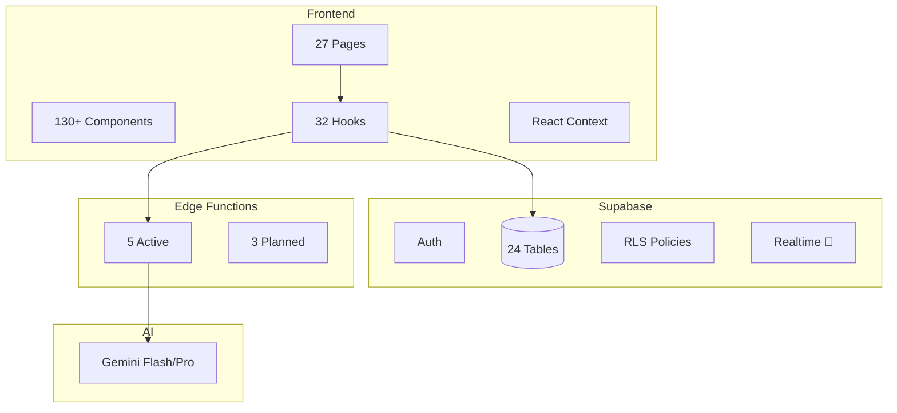

# Progress Tracker

> **Last Updated:** 2026-01-29 | **Overall Completion:** 72%

---

## Executive Summary

| Category | Done | Total | % Complete |
|----------|------|-------|------------|
| **Phase 1: Foundation** | 19 | 20 | 95% |
| **Phase 2: Features** | 15 | 16 | 94% |
| **Phase 3: AI Agents** | 5 | 10 | 50% |
| **Phase 4: Realtime** | 0 | 10 | 0% |
| **Phase 5: Marketing** | 0 | 4 | 0% |
| **Phase 6: Automations** | 0 | 3 | 0% |

---

## 🚨 Critical Issues

| Issue | Severity | Location | Status |
|-------|----------|----------|--------|
| spatial_ref_sys no RLS | 🟡 WARN | PostGIS system table | Expected |
| Leaked password disabled | 🟡 WARN | Supabase Auth settings | Manual fix |
| Extension in public schema | 🟡 WARN | PostGIS extension | Expected |

---

## 🏗️ System Architecture

---

## Phase 1: Foundation & Listings (95% Complete)

### ✅ Completed

| Task | Prompt | % | ✅ Verified | 💡 Notes |
|------|--------|---|------------|----------|
| Project setup (Vite+React+TS) | — | 100% | App runs | Build succeeds |
| Supabase connection | 12 | 100% | 24 tables active | RLS on 23/24 |
| Authentication (Email+Google) | — | 100% | Login/Signup works | OAuth fix applied |
| 3-Panel Layout System | 16 | 100% | ThreePanelLayout | Desktop/tablet/mobile |
| Responsive Navigation | 16 | 100% | Mobile bottom nav | + sheet drawer |
| Home Page | 08 | 100% | Hero, categories | useFeaturedPlaces |
| Apartments List + Detail | 03 | 100% | Filters, 3-panel | ApartmentDetailPanel |
| Cars List + Detail | 04 | 100% | Filters, 3-panel | CarDetailPanel |
| Restaurants List + Detail | 05 | 100% | Filters, 3-panel | RestaurantDetailPanel |
| Events List + Detail | 06 | 100% | Calendar, filters | EventDetailPanel |
| Explore Unified Search | 08 | 100% | Multi-table queries | Category tabs |
| Saved Dashboard | 07 | 100% | 3-panel, filters | Collections CRUD |
| Right Panel Detail Views | 19 | 100% | Type-specific | All 4 types |
| Onboarding Wizard (6 steps) | 18 | 100% | Full flow | Context + persistence |

### ⏳ Remaining

| Task | Prompt | Status | Notes |
|------|--------|--------|-------|
| Home Dashboard (post-login) | 15 | 📋 TODO | Personalized experience |

---

## Phase 2: Features & Booking (94% Complete)

### ✅ Completed

| Task | Prompt | % | ✅ Verified | 💡 Notes |
|------|--------|---|------------|----------|
| TripContext (global state) | 09 | 100% | localStorage | Persistence |
| Trips List Page | 09 | 100% | /trips | Filters |
| Trip Detail Page | 09 | 100% | /trips/:id | Timeline |
| Trip Creation Wizard | 09 | 100% | /trips/new | 4 steps |
| Visual Itinerary Builder | 09 | 100% | @dnd-kit | Drag-drop |
| Itinerary Map View | 09 | 100% | Google Maps | Polylines |
| Travel Time Indicators | 09 | 100% | Haversine | + Google fallback |
| Bookings Dashboard | 10 | 100% | /bookings | 3-panel |
| Apartment Booking Wizard | 10 | 100% | Premium 5-step | Dialog modal |
| Restaurant Booking Wizard | 10 | 100% | Premium 4-step | Time slots |
| Car Booking Wizard | 10 | 100% | 3-panel | Insurance tiers |
| Event Booking Wizard | 10 | 100% | 3-panel | VIP perks |
| Admin Dashboard | — | 100% | /admin | RBAC |
| Admin CRUD | — | 100% | All 4 types | ListingDataTable |
| Admin Users & Roles | — | 100% | user_roles | Role dialog |

### ⏳ Remaining

| Task | Prompt | Status | Notes |
|------|--------|--------|-------|
| Payment Integration | 10 | 📋 TODO | Stripe or demo |

---

## Phase 3: AI & Chat (50% Complete)

### ✅ Completed

| Task | Prompt | % | Edge Function | Model |
|------|--------|---|---------------|-------|
| AI Chat Edge Function | 13 | 100% | ai-chat ✅ | Gemini Flash |
| Concierge Page | 11 | 100% | Uses ai-chat | 3-panel chat |
| AI Router Edge Function | 13 | 100% | ai-router ✅ | Gemini Flash |
| AI Route Optimization | 13 | 100% | ai-optimize-route ✅ | Gemini Flash |
| Collection Suggester | 13 | 100% | ai-suggest-collections ✅ | Gemini Flash |

### ⏳ Remaining

| Task | Prompt | Status | Notes |
|------|--------|--------|-------|
| AI Search | 14 | 📋 TODO | Multi-domain + Google Search |
| AI Trip Planner | 14 | 📋 TODO | Gemini Pro agent |
| AI Booking Agent | 14 | 📋 TODO | Conversational |
| AI Explore Agent | 14 | 📋 TODO | Discovery |
| Chat 4-Tab System | 11 | 🔄 Partial | Tabs exist, need wiring |

---

## Phase 4: Realtime (0% Complete) 🆕

### Backend Tasks

| Task ID | Description | Status | Prompt |
|---------|-------------|--------|--------|
| RT-B1 | Enable Realtime settings | 🔴 TODO | REALTIME-P1 |
| RT-B2 | Trigger: messages broadcast | 🔴 TODO | REALTIME-P2 |
| RT-B3 | Trigger: trip_items/trips | 🔴 TODO | REALTIME-P3 |
| RT-B4 | Trigger: agent_jobs | 🔴 TODO | REALTIME-P4 |
| RT-B5 | RLS on realtime.messages | 🔴 TODO | REALTIME-P5 |

### Frontend Tasks

| Task ID | Description | Status | Prompt |
|---------|-------------|--------|--------|
| RT-F1 | Chat Realtime subscription | 🔴 TODO | FE-P1 |
| RT-F2 | Trip Realtime subscription | 🔴 TODO | FE-P2 |
| RT-F3 | Job progress subscription | 🔴 TODO | FE-P3 |
| RT-F4 | Shared useRealtimeChannel | 🔴 TODO | FE-P4 |
| RT-F5 | Verification testing | 🔴 TODO | — |

---

## Phase 4B: AI Safety Pattern (0% Complete) 🆕

| Task ID | Description | Status | Prompt |
|---------|-------------|--------|--------|
| PAU-1 | Preview surface in Right panel | 🔴 TODO | PAU-P1 |
| PAU-2 | Approval gate + Apply button | 🔴 TODO | PAU-P2 |
| PAU-3 | Apply transaction logic | 🔴 TODO | PAU-P3 |
| PAU-4 | One-step Undo | 🔴 TODO | PAU-P4 |

---

## Phase 5: Marketing & AI Wiring (0% Complete) 🆕

### Marketing Routes

| Task ID | Description | Status | Prompt |
|---------|-------------|--------|--------|
| MR-1 | Add 4 public routes | 🔴 TODO | MR-P1 |
| MR-2 | How It Works page | 🔴 TODO | MR-P2 |
| MR-3 | Pricing page | 🔴 TODO | MR-P3 |
| MR-4 | Privacy + Terms pages | 🔴 TODO | MR-P4 |

### AI Wiring

| Task ID | Description | Status | Prompt |
|---------|-------------|--------|--------|
| AIW-1 | Wire ai-search → Explore | 🔴 TODO | AIW-P1 |
| AIW-2 | Wire ai-search → Concierge | 🔴 TODO | AIW-P2 |
| AIW-3 | Wire ai-trip-planner → TripWizard | 🔴 TODO | AIW-P3 |

---

## Phase 6: Automations (0% Complete) 🆕

| Task ID | Description | Status | Prompt |
|---------|-------------|--------|--------|
| AUT-1 | Rules engine edge function | 🔴 TODO | AUT-P1 |
| AUT-2 | Notification center page | 🔴 TODO | AUT-P2 |
| AUT-3 | Realtime notifications | 🔴 TODO | AUT-P3 |

---

## Database & Backend

### Tables (24 total)

| Table | RLS | Status |
|-------|-----|--------|
| profiles | ✅ | Production |
| apartments | ✅ | Production |
| car_rentals | ✅ | Production |
| restaurants | ✅ | Production |
| events | ✅ | Production |
| saved_places | ✅ | Production |
| collections | ✅ | Production |
| trips | ✅ | Production |
| trip_items | ✅ | Production |
| bookings | ✅ | Production |
| conversations | ✅ | Production |
| messages | ✅ | Production |
| ai_runs | ✅ | Production |
| ai_context | ✅ | Production |
| user_roles | ✅ | Production |
| agent_jobs | ✅ | Production |
| budget_tracking | ✅ | Production |
| conflict_resolutions | ✅ | Production |
| proactive_suggestions | ✅ | Production |
| rentals | ✅ | Production |
| tourist_destinations | ✅ | Production |
| spatial_ref_sys | ⚠️ | PostGIS system |

### Edge Functions

| Function | Status | Purpose |
|----------|--------|---------|
| ai-chat | ✅ Active | Streaming chat + 7 tools |
| ai-router | ✅ Active | Intent classification |
| ai-optimize-route | ✅ Active | Route optimization |
| ai-suggest-collections | ✅ Active | Collection suggestions |
| google-directions | ✅ Active | Google Routes API |
| ai-search | 📋 TODO | Multi-domain search |
| ai-trip-planner | 📋 TODO | Itinerary generation |
| rules-engine | 📋 TODO | Automated suggestions |

---

## AI Agents & Workflows

| Agent | Function | Status | Model |
|-------|----------|--------|-------|
| Concierge | ai-chat | 🟢 Done | Gemini Flash |
| Router | ai-router | 🟢 Done | Gemini Flash |
| Route Optimizer | ai-optimize-route | 🟢 Done | Gemini Flash |
| Collection Suggester | ai-suggest-collections | 🟢 Done | Gemini Flash |
| Search Agent | ai-search | 🔴 TODO | Gemini + Search |
| Trip Planner | ai-trip-planner | 🔴 TODO | Gemini Pro |
| Booking Agent | ai-booking | 🔴 TODO | Claude |

---

## Wizards & Workflows

| Wizard | Steps | Status | Persistence |
|--------|-------|--------|-------------|
| Onboarding | 6 | 🟢 Done | localStorage + Supabase |
| Trip Creation | 4 | 🟢 Done | trips table |
| Apartment Booking | 5 | 🟢 Done | bookings table |
| Restaurant Booking | 4 | 🟢 Done | bookings table |
| Car Booking | 3 | 🟢 Done | bookings table |
| Event Booking | 3 | 🟢 Done | bookings table |

---

## Knowledge Base

| Category | Documents | Status |
|----------|-----------|--------|
| Gemini AI | 3 docs | 🟢 Created |
| Supabase Auth | 3 docs | 🟢 Created |
| User Stories | 1 doc | 🟢 Created |

### Gemini Tools Reference

| Tool | Gemini 3 | Gemini 2.5 | Use Case |
|------|----------|------------|----------|
| Google Search | ✅ | ✅ | Real-time facts |
| Google Maps | ❌ | ✅ | Location grounding |
| URL Context | ✅ | ✅ | Document analysis |
| Function Calling | ✅ | ✅ | Structured actions |

---

## 🎯 Next Steps (Priority Order)

1. **P1: Realtime Backend** — Triggers for live updates
2. **P1: Realtime Frontend** — Subscribe to chat/trips/jobs
3. **P1: AI Safety** — Preview-Apply-Undo pattern
4. **P1: AI Wiring** — Connect ai-search to UI
5. **P2: Marketing Routes** — Legal & marketing pages
6. **P2: Home Dashboard** — Personalized experience
7. **P3: Automations** — Rules engine
8. **P3: Payment** — Stripe integration

---

## 📊 Metrics

| Metric | Value |
|--------|-------|
| Total Routes | 27 |
| Protected Routes | 10 |
| Components | ~130 |
| Hooks | 32 |
| Edge Functions | 5 (3 planned) |
| Database Tables | 24 |
| RLS Coverage | 96% (23/24) |
| Knowledge Docs | 8 |
| Console Errors | 0 |

---

## Related

- [Tasks & Prompts](../tasks/README.md) — Implementation prompts
- [Master Progress](../tasks/00-progress-tracker.md) — Detailed task tracking
- [Knowledge Base](../knowledge/README.md) — Gemini & Supabase references
- [CHANGELOG.md](../CHANGELOG.md) — Change history
- [Auth Audit](../auth-audit.md) — OAuth configuration
