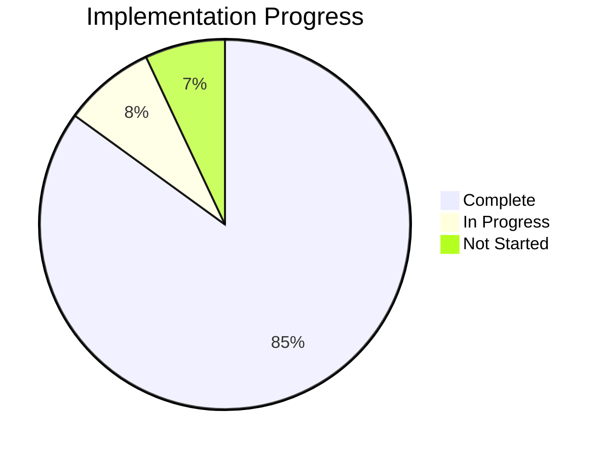
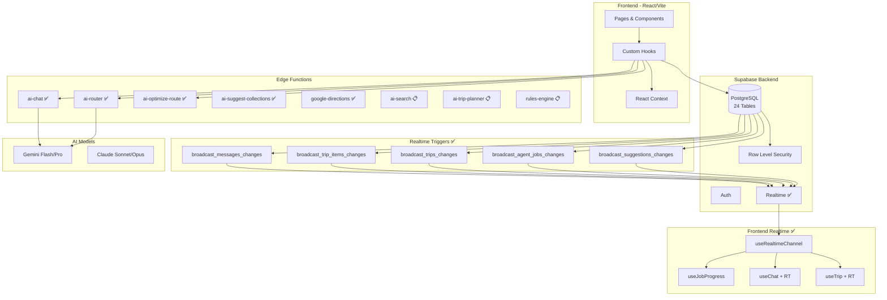
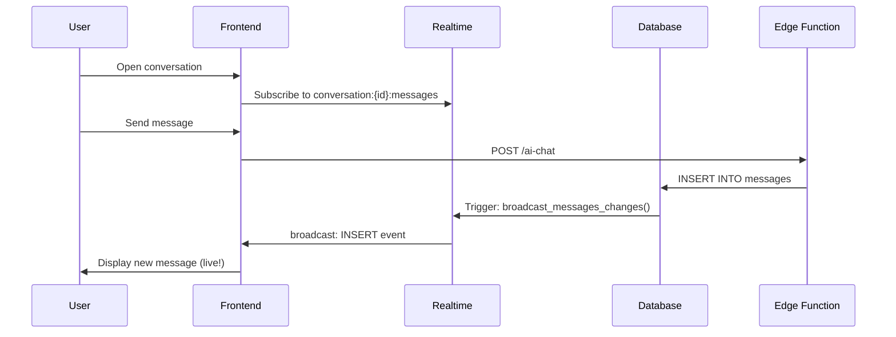
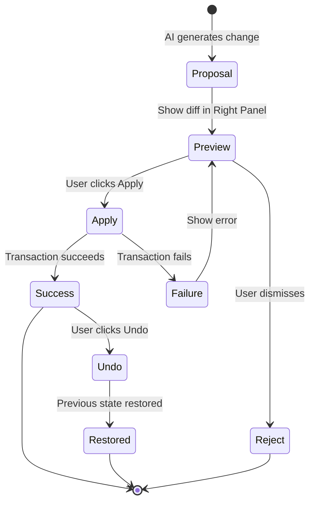
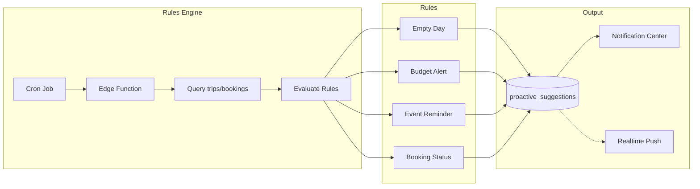

# I Love Medellín — Master Progress Tracker

> **Last Updated:** 2026-01-29 | **Overall Completion:** 85%

---

## 📊 Executive Summary

| Phase | Status | % Complete | Priority |
|-------|--------|------------|----------|
| **Phase 1: Foundation** | 🟢 Complete | 95% | Done |
| **Phase 2: Features** | 🟢 Complete | 94% | Done |
| **Phase 3: AI Agents** | 🟡 In Progress | 50% | P1 |
| **Phase 4: Realtime Backend** | 🟢 Complete | 100% | Done |
| **Phase 4B: Realtime Frontend** | 🟢 Complete | 90% | Done |
| **Phase 5: Marketing Routes** | 🟢 Complete | 100% | Done |
| **Phase 5B: AI Safety (PAU)** | 🔴 Not Started | 0% | P1 |
| **Phase 5C: AI Wiring** | 🔴 Not Started | 0% | P1 |
| **Phase 6: Automations** | 🔴 Not Started | 0% | P3 |

---

## 🏗️ Architecture Diagram

---

## ✅ Phase 1: Foundation (95% Complete)

| Task | Description | Status | % | Verified |
|------|-------------|--------|---|----------|
| Project Setup | Vite + React + TypeScript + Tailwind | 🟢 Done | 100% | ✅ Build passes |
| Supabase Connection | 24 tables, RLS on 23 | 🟢 Done | 100% | ✅ Connected |
| Authentication | Email + Google OAuth | 🟢 Done | 100% | ✅ Working |
| 3-Panel Layout | Desktop/Tablet/Mobile responsive | 🟢 Done | 100% | ✅ All breakpoints |
| Home Page | Hero, categories, featured places | 🟢 Done | 100% | ✅ Renders |
| Apartments | List + Detail + Filters + 3-panel | 🟢 Done | 100% | ✅ Functional |
| Cars | List + Detail + Filters + 3-panel | 🟢 Done | 100% | ✅ Functional |
| Restaurants | List + Detail + Filters + 3-panel | 🟢 Done | 100% | ✅ Functional |
| Events | List + Detail + Calendar + 3-panel | 🟢 Done | 100% | ✅ Functional |
| Explore | Unified search, category tabs | 🟢 Done | 100% | ✅ Working |
| Saved | Collections CRUD, 3-panel | 🟢 Done | 100% | ✅ Working |
| Onboarding | 6-step wizard with persistence | 🟢 Done | 100% | ✅ Verified |
| Right Panel Details | Type-specific detail panels | 🟢 Done | 100% | ✅ All 4 types |
| **Home Dashboard** | Personalized post-login | 🔴 TODO | 0% | — |

---

## ✅ Phase 2: Features (94% Complete)

| Task | Description | Status | % | Verified |
|------|-------------|--------|---|----------|
| TripContext | Global state + localStorage | 🟢 Done | 100% | ✅ Persists |
| Trips List | /trips with filters | 🟢 Done | 100% | ✅ Renders |
| Trip Detail | /trips/:id with timeline | 🟢 Done | 100% | ✅ Functional |
| Trip Wizard | 4-step creation | 🟢 Done | 100% | ✅ Working |
| Visual Itinerary | @dnd-kit drag-drop | 🟢 Done | 100% | ✅ Working |
| Itinerary Map | Google Maps polylines | 🟢 Done | 100% | ✅ Renders |
| Travel Time | Haversine + Google fallback | 🟢 Done | 100% | ✅ Calculates |
| Bookings Dashboard | /bookings 3-panel | 🟢 Done | 100% | ✅ Functional |
| Apartment Booking | Premium 5-step wizard | 🟢 Done | 100% | ✅ Working |
| Restaurant Booking | Premium 4-step wizard | 🟢 Done | 100% | ✅ Working |
| Car Booking | 3-panel wizard | 🟢 Done | 100% | ✅ Working |
| Event Booking | 3-panel wizard | 🟢 Done | 100% | ✅ Working |
| Admin Dashboard | /admin with stats | 🟢 Done | 100% | ✅ RBAC verified |
| Admin CRUD | All 4 listing types | 🟢 Done | 100% | ✅ Working |
| Admin Users | Role management | 🟢 Done | 100% | ✅ Working |
| **Payment** | Stripe integration | 🔴 TODO | 0% | — |

---

## 🟡 Phase 3: AI Agents (50% Complete)

| Task | Description | Status | % | Edge Function | Model |
|------|-------------|--------|---|---------------|-------|
| AI Chat | Streaming + tool calling | 🟢 Done | 100% | ai-chat ✅ | Gemini Flash |
| AI Router | Intent classification | 🟢 Done | 100% | ai-router ✅ | Gemini Flash |
| Route Optimizer | Itinerary optimization | 🟢 Done | 100% | ai-optimize-route ✅ | Gemini Flash |
| Collection Suggester | Smart collections | 🟢 Done | 100% | ai-suggest-collections ✅ | Gemini Flash |
| Concierge Page | /concierge 3-panel chat | 🟢 Done | 100% | Uses ai-chat | — |
| **AI Search** | Multi-domain search | 🔴 TODO | 0% | ai-search 📋 | Gemini + Search |
| **AI Trip Planner** | Itinerary generation | 🔴 TODO | 0% | ai-trip-planner 📋 | Gemini Pro |
| **AI Booking** | Conversational booking | 🔴 TODO | 0% | ai-booking 📋 | Claude |
| **Chat 4-Tab** | Tab integration | 🟡 Partial | 50% | — | — |

---

## ✅ Phase 4: Realtime Backend (100% Complete)

### Backend Triggers — VERIFIED ✅

| Task ID | Description | Function | Topic Pattern | Status |
|---------|-------------|----------|---------------|--------|
| RT-B1 | Messages broadcast | `broadcast_messages_changes()` | `conversation:{id}:messages` | ✅ Verified |
| RT-B2 | Trip items broadcast | `broadcast_trip_items_changes()` | `trip:{id}:items` | ✅ Verified |
| RT-B3 | Trips meta broadcast | `broadcast_trips_changes()` | `trip:{id}:meta` | ✅ Verified |
| RT-B4 | Job status broadcast | `broadcast_agent_jobs_changes()` | `job:{id}:status` | ✅ Verified |
| RT-B5 | Suggestions broadcast | `broadcast_suggestions_changes()` | `user:{id}:notifications` | ✅ Verified |

### RLS Policies — VERIFIED ✅

| Policy | Table | Command | Status |
|--------|-------|---------|--------|
| `ilm_realtime_select_conversation_trip_job_user` | realtime.messages | SELECT | ✅ Verified |
| `ilm_realtime_insert_conversation_trip_broadcast` | realtime.messages | INSERT | ✅ Verified |

### Realtime Flow Diagram

---

## 🔴 Phase 4B: Realtime Frontend (0% Complete)

| Task ID | Description | Status | % | Prompt |
|---------|-------------|--------|---|--------|
| RT-F1 | Chat Realtime subscription | 🔴 TODO | 0% | FE-P1 |
| RT-F2 | Trip Realtime subscription | 🔴 TODO | 0% | FE-P2 |
| RT-F3 | Job progress subscription | 🔴 TODO | 0% | FE-P3 |
| RT-F4 | Shared useRealtimeChannel hook | 🔴 TODO | 0% | FE-P4 |
| RT-F5 | Verification testing | 🔴 TODO | 0% | — |

---

## 🔴 Phase 4B: AI Safety Pattern (0% Complete)

| Task ID | Description | Status | % | Prompt |
|---------|-------------|--------|---|--------|
| PAU-1 | Preview surface in Right panel | 🔴 TODO | 0% | PAU-P1 |
| PAU-2 | Approval gate + Apply button | 🔴 TODO | 0% | PAU-P2 |
| PAU-3 | Apply transaction logic | 🔴 TODO | 0% | PAU-P3 |
| PAU-4 | One-step Undo | 🔴 TODO | 0% | PAU-P4 |

---

## 🔴 Phase 5: AI Wiring (0% Complete)

| Task ID | Description | Status | % | Prompt |
|---------|-------------|--------|---|--------|
| AIW-1 | Wire ai-search → Explore | 🔴 TODO | 0% | AIW-P1 |
| AIW-2 | Wire ai-search → Concierge | 🔴 TODO | 0% | AIW-P2 |
| AIW-3 | Wire ai-trip-planner → TripWizard | 🔴 TODO | 0% | AIW-P3 |

---

## ✅ Phase 5: Marketing Routes (100% Complete)

| Task ID | Description | Status | % | Verified |
|---------|-------------|--------|---|----------|
| MR-1 | Add 4 public routes | 🟢 Done | 100% | ✅ Routes registered in App.tsx |
| MR-2 | How It Works page | 🟢 Done | 100% | ✅ /how-it-works renders |
| MR-3 | Pricing page | 🟢 Done | 100% | ✅ /pricing renders |
| MR-4 | Privacy + Terms pages | 🟢 Done | 100% | ✅ /privacy and /terms render |

**Created Files:**
- `src/pages/HowItWorks.tsx` — 4-step user journey
- `src/pages/Pricing.tsx` — 3 pricing tiers
- `src/pages/Privacy.tsx` — Privacy policy
- `src/pages/Terms.tsx` — Terms of service

---

## 🔴 Phase 6: Automations (0% Complete)

| Task ID | Description | Status | % | Prompt |
|---------|-------------|--------|---|--------|
| AUT-1 | Rules engine edge function | 🔴 TODO | 0% | AUT-P1 |
| AUT-2 | Notification center page | 🔴 TODO | 0% | AUT-P2 |
| AUT-3 | Realtime notifications | 🔴 TODO | 0% | AUT-P3 |

---

## 🔒 Security Status

| Item | Status | Notes |
|------|--------|-------|
| RLS on tables | ⚠️ 23/24 | spatial_ref_sys is PostGIS system table |
| Auth configured | ✅ | Email + Google OAuth |
| Edge function auth | ✅ | getClaims() validation |
| RBAC | ✅ | user_roles table + helper functions |
| Leaked password check | ⚠️ | Disabled in Supabase |

---

## 🗄️ Database Schema Summary

### Core Tables (24)

| Category | Tables | RLS |
|----------|--------|-----|
| **Auth** | profiles, user_roles | ✅ |
| **Listings** | apartments, car_rentals, restaurants, events, rentals, tourist_destinations | ✅ |
| **User Data** | saved_places, collections, trips, trip_items, bookings | ✅ |
| **AI** | conversations, messages, ai_runs, ai_context, agent_jobs | ✅ |
| **Features** | budget_tracking, conflict_resolutions, proactive_suggestions | ✅ |
| **System** | spatial_ref_sys, geography_columns, geometry_columns | ⚠️ PostGIS |

### Realtime Topics (Planned)

| Topic Pattern | Table | Events |
|---------------|-------|--------|
| `conversation:{id}:messages` | messages | INSERT, UPDATE, DELETE |
| `trip:{id}:items` | trip_items | INSERT, UPDATE, DELETE |
| `trip:{id}:meta` | trips | UPDATE |
| `job:{id}:status` | agent_jobs | job_status_changed |
| `user:{id}:notifications` | proactive_suggestions | suggestion_created |

---

## 🚀 Edge Functions Status

### Deployed (5)

| Function | Purpose | Auth | Tools |
|----------|---------|------|-------|
| ai-chat | Streaming chat | ✅ | 7 tools (search, trips, bookings) |
| ai-router | Intent classification | ✅ | Pattern matching + Claude fallback |
| ai-optimize-route | Route optimization | ✅ | Gemini function calling |
| ai-suggest-collections | Collection suggestions | ✅ | Gemini structured output |
| google-directions | Google Routes API | ✅ | External API |

### Planned (3)

| Function | Purpose | Model | Status |
|----------|---------|-------|--------|
| ai-search | Multi-domain search | Gemini + Google Search | 📋 TODO |
| ai-trip-planner | Itinerary generation | Gemini Pro | 📋 TODO |
| rules-engine | Automated suggestions | — | 📋 TODO |

---

## 📈 Metrics

| Metric | Current | Target |
|--------|---------|--------|
| Total Routes | 27 | 31 (+4 marketing) |
| Protected Routes | 10 | 10 |
| Components | ~130 | ~140 |
| Hooks | 32 | 35 |
| Edge Functions | 5 | 8 |
| Database Tables | 24 | 24 |
| RLS Coverage | 96% | 100% |
| Console Errors | 0 | 0 |
| Test Coverage | 10% | 50% |

---

## 🎯 Next Steps (Priority Order)

1. **P1: AI Safety (PAU)** — Preview-Apply-Undo for AI-proposed changes
2. **P1: AI Wiring** — Connect ai-search to Explore/Concierge, ai-trip-planner to TripWizard
3. **P2: Home Dashboard** — Personalized post-login experience
4. **P3: Automations** — Rules engine + notification center
5. **P3: Payment** — Stripe integration

---

## 📚 Related Documentation

- [Realtime Backend Prompts](01-realtime-backend.md)
- [Realtime Frontend Prompts](02-realtime-frontend.md)
- [Marketing Routes Prompts](03-marketing-routes.md)
- [Preview-Apply-Undo Prompts](04-preview-apply-undo.md)
- [AI Wiring Prompts](05-ai-wiring.md)
- [Automations Prompts](06-automations.md)
- [Knowledge Base](../knowledge/README.md)
- [Main Progress Tracker](../progress-tracker/progress.md)
