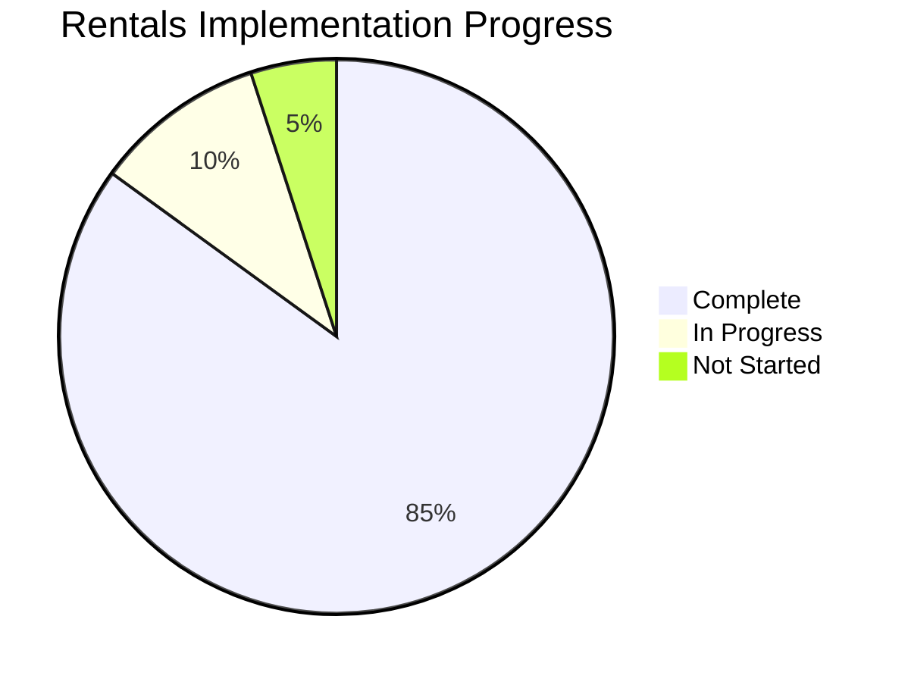
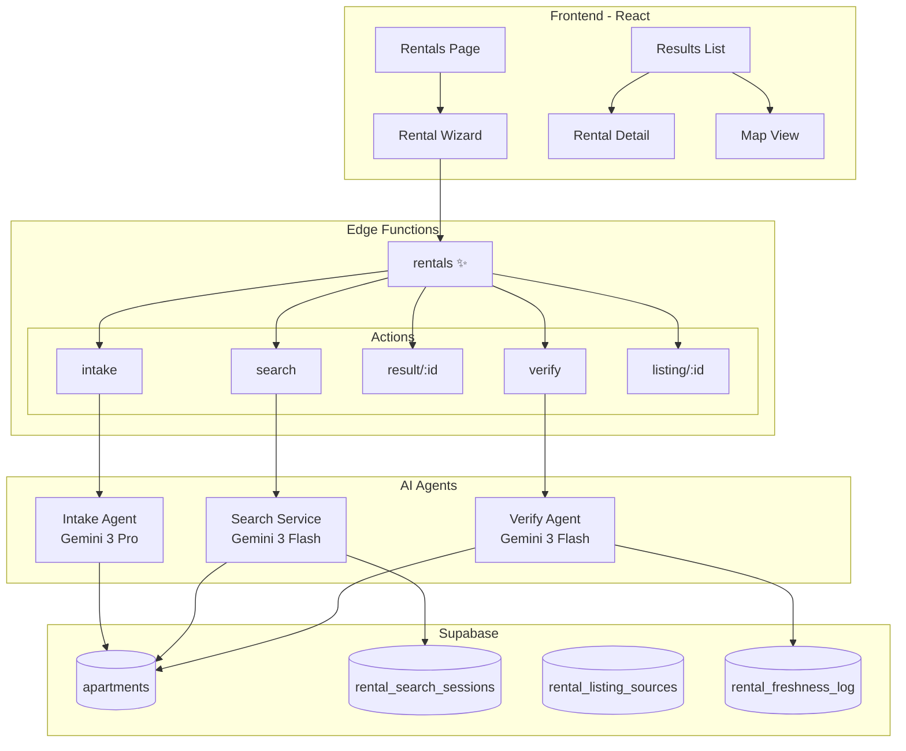
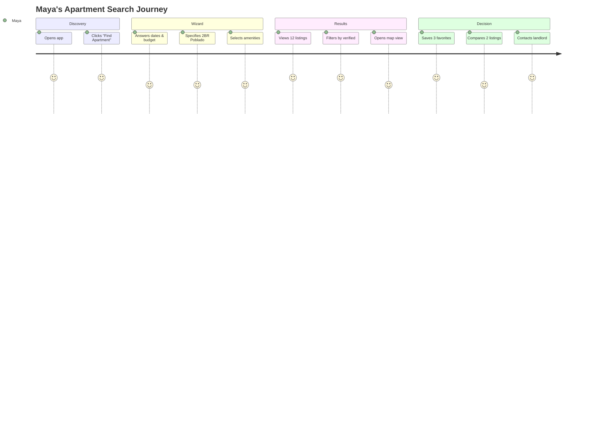

# Rentals Feature — Master Index

**Purpose:** Entry point for the AI-powered Medellín property search system.  
**Last Updated:** 2026-01-29 | **Completion:** 0%

---

## 📊 Overview



## 📁 Document Index

| Document | Purpose |
|----------|---------|
| [00-rentals-index.md](./00-rentals-index.md) | This file - master index and navigation |
| [01-rentals-summary.md](./01-rentals-summary.md) | Summary table, screens, features, agents, use cases, real-world examples |
| [02-rentals-prompts.md](./02-rentals-prompts.md) | User stories, acceptance criteria, 3-panel layout, wiring, schema |
| [03-intake-agent.md](./03-intake-agent.md) | **Task:** Implement AI Intake Agent with Gemini 3 Pro |
| [04-search-logic.md](./04-search-logic.md) | **Task:** Implement real search that queries apartments table |
| [05-verification.md](./05-verification.md) | **Task:** Implement real HTTP verification for freshness |
| [06-unified-rentals-plan.md](./06-unified-rentals-plan.md) | **NEW:** Unified wizard form + Concierge integration plan |

---

## 🏗️ Architecture Diagram



---

## 🎯 User Journey Flow



---

## 📋 Implementation Phases

### Phase 1: Core Infrastructure (Current)
- [x] Apartments table with extended schema
- [x] rental_search_sessions table
- [x] rental_listing_sources table
- [x] rental_freshness_log table
- [ ] Rentals edge function skeleton

### Phase 2: AI Agents
- [ ] Intake Agent (Gemini 3 Pro)
- [ ] Search Service with filters
- [ ] Verify Agent with HTTP checks

### Phase 3: Frontend Integration
- [ ] Rentals page with wizard
- [ ] Results list + map
- [ ] Detail view with gallery
- [ ] Save to shortlist

### Phase 4: Advanced Features
- [ ] Compare view (2-4 listings)
- [ ] Batch verification cron
- [ ] Source adapters

---

## 🔗 Related Documentation

- [Progress Tracker](../00-progress-tracker.md)
- [AI Wiring](../05-ai-wiring.md)
- [Automations](../06-automations.md)

---

## ⚡ Quick Start

```bash
# Test the rentals endpoint
curl -X POST https://zkwcbyxiwklihegjhuql.supabase.co/functions/v1/rentals \
  -H "Authorization: Bearer <token>" \
  -H "Content-Type: application/json" \
  -d '{"action": "intake", "messages": [{"role": "user", "content": "I need an apartment"}]}'
```

---

**3-Panel Layout:**
- **Left** = Context (nav, active trip)
- **Main** = Work (wizard, results, detail, saved, compare)
- **Right** = Intelligence (AI suggestions, "Find me an apartment")
