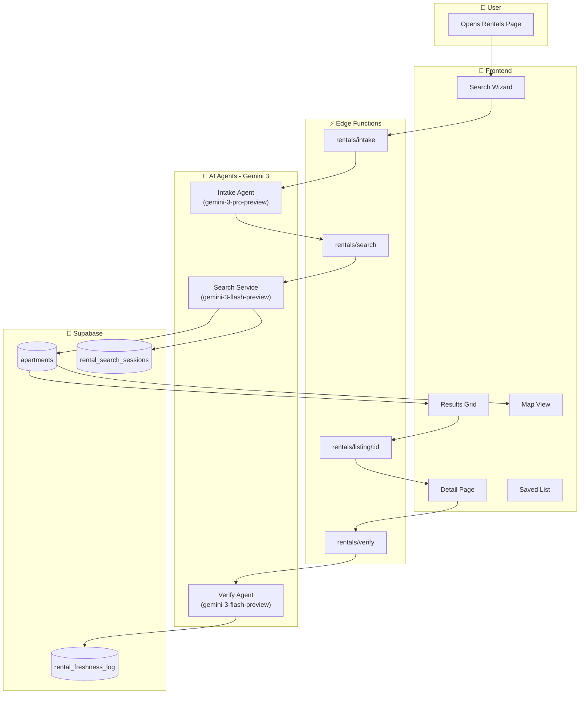
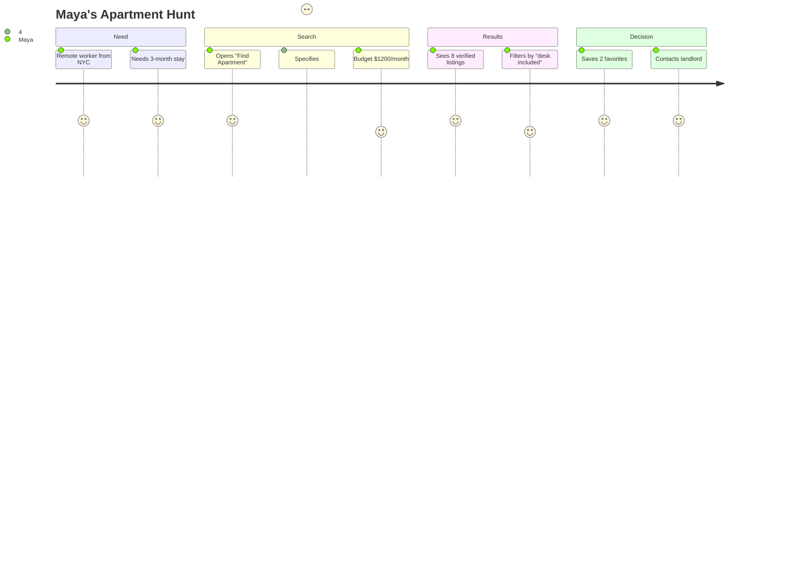
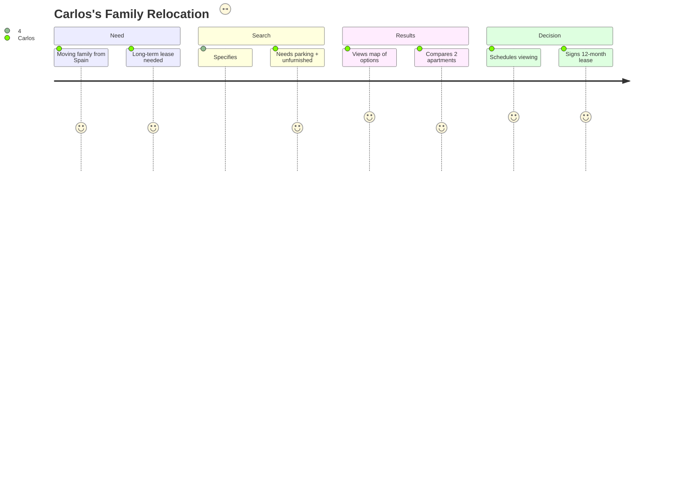

# Rentals Feature — Summary

**Purpose:** Single reference for Medellín property search: screens, features, agents, use cases, and real-world examples.  
**Audience:** Product, design, and implementation.

---

## Summary Table

| Dimension | Items |
|-----------|--------|
| **Screens** | Rentals search/wizard, Rentals results (list + map), Rental detail, Saved shortlist, Compare (optional) |
| **Features** | Search wizard (core + advanced), multi-source aggregation, freshness verification badges, filters and map bounds, photo gallery, save to shortlist, contact CTA, compare view |
| **Agents** | Intake Agent, Search Aggregator, Extractor, Verifier, Deduper/Ranker, Map Agent, Page Composer; Orchestrator coordinates all |
| **Use Cases** | Find apartment by criteria, refine with wizard, see verified listings on map, save favorites, compare 2–4 listings, contact landlord |
| **Real-World Examples** | Maya (nomad) finds furnished Poblado 1BR with strong WiFi; Carlos (expat) filters Envigado 3BR with parking; Sarah (traveler) compares monthly Airbnb vs Nomad Barrio |

---

## System Architecture

---

## Description

The rentals feature is an AI-powered apartment search flow for Medellín. The user starts from a search box or "Find me an apartment," answers a short wizard of core and optional advanced questions, and receives a unified results page: cards, filters, map with pins and clustering, photo galleries, and "verified freshness" badges.

**Key Components:**
1. **AI Orchestrator** - Coordinates the flow using Gemini 3 Pro
2. **Intake Agent** - Asks questions, normalizes answers, outputs filter_json
3. **Search Aggregator** - Queries apartments table with smart filters
4. **Verifier Agent** - Checks listing URLs for freshness status
5. **Page Composer** - Builds UI-ready payload with map pins

---

## Rationale

- **Single entry point:** One place to express "what I need" and get results
- **Trust:** Freshness verification and "last checked" reduce dead leads
- **Medellín-specific:** Neighborhoods, fiador/contract questions match local demand
- **Scalable:** Source adapters allow adding/removing sites without hardcoding
- **AI-native:** Wizard and orchestration use Gemini 3 with function calling

---

## Purpose and Goals

- **Purpose:** Help users find a Medellín apartment that fits dates, budget, location, and lifestyle
- **Goals:**
  - Collect search criteria via friendly wizard (core + advanced questions)
  - Return unified results with verification badges and map
  - Let users filter, pan/zoom map, save to shortlist, open detail
  - Persist search sessions and cache listings in Supabase

---

## Outcomes

- Users complete wizard and see results from apartments table
- Listings show verification status and last-checked time
- Map shows pins with clustering; pan/zoom updates results
- Detail page shows gallery, map, and contact CTA
- Saved shortlist works on dedicated screen

---

## User Personas

### Maya (Digital Nomad)

### Carlos (Expat)

---

## Key Points

- **3-panel layout:** Left = context; Main = work; Right = intelligence
- **Freshness is first-class:** Active / Unconfirmed / Stale with HTTP/HTML checks
- **Models:** Gemini 3 Pro for Orchestrator/Intake; Gemini 3 Flash for sub-agents
- **Wiring:** Frontend calls Edge Functions; Supabase stores all data
