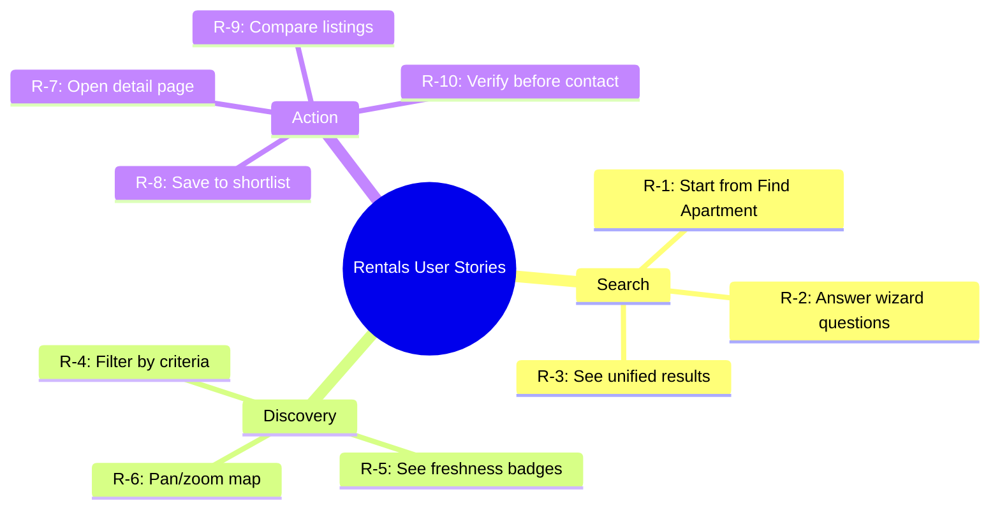
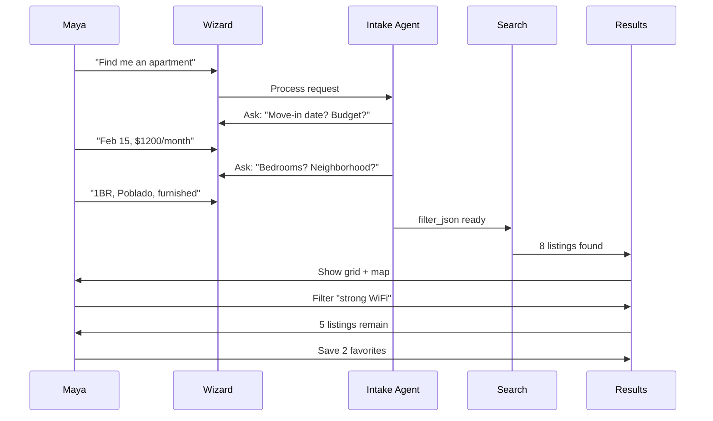
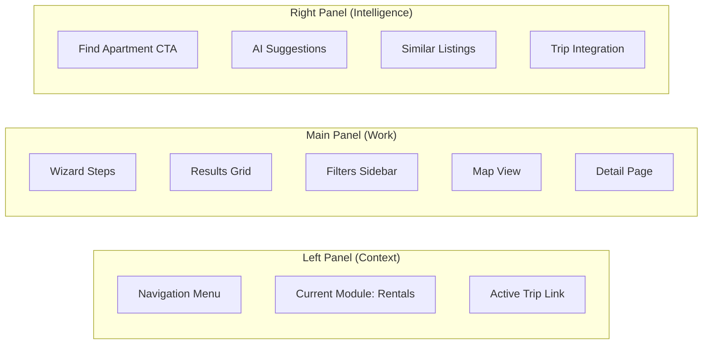
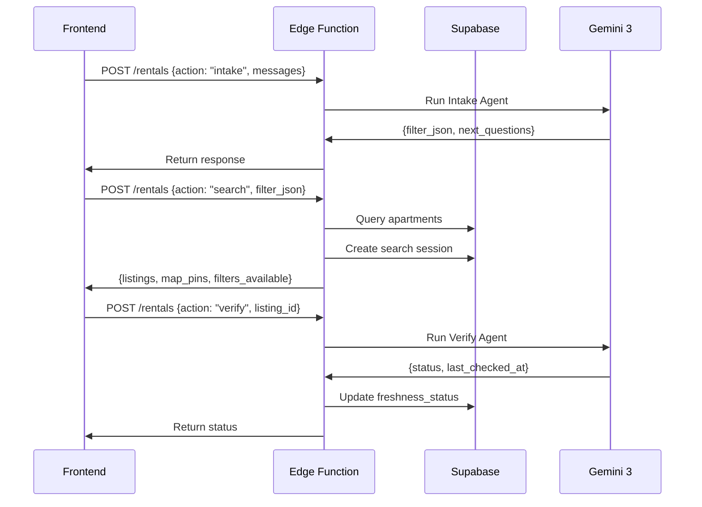
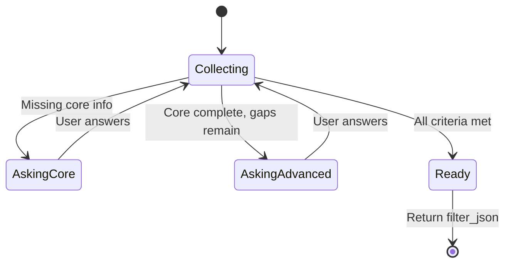

# Rentals Feature — Task Prompts

**Purpose:** Complete prompts for building the Medellín property search flow with user stories, acceptance criteria, 3-panel layout, wiring, schema, and AI agent specifications.

---

## Summary Table

| Dimension | Items |
|-----------|--------|
| **Screens** | Rentals search/wizard, Results (list + map), Detail, Saved shortlist, Compare |
| **Features** | Search wizard, freshness verification, filters, map, photo gallery, save, contact CTA |
| **Agents** | Intake (Gemini 3 Pro), Search, Verifier, Map, Page Composer (Gemini 3 Flash) |
| **Use Cases** | Find apartment, refine search, verify listings, save favorites, compare, contact |
| **Real-World Examples** | Maya finds Poblado 1BR; Carlos filters Envigado 3BR; Sarah compares monthly options |

---

## 1. User Stories



| ID | As a… | I want to… | So that… |
|----|-------|-------------|----------|
| R-1 | User | Start search from "Find me an apartment" | I can begin without hunting for filters |
| R-2 | User | Answer a short wizard (dates, bedrooms, budget, neighborhood) | The system has clear criteria |
| R-3 | User | See unified results from the database | I get comprehensive options |
| R-4 | User | Filter results by price, bedrooms, amenities | I narrow to what I need |
| R-5 | User | See "verified freshness" badges on listings | I know which are still available |
| R-6 | User | Pan/zoom map to filter by area | I focus on neighborhoods I care about |
| R-7 | User | Open listing detail with gallery and specs | I can evaluate before contacting |
| R-8 | User | Save listings to a shortlist | I can compare and decide later |
| R-9 | User | Compare 2–4 listings side-by-side | I can weigh options quickly |
| R-10 | User | Trigger "Check again" before contacting | I avoid contacting stale listings |

---

## 2. Real-World Examples

### Example 1: Maya (Digital Nomad)



**Story:** Maya is a remote worker from NYC planning a 3-month stay. She starts the wizard, specifies 1BR furnished in Poblado with strong WiFi for $1200/month. She gets 8 results with "Verified today" badges, filters by amenities, saves two favorites, and contacts the landlord.

### Example 2: Carlos (Expat)

**Story:** Carlos is relocating his family from Spain. He needs a 3BR in Envigado with parking, unfurnished, formal lease. He uses the wizard, filters by map bounds, compares two listings side-by-side, and schedules a viewing for the one checked 2 days ago.

### Example 3: Sarah (Traveler)

**Story:** Sarah wants a monthly furnished stay, open to Poblado or Laureles. She answers core questions and specifies "utilities included." Results include verified monthly listings. She saves three, opens detail for one, and re-verifies before booking.

---

## 3. Acceptance Criteria

- [ ] User can start flow from rentals page or "Find me an apartment"
- [ ] Wizard collects: move-in date, length, bedrooms, budget, neighborhood, furnished, amenities
- [ ] Intake Agent returns structured `filter_json` when criteria complete
- [ ] Search queries apartments table with proper filters
- [ ] Results show cards with freshness badge and last-checked time
- [ ] Map shows pins; pan/zoom can update list
- [ ] Detail page shows photo gallery, map, specs, contact CTA
- [ ] User can save listings to shortlist
- [ ] Optional: compare 2–4 listings side-by-side
- [ ] On-demand re-verification available before contact

---

## 4. Three-Panel Layout



| Panel | Role | Rentals Content |
|-------|------|-----------------|
| **Left** | Navigation, scope | Nav menu, current module, active trip |
| **Main** | Primary content, actions | Wizard, results, filters, map, detail |
| **Right** | AI suggestions | "Find apartment" entry, suggestions, trip tools |

---

## 5. Wiring Plan

### Frontend → Backend



### API Endpoints

| Endpoint | Method | Input | Output |
|----------|--------|-------|--------|
| `/rentals` action=intake | POST | messages, history | filter_json or next_questions |
| `/rentals` action=search | POST | filter_json | listings, map_pins, job_id |
| `/rentals` action=result | POST | job_id | listings, filters_available |
| `/rentals` action=verify | POST | listing_id | status, last_checked_at |
| `/rentals` action=listing | POST | id | listing detail |

---

## 6. Supabase Schema

### Existing Tables (Extended)

**apartments** - Extended with:
- `freshness_status` (active | unconfirmed | stale)
- `last_checked_at` (timestamp)
- `source_url` (text)
- `source_listing_id` (text)

### New Tables

**rental_search_sessions:**
```sql
- id (uuid, PK)
- user_id (uuid, FK profiles)
- filter_json (jsonb)
- result_ids (uuid[])
- created_at (timestamp)
```

**rental_freshness_log:**
```sql
- id (uuid, PK)
- listing_id (uuid, FK apartments)
- checked_at (timestamp)
- status (text)
- http_status (int)
- html_signature_match (boolean)
```

---

## 7. AI Agent Specifications

### Intake Agent (Gemini 3 Pro)



**Model:** `google/gemini-3-pro-preview`
**Purpose:** Collect search criteria through conversational wizard
**Output:** `filter_json` or `next_questions`

### Search Service (Gemini 3 Flash)

**Model:** `google/gemini-3-flash-preview`
**Purpose:** Execute search queries, calculate facets
**Output:** listings[], map_pins[], filters_available

### Verify Agent (Gemini 3 Flash)

**Model:** `google/gemini-3-flash-preview`
**Purpose:** Check listing freshness via HTTP
**Output:** status (active/unconfirmed/stale), last_checked_at

---

## 8. Dependencies

### Required
- [x] Apartments table with data
- [x] rental_search_sessions table
- [x] rental_freshness_log table
- [ ] LOVABLE_API_KEY secret configured
- [ ] Rentals edge function deployed

### AI Models
- `google/gemini-3-pro-preview` - Intake Agent (complex reasoning)
- `google/gemini-3-flash-preview` - Search/Verify (fast execution)

### Features Used
- Function calling for structured output
- Tool calling for database queries
- Structured outputs for filter_json schema
