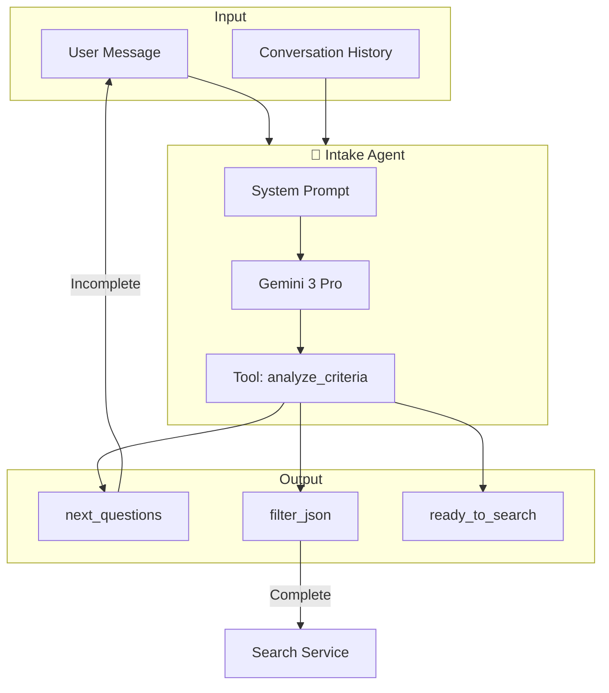
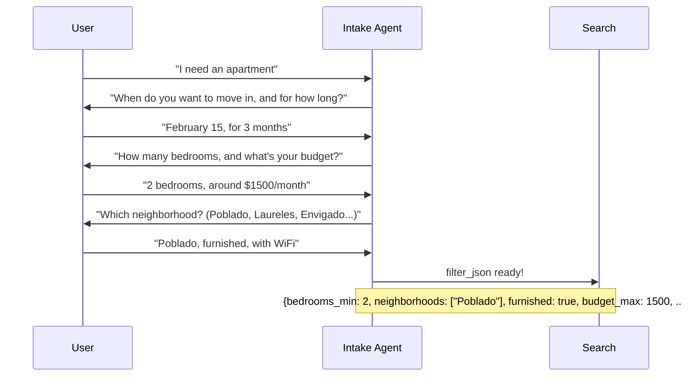

# Task: Implement Rentals Intake Agent

**Priority:** High  
**Estimated Effort:** 4-6 hours  
**Dependencies:** LOVABLE_API_KEY configured, apartments table

---

## Summary

Implement an AI-powered Intake Agent using Gemini 3 Pro that asks smart questions and outputs structured `filter_json` for apartment searches.

---

## Agent Architecture



---

## Conversation Flow



---

## Core Questions (Must Collect)

| # | Question | Maps To |
|---|----------|---------|
| 1 | Move-in date and length of stay | move_in_date, stay_length_months |
| 2 | Number of bedrooms (Studio/1/2/3+) | bedrooms_min, bedrooms_max |
| 3 | Monthly budget range (COP or USD) | budget_min, budget_max, currency |
| 4 | Neighborhood preference | neighborhoods[] |
| 5 | Furnished or unfurnished | furnished |
| 6 | Must-have amenities | amenities[] |
| 7 | Work needs (WiFi, quiet, desk) | work_needs[] |
| 8 | Pets allowed needed? | pets |
| 9 | Safety/vibe preference | safety_vibe |

---

## Advanced Questions (Ask 2-5 Based on Gaps)

| Question | Maps To |
|----------|---------|
| Utilities included in rent? | utilities_included |
| Deposit and payment flexibility? | deposit_flexible |
| Building type (high-rise vs house)? | building_type |
| Parking or motorcycle parking? | parking |
| Contract type (formal vs flexible)? | contract_type |
| Fiador/guarantor requirements? | fiador_required |
| Elevator required? | elevator_required |
| Verified listings only? | verified_only |

---

## Filter JSON Schema

```typescript
interface FilterJson {
  // Core criteria
  move_in_date?: string;        // ISO date
  stay_length_months?: number;  // 1-12+
  bedrooms_min?: number;        // 0 = studio
  bedrooms_max?: number;
  budget_min?: number;
  budget_max?: number;
  currency?: 'USD' | 'COP';
  neighborhoods?: string[];     // Poblado, Laureles, etc.
  furnished?: boolean;
  
  // Amenities and features
  amenities?: string[];         // WiFi, AC, balcony, etc.
  work_needs?: string[];        // strong_wifi, desk, quiet
  pets?: boolean;
  safety_vibe?: 'quiet' | 'nightlife' | 'any';
  
  // Advanced (optional)
  utilities_included?: boolean;
  deposit_flexible?: boolean;
  building_type?: 'high_rise' | 'house' | 'low_rise' | 'any';
  parking?: boolean;
  elevator_required?: boolean;
  verified_only?: boolean;
}
```

---

## System Prompt

```
You are a friendly apartment search assistant for Medellín, Colombia.

Your job is to collect the user's rental search criteria through a conversational wizard.

CORE QUESTIONS (must collect before searching):
1. Move-in date and length of stay
2. Number of bedrooms (Studio/1/2/3+)
3. Monthly budget range (COP or USD)
4. Neighborhood preference (Poblado/Laureles/Envigado/Sabaneta/Any safe)
5. Furnished or unfurnished
6. Must-have amenities (WiFi, AC, balcony, parking, gym, elevator, doorman)
7. Work needs (strong WiFi, quiet, desk, backup power)
8. Pets allowed needed?
9. Safety/vibe preference (quiet residential vs nightlife-friendly)

ADVANCED QUESTIONS (ask 2-5 based on gaps):
- Utilities included in rent?
- Deposit and payment flexibility?
- Building type (high-rise vs house)?
- Parking or motorcycle parking?
- Contract type (formal lease vs flexible monthly)?
- Fiador/guarantor requirements?

RULES:
1. Be conversational and friendly
2. Ask 2-3 questions at a time maximum
3. Once you have enough info for core criteria, set ready_to_search: true
4. Output structured JSON

MEDELLÍN NEIGHBORHOODS:
- Poblado: Upscale, expat-friendly, nightlife
- Laureles: Local vibe, cafes, safer
- Envigado: Family-friendly, quieter, good value
- Sabaneta: Suburban, affordable, growing
- Centro: Budget, historic, less safe for newcomers
```

---

## Acceptance Criteria

- [ ] Intake Agent calls Gemini 3 Pro via Lovable AI Gateway
- [ ] Returns structured `filter_json` when criteria complete
- [ ] Returns `next_questions` when criteria incomplete
- [ ] Handles multi-turn conversation history
- [ ] All 9 core questions can be collected
- [ ] Logs AI run to `ai_runs` table

---

## Test Scenarios

```bash
# Test 1: Initial message (needs questions)
POST /rentals
{
  "action": "intake",
  "messages": [{"role": "user", "content": "I need an apartment"}]
}
# Expected: next_questions with 2-3 core questions

# Test 2: Partial info
POST /rentals
{
  "action": "intake", 
  "messages": [
    {"role": "user", "content": "I need a 2BR in Poblado"},
    {"role": "assistant", "content": "Great! When do you need to move in?"},
    {"role": "user", "content": "Feb 15, for 3 months, budget $1500"}
  ]
}
# Expected: more questions or ready filter_json

# Test 3: Complete info
POST /rentals
{
  "action": "intake",
  "messages": [...complete conversation with all core answers...]
}
# Expected: ready_to_search: true, filter_json populated
```

---

## Files to Create/Modify

| File | Action |
|------|--------|
| `supabase/functions/rentals/index.ts` | CREATE |
| `supabase/config.toml` | MODIFY - add rentals function |
