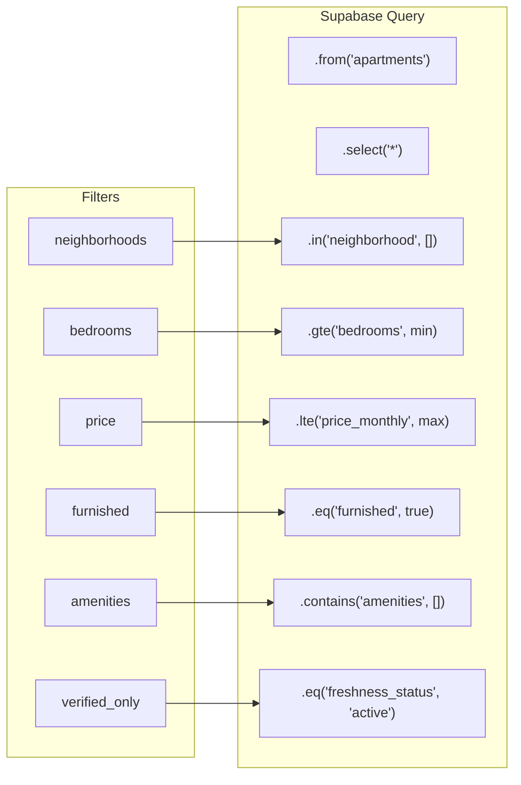
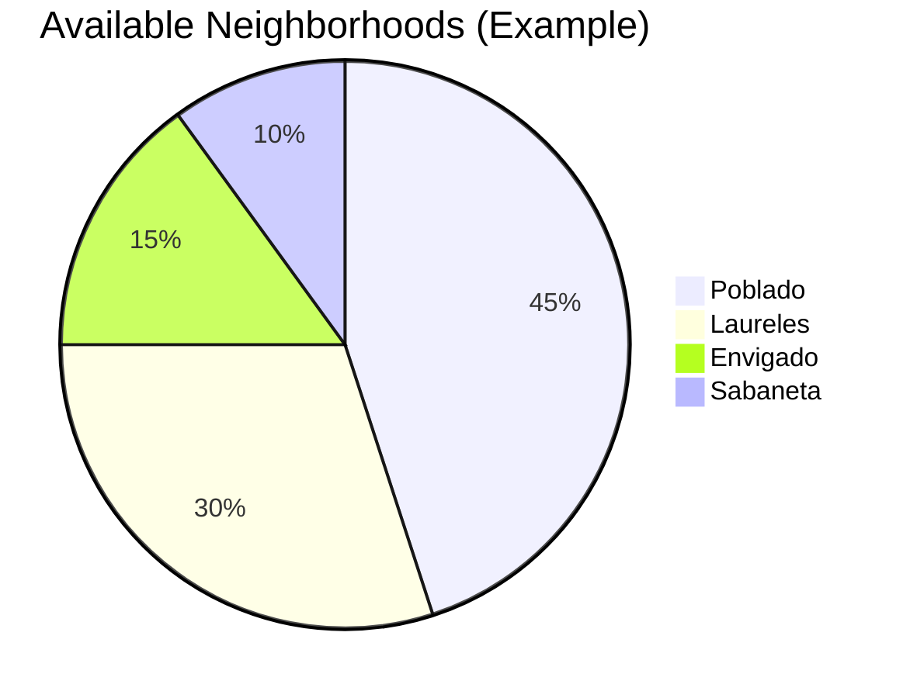

# Task: Implement Rentals Search Logic

**Priority:** High  
**Estimated Effort:** 6-8 hours  
**Dependencies:** Intake Agent (Task 03), Apartments table with data

---

## Summary

Implement real search logic that queries the `apartments` table, populates `result_ids` in the search session, and returns actual listings with map pins and filter facets.

---

## Search Flow Architecture

```mermaid
flowchart TB
    subgraph Input
        F[filter_json from Intake]
    end
    
    subgraph SearchService["🔍 Search Service"]
        Q[Build Query]
        E[Execute on apartments]
        M[Generate Map Pins]
        C[Calculate Facets]
    end
    
    subgraph Supabase
        A[(apartments)]
        S[(rental_search_sessions)]
    end
    
    subgraph Output
        L[listings[]]
        P[map_pins[]]
        FA[filters_available]
    end
    
    F --> Q
    Q --> E
    E --> A
    A --> L
    L --> M --> P
    L --> C --> FA
    L --> S
```

---

## Query Building Logic



---

## Filter Mapping

| Filter JSON Key | Apartments Column | Query Method |
|-----------------|-------------------|--------------|
| neighborhoods | neighborhood | .in() |
| bedrooms_min | bedrooms | .gte() |
| bedrooms_max | bedrooms | .lte() |
| budget_min | price_monthly | .gte() |
| budget_max | price_monthly | .lte() |
| furnished | furnished | .eq() |
| pets | pet_friendly | .eq() |
| amenities | amenities | .contains() |
| verified_only | freshness_status | .eq('active') |
| parking | parking_included | .eq() |

---

## Response Structure

```typescript
interface SearchResponse {
  job_id: string;           // Session ID for polling
  status: 'completed' | 'no_results';
  results: {
    listings: Apartment[];
    total_count: number;
  };
  map_data: {
    pins: MapPin[];
  };
  filters_available: {
    neighborhoods: { value: string; count: number }[];
    bedrooms: { value: number; count: number }[];
    price_range: { min: number; max: number };
  };
}

interface MapPin {
  id: string;
  lat: number;
  lng: number;
  price: number;
  bedrooms: number;
  freshness_status: string;
}
```

---

## Facet Calculation



The search service calculates available filter values from results:
- **Neighborhoods:** Count listings per neighborhood
- **Bedrooms:** Count listings per bedroom count
- **Price Range:** Min and max from results

---

## Acceptance Criteria

- [ ] Search queries `apartments` table with proper filters
- [ ] Result IDs are stored in `rental_search_sessions`
- [ ] Response includes listings, map pins, and filter facets
- [ ] Empty results return gracefully with status: 'no_results'
- [ ] Freshness status filters work (verified_only)
- [ ] Price filters use correct currency (USD assumed)
- [ ] Amenities filter uses array contains

---

## Test Scenarios

```bash
# Test 1: Basic search
POST /rentals
{
  "action": "search",
  "filter_json": {"neighborhoods": ["Poblado"], "bedrooms_min": 2}
}
# Expected: listings from Poblado with 2+ bedrooms

# Test 2: Price range
POST /rentals
{
  "action": "search", 
  "filter_json": {"budget_min": 500, "budget_max": 1500}
}
# Expected: listings in price range

# Test 3: Verified only
POST /rentals
{
  "action": "search",
  "filter_json": {"verified_only": true}
}
# Expected: only listings with freshness_status = 'active'

# Test 4: Empty results
POST /rentals
{
  "action": "search",
  "filter_json": {"neighborhoods": ["NonExistent"], "bedrooms_min": 10}
}
# Expected: status: 'no_results', listings: []
```

---

## Current Apartments Data

```sql
SELECT neighborhood, COUNT(*), AVG(price_monthly)
FROM apartments 
WHERE status = 'active'
GROUP BY neighborhood;
```

| Neighborhood | Count | Avg Price |
|--------------|-------|-----------|
| El Poblado | 2 | $1850 |
| Laureles | 1 | $450 |
| Envigado | 1 | $1500 |
| Centro | 1 | $300 |

---

## Files to Create/Modify

| File | Action |
|------|--------|
| `supabase/functions/rentals/index.ts` | MODIFY - add search handler |
