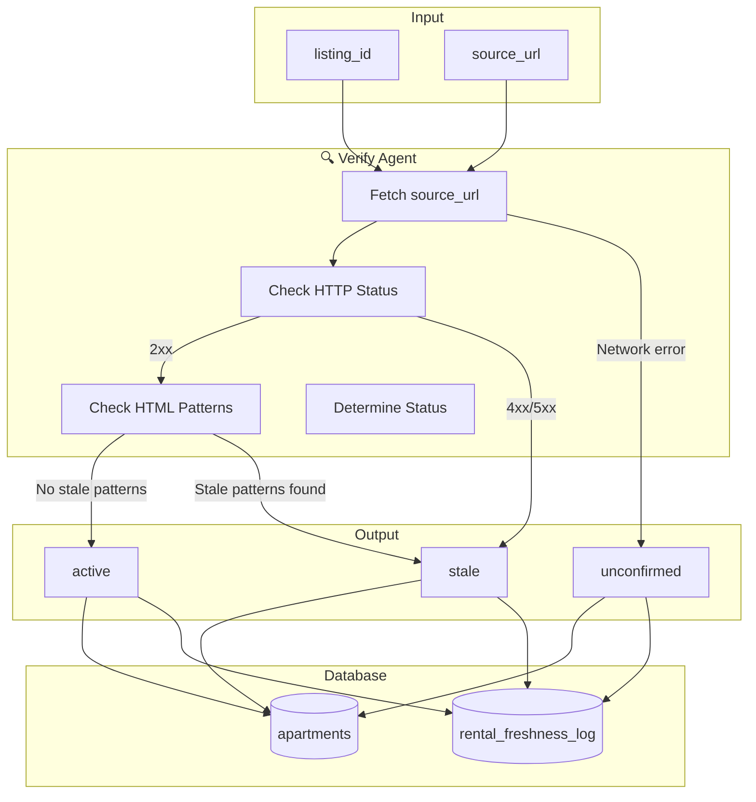
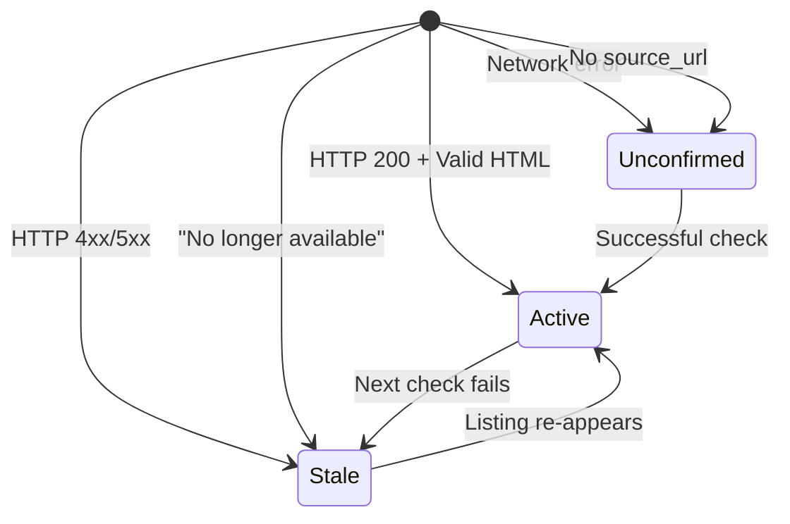
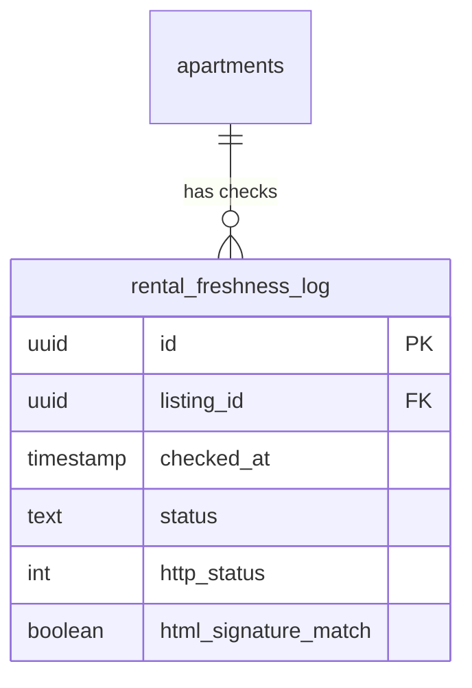
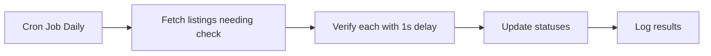

# Task: Implement Real Freshness Verification

**Priority:** Medium  
**Estimated Effort:** 3-4 hours  
**Dependencies:** Apartments with source_url populated

---

## Summary

Implement real HTTP checks and HTML pattern matching to determine if listings are still active, replacing stub verification.

---

## Verification Flow



---

## Status Definitions



| Status | Meaning | UI Display |
|--------|---------|------------|
| **active** | Verified available today | ✅ Verified |
| **unconfirmed** | Could not verify | ⚠️ Unconfirmed |
| **stale** | Likely unavailable | ❌ May be taken |

---

## Stale Detection Patterns

| Source | Stale Patterns (Spanish/English) |
|--------|----------------------------------|
| General | "no longer available", "listing not found" |
| FincaRaíz | "Este inmueble ya no está disponible" |
| Properstar | "This listing is no longer available" |
| Airbnb | "This listing isn't available" |
| General | "already rented", "ya rentado", "no disponible" |
| HTTP | 404, 410, 500+ |

---

## Freshness Log Schema



Each verification creates a log entry for audit trail.

---

## Verification Logic

```typescript
interface VerifyOutput {
  status: 'active' | 'unconfirmed' | 'stale';
  last_checked_at: string;
  http_status?: number;
  reason?: string;
}

// Decision tree:
// 1. No source_url → unconfirmed
// 2. HTTP 4xx/5xx → stale
// 3. HTML contains stale patterns → stale
// 4. HTTP 2xx + no stale patterns → active
// 5. Network/timeout error → unconfirmed
```

---

## Acceptance Criteria

- [ ] HTTP GET to source_url with 10s timeout
- [ ] Returns `stale` for 4xx/5xx responses
- [ ] Returns `stale` if HTML contains removal patterns
- [ ] Returns `active` if listing appears available
- [ ] Returns `unconfirmed` on network errors
- [ ] Updates `apartments.freshness_status` and `last_checked_at`
- [ ] Logs to `rental_freshness_log` table
- [ ] Handles missing source_url gracefully

---

## Test Scenarios

```bash
# Test 1: Verify listing by ID
POST /rentals
{
  "action": "verify",
  "listing_id": "750e8400-e29b-41d4-a716-446655440001"
}
# Expected: status based on source_url check

# Test 2: Listing without source_url
POST /rentals
{
  "action": "verify", 
  "listing_id": "uuid-without-source-url"
}
# Expected: status: "unconfirmed", reason: "No source URL on record"

# Test 3: Force refresh
POST /rentals
{
  "action": "verify",
  "listing_id": "uuid",
  "force": true
}
# Expected: Always performs new HTTP check
```

---

## Batch Verification (Future)

For scheduled verification of stale listings:



Query for listings needing verification:
```sql
SELECT id, source_url FROM apartments
WHERE freshness_status != 'active'
   OR last_checked_at < NOW() - INTERVAL '7 days'
ORDER BY last_checked_at ASC NULLS FIRST
LIMIT 50;
```

---

## Files to Create/Modify

| File | Action |
|------|--------|
| `supabase/functions/rentals/index.ts` | MODIFY - add verify handler |
