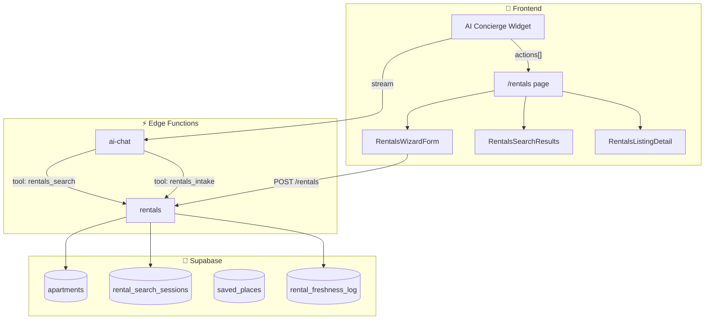
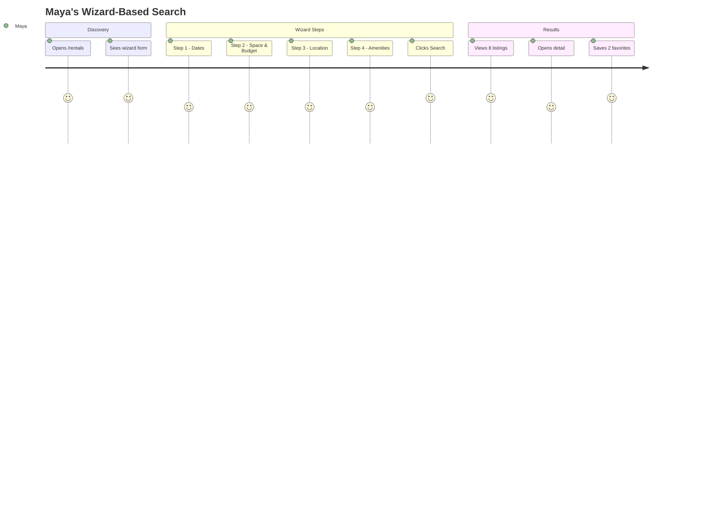
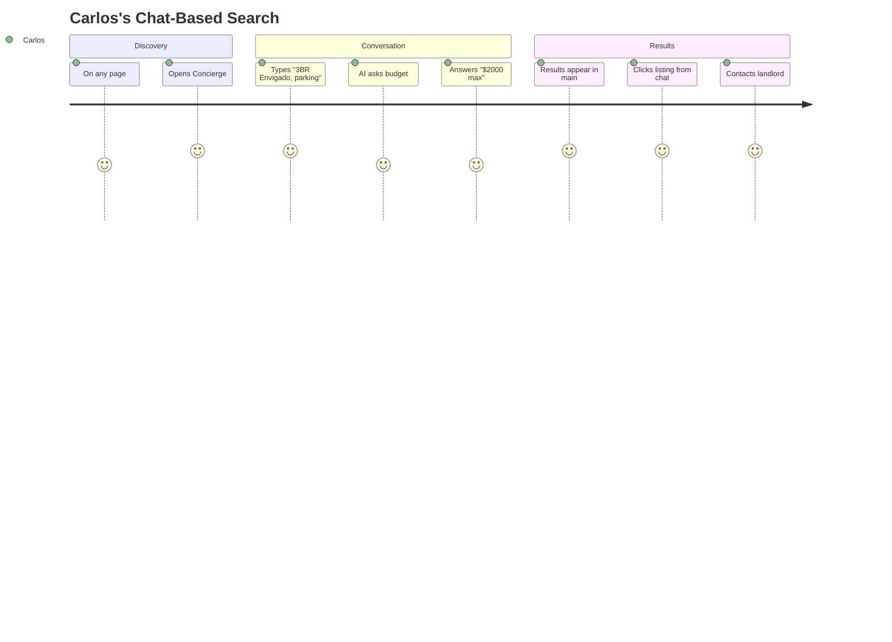
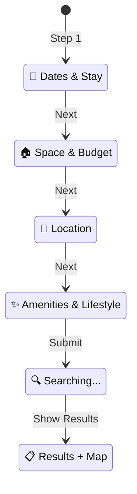

# Unified Rentals System — Wizard Form + Concierge Integration

**Purpose:** Merge rentals into the existing AI Concierge chat while providing a multistep wizard form on `/rentals`. No duplicate chatbot.  
**Status:** Implementation Ready | **Priority:** High

---

## 📊 Architecture Overview



---

## 🎯 Key Principle: One Chat, Two Entry Points

| Entry Point | How Criteria Are Collected | Backend |
|-------------|---------------------------|---------|
| **Wizard (form-based)** | Structured steps: date picker, dropdowns, multi-select | Frontend builds `filter_json` → `POST /rentals` action:search |
| **Concierge (chat-based)** | Natural language → AI extracts criteria | ai-chat calls rentals tool → same `filter_json` → same search |

Both paths use the **same search agent** (rentals Edge Function) and produce the same results.

---

## 📋 User Stories

| ID | As a… | I want to… | So that… |
|----|-------|------------|----------|
| R-1 | User | Fill a step-by-step form on `/rentals` | I can specify criteria without typing |
| R-2 | User | Ask the Concierge "Find me a 2BR in Poblado" | I can search via natural language |
| R-3 | User | See results update in main panel from either wizard or chat | Both methods give me the same experience |
| R-4 | User | Save listings to my shortlist | I can compare and decide later |
| R-5 | User | Verify listing freshness before contacting | I avoid stale listings |
| R-6 | User | See freshness badges on results | I know which listings are verified |

---

## 🚶 User Journeys

### Journey 1: Wizard Flow



### Journey 2: Concierge Flow



---

## 🧩 Wizard Form Steps



| Step | Fields |
|------|--------|
| **1. Dates & Stay** | Move-in date (date picker), Length of stay (1/3/6+ months or custom) |
| **2. Space & Budget** | Bedrooms (Studio/1/2/3+), Budget range (min-max USD), Flexibility toggle |
| **3. Location** | Neighborhoods (multi-select: Poblado, Laureles, Envigado, Sabaneta), Furnished toggle |
| **4. Amenities** | Must-haves (WiFi, AC, parking, gym, pool), Work needs (desk, fast WiFi), Pets toggle |

---

## 🤖 Concierge Tool Integration

### Tool: `rentals_intake`

```typescript
{
  name: "rentals_intake",
  description: "Collect rental criteria via conversation. Returns filter_json when complete or next_questions to ask.",
  parameters: {
    messages: [{ role: string, content: string }],
    context: { collected_criteria: object }
  }
}
```

### Tool: `rentals_search`

```typescript
{
  name: "rentals_search", 
  description: "Search apartments using filter criteria. Returns listings, map pins, and available filters.",
  parameters: {
    filter_json: {
      neighborhoods: string[],
      bedrooms_min: number,
      budget_max: number,
      furnished: boolean,
      amenities: string[],
      // ...
    }
  }
}
```

---

## 🔄 Actions System

When Concierge triggers rentals, responses include `actions[]`:

```typescript
interface RentalsAction {
  type: 'OPEN_RENTALS_RESULTS' | 'OPEN_LISTING' | 'SAVE_LISTING' | 'VERIFY_LISTING';
  payload: {
    job_id?: string;
    listing_id?: string;
    listings?: Apartment[];
    map_pins?: MapPin[];
  };
}
```

Frontend listens for actions and updates main panel accordingly.

---

## 📁 Files to Create/Modify

| File | Action | Purpose |
|------|--------|---------|
| `src/components/rentals/RentalsWizardForm.tsx` | CREATE | Multistep form wizard |
| `src/pages/Rentals.tsx` | MODIFY | Remove AI chat from main, use wizard |
| `supabase/functions/ai-chat/index.ts` | MODIFY | Add rentals_intake and rentals_search tools |
| `docs/tasks/07-rentals/06-unified-rentals-plan.md` | CREATE | This documentation |

---

## ✅ Acceptance Criteria

- [ ] `/rentals` shows wizard form in main area (not a chat)
- [ ] Only Concierge widget on right (no duplicate chat)
- [ ] Wizard submits to rentals search and shows results
- [ ] Concierge can search rentals via natural language
- [ ] Both paths use same search backend
- [ ] Results show freshness badges
- [ ] Listings can be saved to shortlist

---

## 🧪 Test Scenarios

```bash
# Test 1: Wizard search
1. Go to /rentals
2. Fill wizard: Poblado, 2BR, $1500 max, furnished
3. Click Search
4. Expected: Results grid + map with apartments

# Test 2: Concierge search
1. Open Concierge widget
2. Type "Find me a furnished 2BR in Laureles under $1200"
3. Expected: AI asks follow-up if needed, then shows results

# Test 3: Verify action
1. Open a listing detail
2. Click "Verify Availability"
3. Expected: Freshness check runs, badge updates
```

---

## 🌍 Real-World Examples

### Maya (Digital Nomad)
- Uses **wizard** because she knows exactly what she wants
- Fills: Poblado, 1BR, $1200-1500, furnished, fast WiFi, desk
- Gets 6 results, saves 2, contacts the verified one

### Carlos (Expat Family)
- Uses **Concierge** while browsing trips
- Types: "I need a 3BR in Envigado with parking for my family"
- Concierge asks budget → "$2500" → Shows results in main panel
- Never leaves the chat flow

### Sarah (Traveler)
- Starts with wizard, but asks Concierge for refinement
- Wizard: Laureles, Studio, $800 max
- Then in chat: "Show me ones with pools"
- Concierge applies filter, updates results

---

**Document Status:** Ready for implementation ✅
