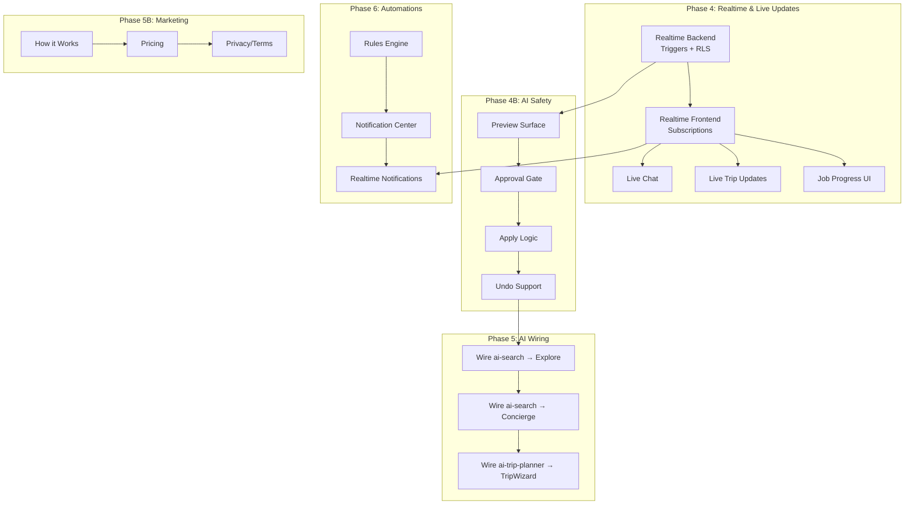

# I Love Medellín — Tasks & Implementation Prompts

> **Last Updated:** 2026-01-29

This directory contains implementation prompts, progress tracking, and development plans for the I Love Medellín project.

---

## 📁 Directory Structure

```
docs/tasks/
├── README.md                      # This file
├── 00-progress-tracker.md         # Master progress tracker
├── 01-realtime-backend.md         # Supabase Realtime triggers/RLS
├── 02-realtime-frontend.md        # Frontend Realtime subscriptions
├── 03-marketing-routes.md         # Public marketing & legal pages
├── 04-preview-apply-undo.md       # AI safety pattern
├── 05-ai-wiring.md                # Wire ai-search & ai-trip-planner
└── 06-automations.md              # Rules engine & notifications
```

---

## 📊 Implementation Status

| Feature Area | Status | Priority | Effort |
|--------------|--------|----------|--------|
| **Realtime Backend** | 🔴 Not Started | P1 | L |
| **Realtime Frontend** | 🔴 Not Started | P1 | M |
| **Marketing Routes** | 🔴 Not Started | P2 | S |
| **Preview-Apply-Undo** | 🔴 Not Started | P1 | M |
| **AI Wiring** | 🔴 Not Started | P1 | M |
| **Automations** | 🔴 Not Started | P3 | L |

---

## 🔗 Related Documentation

- [Knowledge Base](../knowledge/README.md) — Gemini & Supabase references
- [Progress Tracker](../progress-tracker/progress.md) — Overall project status
- [Prompts](../prompts/README.md) — Feature specification prompts
- [Audits](../audits/README.md) — Forensic audit reports

---

## 🎯 Implementation Order



---

## 📋 Quick Reference

### Edge Functions (Deployed)

| Function | Purpose | Status |
|----------|---------|--------|
| ai-chat | Main chat with tool calling | ✅ Active |
| ai-router | Intent classification | ✅ Active |
| ai-optimize-route | Route optimization | ✅ Active |
| ai-suggest-collections | Collection suggestions | ✅ Active |
| google-directions | Google Routes API | ✅ Active |

### Edge Functions (Planned)

| Function | Purpose | Status |
|----------|---------|--------|
| ai-search | Multi-domain search | 📋 TODO |
| ai-trip-planner | Itinerary generation | 📋 TODO |
| rules-engine | Automated suggestions | 📋 TODO |

### Database Tables for Realtime

| Table | Broadcast Topic | Events |
|-------|-----------------|--------|
| messages | `conversation:{id}:messages` | INSERT, UPDATE, DELETE |
| trip_items | `trip:{id}:items` | INSERT, UPDATE, DELETE |
| trips | `trip:{id}:meta` | UPDATE |
| agent_jobs | `job:{id}:status` | job_status_changed |
| proactive_suggestions | `user:{id}:notifications` | suggestion_created |
