# mdeai Roadmap + System Diagrams

*Version 1.0 · Locked: 2026-04-23 · Companion to `tasks/MDEAI-MASTER-PRD.md`*

This document is the single-page visual view of mdeai. It uses two skills:
- **roadmap** — Now / Next / Later + quarterly outcomes, capacity-aware
- **mermaid-diagrams** — all visuals rendered as Mermaid so they live in-repo, diff clean, and update with code

Every diagram here is a live Mermaid block — renders on GitHub, in any IDE markdown preview, and in the Supabase/Vercel dashboards that accept Mermaid.

---

## 1. Now · Next · Later

The roadmap skill's recommended view when you need to say *"what ships when"* without over-committing to dates 6 months out. Everything left of the vertical bar is a commitment; right of the bar is a bet.

| NOW (Week 2–5 · committed) | NEXT (Month 2 · planned) | LATER (Month 3+ · bets) |
|---|---|---|
| Week 2: context chips · save/trip · left-nav · SEO CTA · affiliate attribution | pgvector + embeddings + HNSW index | OpenClaw skills (ingest-*, scam-score, outreach) |
| Week 3: Google Places → restaurants tool + 🍽️ pins | Hermes-style composite ranker RPC | Paperclip governance (budgets, approvals, audit) |
| Week 4: Eventbrite → events tool + 🎉 pins | User taste vectors + personalization re-rank | WhatsApp channel (Infobip) |
| Week 5: Places `tourist_attraction` → attractions tool + 📍 pins | Gemini conversation memory summarization | Native Stripe Connect rental bookings |
| First paying agent + $500 credit pack | Firecrawl ingestion (FazWaz, Metrocuadrado, FincaRaiz) | Landlord SaaS ($29–99/mo) |
| First affiliate click + `outbound_clicks` table | Apify Airbnb + Facebook Groups (accept account risk) | Scam-check API (B2B, $0.10/check) |
| — | `scam_signals` table + price/photo hash detection | Multi-city (Bogotá, Cartagena) |
| — | Lease review AI (PDF → clauses → risk tier) | Verified-agent marketplace |

**Capacity note:** All of NOW is committed against existing Week 1 velocity (1 engineering day ≈ 1 column in the table). NEXT assumes continued solo pace. LATER assumes either more hands or externalizing scrape infra.

---

## 2. 12-month roadmap (Gantt)

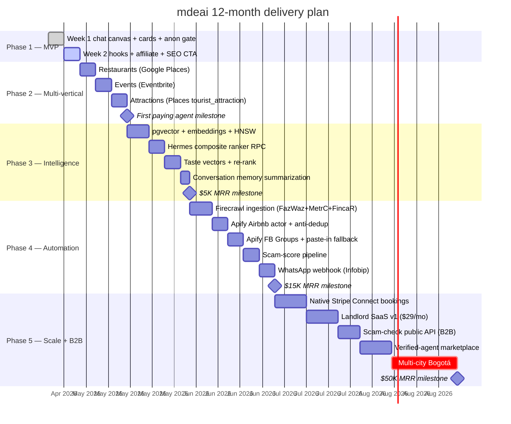

---

## 3. System architecture (layered flowchart)

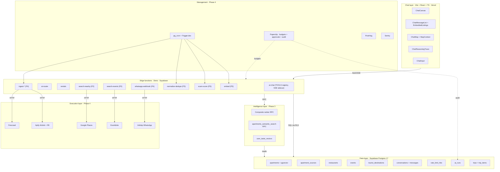

---

## 4. Current sprint + backlog (Kanban)

```mermaid
kanban
    Done
        [Tool-registry refactor + ChatCanvas at /]@{ priority: 'High' }
        [Inline RentalCardInline + EmbeddedListings]
        [MapContext + ChatMap + reasoning trace]
        [Structured response + Not a Fit table]
        [Anon 3-msg gate + EmailGateModal (curl-proven)]
        [Durable Postgres rate limiter]
        [Seed 43 apartments with hosts+ratings+sources]
        [Vercel build green]

    In Progress (Week 2)
        [Context chips bar + session_data jsonb]@{ priority: 'High' }
        [♥ Save + ➕ Add-to-trip wiring]@{ priority: 'High' }

    Up Next (Week 2 remaining)
        [ChatLeftNav with chat history + saved + trips]
        [/apartments/:id "Ask mdeai about this →" CTA]
        [outbound_clicks table + affiliate tag injection]@{ priority: 'Very High' }

    Phase 2 backlog
        [search-nearby edge fn + Google Places wrapper]
        [Seed 200 Medellin restaurants via Places]
        [RestaurantCardInline + pin]
        [Eventbrite tool + EventCardInline + pin]
        [Attractions tool + pin]
        [First paying agent ($500 credit pack)]@{ priority: 'Very High' }

    Phase 3 backlog
        [pgvector extension + embedding column + HNSW]
        [apartments_semantic_search RPC]
        [Hermes composite ranker]
        [user_taste_vectors + personalization re-rank]
        [Firecrawl FazWaz/Metrocuadrado/FincaRaiz]
```

---

## 5. User journey — Medellín nomad finds + saves a rental

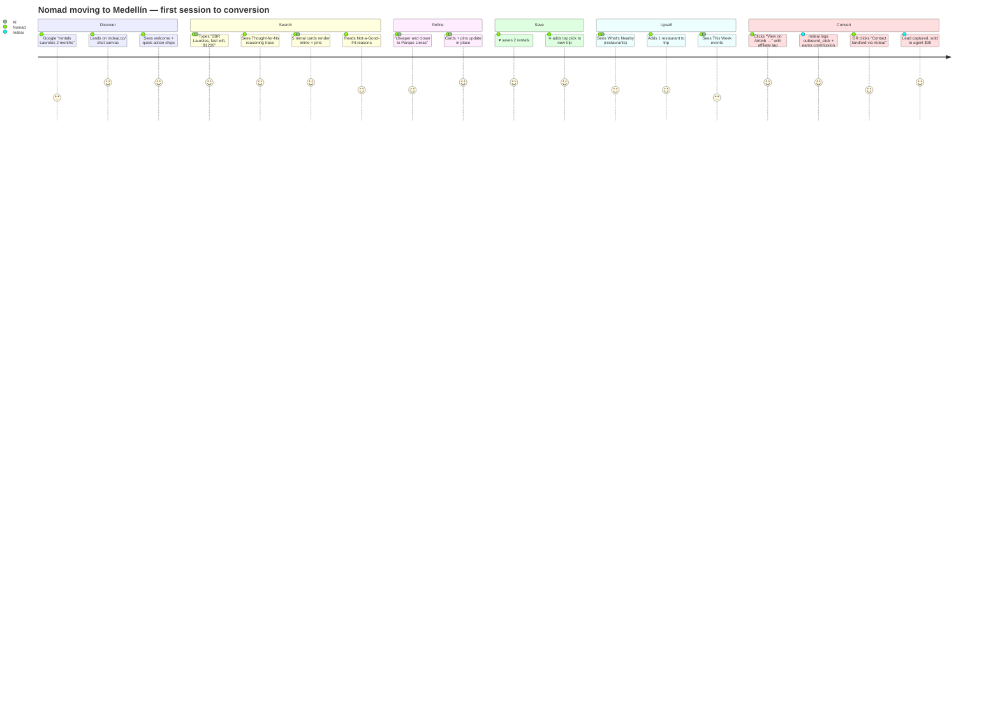

---

## 6. Sequence — chat tool-call end-to-end

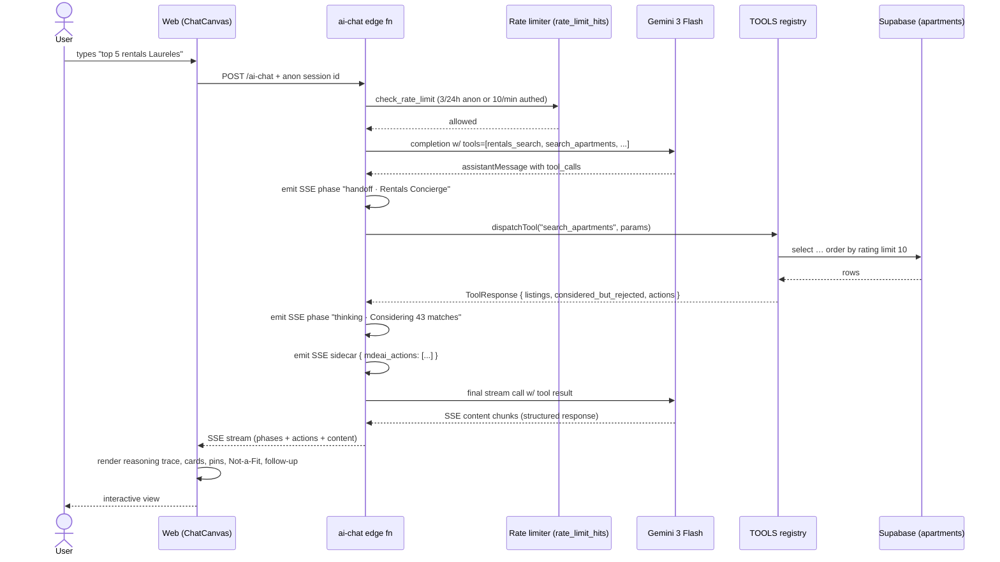

---

## 7. Data model (ERD)

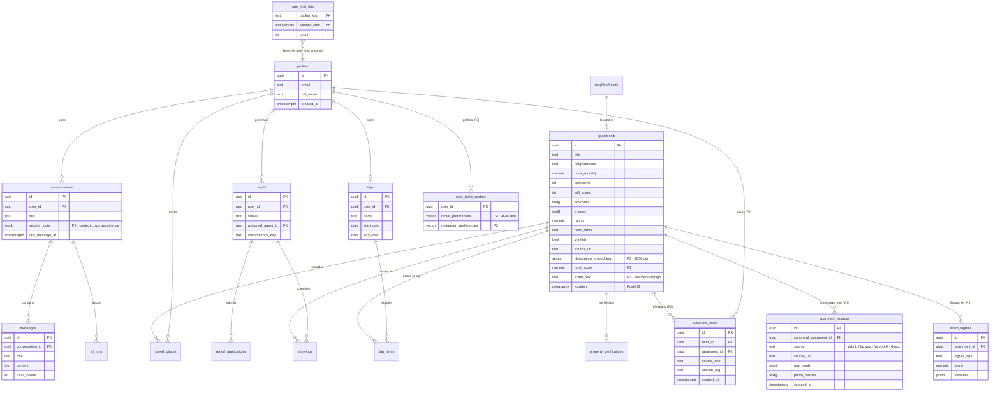

---

## 8. Scraping pipeline — decision tree

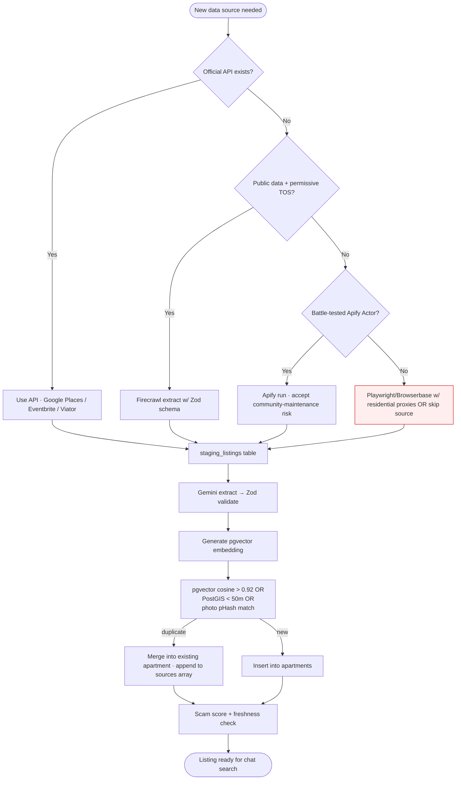

---

## 9. Anonymous-to-authed session lifecycle

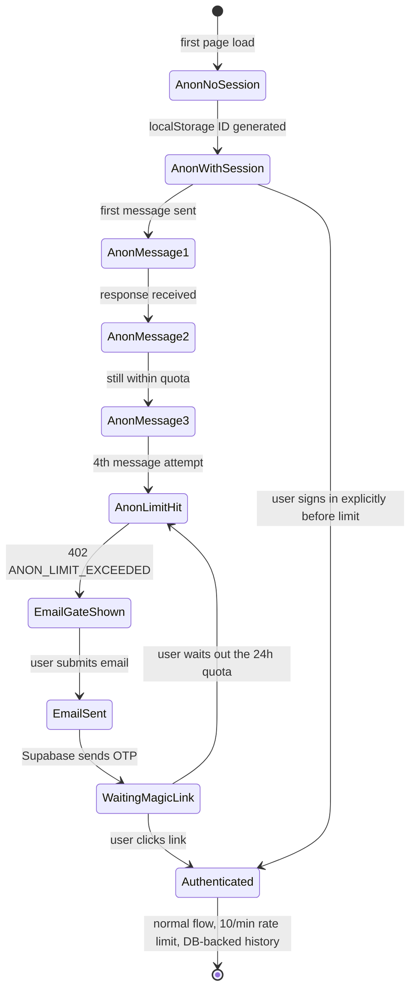

---

## 10. Scam detection signals (flowchart)

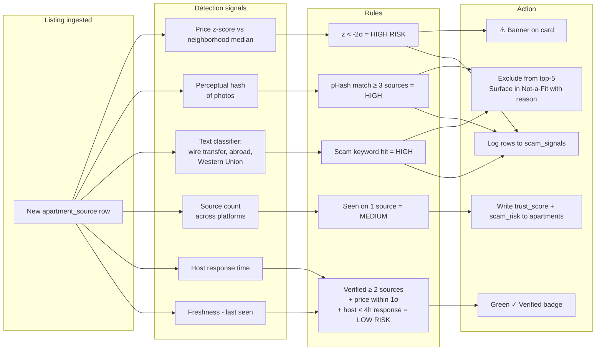

---

## 11. Revenue mix projections

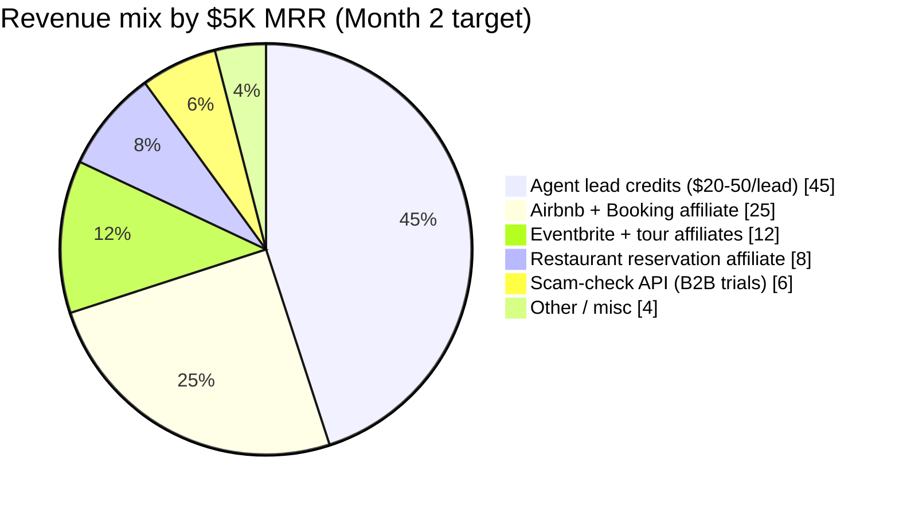

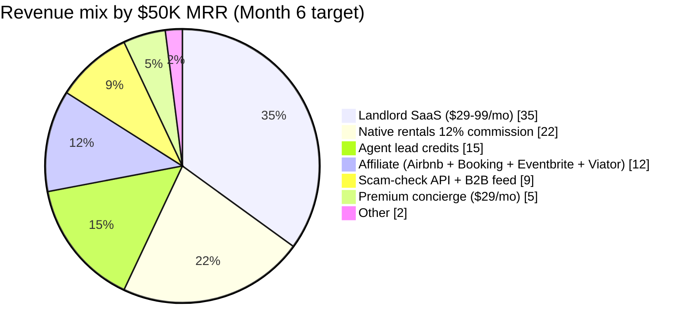

---

## 12. Tool-registry extension pattern (how new verticals plug in)

```mermaid
flowchart LR
    subgraph NEW[Add a new vertical = 3 files]
        direction TB
        TOOL["1\. supabase/functions/ai-chat/TOOLS entry<br/>{ definition, execute }"]
        CARD["2\. src/components/chat/embedded/<br/>XCardInline.tsx"]
        PIN["3\. src/context/MapContext.tsx<br/>PIN_CATEGORY_CONFIG row"]
    end

    subgraph UNCHANGED[Zero changes needed]
        direction TB
        PIPE[Chat SSE pipeline]
        EMB[EmbeddedListings dispatcher]
        ACT[ChatActionBar]
        MAP[ChatMap pin renderer]
        NOT[NotAFitTable]
        CHIPS[ContextChips]
        TRACE[ChatReasoningTrace]
    end

    NEW -- registers --> UNCHANGED

    subgraph VERTICALS[Verticals unlocked in turn]
        direction TB
        R1["Rentals · shipped"]:::done
        R2["Restaurants · Week 3"]:::next
        R3["Events · Week 4"]:::next
        R4["Attractions · Week 5"]:::next
        R5["Cars · Q3 if needed"]:::later
    end

    UNCHANGED --> VERTICALS

    classDef done fill:#dcfce7,stroke:#15803d
    classDef next fill:#dbeafe,stroke:#1d4ed8
    classDef later fill:#f3f4f6,stroke:#6b7280
```

---

## 13. Phase transitions — gates to advance

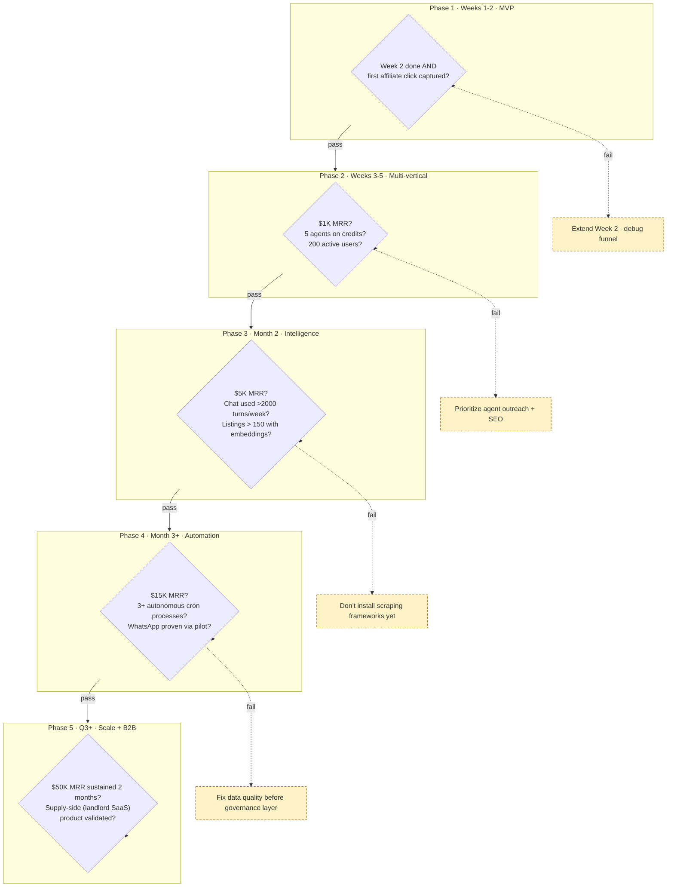

---

## 14. Appendix — where each diagram lives in the PRD

| Diagram | PRD section | Use case |
|---|---|---|
| Now/Next/Later | New (top of this doc) | Exec briefing |
| 12-month Gantt | Appendix A | Quarterly planning |
| System architecture | §3.2 | Onboarding engineers |
| Kanban | — | Standup / sprint review |
| User journey | §11.1 | Marketing narrative |
| Sequence (chat) | §3.3 | Debugging |
| ERD | §15 | Migration planning |
| Scraping flowchart | §9.1 | Data engineering |
| Anon session state | §11.4 | Auth debugging |
| Scam detection | §9.5 | Trust & safety |
| Revenue mix pie | §10.1 | Investor deck |
| Tool-registry pattern | §3.3 | Adding a vertical |
| Phase gates | §4 | Promoting phases |

---

## 15. How to keep this document alive

- **Update the Gantt + Kanban** when a week ships or a phase gate is met (both live in this single file)
- **Bump version** in the PRD header when a phase transitions
- **Never add a diagram without removing a stale one** — keep the total ≤ 14 so the doc stays navigable
- Mermaid renders on GitHub + Vercel + most IDEs, so diagrams travel with the code

---

*End of roadmap v1.0. Update on phase transitions or quarterly reviews.*
