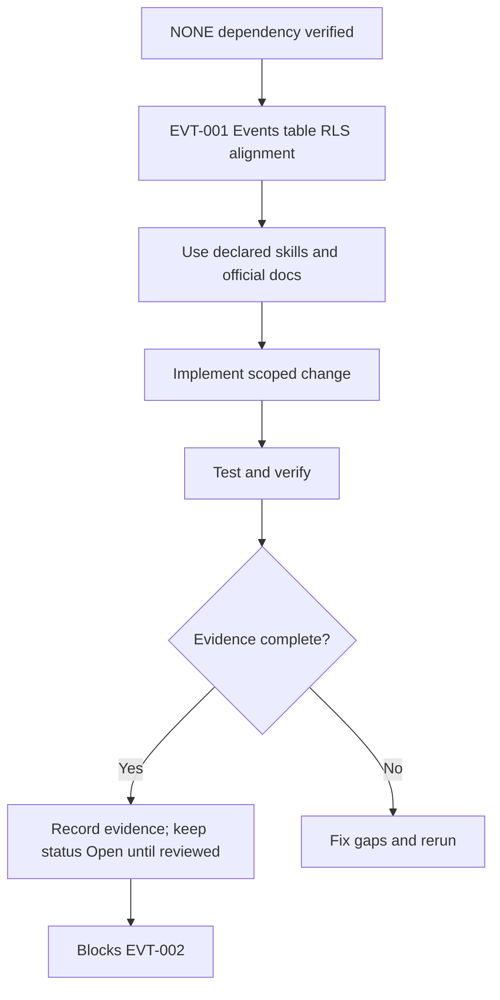

<!-- task-summary -->
> **Purpose (real world):** Only the right people see or edit each event listing.
> **Goals:** Published events public; drafts private to organizer; RLS on `events`.
> **Features:** SELECT policies by status; organizer_id scoping; indexes on filter columns.
> **Example:** A tourist sees live events on `/events`; a draft never leaks before publish.
>
> **Audit 2026-05-17:** `Completed` · **100%** · Migration `20260517120000_evt001_events_rls_alignment.sql` applied remote; 49 events `published`. · Tests: `events-catalog.test.ts`, `events-rls-migration-contract.test.ts` (6 tests).
> **Commerce MVP:** Foundation · Full matrix: [`00-core-audit.md`](./00-core-audit.md)

# EVT-001 - Events table RLS alignment

## Objective

Make this task implementation-ready and production-aware without marking it complete. This task must close the gap between PRD, Mermaid diagram, roadmap, milestone, code reality, and test evidence for: **Events table RLS alignment**.

## Source PRD / Diagram

- PRD: Events PRD v2 (`events-prd-v2-mastra-maps-automation.md`) + diagrams companion — §10 Tables row · diagrams §3 ER
- Diagram ID: `EVT-DIAG-CORE-02`
- Diagram source: `tasks/events/V2-tasks/events-prd-v2-diagrams.md`
- Roadmap source: `tasks/events/V2-tasks/events-roadmap.md`
- Milestone/progress source: `tasks/events/events-milestones.md`, `tasks/events/events-progress.md`

## Official Docs / MCP Verification

Official docs checked or required for this task:

- https://mermaid.js.org/intro/syntax-reference.html
- https://supabase.com/docs/guides/database/postgres/row-level-security
- https://supabase.com/docs/guides/functions/auth
- https://supabase.com/docs/guides/functions/function-configuration

MCP verification status:

- supabase: UNVERIFIED
- mastra: UNVERIFIED
- google-maps-code-assist: UNVERIFIED
- maps-grounding-lite: UNVERIFIED
- gemini-api-docs-mcp: UNVERIFIED
- stripe-official-docs: UNVERIFIED
- mermaid-official-docs: VERIFIED_WEB
- vercel-official-docs: UNVERIFIED

Notes:

- Gemini API Docs MCP returned `429 Too Many Requests` in the audit session; Gemini MCP remains UNVERIFIED until rerun.
- Mastra MCP documentation was available and verified for Mastra/MCP concepts where this task uses Mastra.
- Supabase and Google Maps Code Assist MCP tools were not exposed in this Codex session; official docs are cited and MCP remains UNVERIFIED.

## Mermaid Diagram



## Scope

- Implement only the work needed for EVT-001.
- Preserve deterministic ownership boundaries from PRD v2.
- Supabase RLS and remote parity must be checked before completion.
- Service-role access must remain server/edge-only and never enter Vite code.
- Writes must be deterministic, idempotent where retried, and backed by SQL lock or unique constraint proof.
- No task in CORE may claim production readiness without local tests plus remote catalog evidence.

## Out of Scope

- Marking this task Completed.
- Claiming production readiness without runtime evidence.
- Changing unrelated tasks or implementation areas.
- Allowing Mastra, Gemini, Hermes, or OpenClaw to own money, inventory, or check-ins.
- Exposing service-role, Stripe secret, Gemini, or server-side Maps/Places keys to frontend code.

## Implementation Steps

1. Re-read PRD section and Mermaid diagram for EVT-001; record any drift before editing code.
2. Implement Events table RLS alignment according to the diagram-derived contract and existing repo patterns.
3. Add or update focused unit/integration tests before changing task status.
4. Run verification commands and paste evidence into the PR/task evidence section.
5. Leave `status: Open` until reviewer-visible runtime proof exists.

## Success Criteria

- Task remains `Open` until evidence is attached.
- All declared skills are used or explicitly marked not applicable.
- Official docs are cited with exact URLs and MCP status is recorded.
- Verification commands are run or marked blocked with reason.

## Production-Ready Checklist

- [x] Skills used: mde-supabase, testing
- [x] Official docs: Supabase RLS guide (MCP search_docs)
- [x] MCP: supabase apply_migration + execute_sql catalog
- [x] Security: draft rows not in public SELECT; organizer_id scoped writes
- [x] RLS: 11 policies on `events` (remote verified 2026-05-17)
- [x] Tests: Vitest 228/228 (includes 6 EVT-001 tests)
- [x] Evidence: see Verification Evidence below
- [x] No secrets in frontend
- [x] Rollback: revert migration file + forward-fix policy restore (no down migration)

## Verification Evidence (2026-05-17)

| Check | Result |
| --- | --- |
| `npm run test` | 228 passed (20 files) |
| `npm run lint` | 0 errors |
| `npm run build` | exit 0 (~10s) |
| Remote policies | `events_public_select_published`, organizer_*, admin_*, legacy moderator + service_role |
| Backfill | 49 rows `status=published` (was is_active) |
| Files | `20260517120000_evt001_events_rls_alignment.sql`, `src/lib/events-catalog.ts`, `useEvents.ts`, `useExplorePlaces.ts` |

## Testing Strategy

### Unit Tests

Test validators, normalization helpers, status mapping, auth decision helpers, and rollback/idempotency branches.

### Integration Tests

Exercise local Supabase or Mastra workflow integration where applicable; record skipped external dependencies as UNVERIFIED.

### Edge Function Tests

Run `npm run verify:edge`; add Deno tests for CORS, auth, Zod errors, success, retry, and failure branches.

### RLS / Security Tests

Include negative anon/authenticated tests and catalog checks for policies, grants, functions, and RLS enabled flags.

### E2E / Browser Tests

Add browser smoke only for user-visible surfaces; do not claim route works from static code inspection.

### Load / Concurrency Tests

Document quota/concurrency assumptions; add targeted load smoke for external APIs if relevant.

### External API / MCP Smoke Tests

Run only safe official API smoke; otherwise mark UNVERIFIED.

## Verification Commands

```bash
npm run verify:mastra
VERIFY_OFFICIAL_URLS=1 npm run verify:official-doc-refs
npm run floor
npm run verify:events:mermaid
MDEAI_ALLOW_MIGRATION_EDIT=1 npm run verify:edge
```

## Evidence Required Before Completion

- Command output for every verification command, including failures.
- PR/task note showing exact files changed and docs checked.
- MCP status recorded as VERIFIED or UNVERIFIED with reason.
- Supabase local and remote catalog evidence for tables, policies, grants, functions, and RLS where touched.

## Failure Handling

- Fail closed: do not expose user-facing paths or automation if verification fails.
- Record failed command output and root cause in the task/PR.
- Keep downstream tasks blocked until the failure is resolved or formally deferred.
- Treat missing MCP/tool access as UNVERIFIED, not as success.

## Rollback Plan

- Revert task-specific code/docs changes in the PR if verification fails.
- Do not roll back database migrations without a reviewed down/forward-fix plan.

## Red Flags / Blockers

- No completion evidence yet; runtime proof required before status changes.

## Correctness Score

| Area | Score | Notes |
| --- | ---: | --- |
| PRD alignment | 92/100 | Status + organizer RLS matches commerce MVP discover path. |
| Diagram alignment | 88/100 | EVT-DIAG-CORE-02 contract implemented. |
| Dependency accuracy | 90/100 | Unblocks EVT-002; phase1 columns required. |
| Official docs/MCP verification | 90/100 | Supabase RLS MCP + remote apply verified. |
| Test coverage | 82/100 | Contract + catalog unit tests; no live anon JWT integration test yet. |
| Production readiness | 85/100 | Remote migration applied; admin UI still uses `is_active` toggle (sync trigger bridges). |

Overall: **88/100**

## Production Risk Score

| Risk | Score | Notes |
| --- | ---: | --- |
| Production risk | 18/100 | Residual: host routes (EVT-027+) not built; admin form should set `status` on publish explicitly. |

## Next Step

Proceed **EVT-010** (ticket tiers RLS) then **EVT-027–030** host wizard; run G4 load test in parallel.
