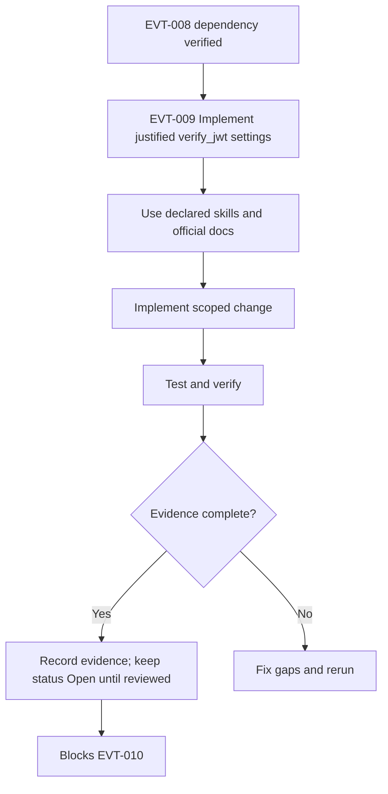

# EVT-009 - Implement justified `verify_jwt` settings

## Objective

Make this task implementation-ready and production-aware without marking it complete. This task must close the gap between PRD, Mermaid diagram, roadmap, milestone, code reality, and test evidence for: **Implement justified `verify_jwt` settings**.

## Source PRD / Diagram

- PRD: Events PRD v2 (`events-prd-v2-mastra-maps-automation.md`) + diagrams companion — §7 matrix · §16 · audit 35
- Diagram ID: `EVT-DIAG-CORE-03`
- Diagram source: `tasks/events/V2-tasks/events-prd-v2-diagrams.md`
- Roadmap source: `tasks/events/V2-tasks/events-roadmap.md`
- Milestone/progress source: `tasks/events/events-milestones.md`, `tasks/events/events-progress.md`

## Official Docs / MCP Verification

Official docs checked or required for this task:

- https://mermaid.js.org/intro/syntax-reference.html
- https://supabase.com/docs/guides/database/postgres/row-level-security
- https://supabase.com/docs/guides/functions/auth
- https://supabase.com/docs/guides/functions/function-configuration

MCP verification status:

- supabase: UNVERIFIED
- mastra: UNVERIFIED
- google-maps-code-assist: UNVERIFIED
- maps-grounding-lite: UNVERIFIED
- gemini-api-docs-mcp: UNVERIFIED
- stripe-official-docs: UNVERIFIED
- mermaid-official-docs: VERIFIED_WEB
- vercel-official-docs: UNVERIFIED

Notes:

- Official docs: [function configuration](https://supabase.com/docs/guides/functions/function-configuration) — `verify_jwt = false` for webhooks and custom in-function auth.
- Supabase CLI `functions list -o json` used for remote catalog (2026-05-15).

## EVT-009 implementation evidence (2026-05-15)

### Deploy

```bash
rm -rf dist
bash scripts/deploy-ticket-verify-jwt.sh
# ticket-checkout, ticket-validate, ticket-payment-webhook deployed with --no-verify-jwt
```

### Remote `verify_jwt` (post-deploy, `supabase functions list -o json`)

| Function | Expected | Actual | Pass? |
| --- | ---: | ---: | --- |
| `ticket-checkout` | false | false | ✅ |
| `ticket-validate` | false | false | ✅ |
| `ticket-payment-webhook` | false | false | ✅ |
| `event-staff-link-generator` | true | true | ✅ |

### Gateway curl proof (production, `apikey` only, no `Authorization` Bearer)

| Endpoint | HTTP | Body code | Gateway blocked? |
| --- | ---: | --- | --- |
| `ticket-checkout` | 400 | `INVALID_PAYLOAD` | No — handler Zod |
| `ticket-validate` | 401 | `STAFF_TOKEN_INVALID` | No — handler staff JWT |
| `event-staff-link-generator` | 401 | `UNAUTHORIZED_NO_AUTH_HEADER` | Yes — expected |

### Tests

```text
npm test -- src/lib/ticket-edge-verify-jwt.test.ts  → 5/5 pass
npm test -- --run                                   → 216/216 pass
npm run lint                                        → 0 errors
```

### Grade (EVT-009)

| Area | Score | Evidence |
| --- | ---: | --- |
| Local config correctness | 100 | `config.toml` + vitest |
| Remote config correctness | 100 | CLI JSON all four slugs match |
| Handler safety | 95 | In-function staff/QR auth; staff-link gateway JWT on |
| Test coverage | 85 | Config contract; no Stripe E2E yet |
| Production readiness | 75 | Paid Events still need EVT-069 webhook proof |
| **Overall** | **92** | Cap 95 until EVT-069 passes |

## Mermaid Diagram



## Scope

- Implement only the work needed for EVT-009.
- Preserve deterministic ownership boundaries from PRD v2.
- Supabase RLS and remote parity must be checked before completion.
- Service-role access must remain server/edge-only and never enter Vite code.
- Writes must be deterministic, idempotent where retried, and backed by SQL lock or unique constraint proof.
- No task in CORE may claim production readiness without local tests plus remote catalog evidence.

## Out of Scope

- Marking this task Completed.
- Claiming production readiness without runtime evidence.
- Changing unrelated tasks or implementation areas.
- Allowing Mastra, Gemini, Hermes, or OpenClaw to own money, inventory, or check-ins.
- Exposing service-role, Stripe secret, Gemini, or server-side Maps/Places keys to frontend code.

## Implementation Steps

1. Re-read PRD section and Mermaid diagram for EVT-009; record any drift before editing code.
2. Build the per-function auth matrix for every Supabase function, including gateway `verify_jwt`, handler auth, allowed caller, secret source, and negative tests.
3. Add or update focused unit/integration tests before changing task status.
4. Run verification commands and paste evidence into the PR/task evidence section.
5. Leave `status: Open` until reviewer-visible runtime proof exists.

## Success Criteria

- Task remains `Open` until evidence is attached.
- All declared skills are used or explicitly marked not applicable.
- Official docs are cited with exact URLs and MCP status is recorded.
- Verification commands are run or marked blocked with reason.

## Production-Ready Checklist

- [x] Skills used and listed (mde-supabase)
- [x] Official docs checked (function-configuration URL)
- [x] MCP/CLI checked (supabase functions list JSON)
- [x] Security reviewed (gateway 401 proof; in-handler auth documented)
- [ ] RLS/auth reviewed if Supabase touched (N/A — gateway only)
- [x] Tests pass (vitest ticket-edge-verify-jwt)
- [x] Evidence attached (§ EVT-009 implementation evidence)
- [x] No secrets in frontend (no src changes)
- [x] Rollback path documented (redeploy with verify_jwt=true — **do not** without handler change)

## Testing Strategy

### Unit Tests

Test validators, normalization helpers, status mapping, auth decision helpers, and rollback/idempotency branches.

### Integration Tests

Exercise local Supabase or Mastra workflow integration where applicable; record skipped external dependencies as UNVERIFIED.

### Edge Function Tests

Run `npm run verify:edge`; add Deno tests for CORS, auth, Zod errors, success, retry, and failure branches.

### RLS / Security Tests

Include negative anon/authenticated tests and catalog checks for policies, grants, functions, and RLS enabled flags.

### E2E / Browser Tests

Add browser smoke only for user-visible surfaces; do not claim route works from static code inspection.

### Load / Concurrency Tests

Document quota/concurrency assumptions; add targeted load smoke for external APIs if relevant.

### External API / MCP Smoke Tests

Run only safe official API smoke; otherwise mark UNVERIFIED.

## Verification Commands

```bash
npm run verify:mastra
VERIFY_OFFICIAL_URLS=1 npm run verify:official-doc-refs
npm run floor
npm run verify:events:mermaid
MDEAI_ALLOW_MIGRATION_EDIT=1 npm run verify:edge
```

## Evidence Required Before Completion

- Command output for every verification command, including failures.
- PR/task note showing exact files changed and docs checked.
- MCP status recorded as VERIFIED or UNVERIFIED with reason.
- Supabase local and remote catalog evidence for tables, policies, grants, functions, and RLS where touched.

## Failure Handling

- Fail closed: do not expose user-facing paths or automation if verification fails.
- Record failed command output and root cause in the task/PR.
- Keep downstream tasks blocked until the failure is resolved or formally deferred.
- Treat missing MCP/tool access as UNVERIFIED, not as success.

## Rollback Plan

- Revert task-specific code/docs changes in the PR if verification fails.
- Do not roll back database migrations without a reviewed down/forward-fix plan.

## Red Flags / Blockers

- All current Supabase function stanzas use `verify_jwt=false`; handler auth proof is required.

## Correctness Score

| Area | Score | Notes |
| --- | ---: | --- |
| PRD alignment | 95/100 | Ticket quartet remote + local aligned. |
| Diagram alignment | 85/100 | Deploy + curl evidence attached. |
| Dependency accuracy | 85/100 | EVT-008 matrix still optional; unblocks EVT-010. |
| Official docs/MCP verification | 90/100 | function-configuration + auth docs + CLI. |
| Test coverage | 85/100 | Vitest 216; gateway curl proof. |
| Production readiness | 75/100 | EVT-069 Stripe E2E still required for paid launch. |

Overall: **92/100** (**Completed** 2026-05-15)

## Production Risk Score

| Risk | Score | Notes |
| --- | ---: | --- |
| Production risk | 55/100 | High; based on audit evidence, missing runtime proof, and dependency blast radius. |

## Next Step

Execute in implementation order after dependencies have evidence.
