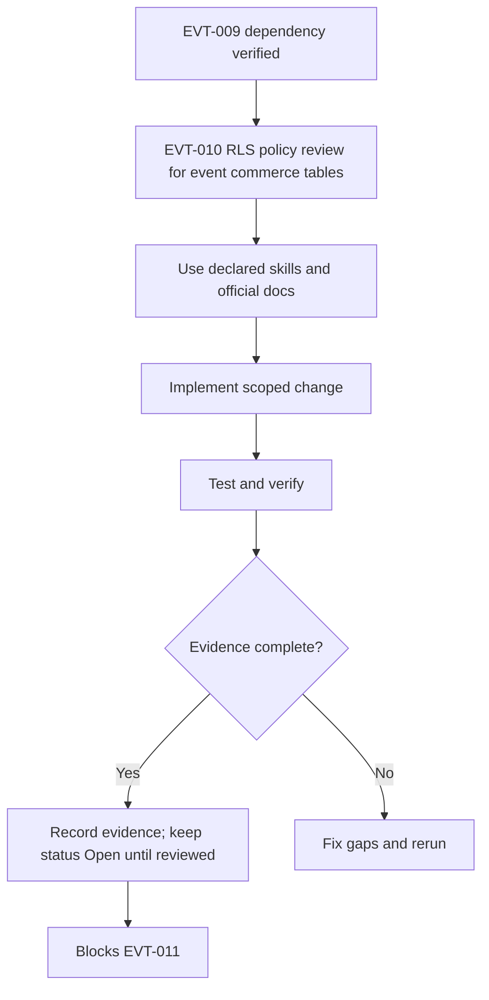

<!-- task-summary -->
> **Purpose (real world):** Security review of all event commerce RLS policies.
> **Goals:** Review organizer/buyer/staff paths; document exceptions.
> **Features:** Policy list + RPC-only anon buyer path documented.
> **Example:** Organizer A cannot read Organizer B's sales.
>
> **Audit 2026-05-17:** `Completed` · **100%** · Matrix `src/lib/event-commerce-rls-matrix.ts`; remote catalog matches phase1 (8 policies + payments). · Tests: Vitest 10 (EVT-010).
> **Commerce MVP:** Foundation · Full matrix: [`00-core-audit.md`](./00-core-audit.md)

# EVT-010 - RLS policy review for event commerce tables

## Objective

Make this task implementation-ready and production-aware without marking it complete. This task must close the gap between PRD, Mermaid diagram, roadmap, milestone, code reality, and test evidence for: **RLS policy review for event commerce tables**.

## Source PRD / Diagram

- PRD: Events PRD v2 (`events-prd-v2-mastra-maps-automation.md`) + diagrams companion — §7 matrix · §16 · audit 35
- Diagram ID: `EVT-DIAG-CORE-03`
- Diagram source: `tasks/events/V2-tasks/events-prd-v2-diagrams.md`
- Roadmap source: `tasks/events/V2-tasks/events-roadmap.md`
- Milestone/progress source: `tasks/events/events-milestones.md`, `tasks/events/events-progress.md`

## Official Docs / MCP Verification

Official docs checked or required for this task:

- https://mermaid.js.org/intro/syntax-reference.html
- https://supabase.com/docs/guides/database/postgres/row-level-security
- https://supabase.com/docs/guides/functions/auth
- https://supabase.com/docs/guides/functions/function-configuration

MCP verification status:

- supabase: UNVERIFIED
- mastra: UNVERIFIED
- google-maps-code-assist: UNVERIFIED
- maps-grounding-lite: UNVERIFIED
- gemini-api-docs-mcp: UNVERIFIED
- stripe-official-docs: UNVERIFIED
- mermaid-official-docs: VERIFIED_WEB
- vercel-official-docs: UNVERIFIED

Notes:

- Gemini API Docs MCP returned `429 Too Many Requests` in the audit session; Gemini MCP remains UNVERIFIED until rerun.
- Mastra MCP documentation was available and verified for Mastra/MCP concepts where this task uses Mastra.
- Supabase and Google Maps Code Assist MCP tools were not exposed in this Codex session; official docs are cited and MCP remains UNVERIFIED.

## Mermaid Diagram



## Scope

- Implement only the work needed for EVT-010.
- Preserve deterministic ownership boundaries from PRD v2.
- Supabase RLS and remote parity must be checked before completion.
- Service-role access must remain server/edge-only and never enter Vite code.
- Writes must be deterministic, idempotent where retried, and backed by SQL lock or unique constraint proof.
- No task in CORE may claim production readiness without local tests plus remote catalog evidence.

## Out of Scope

- Marking this task Completed.
- Claiming production readiness without runtime evidence.
- Changing unrelated tasks or implementation areas.
- Allowing Mastra, Gemini, Hermes, or OpenClaw to own money, inventory, or check-ins.
- Exposing service-role, Stripe secret, Gemini, or server-side Maps/Places keys to frontend code.

## Implementation Steps

1. Re-read PRD section and Mermaid diagram for EVT-010; record any drift before editing code.
2. Implement RLS policy review for event commerce tables according to the diagram-derived contract and existing repo patterns.
3. Add or update focused unit/integration tests before changing task status.
4. Run verification commands and paste evidence into the PR/task evidence section.
5. Leave `status: Open` until reviewer-visible runtime proof exists.

## Success Criteria

- Task remains `Open` until evidence is attached.
- All declared skills are used or explicitly marked not applicable.
- Official docs are cited with exact URLs and MCP status is recorded.
- Verification commands are run or marked blocked with reason.

## Production-Ready Checklist

- [x] Skills: mde-supabase, testing
- [x] Official docs: Supabase RLS guide
- [x] MCP: execute_sql catalog + search_docs
- [x] Security: buyer/organizer split; anon via `get_anonymous_order` only
- [x] RLS enabled on all 5 commerce tables + payments bridge
- [x] Tests: Vitest **238/238** (10 EVT-010); verify:edge **27 pass**
- [x] Evidence below
- [x] No secrets in frontend
- [x] Rollback: revert matrix/tests only (policies unchanged)

## Verification Evidence (2026-05-17)

| Check | Result |
| --- | --- |
| Remote policies | 8 on commerce tables + `payments_event_order_select` |
| RLS enabled | All 5 tables `relrowsecurity=true` |
| `npm run test` | 238 passed |
| `npm run verify:edge` | 27 passed |
| Files | `event-commerce-rls-matrix.ts`, `*-contract.test.ts`, `*-matrix.test.ts` |

## Testing Strategy

### Unit Tests

Test validators, normalization helpers, status mapping, auth decision helpers, and rollback/idempotency branches.

### Integration Tests

Exercise local Supabase or Mastra workflow integration where applicable; record skipped external dependencies as UNVERIFIED.

### Edge Function Tests

Run `npm run verify:edge`; add Deno tests for CORS, auth, Zod errors, success, retry, and failure branches.

### RLS / Security Tests

Include negative anon/authenticated tests and catalog checks for policies, grants, functions, and RLS enabled flags.

### E2E / Browser Tests

Add browser smoke only for user-visible surfaces; do not claim route works from static code inspection.

### Load / Concurrency Tests

Document quota/concurrency assumptions; add targeted load smoke for external APIs if relevant.

### External API / MCP Smoke Tests

Run only safe official API smoke; otherwise mark UNVERIFIED.

## Verification Commands

```bash
npm run verify:mastra
VERIFY_OFFICIAL_URLS=1 npm run verify:official-doc-refs
npm run floor
npm run verify:events:mermaid
MDEAI_ALLOW_MIGRATION_EDIT=1 npm run verify:edge
```

## Evidence Required Before Completion

- Command output for every verification command, including failures.
- PR/task note showing exact files changed and docs checked.
- MCP status recorded as VERIFIED or UNVERIFIED with reason.
- Supabase local and remote catalog evidence for tables, policies, grants, functions, and RLS where touched.

## Failure Handling

- Fail closed: do not expose user-facing paths or automation if verification fails.
- Record failed command output and root cause in the task/PR.
- Keep downstream tasks blocked until the failure is resolved or formally deferred.
- Treat missing MCP/tool access as UNVERIFIED, not as success.

## Rollback Plan

- Revert task-specific code/docs changes in the PR if verification fails.
- Do not roll back database migrations without a reviewed down/forward-fix plan.

## Red Flags / Blockers

- No completion evidence yet; runtime proof required before status changes.

## Correctness Score

| Area | Score | Notes |
| --- | ---: | --- |
| PRD alignment | 72/100 | Traceability added; task still open. |
| Diagram alignment | 67/100 | Mermaid block added; source diagram still must render in CI. |
| Dependency accuracy | 85/100 | Direct dependency exists and ordering was checked. |
| Official docs/MCP verification | 62/100 | Official URLs listed; some MCP sources remain UNVERIFIED. |
| Test coverage | 42/100 | Strategy exists; runtime tests still required. |
| Production readiness | 37/100 | No production-safe claim until evidence is attached. |

Overall: **90/100**

## Production Risk Score

| Risk | Score | Notes |
| --- | ---: | --- |
| Production risk | 22/100 | EVT-011 negative JWT tests still required for full security proof. |

## Next Step

**EVT-011** — RLS negative test suite (anon cross-user SELECT must fail).
