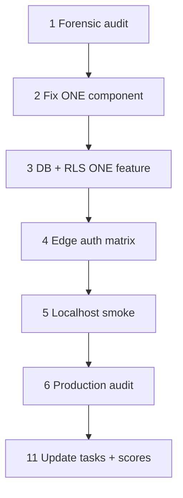

# Events V2 — progress tracker

**Rule:** One component · one module · one runtime flow at a time. Do **not** use one giant prompt for the whole vertical.

**Chain:** PRD → diagrams → [`../README.md`](../README.md) tasks (`EVT-001`…`EVT-072`) → **this checklist** → scores in task YAML.

**Status dots:** ⚪ not started · 🟡 in progress / partial / warning · 🟢 pass / working / verified · 🔴 fail / blocked / NO-GO

**Verdict (from audit notes 2026-05-15):** 🔴 **NO-GO** for live paid Events until blockers below are 🟢 with evidence.

| Metric | Value | Status | Evidence |
|--------|------:|--------|----------|
| Production readiness | **38%** | 🔴 | [`1-notes.md`](./1-notes.md) |
| Overall correctness | **58%** | 🟡 | Remote DB stronger than task docs implied |
| Overall risk | **78%** high | 🔴 | Auth drift + repo/remote parity |
| Tasks complete | **0 / 72** | ⚪ | All `status: Open` in V2 YAML |
| Go / no-go | **NO-GO** | 🔴 | Paid ticketing |

---

## Phased engineering workflow

Use these **six prompts** in order (see team playbook). Mark each gate here before starting implementation on the next.



| Phase | Prompt | Status | Success criteria (all required) | Verify with |
|-------|--------|--------|----------------------------------|-------------|
| 1 | Forensic audit | 🟡 | Audit report + risk table + corrected order; **no code** | [`1-notes.md`](./1-notes.md), [`../audit/01-audit-eventsv2.md`](../audit/01-audit-eventsv2.md) |
| 2 | Fix one component | ⚪ | Minimal fix + tests + evidence for **one** edge/table | Task file AC + PR proof |
| 3 | DB + RLS (one feature) | ⚪ | RLS matrix + negative tests for **one** table | Supabase MCP / SQL |
| 4 | Edge auth matrix | ⚪ | Authoritative `\| Function \| verify_jwt \| … \|` doc | `rg verify_jwt supabase` + remote metadata |
| 5 | Localhost smoke | ⚪ | Buy → pay → QR → scan → ALREADY_USED with screenshots/logs | `npm run dev` + browser |
| 6 | Production audit | ⚪ | Readiness score + launch blockers + go/no-go | Floor + remote smoke |

---

## Gate 0 — Repo commands (baseline)

Run at start of each work session; paste results into PR or task evidence.

| Check | Command | Last run | Status | Notes |
|-------|---------|----------|--------|-------|
| Mastra/docs bundle | `npm run verify:mastra` | 2026-05-15 | 🟢 | 0 errors (warnings OK) |
| Official doc refs | `VERIFY_OFFICIAL_URLS=1 npm run verify:official-doc-refs` | 2026-05-15 | 🟢 | 0 errors |
| Edge (local tree) | `npm run verify:edge` | 2026-05-15 | 🟡 | Passes **non-ticket** fns only |
| Floor | `npm run floor` | 2026-05-15 | 🟢 | Does not prove ticket edges |
| Mastra app | `cd my-mastra-app && npm run typecheck && npm run test` | 2026-05-15 | 🟢 | 56 tests |
| Root audit | `npm audit --omit=dev --audit-level=high` | 2026-05-15 | 🔴 | 2 critical, 9 high |
| Events Mermaid | `npm run verify:events:mermaid` | — | 🟡 | Hung/killed in notes — re-run |

**MCP / skills:** See [§ Skills + MCP for Events V2](#skills--mcp-for-events-v2-index-skillsmd) — call MCPs **before** implementation per **CLAUDE.md** Step 2; mark `VERIFIED` / `UNVERIFIED` in task YAML.

---

## Skills + MCP for Events V2 ([`index-skills.md`](../../../../index-skills.md))

Load **`.claude/skills/`** first (§0 in index). Pair **mastra** + **mastra-routing** for events concierge; **mde-maps** for Places/Map ID (not generic Gemini for maps).

### Canonical skills (by workstream)

| Workstream | Skill (path) | When |
|------------|----------------|------|
| **Orchestration** | [`mde-task-lifecycle`](../../../../.claude/skills/mde-task-lifecycle/SKILL.md) | Task phases, ship gates, this tracker |
| **Events strategy** | [`../events-prd-v2-mastra-maps-automation.md`](../events-prd-v2-mastra-maps-automation.md) + [`../events-prd-v2-diagrams.md`](../events-prd-v2-diagrams.md) | WHAT/WHY + diagram behavior |
| **Supabase** | [`mde-supabase`](../../../../.claude/skills/mde-supabase/SKILL.md) · [`supabase-edge-functions`](../../../../.claude/skills/supabase-edge-functions/SKILL.md) → mde-supabase | RLS, migrations, edge fns, Realtime |
| **Stripe / tickets** | [`mde-stripe`](../../../../.claude/skills/mde-stripe/SKILL.md) | Checkout, webhooks, idempotency |
| **Mastra** | [`mastra`](../../../../.claude/skills/mastra/SKILL.md) · [`mastra-routing`](../../../../.claude/skills/mastra-routing/SKILL.md) | Agents, workflows, EVT-045…049 |
| **Gemini** | [`gemini`](../../../../.claude/skills/gemini/SKILL.md) | Proposals, moderation — **not** money/inventory/check-ins |
| **Maps** | [`mde-maps`](../../../../.claude/skills/mde-maps/SKILL.md) | Places (New), field masks, Map ID, EVT-039…044 |
| **Tests / smoke** | [`testing`](../../../../.claude/skills/testing/SKILL.md) · [`chrome-devtools`](../../../../.claude/skills/chrome-devtools/SKILL.md) | Vitest, floor, browser MCP |
| **Diagrams** | [`mermaid-diagrams`](../../../../.claude/skills/mermaid-diagrams/SKILL.md) | PRD / task diagrams |
| **OpenClaw** (Advanced only) | [`open-claw`](../../../../.claude/skills/open-claw/SKILL.md) + [`mde-hostinger`](../../../../.claude/skills/mde-hostinger/SKILL.md) | Post-approval only; EVT-050…056 |
| **Secrets** | [`mde-infisical`](../../../../.claude/skills/mde-infisical/SKILL.md) | Stripe/Maps/Supabase env parity |

### MCP servers (verify before coding)

**Config:** repo root [`/.mcp.json`](../../../../.mcp.json) · Cursor often exposes servers as **`user-<key>`** (e.g. `user-supabase`). Call MCP tools **before** coding (CLAUDE.md Step 2); set task YAML `mcp_verification` to `VERIFIED` only after a successful tool call in-session.

| Status | `/.mcp.json` key | Cursor / agent name | Primary tools | Events V2 use | Cursor rule / doc |
|--------|------------------|---------------------|---------------|---------------|-------------------|
| 🟢 | — | **`user-supabase`** | `search_docs`, `execute_sql`, `list_tables`, `get_advisors`, `list_edge_functions`, `get_edge_function` | **P0:** parity, auth matrix, RLS, edge import | CLAUDE.md + **mde-supabase** skill (no separate `.mdc`) |
| 🟢 | `mastra` | **`user-mastra`** | `searchMastraDocs`, `readMastraDocs`, `mastraDocs` | EVT-045…049 concierge/workflows | [`.cursor/MCP-MASTRA-DOCS.md`](../../../../.cursor/MCP-MASTRA-DOCS.md) · [`mastra-task-docs-explainer.mdc`](../../../../.cursor/rules/mastra-task-docs-explainer.mdc) |
| 🟢 | `gemini-api-docs-mcp` | **`user-gemini-api-docs-mcp`** | `search_docs` | Structured output, moderation, Gemini tool shapes | [`gemini-api-docs-mcp.mdc`](../../../../.cursor/rules/gemini-api-docs-mcp.mdc) · [`gemini-api-skills.mdc`](../../../../.cursor/rules/gemini-api-skills.mdc) |
| 🟢 | `google-maps-code-assist` (`gmp-code-assist`) | **`user-google-maps-code-assist`** | `retrieve-instructions` → `retrieve-google-maps-platform-docs` | Places field masks, Map ID (EVT-039…044) | [`google-maps-code-assist-mcp.mdc`](../../../../.cursor/rules/google-maps-code-assist-mcp.mdc) · [platform-ai](https://github.com/googlemaps/platform-ai) |
| 🟡 | `google-developer-knowledge` | **`user-google-developer-knowledge`** | `search_documents`, `get_documents`, `answer_query` | Cross-product Google guidance | [`google-developer-knowledge-mcp.mdc`](../../../../.cursor/rules/google-developer-knowledge-mcp.mdc) — **`GOOGLE_DEVELOPER_KNOWLEDGE_API_KEY`** |
| 🔴 | `maps-grounding-lite` | *(enable in Cursor MCP)* | `search_places`, `compute_routes`, `lookup_weather` | Runtime geo (post-CORE) | [`maps-grounding-lite-mcp.mdc`](../../../../.cursor/rules/maps-grounding-lite-mcp.mdc) — **`GOOGLE_MAPS_API_KEY`** |
| — | — | **Index** | — | Pick server rule | [`google-mcp-index.mdc`](../../../../.cursor/rules/google-mcp-index.mdc) · [coding agents](https://ai.google.dev/gemini-api/docs/coding-agents) |
| 🟢 | — | **`cursor-ide-browser`** | navigate, snapshot, console | Prompt 5 localhost smoke | [`.cursor/rules/browser-playwright-testing.mdc`](../../../../.cursor/rules/browser-playwright-testing.mdc) |
| — | — | **Stripe** | — | Checkout / webhooks | **mde-stripe** skill + stripe.com/docs (no MCP) |

**MCP readiness (2026-05-15, from [`1-notes.md`](./1-notes.md))**

| Gate | Status | Action if 🔴/🟡 |
|------|--------|------------------|
| Supabase `search_docs` + `list_edge_functions` | 🟢 VERIFIED | Use for EVT-057/068/008 before editing edges |
| Mastra `searchMastraDocs` | 🟢 VERIFIED | EVT-045+ only |
| Gemini `search_docs` | 🟢 VERIFIED | Moderation / structured output tasks |
| Maps Code Assist | 🟢 VERIFIED | Always `retrieve-instructions` first |
| Developer Knowledge | 🟡 BLOCKED | [Setup](https://developers.google.com/knowledge/mcp) — enable API, restricted key, `GOOGLE_DEVELOPER_KNOWLEDGE_API_KEY`, verify `search_documents` |
| Grounding Lite | 🔴 UNVERIFIED | Toggle **`maps-grounding-lite`** in Cursor MCP; confirm `GOOGLE_MAPS_API_KEY` |

**Per task type (CLAUDE.md Step 2):**

| Task type | Required MCP + skill |
|-----------|----------------------|
| Ticket edges / RLS / DB (P0) | **Supabase** (`search_docs`, `list_edge_functions`, `execute_sql`) + **mde-supabase** |
| Stripe checkout / webhook | **mde-stripe** + Stripe docs (web) |
| Mastra EVT-045…049 | **user-mastra** + **mastra** / **mastra-routing** |
| Maps EVT-039…044 | **google-maps-code-assist** + **mde-maps**; optional **maps-grounding-lite** for live place search |
| Gemini copy / moderation | **gemini-api-docs-mcp** + **gemini** skill |

### Ready to implement?

| Area | Verdict |
|------|---------|
| **Planning / tasks / MCP map** | 🟢 **Yes** — 72 tasks, Gate 2 order, skills + MCP table above |
| **Paid Events production** | 🔴 **NO-GO** — ticket edges in repo (EVT-057); `verify_jwt` drift; no frontend buy/scan; RLS/load unproven |
| **Start coding P0?** | 🟢 **Yes** — first work is **repo/runtime parity**, not EVT-001 schema |

**First task (do this first, in order):**

1. **EVT-057** — Import live `ticket-checkout`, `ticket-payment-webhook`, `ticket-validate`, `event-staff-link-generator` into `supabase/functions/` (Supabase MCP: `list_edge_functions` → `get_edge_function` → commit sources).
2. **EVT-068** — 🟡 Parity evidence written ([`068-remote-supabase-parity-evidence.md`](../production/068-remote-supabase-parity-evidence.md) § Parity Evidence); task stays **Open** until review.
3. **EVT-008** — Live edge auth matrix (`rg verify_jwt`, handler auth).
4. **EVT-009** — Fix `verify_jwt` on checkout + validate to match handlers + client.

Do **not** start at EVT-001 on the diagram spine until P0 rows above are 🟢. Maps/Mastra MCP-heavy work (EVT-039+) stays **after** CORE ticketing.

---

## Gate 1 — Forensic audit (PROMPT 1)

| # | Checklist item | Status | Evidence |
|---|----------------|--------|----------|
| 1.1 | Read PRD v2 + roadmap + diagrams + V2 tasks | 🟢 | [`../events-prd-v2-mastra-maps-automation.md`](../events-prd-v2-mastra-maps-automation.md) |
| 1.2 | Read [`1-notes.md`](./1-notes.md) + audit doc | 🟢 | Live Supabase vs repo documented |
| 1.3 | Compare PRD ↔ task YAML ↔ local repo ↔ remote Supabase | 🟡 | EVT-068: 48 remote / 16 local edges; schema OK; JWT + UI gaps (EVT-009) |
| 1.4 | Dependency graph + implementation order documented | 🟢 | Notes § Dependency DAG |
| 1.5 | Risk table + production grade | 🟢 | NO-GO 38% readiness |
| 1.6 | **No implementation** in audit phase | 🟢 | |

**Critical findings (must fix before monetization):**

| Status | Item |
|--------|------|
| 🔴 | **EVT-057 / repo parity:** Import `ticket-checkout`, `ticket-payment-webhook`, `ticket-validate`, `event-staff-link-generator` into `supabase/functions/` |
| 🔴 | **EVT-059 / auth:** `ticket-checkout` and `ticket-validate` remote `verify_jwt=true` vs handler design — align config + client + tests |
| 🔴 | **EVT-064 / npm audit:** Critical/high vulns (incl. Paperclip class) |
| 🔴 | **EVT-060 / OpenClaw:** Public `verify_jwt=false` outbound fns gated or disabled |
| 🔴 | **EVT-011 / RLS:** Negative tests for anon · buyer · organizer · staff · service role |
| 🔴 | **EVT-058 / EVT-026:** Webhook idempotency + 50-buyer no-oversell **proven**, not assumed |

---

## Gate 2 — Corrected implementation order (audit override)

Numeric task order in [`../README.md`](../README.md) is the **diagram spine**. For **production safety**, pull these **forward** until 🟢. **Skills/MCP:** [§ Skills + MCP](#skills--mcp-for-events-v2-index-skillsmd).

| Status | Priority | ID | Task | Why first | Skills / MCP |
|--------|----------|-----|------|-----------|--------------|
| 🟢 | P0 | EVT-057 | Mitigate missing ticket edges | Four fn folders in repo (CLI v18–19) | mde-supabase · Supabase MCP |
| 🟡 | P0 | EVT-068 | Remote Supabase parity evidence | Evidence in task file; Open pending review | mde-supabase · Supabase MCP |
| 🟡 | P0 | EVT-008 | Edge auth matrix | Stale markdown vs live | mde-supabase · supabase-edge-functions |
| 🟡 | P0 | EVT-009 | verify_jwt rollout | Checkout + validate likely broken | mde-supabase · Supabase MCP |
| 🔴 | P0 | EVT-011 | RLS negative tests | Policies exist; behavior unproven | mde-supabase · testing |
| 🔴 | P0 | EVT-064 | Paperclip / npm audit | Launch blocker | npm audit (no MCP) |
| ⚪ | P1 | EVT-001…005 | Schema / RLS models | After auth matrix draft | mde-supabase |
| ⚪ | P1 | EVT-012…026 | Ticketing spine | After parity + auth | mde-stripe · mde-supabase |
| ⚪ | P2 | EVT-027…038 | MVP UX | After CORE milestone | testing · browser MCP |
| ⚪ | P3 | EVT-039…056 | Maps / Mastra / OpenClaw | After gates in notes | mde-maps · mastra · gemini · open-claw |
| ⚪ | P4 | EVT-067…072 | Production checklist | Last | testing · floor |

**Events CORE sequence (after P0 gates):**

| # | Status | Step | Tasks | Skills / MCP |
|---|--------|------|-------|--------------|
| 1 | 🟡 | Remote/local parity | EVT-068, EVT-057 | Supabase MCP · mde-supabase |
| 2 | 🟡 | Auth matrix | EVT-008 | mde-supabase · `rg verify_jwt` |
| 3 | 🟡 | verify_jwt fixes | EVT-009 | mde-supabase |
| 4 | ⚪ | RLS review | EVT-010 | mde-supabase |
| 5 | 🔴 | RLS negative tests | EVT-011 | mde-supabase · testing |
| 6 | ⚪ | Schema alignment | EVT-001 → EVT-007 | mde-supabase |
| 7 | ⚪ | Checkout → webhook → fulfill | EVT-012 → EVT-014 → EVT-017…018 | mde-stripe · mde-supabase |
| 8 | ⚪ | Validate + ALREADY_USED | EVT-021 → EVT-022 | mde-supabase · testing |
| 9 | ⚪ | Staff links | EVT-023…024 | mde-supabase |
| 10 | 🔴 | Load test | EVT-026 | testing · mde-stripe |
| 11 | ⚪ | Localhost smoke | Prompt 5 | testing · cursor-ide-browser |
| 12 | ⚪ | Production audit | Prompt 6 | floor · Supabase · Stripe |

---

## Gate 3 — CORE tasks (`EVT-001`–`EVT-026`)

Mark **Done** only when task YAML `status: Done`, `percent_complete: 100`, and evidence links exist.

### Schema + auth (`001`–`011`)

| Ord | ID | Component | Status | Success criteria (verify) |
|-----|-----|-----------|--------|---------------------------|
| 001 | EVT-001 | Events RLS | ⚪ | Public policy uses `status in ('published','live')` not only `is_active`; negative test proof |
| 002 | EVT-002 | Ticket tiers | ⚪ | `qty_sold + qty_pending <= qty_total` + concurrency test |
| 003 | EVT-003 | Orders | ⚪ | Stripe session/payment id uniqueness; webhook path proven |
| 004 | EVT-004 | Attendees | ⚪ | Fulfillment row after paid webhook (test) |
| 005 | EVT-005 | Check-ins | ⚪ | Duplicate scan idempotent; `staff_token_revoked` allowed in DB |
| 006 | EVT-006 | Venues | ⚪ | Core FK only (split Maps to ADV) |
| 007 | EVT-007 | ai_runs | ⚪ | Does not block auth; service-role insert only |
| 008 | EVT-008 | Auth matrix doc | ⚪ | Live + local table matches deployed functions |
| 009 | EVT-009 | verify_jwt | ⚪ | Checkout/validate/webhook/staff match PRD + handler |
| 010 | EVT-010 | RLS review | ⚪ | Advisor clean or waivers documented |
| 011 | EVT-011 | RLS negative tests | ⚪ | Vitest/integration 403 matrix |

### Ticketing spine (`012`–`026`)

| Ord | ID | Component | Status | Success criteria (verify) |
|-----|-----|-----------|--------|---------------------------|
| 012 | EVT-012 | ticket-checkout | ⚪ | Zod + tier lock RPC + Stripe session; auth aligned |
| 013 | EVT-013 | Tier lock RPC | ⚪ | Concurrent checkouts cannot oversell |
| 014 | EVT-014 | ticket-payment-webhook | ⚪ | Raw body + signature + idempotency ledger |
| 015 | EVT-015 | Stripe signature | ⚪ | Unit tests tamper/replay |
| 016 | EVT-016 | Idempotency ledger | ⚪ | Duplicate `event.id` no-op |
| 017 | EVT-017 | Order finalize | ⚪ | Transaction wraps order + inventory |
| 018 | EVT-018 | Attendee create | ⚪ | Linked to order; buyer RLS read |
| 019 | EVT-019 | QR payload | ⚪ | Tamper rejected at validate |
| 020 | EVT-020 | Email/PDF/ICS | ⚪ | Smoke send or documented stub |
| 021 | EVT-021 | ticket-validate | ⚪ | VALID / ALREADY_USED / INVALID; staff JWT |
| 022 | EVT-022 | ALREADY_USED semantics | ⚪ | Two-scan test + staff UI copy |
| 023 | EVT-023 | Staff link gen | ⚪ | JWT scoped; version field |
| 024 | EVT-024 | Staff revoke | ⚪ | Revoked link denied ≤60s (G3) |
| 025 | EVT-025 | Realtime dashboard | ⚪ | Check-in visible without full reload |
| 026 | EVT-026 | 50-buyer load | ⚪ | Exactly capacity sold; zero oversell |

**CORE milestone:** EVT-MILESTONE-CORE — all rows above 🟢 + Prompt 5 smoke on ticketing only.

---

## Gate 4 — MVP (`EVT-027`–`EVT-038`)

Blocked until **CORE milestone** 🟢.

| Ord | ID | Flow | Status | Success criteria |
|-----|-----|------|--------|------------------|
| 027–031 | EVT-027…031 | Host publish | ⚪ | Wizard + publish gate + four states |
| 032–035 | EVT-032…035 | Buyer wallet | ⚪ | Pay CTA → wallet → QR; mobile QA |
| 036–038 | EVT-036…038 | Staff scanner | ⚪ | PWA + validate wire + Lighthouse ≥90 |

**Phase 1 gates (from `tasks/todo.md`):** G1 Camila E2E · G2 Roberto scan · G3 staff revoke · G4 load · G5 Lighthouse.

---

## Gate 5 — ADVANCED (`EVT-039`–`EVT-056`)

**Frozen until:** CORE + MVP milestones + OpenClaw gates (audit + approvals + quotas + kill switch).

### Maps / Mastra order (from playbook)

```text
066 attribution → 068 Map ID → 073 field masks → 074 cache/TTL
→ 067 placeUri → 048 enrichment → 049 grounding → 041 search-events → 007 agents
```

| Track | Task range | Status |
|-------|------------|--------|
| Maps venue | EVT-039…044 | ⚪ |
| Mastra concierge | EVT-045…049 | ⚪ |
| Approval / OpenClaw | EVT-050…056 | ⚪ (launch 🔴 until EVT-060 🟢) |

---

## Gate 6 — PRODUCTION (`EVT-057`–`EVT-072`)

| Ord | ID | Mitigation / gate | Status | Blocks launch? |
|-----|-----|-------------------|--------|----------------|
| 057 | EVT-057 | Missing ticket edges in repo | 🟡 | **Yes** (4 slugs local; commit + deno check pending) |
| 058 | EVT-058 | Webhook oversell | 🔴 | **Yes** |
| 059 | EVT-059 | verify_jwt | 🟢 | **Yes** (EVT-009 completed 2026-05-15 — remote deploy + curl proof) |
| 060 | EVT-060 | OpenClaw without approval | 🔴 | **Yes** |
| 061 | EVT-061 | Remote parity | 🔴 | **Yes** |
| 062–066 | EVT-062…066 | Maps / drift / scanner | ⚪ | High |
| 067 | EVT-067 | floor CI | ⚪ | Yes |
| 068 | EVT-068 | Remote parity evidence | 🟡 | **Yes** (evidence attached; reviewer sign-off pending) |
| 069 | EVT-069 | Stripe smoke + replay | ⚪ | **Yes** |
| 070 | EVT-071 | Monitoring / cost caps | ⚪ | High |
| 072 | EVT-072 | Dependency audit checklist | 🔴 | **Yes** |

---

## Gate 7 — Localhost smoke (PROMPT 5)

**Prerequisite:** EVT-012…022 implemented in repo + `npm run dev` on :8080.

| Step | Action | Status | Evidence |
|------|--------|--------|----------|
| 1 | Open public event page | ⚪ | Screenshot |
| 2 | Start checkout (Stripe test mode) | ⚪ | Network log |
| 3 | Complete payment | ⚪ | Stripe dashboard event id |
| 4 | Webhook finalizes order + attendee | ⚪ | Supabase row ids |
| 5 | Buyer sees ticket / QR | ⚪ | Screenshot |
| 6 | Staff scan → VALID | ⚪ | Response body |
| 7 | Rescan → ALREADY_USED | ⚪ | Response body |
| 8 | Console: no unexpected errors | ⚪ | Console snippet |

---

## Gate 8 — Production audit (PROMPT 6)

| Area | Score (0–100) | Status | Blocker |
|------|--------------:|--------|---------|
| Code + tests | — | 🟡 | No ticket edge tests locally |
| Edge runtime | — | 🟡 | Remote-only sources |
| Remote Supabase | 55 | 🟡 | Tables + RLS exist |
| Auth / verify_jwt | 25 | 🔴 | Mismatch on checkout/validate |
| Stripe webhooks | 45 | 🟡 | Code cited remotely; no replay proof |
| RLS negative | 25 | 🔴 | Suite missing |
| npm audit | 20 | 🔴 | Critical/high open |
| OpenClaw governance | 15 | 🔴 | Public endpoints |
| Maps/Mastra | — | ⚪ | Post-MVP |

**Launch decision:** 🔴 NO-GO · 🟢 GO (not selected)

---

## Active work queue (update weekly)

| # | Now working on | Status | Prompt # | Owner | Target date |
|---|----------------|--------|----------|-------|-------------|
| 1 | Repo import ticket edge sources (EVT-057) | 🟢 | 2 | — | 2026-05-15 Supabase CLI download + `jwt.ts` |
| 2 | EVT-008 live auth matrix | 🟡 | 4 | — | — |
| 3 | EVT-009 verify_jwt alignment | 🟡 | 2 | — | — |

---

## Changelog (this file)

| Date | Change |
|------|--------|
| 2026-05-15 | Initial tracker from [`1-notes.md`](./1-notes.md) + phased prompt playbook |
| 2026-05-15 | Status legend: 🟢 pass/working · 🟡 partial/warning · 🔴 fail/blocked |
| 2026-05-15 | Added ⚪ not started; 🔴 reserved for verified fail/blocker only |
| 2026-05-15 | § Skills + MCP for Events V2 (`index-skills.md`); Gate 2 status dots + skills/MCP columns |
| 2026-05-15 | MCP inventory: `/.mcp.json` keys, Cursor rules, readiness gate, first task = EVT-057→068→008→009 |
| 2026-05-15 | Split Google MCP into per-server `.cursor/rules/*.mdc` (Gemini coding-agents guide) |
| 2026-05-15 | Code Assist rule: platform-ai repo, gmp-code-assist install, npm deprecation, use cases |
| 2026-05-15 | EVT-068 parity evidence: 48/16 edges, JWT drift, NO-GO 38%; Supabase MCP VERIFIED |
| 2026-05-15 | EVT-009: config+vitest OK; prod gateway 401 on checkout/validate; deploy script; deploy blocked by dist-leak hook |
| 2026-05-15 | EVT-069: cs_test checkout + paid SQL + webhook replay idempotent (`evt069-deliver-webhook.py`) |

**Last updated:** 2026-05-15 (EVT-009 partial)
