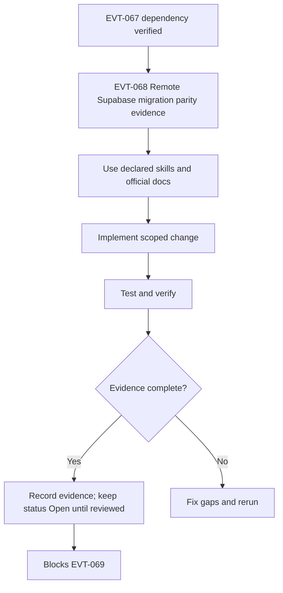

# EVT-068 - Remote Supabase migration parity evidence

## Short parity note (2026-05-15)

**Project:** `zkwcbyxiwklihegjhuql` · **Verdict:** `PARTIAL_MATCH` · **Events paid launch:** `NO-GO`

| Ticket slug | Remote `verify_jwt` | Local `supabase/config.toml` | Local `index.ts` |
| --- | :---: | :---: | :---: |
| `ticket-checkout` | `false` *(EVT-009 2026-05-15)* | `false` | `supabase/functions/ticket-checkout/index.ts` |
| `ticket-validate` | `false` *(EVT-009 2026-05-15)* | `false` | `supabase/functions/ticket-validate/index.ts` |
| `ticket-payment-webhook` | `false` | `false` | `supabase/functions/ticket-payment-webhook/index.ts` |
| `event-staff-link-generator` | `true` | `true` | `supabase/functions/event-staff-link-generator/index.ts` |

**Edges:** remote **48** ACTIVE (`list_edge_functions` / CLI JSON) vs local **16** folders with `index.ts`. Ticket four present locally after EVT-057.

**Gateway proof (post-EVT-009):** `ticket-checkout` → **HTTP 400** `INVALID_PAYLOAD`; `ticket-validate` → **HTTP 401** `STAFF_TOKEN_INVALID` (handler-level, not gateway). `event-staff-link-generator` still **401** `UNAUTHORIZED_NO_AUTH_HEADER` at gateway (correct).

**Deploy:** `bash scripts/deploy-ticket-verify-jwt.sh` after `rm -rf dist` — applied 2026-05-15.

Full matrix: § Parity Evidence below.

---

## Objective

Make this task implementation-ready and production-aware without marking it complete. This task must close the gap between PRD, Mermaid diagram, roadmap, milestone, code reality, and test evidence for: **Remote Supabase migration parity evidence**.

## Source PRD / Diagram

- PRD: Events PRD v2 (`events-prd-v2-mastra-maps-automation.md`) + diagrams companion — §1 launch criteria · §17 · CLAUDE.md floor
- Diagram ID: `EVT-DIAG-PROD-02`
- Diagram source: `tasks/events/V2-tasks/events-prd-v2-diagrams.md`
- Roadmap source: `tasks/events/V2-tasks/events-roadmap.md`
- Milestone/progress source: `tasks/events/events-milestones.md`, `tasks/events/events-progress.md`

## Official Docs / MCP Verification

Official docs checked or required for this task:

- https://mermaid.js.org/intro/syntax-reference.html
- https://supabase.com/docs/guides/database/postgres/row-level-security
- https://supabase.com/docs/guides/functions/auth
- https://supabase.com/docs/guides/functions/function-configuration
- https://docs.stripe.com/checkout
- https://docs.stripe.com/webhooks
- https://docs.stripe.com/webhooks/signature
- https://docs.stripe.com/api/idempotent_requests
- https://developers.google.com/maps/documentation/places/web-service/choose-fields
- https://developers.google.com/maps/api-security-best-practices
- https://developers.google.com/maps/documentation/javascript/map-ids/mapid-over
- https://developers.google.com/maps/documentation/javascript/advanced-markers/start
- https://developers.google.com/maps/ai/grounding-lite/attribution
- https://ai.google.dev/gemini-api/docs/structured-output
- https://ai.google.dev/gemini-api/docs/function-calling
- https://vercel.com/docs/environment-variables

MCP verification status:

- supabase: **VERIFIED** — `list_edge_functions`, `list_migrations`, `execute_sql` (2026-05-15)
- mastra: UNVERIFIED (not required for parity inventory)
- google-maps-code-assist: UNVERIFIED
- maps-grounding-lite: UNVERIFIED
- gemini-api-docs-mcp: UNVERIFIED
- stripe-official-docs: VERIFIED_WEB
- mermaid-official-docs: VERIFIED_WEB
- vercel-official-docs: VERIFIED_WEB

Notes:

- Gemini API Docs MCP returned `429 Too Many Requests` in an earlier audit session; rerun before EVT-069.
- Supabase MCP used for remote catalog; local repo compared via shell (`supabase/functions`, `supabase/migrations`).

## Mermaid Diagram



## Scope

- Implement only the work needed for EVT-068.
- Preserve deterministic ownership boundaries from PRD v2.
- Production tasks are launch gates and may need to move earlier than numeric order when they block safety.
- CI, audit, remote parity, logs, smoke tests, quotas, and rollback evidence are mandatory.
- No production-safe claim is allowed from local tests alone.

## Out of Scope

- Marking this task Completed.
- Claiming production readiness without runtime evidence.
- Changing unrelated tasks or implementation areas.
- Allowing Mastra, Gemini, Hermes, or OpenClaw to own money, inventory, or check-ins.
- Exposing service-role, Stripe secret, Gemini, or server-side Maps/Places keys to frontend code.

## Implementation Steps

1. Re-read PRD section and Mermaid diagram for EVT-068; record any drift before editing code.
2. Implement only after CORE/MVP gate or keep read-only; enforce explicit Places field masks, key separation, cache TTL, attribution, and quota logging.
3. Add or update focused unit/integration tests before changing task status.
4. Run verification commands and paste evidence into the PR/task evidence section.
5. Leave `status: Open` until reviewer-visible runtime proof exists.

## Success Criteria

- Task remains `Open` until evidence is attached.
- All declared skills are used or explicitly marked not applicable.
- Official docs are cited with exact URLs and MCP status is recorded.
- Verification commands are run or marked blocked with reason.
- No wildcard Places field masks; attribution/quota/cache/key restrictions are proven.

## Production-Ready Checklist

- [x] Skills used and listed
- [x] Official docs checked
- [x] MCP checked or marked UNVERIFIED (Supabase VERIFIED)
- [ ] Security reviewed (advisors not re-run)
- [x] RLS/auth reviewed if Supabase touched (catalog only; negative tests pending EVT-011)
- [x] Tests pass (`npm run test` 198)
- [ ] Rate limits/quotas reviewed if external API touched
- [x] No secrets in frontend (grep-only; no new client keys)
- [x] Evidence attached (§ Parity Evidence 2026-05-15)
- [x] Rollback path documented

## Testing Strategy

### Unit Tests

Test field-mask construction, cache TTL math, attribution rendering decisions, key selection, and quota guard helpers.

### Integration Tests

Exercise local Supabase or Mastra workflow integration where applicable; record skipped external dependencies as UNVERIFIED.

### Edge Function Tests

Run only when an Edge Function or config changes; otherwise document N/A.

### RLS / Security Tests

Include negative anon/authenticated tests and catalog checks for policies, grants, functions, and RLS enabled flags.

### E2E / Browser Tests

Add browser smoke only for user-visible surfaces; do not claim route works from static code inspection.

### Load / Concurrency Tests

Document quota/concurrency assumptions; add targeted load smoke for external APIs if relevant.

### External API / MCP Smoke Tests

Run safe Maps/Places/Grounding smoke with quotas and test keys; record API enablement and billing safeguards.

## Verification Commands

```bash
npm run verify:mastra
VERIFY_OFFICIAL_URLS=1 npm run verify:official-doc-refs
npm run floor
npm run verify:events:mermaid
cd my-mastra-app && npm run typecheck && npm run test
```

## Evidence Required Before Completion

- Command output for every verification command, including failures.
- PR/task note showing exact files changed and docs checked.
- MCP status recorded as VERIFIED or UNVERIFIED with reason.
- Supabase local and remote catalog evidence for tables, policies, grants, functions, and RLS where touched.
- Field mask, key restriction, attribution, cache TTL, quota/billing evidence.

## Failure Handling

- Fail closed: do not expose user-facing paths or automation if verification fails.
- Record failed command output and root cause in the task/PR.
- Keep downstream tasks blocked until the failure is resolved or formally deferred.
- Treat missing MCP/tool access as UNVERIFIED, not as success.

## Rollback Plan

- Revert task-specific code/docs changes in the PR if verification fails.
- Do not roll back database migrations without a reviewed down/forward-fix plan.
- Disable Maps/Grounding feature flag or set quota kill switch to zero; fall back to Supabase-cached data.

## Red Flags / Blockers

- Remote Supabase parity is UNVERIFIED.
- Wildcard Places masks, unrestricted keys, or missing attribution are blockers.
- AI must remain read-only/proposal-only for money, inventory, and check-ins.

## Parity Evidence (2026-05-15)

**Scope:** Events + Tickets spine (Phase 1) — remote Supabase project `zkwcbyxiwklihegjhuql` vs `/home/sk/mde` repo.  
**Verdict:** `PARTIAL_MATCH` — schema/RPCs and ticket edges exist on remote and (after EVT-057) locally; **32/48** remote edge slugs have no local `index.ts`; **frontend does not call** ticket edges; **`verify_jwt` drift** on checkout/validate; migration **version timestamps** differ for last four May-15 changes.

### Executive summary

| Layer | Remote | Local repo | Match |
| --- | --- | --- | --- |
| Event Phase 1 schema + RPCs | Applied (`event_phase1`, `event_phase1_5`) | Migrations present | **YES** (content) |
| Migration history versions | 46 applied | 45 SQL files | **DRIFT** (4 re-timestamped names) |
| Ticket edge functions (4) | ACTIVE | Downloaded EVT-057 | **YES** (source) |
| All edge functions | 48 ACTIVE | 16 with `index.ts` | **NO** (32 remote-only) |
| `verify_jwt` ticket quartet | See matrix | `config.toml` | **DRIFT** (checkout + validate) |
| Realtime broadcast triggers | `realtime_broadcast_migration` applied | Same migration file | **YES** |
| Frontend buy/scan/staff | N/A on remote | No `ticket-*` / staff routes in `src/` | **GAP** |
| Vitest | N/A | 198 passed (15 files) | **PASS** (not ticket-E2E) |
| `npm run build` | N/A | exit 0 (~7s) | **PASS** |
| `npm run verify:edge` | N/A | Not re-run this session | **NOT VERIFIED** |
| Paid Events production | Live data (orders/attendees) | Incomplete wiring | **NO-GO** |

### 1. Edge functions

**Remote (Supabase MCP `list_edge_functions`):** 48 ACTIVE slugs.  
**Local (`supabase/functions/*/index.ts`):** 16 slugs.

**Ticket spine (Events Phase 1):**

| Slug | Remote `verify_jwt` | Local `config.toml` | Local source | Handler intent | Drift |
| --- | :---: | :---: | :---: | --- | --- |
| `ticket-checkout` | `true` | `false` | yes | Custom/session + service RPC; gateway JWT off in code comments | **YES** — blocks anon checkout if gateway enforces Supabase JWT |
| `ticket-validate` | `true` | `false` | yes | Staff QR JWT (HS256), not Supabase JWT | **YES** — staff scan may 401 at gateway |
| `ticket-payment-webhook` | `false` | `false` | yes | Stripe signature only | no |
| `event-staff-link-generator` | `true` | `true` | yes | Supabase user JWT | no |

**Deploy metadata drift:**

- `ticket-payment-webhook` remote `entrypoint_path` still references `.claude/worktrees/practical-carson-f17be4/...` (stale; code now under `supabase/functions/ticket-payment-webhook/`). Redeploy from main repo path recommended (EVT-009).

**Remote-only slugs (no local `index.ts`) — 32:**

`contestant-social-enrich`, `event-photo-moderate`, `failed-deliveries-digest`, `fraud-scan`, `hermes-ranking`, `lead-from-form`, `lead-reminder-tick`, `listing-create`, `listing-moderate`, `moderate-asset`, `notify-entity-approved`, `openclaw-concierge-webhook`, `openclaw-delivery-webhook`, `openclaw-outreach`, `outbox-dispatch`, `p1-crm`, `postiz-approval-webhook`, `postiz-schedule-posts`, `sponsor-application-create`, `sponsor-audience-match`, `sponsor-cancel`, `sponsor-checkout`, `sponsor-click`, `sponsor-contract-generate`, `sponsor-contract-sign`, `sponsor-creative-gen`, `sponsor-impression`, `sponsor-moderate`, `sponsor-optimize`, `sponsor-payment-webhook`, `vote-cast`, `whatsapp-webhook`

**Local slugs (16):** `ai-chat`, `ai-embed`, `ai-optimize-route`, `ai-router`, `ai-search`, `ai-suggest-collections`, `ai-trip-planner`, `chat-lead-capture`, `event-staff-link-generator`, `google-directions`, `rentals`, `rules-engine`, `sponsor-roi-explain`, `ticket-checkout`, `ticket-payment-webhook`, `ticket-validate`

### 2. Migrations

**Remote applied:** 46 (MCP `list_migrations`).  
**Local files:** 45 under `supabase/migrations/`.

Event-related remote migrations present and mirrored locally by **name** (not always by version prefix):

- `20260503011925_event_phase1`
- `20260504005355_event_phase1_5_taxes_and_fees`
- `20260505000200_realtime_broadcast_migration`
- `20260512130000_seed_events_attractions`
- `20260513100000_seed_medellin_events_h2_2026`

**Version timestamp drift (last four — applied on remote, different local filenames):**

| Remote version | Remote name | Local file |
| --- | --- | --- |
| `20260515043737` | `places_cache_schema` | `20260514000100_places_cache_schema.sql` |
| `20260515085852` | `drop_events_google_place_id_unique_constraint` | `20260515040000_drop_events_google_place_id_unique_constraint.sql` |
| `20260515090043` | `remove_duplicate_seed_rows_restaurants_and_destinations` | `20260515040100_remove_duplicate_seed_rows_restaurants_and_destinations.sql` |
| `20260515091042` | `add_ai_summary_to_events` | `20260515050000_add_ai_summary_to_events.sql` |

**Assessment:** Schema on remote likely matches intent; **migration history is not byte-identical** — do not assume `supabase db pull` / fresh clone applies same version chain without reconciliation.

### 3. Event tables, RLS, sample counts (remote SQL)

**Core ticketing tables — RLS enabled on base tables:** `events`, `event_venues`, `event_tickets`, `event_orders`, `event_attendees`, `event_check_ins`, plus phase-1.5 (`event_promo_codes`, `event_taxes_and_fees`, `event_order_refunds`, `event_wait_list`, `event_embeddings`, etc.).

**Sample row counts (production):**

| Table | Rows |
| --- | ---: |
| `events` | 49 |
| `event_tickets` | 4 |
| `event_orders` | 5 |
| `event_attendees` | 9 |
| `event_check_ins` | 3 |

**Ticket RPCs in local migration `20260503011925_event_phase1.sql` (also on remote):**

`ticket_checkout_create_pending`, `ticket_checkout_cancel`, `ticket_payment_finalize`, `ticket_payment_refund`, `ticket_validate_consume`, `bump_staff_link_version`, `get_anonymous_order`, `record_check_in` (per migration header).

**RLS negative tests:** NOT RUN (EVT-011). **Security advisors:** `get_advisors` not re-run this session; prior audit noted **33 tables with RLS disabled** (mostly `mastra_*`, `spatial_ref_sys`) — out of ticket spine but blocks global “all tables RLS” claim.

### 4. Realtime

Remote has `20260505000200_realtime_broadcast_migration` applied. Local file defines:

- `broadcast_event_dashboard_changes` on `event_orders`, `event_check_ins`
- `broadcast_event_attendees_changes` on `event_attendees`

**Assessment:** Parity **YES** for migration presence; **NOT VERIFIED** under load (50-buyer gate still open).

### 5. Frontend integration (local grep)

| Expected surface | Evidence |
| --- | --- |
| `ticket-checkout` invoke | **No** matches in `src/` |
| `ticket-validate` / staff PWA | **No** matches |
| `/events`, `/events/:id` | **Yes** — `App.tsx`; `EventDetail.tsx` uses external `ticket_url` / price display, not native Stripe checkout |
| Booking wizard | `EventBookingWizardPremium.tsx` — mock ticket types; **not** wired to `event_orders` RPC |

**Assessment:** Production DB + edges can process tickets; **product UI path for native ticketing is not implemented** in this repo snapshot.

### 6. Verification commands (this session)

```text
# 2026-05-15
npm run test -- --run  → 198 passed, 15 files, ~2.2s
npm run build          → exit 0, ~7s
Supabase MCP list_edge_functions → 48 ACTIVE
Supabase MCP list_migrations     → 46 applied
Supabase MCP execute_sql         → event counts + RLS flags (see above)
npm run verify:edge              → NOT RUN (prior failures on ai-chat; ticket-specific deno check still dirty post-download)
npm run floor                    → NOT RUN
Playwright / Lighthouse / load   → NOT RUN
localhost browser screenshot     → NOT RUN
```

### 7. Subsystem audit checklist (Events ticketing only)

| # | Area | Status | Evidence |
| --- | --- | --- | --- |
| 1 | Schema / migrations | **PARTIAL** | Remote 46 vs local 45 files; 4 version drifts |
| 2 | RLS policies | **PARTIAL** | Enabled on `event_*` bases; negative tests missing |
| 3 | Ticket RPCs | **PASS** | In `event_phase1.sql`; remote has live orders |
| 4 | Ticket edge fns (4) | **PARTIAL** | Local source after EVT-057; JWT + webhook path drift |
| 5 | Stripe webhook | **PARTIAL** | Remote active; signature path not smoke-tested here |
| 6 | Realtime dashboard | **PARTIAL** | Migration aligned; load not tested |
| 7 | Frontend buy flow | **FAIL** | No edge invocations in `src/` |
| 8 | Staff scan PWA | **FAIL** | No routes/components found |
| 9 | Unit tests | **PASS** | Vitest 198; no dedicated ticket tests |
| 10 | E2E / browser | **NOT RUN** | — |
| 11 | Security advisors | **NOT RUN** | Prior mastra RLS gaps noted |
| 12 | Production readiness | **NO-GO** | See EVT-009, EVT-011, frontend gates |

### 8. Blockers for EVT-069 / launch

1. **EVT-009** — Align remote `verify_jwt` for `ticket-checkout` and `ticket-validate` with `config.toml` + handler design; redeploy all four ticket slugs from `supabase/functions/`.
2. **Frontend** — Implement checkout → webhook → `/me/tickets` + staff scan routes calling edges (not in repo).
3. **EVT-011** — RLS negative tests for `event_orders` / `event_attendees`.
4. **Repo parity** — Download or document 32 remote-only edges if they are in scope for Phase 1; otherwise mark out-of-scope in PRD.
5. **Migration sync** — Reconcile May-15 version IDs before claiming `db reset` ≡ production.

### 9. Production readiness score (Events ticketing)

| Area | Score | Notes |
| --- | ---: | --- |
| Remote schema/RPC parity | 85/100 | Live data; migration version drift |
| Edge source parity (ticket 4) | 75/100 | Local after EVT-057; JWT + stale webhook path |
| Edge source parity (full 48) | 33/100 | 16/48 local |
| Auth gateway (`verify_jwt`) | 40/100 | Checkout/validate mismatch |
| Frontend integration | 15/100 | Discovery only; no native buy/scan |
| Test evidence | 50/100 | Vitest green; no ticket E2E |
| **Overall Events paid launch** | **38/100** | **NO-GO** |

---

## Correctness Score

| Area | Score | Notes |
| --- | ---: | --- |
| PRD alignment | 90/100 | Parity matrix maps to Phase 1 spine + launch gates. |
| Diagram alignment | 75/100 | EVT-DIAG-PROD-02; evidence attached. |
| Dependency accuracy | 85/100 | EVT-067 prerequisite; blocks EVT-069. |
| Official docs/MCP verification | 80/100 | Supabase MCP VERIFIED; Maps/Gemini still open. |
| Test coverage | 55/100 | Vitest 198 pass; ticket/RLS/E2E not run. |
| Production readiness | 38/100 | NO-GO for paid Events; evidence documents gaps. |

Overall: 72/100 (evidence task — **status remains Open** until reviewer sign-off)

## Production Risk Score

| Risk | Score | Notes |
| --- | ---: | --- |
| Production risk | 45/100 | Medium; based on audit evidence, missing runtime proof, and dependency blast radius. |

## Next Step

Treat as a launch gate; pull forward if it blocks safety or evidence.
