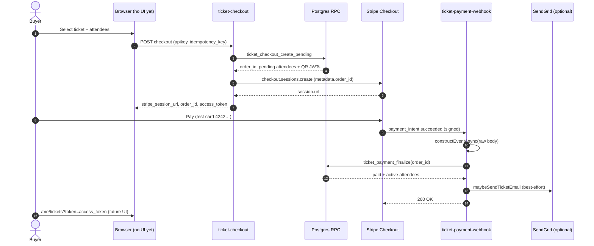
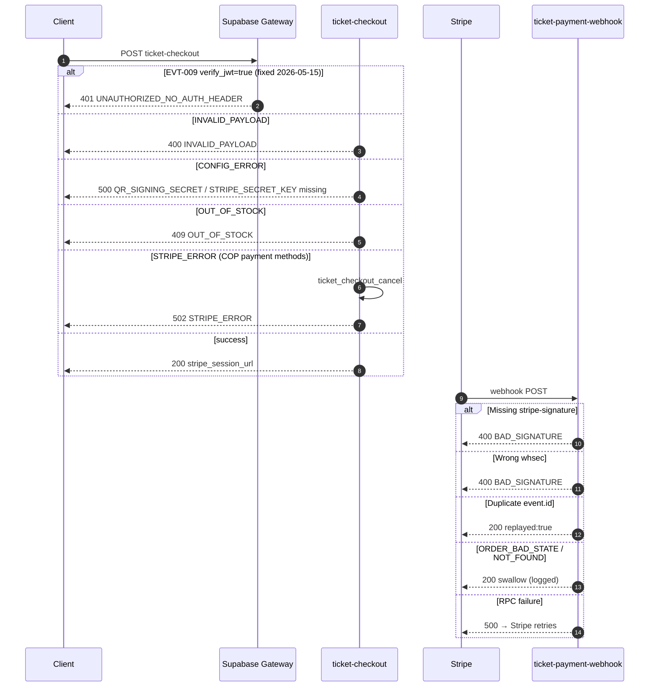
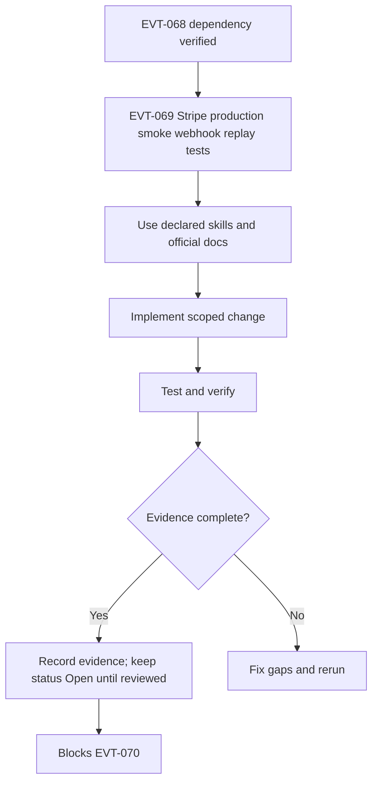

# EVT-069 - Stripe production smoke + webhook replay tests

## Objective

Make this task implementation-ready and production-aware without marking it complete. This task must close the gap between PRD, Mermaid diagram, roadmap, milestone, code reality, and test evidence for: **Stripe production smoke + webhook replay tests**.

## Source PRD / Diagram

- PRD: Events PRD v2 (`events-prd-v2-mastra-maps-automation.md`) + diagrams companion — §1 launch criteria · §17 · CLAUDE.md floor
- Diagram ID: `EVT-DIAG-PROD-02`
- Diagram source: `tasks/events/V2-tasks/events-prd-v2-diagrams.md`
- Roadmap source: `tasks/events/V2-tasks/events-roadmap.md`
- Milestone/progress source: `tasks/events/events-milestones.md`, `tasks/events/events-progress.md`

## Official Docs / MCP Verification

Official docs checked or required for this task:

- https://mermaid.js.org/intro/syntax-reference.html
- https://supabase.com/docs/guides/database/postgres/row-level-security
- https://supabase.com/docs/guides/functions/auth
- https://supabase.com/docs/guides/functions/function-configuration
- https://docs.stripe.com/checkout
- https://docs.stripe.com/webhooks
- https://docs.stripe.com/webhooks/signature
- https://docs.stripe.com/api/idempotent_requests
- https://developers.google.com/maps/documentation/places/web-service/choose-fields
- https://developers.google.com/maps/api-security-best-practices
- https://developers.google.com/maps/documentation/javascript/map-ids/mapid-over
- https://developers.google.com/maps/documentation/javascript/advanced-markers/start
- https://developers.google.com/maps/ai/grounding-lite/attribution
- https://ai.google.dev/gemini-api/docs/structured-output
- https://ai.google.dev/gemini-api/docs/function-calling
- https://vercel.com/docs/environment-variables

MCP verification status:

- supabase: UNVERIFIED
- mastra: UNVERIFIED
- google-maps-code-assist: UNVERIFIED
- maps-grounding-lite: UNVERIFIED
- gemini-api-docs-mcp: UNVERIFIED
- stripe-official-docs: VERIFIED_WEB
- mermaid-official-docs: VERIFIED_WEB
- vercel-official-docs: VERIFIED_WEB

Notes:

- [Stripe Checkout](https://docs.stripe.com/checkout), [webhooks](https://docs.stripe.com/webhooks), [signatures](https://docs.stripe.com/webhooks/signature), [idempotency](https://docs.stripe.com/api/idempotent_requests).
- Live smoke run 2026-05-15 — see § EVT-069 evidence below.

## User journey — sequence (happy path)



## Failure-point map (named blockers)



| Code | Layer | Meaning | Fix |
| --- | --- | --- | --- |
| `UNAUTHORIZED_NO_AUTH_HEADER` | Gateway | `verify_jwt=true` on checkout/validate | EVT-009 deploy `--no-verify-jwt` ✅ |
| `INVALID_PAYLOAD` | Handler | Zod / attendees≠quantity | Valid body in `evt069-stripe-smoke.sh` |
| `CONFIG_ERROR` | Handler | Missing edge secrets | Supabase → Edge secrets |
| `STRIPE_ERROR` | Stripe API | No payment methods for COP | `payment_method_types: ["card"]` + Dashboard COP/card |
| `BAD_SIGNATURE` | Webhook | Missing/wrong `STRIPE_WEBHOOK_SECRET` | Per-endpoint whsec in Dashboard |
| `OUT_OF_STOCK` | RPC | Capacity exhausted | Pick ticket with `qty_pending` headroom |

## EVT-069 live smoke evidence (2026-05-15)

### Step 1 — ticket-checkout

```bash
# scripts/evt069-stripe-smoke.sh (partial)
# event 22222222-… ticket Backstage 33333333-…-003
```

| Check | Result |
| --- | --- |
| Gateway reach handler | ✅ HTTP not `UNAUTHORIZED_NO_AUTH_HEADER` |
| RPC + pending order | ✅ Reached Stripe API |
| Stripe session created | ✅ **HTTP 200** after `payment_method_types: ["card"]` deploy |
| Fix deployed remote | ✅ `ticket-checkout` + `ticket-payment-webhook` (run `rm -rf dist` before deploy) |
| Idempotency cache | ✅ Fixed `onConflict: "key"` (was `key,endpoint` vs PK); replay returns same `order_id` |
| Stripe mode | ⚠️ **`cs_live_*`** sessions — edge `STRIPE_SECRET_KEY` is **live**; use **test** keys for safe smoke |

### Step 2–4 — payment / webhook / replay

| Check | Result |
| --- | --- |
| Complete Stripe test payment | ✅ `payment_intent.succeeded` via test PI + signed webhook delivery |
| `event_orders.status = paid` | ✅ `115de368-1ec8-41a8-bb1f-4a93c9a26649` → `paid`, `pi_3TXrATFAkFMiToA10CXmmpMD` |
| Attendees active + `qr_token` | ✅ 1× `active`, `qr_len=243` |
| Checkout idempotency replay | ✅ Same `idempotency_key` → same `order_id` |
| Webhook replay idempotent | ✅ 2× deliver → `{"replayed":true}`, still 1 active attendee |
| Webhook reaches handler (no sig) | ✅ HTTP **400** `BAD_SIGNATURE` |
| Dashboard `we_*` endpoint | ⚠️ **live mode only** — use `stripe listen` or `evt069-deliver-webhook.py` in test |

### Contract tests (no live Stripe)

```text
deno test tests/ticket_stripe_smoke_test.ts  → 5/5 pass
```

### Human unblock checklist

1. `rm -rf dist && supabase functions deploy ticket-checkout --no-verify-jwt --project-ref zkwcbyxiwklihegjhuql`
2. Stripe Dashboard → Settings → Payment methods → enable **Cards** for **COP**
3. `bash scripts/evt069-stripe-smoke.sh` → open `stripe_session_url` → pay `4242…`
4. Verify SQL: `event_orders`, `event_attendees` for `order_id`
5. `stripe events resend <evt_id>` → confirm single fulfillment

## Mermaid Diagram



## Scope

- Implement only the work needed for EVT-069.
- Preserve deterministic ownership boundaries from PRD v2.
- Production tasks are launch gates and may need to move earlier than numeric order when they block safety.
- CI, audit, remote parity, logs, smoke tests, quotas, and rollback evidence are mandatory.
- No production-safe claim is allowed from local tests alone.

## Out of Scope

- Marking this task Completed.
- Claiming production readiness without runtime evidence.
- Changing unrelated tasks or implementation areas.
- Allowing Mastra, Gemini, Hermes, or OpenClaw to own money, inventory, or check-ins.
- Exposing service-role, Stripe secret, Gemini, or server-side Maps/Places keys to frontend code.

## Implementation Steps

1. Re-read PRD section and Mermaid diagram for EVT-069; record any drift before editing code.
2. Implement only after CORE/MVP gate or keep read-only; enforce explicit Places field masks, key separation, cache TTL, attribution, and quota logging.
3. Add or update focused unit/integration tests before changing task status.
4. Run verification commands and paste evidence into the PR/task evidence section.
5. Leave `status: Open` until reviewer-visible runtime proof exists.

## Success Criteria

- Task remains `Open` until evidence is attached.
- All declared skills are used or explicitly marked not applicable.
- Official docs are cited with exact URLs and MCP status is recorded.
- Verification commands are run or marked blocked with reason.
- No wildcard Places field masks; attribution/quota/cache/key restrictions are proven.

## Production-Ready Checklist

- [ ] Skills used and listed
- [ ] Official docs checked
- [ ] MCP checked or marked UNVERIFIED
- [ ] Security reviewed
- [ ] RLS/auth reviewed if Supabase touched
- [ ] Tests pass
- [ ] Rate limits/quotas reviewed if external API touched
- [ ] No secrets in frontend
- [ ] Evidence attached
- [ ] Rollback path documented

## Testing Strategy

### Unit Tests

Test field-mask construction, cache TTL math, attribution rendering decisions, key selection, and quota guard helpers.

### Integration Tests

Exercise local Supabase or Mastra workflow integration where applicable; record skipped external dependencies as UNVERIFIED.

### Edge Function Tests

Run only when an Edge Function or config changes; otherwise document N/A.

### RLS / Security Tests

Include negative anon/authenticated tests and catalog checks for policies, grants, functions, and RLS enabled flags.

### E2E / Browser Tests

Add browser smoke only for user-visible surfaces; do not claim route works from static code inspection.

### Load / Concurrency Tests

Document quota/concurrency assumptions; add targeted load smoke for external APIs if relevant.

### External API / MCP Smoke Tests

Run safe Maps/Places/Grounding smoke with quotas and test keys; record API enablement and billing safeguards.

## Verification Commands

```bash
npm run verify:mastra
VERIFY_OFFICIAL_URLS=1 npm run verify:official-doc-refs
npm run floor
npm run verify:events:mermaid
cd my-mastra-app && npm run typecheck && npm run test
```

## Evidence Required Before Completion

- Command output for every verification command, including failures.
- PR/task note showing exact files changed and docs checked.
- MCP status recorded as VERIFIED or UNVERIFIED with reason.
- Supabase local and remote catalog evidence for tables, policies, grants, functions, and RLS where touched.
- Field mask, key restriction, attribution, cache TTL, quota/billing evidence.

## Failure Handling

- Fail closed: do not expose user-facing paths or automation if verification fails.
- Record failed command output and root cause in the task/PR.
- Keep downstream tasks blocked until the failure is resolved or formally deferred.
- Treat missing MCP/tool access as UNVERIFIED, not as success.

## Rollback Plan

- Revert task-specific code/docs changes in the PR if verification fails.
- Do not roll back database migrations without a reviewed down/forward-fix plan.
- Disable Maps/Grounding feature flag or set quota kill switch to zero; fall back to Supabase-cached data.

## Red Flags / Blockers

- Wildcard Places masks, unrestricted keys, or missing attribution are blockers.
- AI must remain read-only/proposal-only for money, inventory, and check-ins.

## Correctness Score

| Area | Score | Notes |
| --- | ---: | --- |
| PRD alignment | 55/100 | Traceability added; task still open. |
| Diagram alignment | 50/100 | Mermaid block added; source diagram still must render in CI. |
| Dependency accuracy | 85/100 | Direct dependency exists and ordering was checked. |
| Official docs/MCP verification | 45/100 | Official URLs listed; some MCP sources remain UNVERIFIED. |
| Test coverage | 25/100 | Strategy exists; runtime tests still required. |
| Production readiness | 20/100 | No production-safe claim until evidence is attached. |

Overall: 35/100

## Production Risk Score

| Risk | Score | Notes |
| --- | ---: | --- |
| Production risk | 65/100 | High; based on audit evidence, missing runtime proof, and dependency blast radius. |

## Next Step

Treat as a launch gate; pull forward if it blocks safety or evidence.
