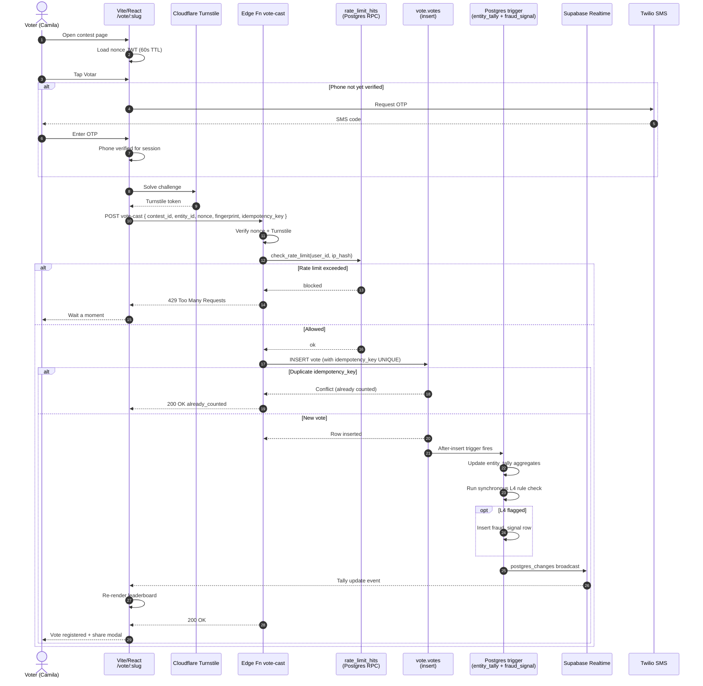

# 01 — Vote cast end-to-end (sequence)

**What this shows.** From the moment a voter (Camila) taps "Votar" to the leaderboard updating in real time. Includes phone OTP, rate limit, idempotency, fraud signal, and Realtime fan-out.

**Phase.** CORE — required for Phase 1 ("Miss Elegance Colombia 2026" — free voting).

## Notes

- **Nonce JWT.** Issued at page render, 60-second TTL, single-use. Kills curl scripts that skip the page.
- **Phone OTP.** Cached per-session — voter enters OTP once per device per day, then 1-tap voting until daily quota.
- **Idempotency.** `UNIQUE` constraint on `idempotency_key` makes the INSERT safe to retry.
- **L4 fraud rule.** Synchronous (<30ms) — IP burst, device reuse, country mismatch. L5 (Gemini AI anomaly) runs async.
- **Realtime fan-out.** All viewers of the contest page see the new total within 2 seconds.
