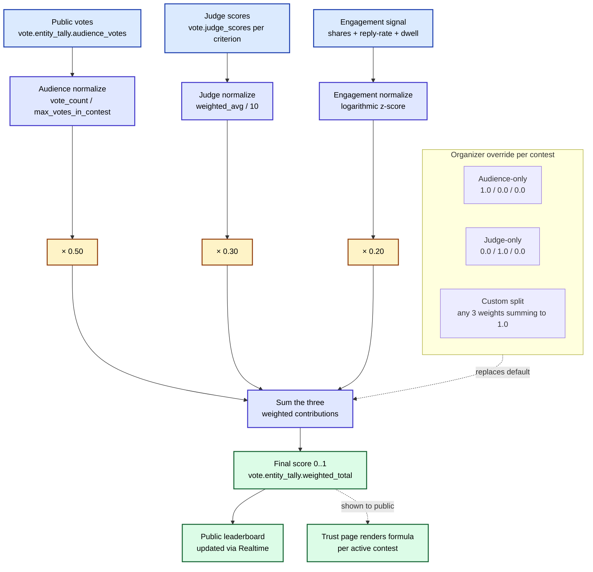

# 02 — Hybrid scoring formula (flowchart)

**What this shows.** How a contestant's final score is computed from three weighted inputs — public votes (50%), judge scores (30%), engagement signal (20%). Default for pageant-class contests like Miss Elegance Colombia 2026. Organizer can override per contest; the formula in use is always rendered on the public Trust page for transparency.

**Phase.** CORE — must be visible on the public Trust page before Phase 1 voting opens.

## Notes

- **Default 0.5 / 0.3 / 0.2** for pageant-class. Restaurant week defaults to 0.7 / 0.0 / 0.3 (audience + engagement, no judges).
- **Engagement** is computed from `share_clicks` + `wa_reply_rate` + average `time_on_contest_page`, normalized via log z-score.
- **Override is contractual.** Organizer signs off in the partnership agreement (Phase 0). Cannot change mid-contest.
- **Trust page.** The active formula is always shown to voters, with plain-Spanish-Paisa explanation of each weight.
