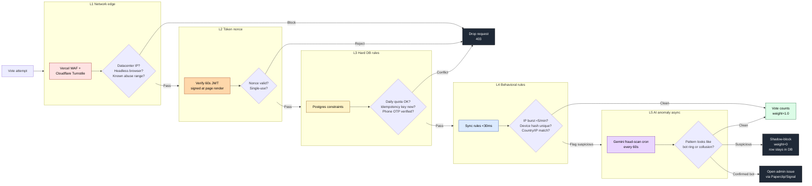

# 03 — Five-layer fraud defense (flowchart)

**What this shows.** Defense in depth — a vote attempt has to pass five independent checks before it counts as valid. Each layer catches different attack classes. Inspired by [01-contests.md §6 anti-fraud strategy].

**Phase.** CORE — all five layers must be live before Phase 1 voting opens (mandatory release blocker for Miss Elegance Colombia 2026).

## Layer responsibilities

| Layer | Catches | Speed | Where it runs |
|---|---|---|---|
| **L1 — Network** | DDoS, headless browsers, datacenter IPs | <10ms | Vercel + Cloudflare |
| **L2 — Token nonce** | curl scripts that skip page render | <5ms | Edge fn |
| **L3 — Hard DB rules** | Replay, daily quota breach, unverified phone | <20ms | Postgres constraints |
| **L4 — Behavioral** | IP burst, device-reuse rings, country mismatch | <30ms | Edge fn (sync) |
| **L5 — AI anomaly** | Coordinated bot rings, slow-burn collusion | ~60s lag | Cron + Gemini |

## Notes

- **Shadow-block** is critical for the buy-votes scenario: confirmed-fraud votes stay in `vote.votes` with `weight=0` so the attacker doesn't realize they've been caught and rotate to a new account.
- **Honeypot** field on the form — populated by bots, never by humans — instantly classifies as L4 fraud.
- **Daily IP-hash salt rotation** keeps device fingerprinting privacy-preserving (we don't store raw IPs).
