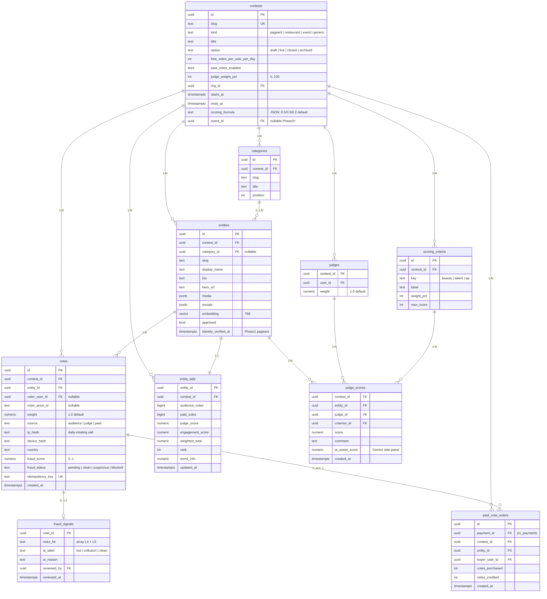

# 04 — `vote.*` schema (ERD)

**What this shows.** All Phase 1 tables in the `vote.*` schema and their relationships. Source of truth: [`01-contests.md`](../01-contests.md) §3.

**Phase.** CORE — full schema migrates in Phase 1.

## Notes

- **Phase 1 (Miss Elegance Colombia 2026, free voting):** all tables migrate. `paid_vote_orders` exists but unused until Phase 2.
- **`votes` is append-only.** Never updated. Shadow-block sets `fraud_status = 'blocked'` and the trigger sets `weight = 0` in `entity_tally` recompute.
- **`entity_tally` is materialized** via after-insert trigger — clients read this counter, not raw `votes` rows. Keeps finals-night load O(1) per leaderboard view.
- **`identity_verified_at`** on `entities` enforces the Phase 0 partnership agreement: a contestant cannot go public until admin moderation of waiver + ID is complete.
