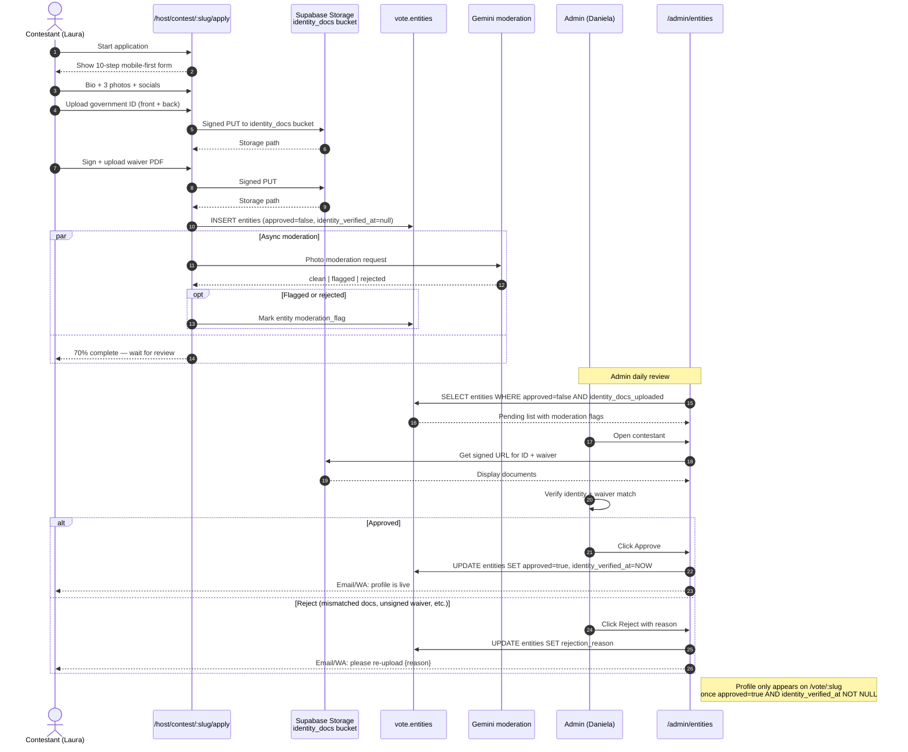

# 05 — Contestant identity verification (sequence)

**What this shows.** New for Phase 1 because we chose a beauty pageant ([Miss Elegance Colombia 2026](https://misseleganceco.com/)) as the flagship. Each contestant uploads a government-ID photo + signed waiver. Admin moderates. Profile activates only after both pass.

**Phase.** CORE — release blocker for Phase 1 voting open.

## Notes

- **Storage bucket reuse.** `identity_docs` bucket already exists in mdeai (from landlord V1). Reused with new RLS policy for contest contestants.
- **Retention.** Identity docs retained 12 months post-contest-close per Habeas Data §6 Q6 default; voter PII separately handled.
- **Why Phase 0 partnership matters.** Miss Elegance Colombia organizers must agree to the moderation flow — who arbitrates a rejection dispute, what evidence rises to "reject", how appeals work. Documented in the partnership agreement.
- **AI moderation is a pre-check, not a decision.** Gemini flags; admin decides. False positives are recoverable; false negatives are brand-safety incidents.
