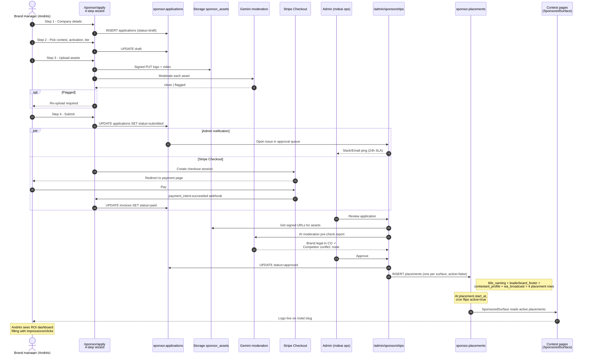

# 06 — Sponsor onboarding end-to-end (sequence)

**What this shows.** From a brand manager visiting `/sponsor/apply` to their logo flipping live on the contest page. Phase 2 ships the full self-serve flow; Phase 1 has admin-only manual configuration of one `contest_header` surface.

**Phase.** MVP — Phase 2 release blocker.

## Notes

- **One application → many placements.** A Premium tier produces 5 placement rows (one per surface). Bronze produces 1.
- **`active=false` until `start_at`** so an early-paying sponsor doesn't appear before their contracted start date. Cron flips at the boundary.
- **Brand-safety guardrail (Phase 4).** If a fraud spike or judge controversy hits during a sponsor's window, `active` flips to `false` automatically until admin clears.
- **Phase 1 simplification.** Admin manually creates `placements` rows for the first sponsor of Miss Elegance Colombia 2026 — no wizard yet. Wizard ships in Phase 2.
