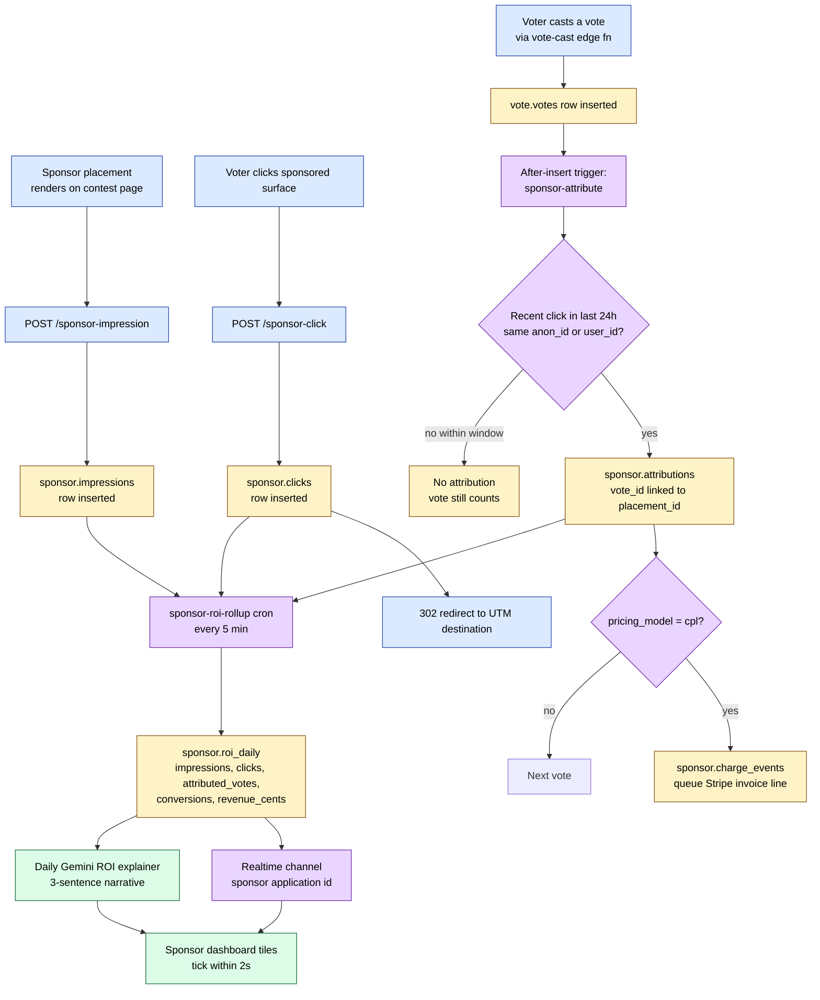

# 07 — Sponsor ROI attribution pipeline (flowchart)

**What this shows.** How an impression → click → vote turns into one row of attributed ROI in the sponsor dashboard. Last-click within a 24-hour window on `(viewer_anon_id OR viewer_user_id)`.

**Phase.** MVP — Phase 2 release blocker (CPL pricing depends on this).

## Edge cases handled

- **Anon → user upgrade.** When a `viewer_anon_id` resolves to a `user_id`, retro-attribute the last 24h of clicks to the new user's votes. One-shot SQL job on identity merge.
- **Multi-touch (Premium tier only).** If `application.attribution_model = 'multi_touch'`, distribute credit across last 3 placements seen — 50/30/20 split.
- **Click without vote.** Counted as engagement (not attribution); shown in dashboard CTR but not CPL revenue.
- **Vote without prior click.** Organic vote — no sponsor attribution.

## Notes

- **24-hour window.** Configurable per contest via `application.attribution_window_hours`; default 24, max 72 (matches typical pageant decision-cycle research).
- **Brand-safety.** If `vote.fraud_signals.fraud_status = 'blocked'`, the attribution is also voided — sponsor doesn't pay CPL on a fake vote.
- **Why this matters.** "How many real customers?" — the Phase 1 question Andrés asks his director. Phase 2 ships actual numbers, not promises.
