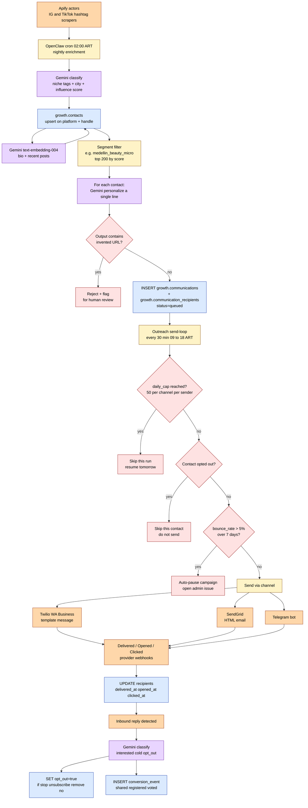

# 08 — Compliant outreach campaign flow (flowchart)

**What this shows.** From Apify nightly enrichment to a personalized WhatsApp/email landing in an influencer's inbox. Compliance rails enforced as hard rules: 50/day cap, suppression list, bounce-rate auto-pause.

**Phase.** MVP — Phase 2 release blocker; **does NOT ship in Phase 1** (Miss Elegance Colombia uses inbound-only — contest is the viral hook).

## Hard compliance rules

| Rule | Enforced where |
|---|---|
| 50 sends/day/channel/sender | `growth.outreach_campaigns.daily_cap NOT NULL` |
| Suppression honored ≤24h | `growth.contacts.opt_out` + inbound watcher |
| Bounce rate < 5% rolling 7d | Auto-pause job; admin issue opened |
| No invented URLs in AI output | regex `https?://` validation in personalize step |
| Email unsubscribe in every send | Static template footer |
| WA template-only first contact | Free-form unlocks 24h after their reply |
| IG/TikTok DM **only after** prior reply elsewhere | Channel branch logic in send-loop |

## Notes

- **Phase 1 does NOT ship outreach.** The contest itself is the viral hook. Phase 1 monetizes via sponsor sales against the live contest, not via outreach campaigns.
- **Phase 2 starts with hand-curated top-50** influencers, not full 200/day. Volume ramps gradually with Twilio reputation.
- **nielsberglund schema** (campaigns / communications / communication_recipients / marketing_assets / asset_distributions) replaces our older outreach_messages structure and is what the diagram references.
