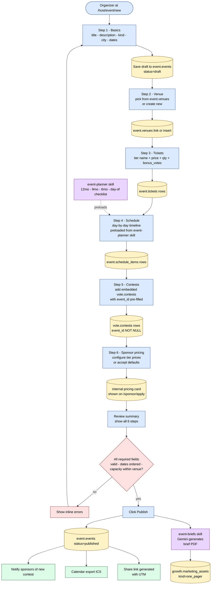

# 10 — Organizer event-creation wizard (flowchart)

**What this shows.** Daniela's 6-step path from "I have an event in my head" to "published with embedded contests, tickets, and sponsor pricing" in 30 minutes. Loads the [`event-planner`](../../../.claude/skills/event-planner/SKILL.md) skill's logistics checklist; auto-generates a brief PDF on publish via [`event-briefs`](../../../.claude/skills/event-briefs/SKILL.md).

**Phase.** MVP — Phase 3 release blocker.

## Notes

- **Draft persists on blur** — refresh-safe across all 6 steps. Daniela never loses work.
- **`event-planner` preloads** the timeline checklist as suggested `schedule_items` items the organizer can accept or override. Saves ~15 minutes per event.
- **`event-briefs` Gemini call** runs on publish, not earlier — only finalized data goes into the brief PDF. Brief lives in `growth.marketing_assets` and is shared with sponsors automatically.
- **Validation gate** rejects: `ends_at < starts_at`, sum of ticket qty > venue capacity, embedded contest with status='live' but contest dates outside event range.
- **30-minute target** verified with 5-buyer dogfood cohort before Phase 3 ships.
