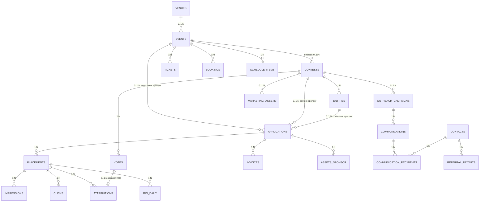

# 11 — Integrated schema relationships across `vote.* / growth.* / sponsor.* / event.*` (ERD)

**What this shows.** The cross-schema **relationships** that make the bundle work. Field-level detail per schema lives in [`04-vote-schema.md`](./04-vote-schema.md) and the upstream specs ([`03-sponsorship-system.md`](../03-sponsorship-system.md), [`05-unified-platform.md`](../05-unified-platform.md), [`02-openclaw-growth.md`](../02-openclaw-growth.md)). This relationship-only view fits on one page; the full field-level ERD spans 22 entities and is split across the per-schema diagrams.

**Phase.** MVP — by Phase 3 all 4 schemas live; Phase 4 adds `trio.*`.

## The eight cross-schema FKs (the integration points)

| FK | From → To | Phase introduced | Why |
|---|---|---|---|
| 1 | `vote.contests.event_id` → `event.events.id` | 3 | embed contest in event |
| 2 | `event.bookings.user_id` → `auth.users.id` | 3 | ticket holder identity |
| 3 | `sponsor.applications.event_id` → `event.events.id` | 3 | event-level sponsor |
| 4 | `sponsor.applications.contest_id` → `vote.contests.id` | 2 | contest-level sponsor |
| 5 | `sponsor.applications.entity_id` → `vote.entities.id` | 2 | contestant sponsor |
| 6 | `sponsor.attributions.vote_id` → `vote.votes.id` | 2 | ROI link |
| 7 | `growth.outreach_campaigns.contest_id` → `vote.contests.id` | 2 | contest-bound campaign |
| 8 | `growth.marketing_assets` → `{vote.contests, event.events, sponsor.applications}` | 2 | multi-parent asset library |

All cross-schema FKs are **nullable** so each schema works standalone. Adding events doesn't require rewriting voting; adding sponsors doesn't require events.

## Per-schema field-level ERDs

| Schema | Diagram |
|---|---|
| `vote.*` | [04-vote-schema.md](./04-vote-schema.md) |
| `sponsor.*` | not yet diagrammed — see [03-sponsorship-system.md §3](../03-sponsorship-system.md) |
| `event.*` | not yet diagrammed — see [05-unified-platform.md §8](../05-unified-platform.md) |
| `growth.*` | not yet diagrammed — see [02-openclaw-growth.md `growth.*` schema](../02-openclaw-growth.md) + [07-ai-event-research.md §2](../07-ai-event-research.md) for nielsberglund 5-table additions |
| `trio.*` | not yet diagrammed — see [06-trio-integration.md §8](../06-trio-integration.md) |
