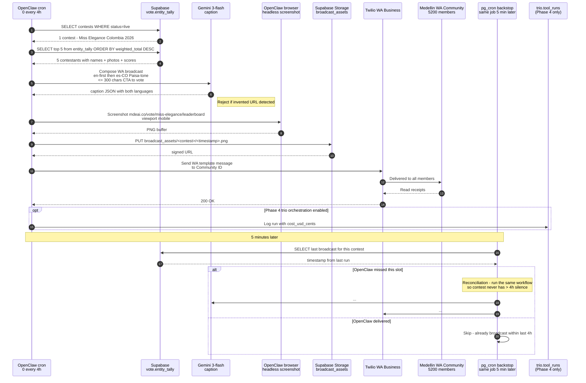

# 12 — Leaderboard broadcast every 4 hours (sequence)

**What this shows.** OpenClaw's Workflow C — the single OpenClaw automation that ships in Phase 1. Every 4 hours during a live contest, OpenClaw screenshots the leaderboard, writes a Spanish-Paisa caption (English-first AI generation, then localized), and broadcasts to a Medellín WhatsApp Community.

**Phase.** CORE — Phase 1 ships this for Miss Elegance Colombia 2026. Pure outbound; no inbound parsing yet.

## Notes

- **Trigger.** Paperclip routine (Phase 4) or simple cron (Phase 1). Same workflow, different orchestrator.
- **Gemini caption rules.** ≤300 chars, English first then Spanish-Paisa, includes vote CTA URL with UTM, rejects any output containing URLs the model invented. Voice quality reviewed weekly by Spanish QA contractor.
- **Why screenshot, not text.** WhatsApp Communities engage 5–8× higher with images. Screenshot shows actual leaderboard rankings — visual social proof.
- **`pg_cron` backstop.** If OpenClaw VPS is down, Supabase pg_cron runs the same job 5 minutes later as reconciliation — never duplicates, never misses a 4h slot.
- **Phase 1 simplification.** Just this one workflow. No outreach (Phase 2). No A6/A7 (Phase 3). No Hermes/Paperclip (Phase 4). The `trio.tool_runs` log is optional in Phase 1 — direct Supabase logging is fine.
