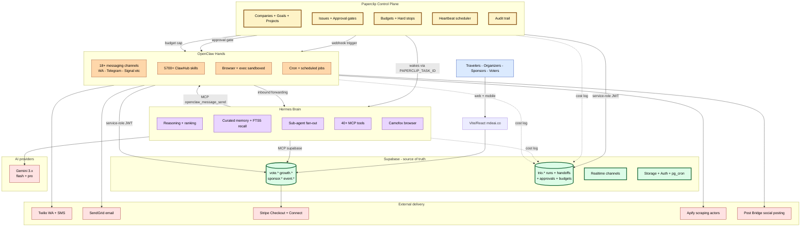

# 13 — Trio architecture (flowchart, C4-container style)

**What this shows.** Phase 4 introduces three additional runtimes — OpenClaw (channels + exec), Hermes (reasoning + memory), Paperclip (governance + budgets) — wired around Supabase as the single source of truth. Every cross-tool action logs to `trio.tool_runs` for cost + audit visibility.

**Phase.** ADVANCED — deferred from Phase 1 per audit response. Only ships when scale or team demands governance + reasoning + sub-agent fan-out.

## Communication patterns (per `06-trio-integration.md`)

| From → To | Pattern |
|---|---|
| Paperclip → OpenClaw | Webhook to OpenClaw HTTP API on issue status change |
| Paperclip → Hermes | Heartbeat env (`PAPERCLIP_TASK_ID`) wakes Hermes as ACP agent |
| Hermes → OpenClaw | MCP tool: `openclaw.message_send` |
| OpenClaw → Hermes | OpenClaw exposes channels as MCP tools — inbound message routed for reasoning |
| Any → Supabase | Service-role JWT scoped to specific schemas (read or write) |
| Any → Paperclip | REST `/api/issues/*` with `X-Paperclip-Run-Id` header |

## Rule of thumb

> **Channel or external API → OpenClaw. Reasoning or memory → Hermes. Approval or budget → Paperclip. What's true → Supabase.**

If a capability fits two runtimes (e.g. both OpenClaw and Hermes have cron), pick by primary purpose and stay disciplined. The audit warned: 3 runtimes = 3 failure surfaces if responsibilities blur.
