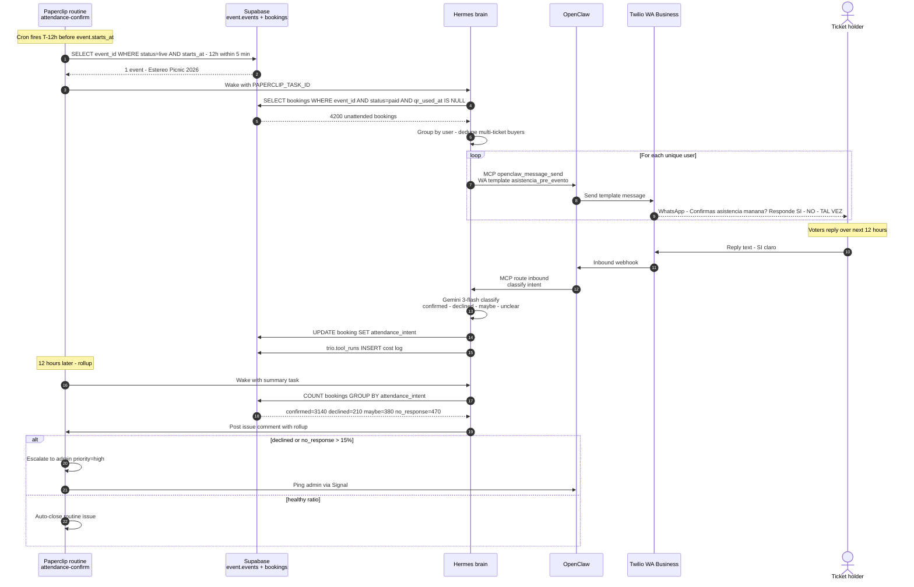

# 14 — A6 attendance confirmation (sequence)

**What this shows.** Ported from EventMobi's pattern. T-12 hours before any event with `status='live'`, OpenClaw sends a WhatsApp template asking "¿Confirmas asistencia mañana?" Replies route to Hermes for sentiment classification; results update `event.bookings.attendance_intent`. Resolves "ghost attendees" — paid + no-show — that break venue capacity planning.

**Phase.** ADVANCED — Phase 3 ships this as plain OpenClaw + pg_cron; Phase 4 re-orchestrates via Paperclip + Hermes for budget + audit.

## Acceptance criteria

| Metric | Target |
|---|---|
| Confirmation rate | ≥ 70% (vs ~50% baseline without prompt) |
| Reply classification F1 | ≥ 90% on the 4-label set |
| Cost per event | ≤ $25 (Twilio template + Gemini inference) |
| Time to deliver all prompts | ≤ 15 min from cron fire |

## Notes

- **Why WhatsApp, not phone calls.** Original EventMobi pattern uses voice calls; in Colombia, WhatsApp is dominant and 10× cheaper.
- **Gemini classifier eval.** 200 hand-labeled real Spanish replies tested before production. Ambiguous replies fall back to admin queue.
- **Phase 3 vs Phase 4.** Phase 3 ships the workflow as a single OpenClaw skill + pg_cron, no Hermes/Paperclip. Phase 4 re-orchestrates for governance — Paperclip enforces budget cap, Hermes does sub-agent fan-out for parallel classification.
- **ROI math.** A 5,000-attendee festival saves ~750 confirmed seats from no-show baseline at $25 cost. Per-event ROI is the single best argument for the trio investment.
