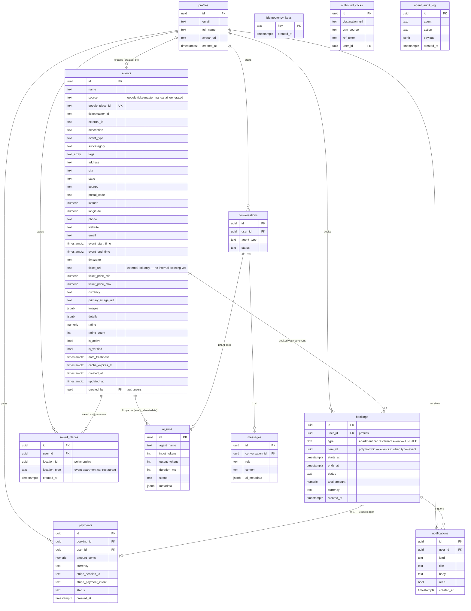

# 16 — What's actually in Supabase TODAY (events domain)

**Source.** Live `medellin` Supabase project (`zkwcbyxiwklihegjhuql`), inspected May 2026 via MCP. Plus the canonical `public.events` DDL the user pasted. **44 tables exist in `public`.** This diagram shows ONLY the ~12 tables relevant to the events module — everything else (apartments, restaurants, landlord, P1-CRM, etc.) is omitted for clarity.

## Key observations from the actual schema

| Observation | Implication |
|---|---|
| **`events` is a discovery catalog** with Google Places + Ticketmaster + manual sources | It's NOT a transactional events table. There's no `qty_total`, `qty_sold`, ticket inventory, organizer ownership, or status workflow. |
| **`ticket_url` is an external link** | mdeai today doesn't sell tickets — it links out. **Phase 1 MVP must add internal ticketing to make events transactional.** |
| **`bookings` is polymorphic** (apartments, cars, restaurants, events all share it) | We can use it for event tickets without a new table. Need to add `qr_token` + `qr_used_at`. |
| **`payments` is a real Stripe ledger** with 3 rows already | Working payments infra. Just wire to event bookings. |
| **`agent_audit_log` exists** with comment "audit trail for Paperclip/Hermes/OpenClaw agent actions" | Phase 4 trio infra is already in schema even though runtimes aren't installed. |
| **`idempotency_keys` table** exists with TTL 24h cron | Reuse for `ticket-checkout` retries. |
| **`outbound_clicks` table** exists for affiliate attribution | Phase 2 sponsor ROI tracking already has its starting point. |
| **`is_active` flag** + 10 indexes on `events` | Discovery query patterns are well-optimized. Don't break them. |

## What's missing for Phase 1 MVP (additive only)

Per [`18-mvp-gap.md`](./18-mvp-gap.md), only **3 schema changes needed** to enable internal ticketing — none of them risky:

1. **NEW `event_tickets` table** — ticket types (id, event_id, name, price_cents, qty_total, qty_sold)
2. **Extend `public.events`** with: `slug` (UK), `status` (draft|published|live|closed), `organizer_id` (FK profiles), `total_capacity`
3. **Extend `public.bookings`** with: `qr_token` (UK), `qr_used_at`, `attendee_email`, `attendee_name`

That's it. **Three additive migrations.** No table renames. No column drops. No data loss.

## See also

- [`17-current-data-flow.md`](./17-current-data-flow.md) — how `useEvents` + `EventBookingWizardPremium` work today end-to-end
- [`18-mvp-gap.md`](./18-mvp-gap.md) — exactly what to add (3 migrations + 3 edge fns + 4 screens) to ship Phase 1
- [`tasks/events/09-prd.md`](../09-prd.md) §4.6 — Hi.Events benchmark + feature gap analysis
