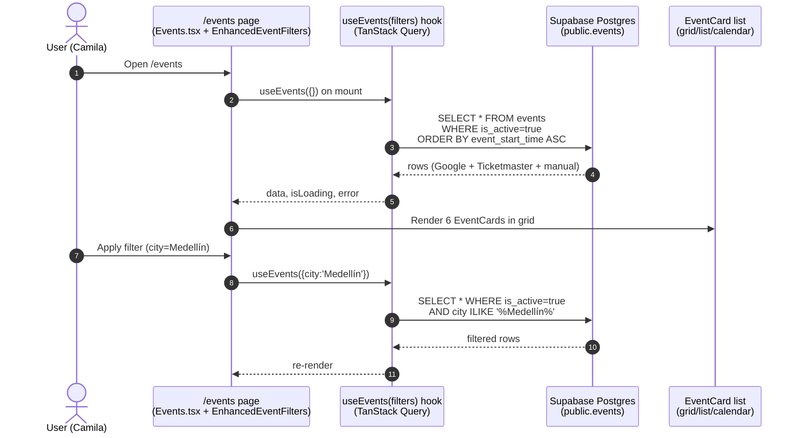

# 17 — How events actually flow today (May 2026)

**Source.** Verified from real code: [`src/hooks/useEvents.ts`](../../../src/hooks/useEvents.ts), [`src/pages/Events.tsx`](../../../src/pages/Events.tsx), [`src/pages/EventDetail.tsx`](../../../src/pages/EventDetail.tsx). **EventBookingWizardPremium component is already imported** in EventDetail.tsx — partial booking UX exists.

## Discovery flow (browse `/events` page)



## Detail flow (`/event/:id` page)

```mermaid
sequenceDiagram
    autonumber
    actor U as User
    participant FE as /event/:id<br/>(EventDetail.tsx)
    participant H as useEvent(id) hook
    participant SB as Supabase
    participant SAVE as useSavedPlaces<br/>(saved_places table)
    participant WIZ as EventBookingWizardPremium<br/>(component imported, partial)

    U->>FE: Open /event/:id
    FE->>H: useEvent(id)
    H->>SB: SELECT * FROM events WHERE id=$1
    SB-->>H: event row
    H-->>FE: event detail
    FE->>SAVE: useIsSaved(id, 'event')
    SAVE->>SB: SELECT FROM saved_places WHERE user_id=auth.uid() AND location_id=$1
    SB-->>SAVE: saved boolean
    FE-->>U: Render hero + description + map + Get Tickets button
    U->>FE: Click Get Tickets
    Note over FE,WIZ: Today: opens EventBookingWizardPremium dialog<br/>(but completion path unclear; ticket_url external link is the fallback)
    alt Internal booking (partial)
        FE->>WIZ: Show wizard
        WIZ->>SB: INSERT INTO bookings (type='event', item_id=event.id, ...)
        SB-->>WIZ: booking row
        WIZ-->>U: Confirmation
    else External link (current default)
        FE->>FE: Open events.ticket_url in new tab (Eventbrite/etc.)
    end
```

## What's working today

- ✅ Event discovery on `/events` (filters: type, city, date, free, search, calendar view)
- ✅ Event detail page with 3-panel layout
- ✅ Save/unsave events via `saved_places`
- ✅ Booking wizard component exists (partial)
- ✅ External `ticket_url` link works as fallback
- ✅ AI agents (`ai-chat`, `ai-search`, `ai-router`) deployed but not events-specific

## What's NOT working today (the Phase 1 gap)

- ❌ **No internal ticketing** — clicking "Get Tickets" defaults to external `ticket_url`
- ❌ **No QR code generation** — bookings don't mint a server-signed token
- ❌ **No door check-in** — no `qr_used_at` flow, no scanner PWA
- ❌ **No organizer dashboard** — `/host/event/:id` doesn't exist
- ❌ **No event creation** — `/host/event/new` doesn't exist; events are seeded from external sources only
- ❌ **No event ownership** — `events.created_by` exists but is rarely populated for non-manual events
- ❌ **No tickets table** — `events.ticket_price_min/max` are display-only, not inventory
- ❌ **No status workflow** — events are either `is_active=true` or `is_active=false` (binary)

## How AI is used today (limited)

| AI feature | Edge fn | Used for events? |
|---|---|---|
| `ai-chat` (Gemini) | deployed | ✅ floating chat widget, can answer event questions |
| `ai-search` (semantic) | deployed | ✅ events listed in search corpus |
| `ai-router` (intent) | deployed | ✅ routes "show me events" intent |
| `ai-trip-planner` | deployed | ✅ adds events to trips |
| `ai-suggest-collections` | deployed | partial |
| `ai-optimize-route` | deployed | adds event venues to optimized route |
| `lead-from-form` | deployed | NOT events-related (landlord) |
| `listing-create` / `listing-moderate` | deployed | NOT events-related (apartments) |

**No edge function exists for: event create, ticket purchase, QR validation, organizer dashboard, photo moderation specifically for events.** All to be added in Phase 1.

## See also

- [`16-current-supabase-erd.md`](./16-current-supabase-erd.md) — schema view
- [`18-mvp-gap.md`](./18-mvp-gap.md) — what to add to close the gap
