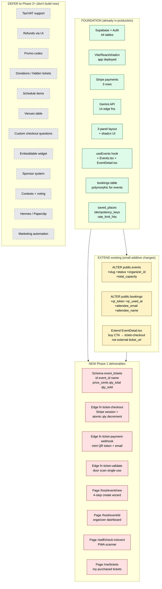

# 18 — The exact gap to ship Phase 1 MVP (3 weeks)

**Reality.** Most of mdeai's events foundation is **already built**. The Phase 1 MVP is a **small additive layer** — 3 schema changes, 3 edge functions, 4 new screens, 1 Stripe webhook. Everything else (sponsors, contests, AI orchestration, marketing automation) is Phase 2+.

## Visual: green = exists, yellow = extend, red = build new



## Phase 1 build sheet (the entire MVP scope)

### Schema (1 migration, ~1 day)

```sql
-- 1. ALTER existing events table (additive only — no data loss)
ALTER TABLE public.events
  ADD COLUMN slug text,
  ADD COLUMN status text DEFAULT 'draft' CHECK (status IN ('draft','published','live','closed','archived')),
  ADD COLUMN organizer_id uuid REFERENCES profiles(id),
  ADD COLUMN total_capacity int;
CREATE UNIQUE INDEX events_slug_uk ON public.events(slug) WHERE slug IS NOT NULL;
CREATE INDEX events_organizer_idx ON public.events(organizer_id) WHERE organizer_id IS NOT NULL;

-- 2. NEW event_tickets table (the only new table)
CREATE TABLE public.event_tickets (
  id uuid PRIMARY KEY DEFAULT gen_random_uuid(),
  event_id uuid NOT NULL REFERENCES public.events(id) ON DELETE CASCADE,
  name text NOT NULL,
  description text,
  price_cents int NOT NULL CHECK (price_cents >= 0),
  currency text NOT NULL DEFAULT 'COP',
  qty_total int NOT NULL CHECK (qty_total > 0),
  qty_sold int NOT NULL DEFAULT 0,
  is_active boolean NOT NULL DEFAULT true,
  position int NOT NULL DEFAULT 0,
  created_at timestamptz NOT NULL DEFAULT now(),
  CHECK (qty_sold <= qty_total)
);
ALTER TABLE public.event_tickets ENABLE ROW LEVEL SECURITY;

-- 3. ALTER bookings (additive — works for existing apartment/car/restaurant bookings unchanged)
ALTER TABLE public.bookings
  ADD COLUMN qr_token text UNIQUE,
  ADD COLUMN qr_used_at timestamptz,
  ADD COLUMN attendee_email text,
  ADD COLUMN attendee_name text,
  ADD COLUMN ticket_id uuid REFERENCES public.event_tickets(id);
CREATE UNIQUE INDEX bookings_qr_token_uk ON public.bookings(qr_token) WHERE qr_token IS NOT NULL;
```

**Rollback path:** `DROP TABLE public.event_tickets; ALTER TABLE public.events DROP COLUMN slug, ...;` — clean, atomic.

### Backend (3 edge functions, ~4 days)

| Edge fn | Purpose | Effort |
|---|---|---|
| `ticket-checkout` | Stripe Checkout session + atomic `qty_sold` increment via advisory lock | 2 days |
| `ticket-payment-webhook` | Stripe webhook → mint QR token (signed JWT) + email via SendGrid | 1 day |
| `ticket-validate` | Door scan → mark `qr_used_at` (single-use) | 1 day |

### Frontend (4 new screens + 1 extension, ~7 days)

| Screen | Purpose | Effort |
|---|---|---|
| `/host/event/new` | 4-step wizard (basics → tickets → review → publish) | 3 days |
| `/host/event/:id` | Organizer dashboard (sold/attended/revenue from existing tables) | 2 days |
| `/staff/check-in/:event` | PWA scanner (works offline) | 1.5 days |
| `/me/tickets` | User's purchased tickets with QR display | 0.5 day |
| `EventDetail.tsx` extension | Buy CTA → `ticket-checkout` (replace external link) | already partial — finish |

### AI features (2 Gemini direct calls, no agents)

| Feature | Where | Effort |
|---|---|---|
| Event description generator | `/host/event/new` step 1 → Gemini Flash → 3 variants | 0.5 day |
| Hero photo moderation | On upload → existing edge-fn pattern | 0.5 day |

### Automations (1 only)

| Automation | Trigger | Action |
|---|---|---|
| Stripe webhook | `payment_intent.succeeded` | Mint QR token + send confirmation email via SendGrid |

## Total Phase 1 scope

| Layer | Items | Effort |
|---|---|---|
| Schema | 1 migration (1 new table + 2 ALTERs) | 1 day |
| Backend | 3 edge functions | 4 days |
| Frontend | 4 new screens + 1 extension | 7 days |
| AI | 2 Gemini direct calls | 1 day |
| Automations | 1 webhook | (in backend above) |
| Testing + polish | Lint, build, manual smoke test | 2 days |
| **Total** | | **~15 dev-days = 3 weeks at 1 dev** |

## What we deliberately defer (and why)

| Deferred | Phase | Why |
|---|---|---|
| Tax/VAT (Colombia IVA) | 2 | Sponsor revenue first; tax compliance after first organizer requests it |
| Refunds via UI | 2 | Stripe Dashboard handles manually until volume justifies UI |
| Promo codes | 2 | Useful for sponsor comp tickets — comes when sponsors come |
| Donation / hidden / tiered tickets | 2 | Add when first organizer asks |
| Schedule items / venues / capacity sharing | 2/3 | Festival-scale features |
| Custom checkout questions | 2 | Common ask but not blocker |
| CSV/XLSX export | 2 | Built into dashboard later |
| Embeddable widget | 3 | Long-tail feature |
| Sponsor system + ROI attribution | 2 | Major Phase 2 work |
| Contests inside events (vote.*) | 2 | After events foundation works |
| OpenClaw scaling / WhatsApp broadcasts | 3 | Marketing automation Phase |
| Hermes + Paperclip orchestration | 4 | Only when scale demands it |

## Honesty checkpoint

> **Phase 1 = ~15 days of focused work. We're not building Eventbrite. We're closing the gap from "discovery catalog with external ticket links" to "internal ticketing with door scans" — for one beauty pageant in Medellín.**

If anyone asks why we don't have feature X (refunds, taxes, promo codes, drag-drop builder, etc.), the answer is: **"Phase 1 ships first. Real customers tell us what to build next."**

## See also

- [`16-current-supabase-erd.md`](./16-current-supabase-erd.md) — what's in DB today
- [`17-current-data-flow.md`](./17-current-data-flow.md) — how it works today end-to-end
- [`tasks/events/09-prd.md`](../09-prd.md) — full PRD (over-engineered for context only)
- [`tasks/events/14-production-architecture.md`](../14-production-architecture.md) — the broader plan (everything beyond Phase 1)
