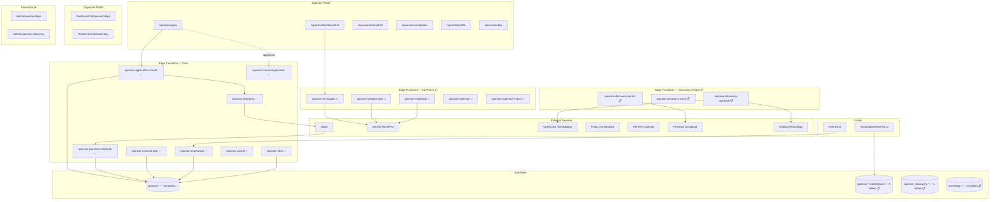
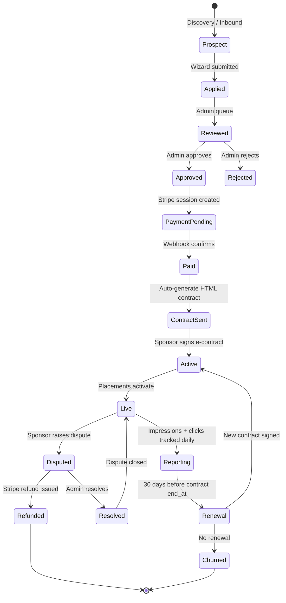
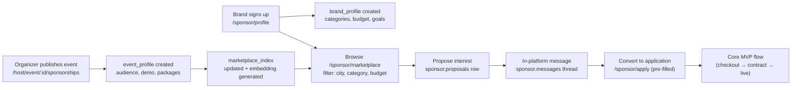
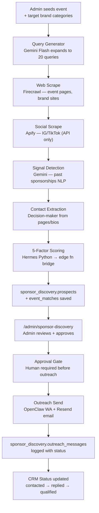
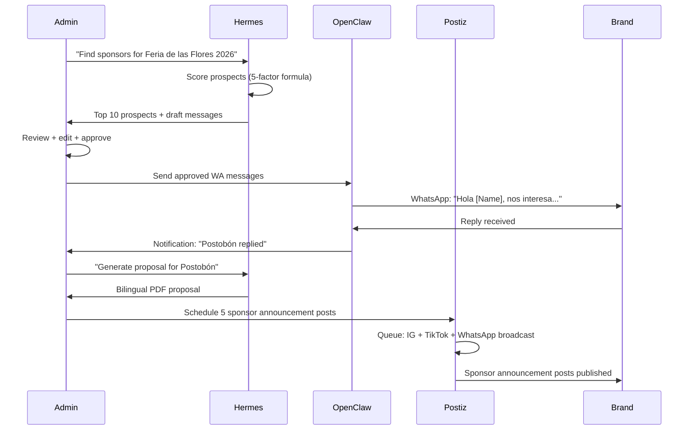
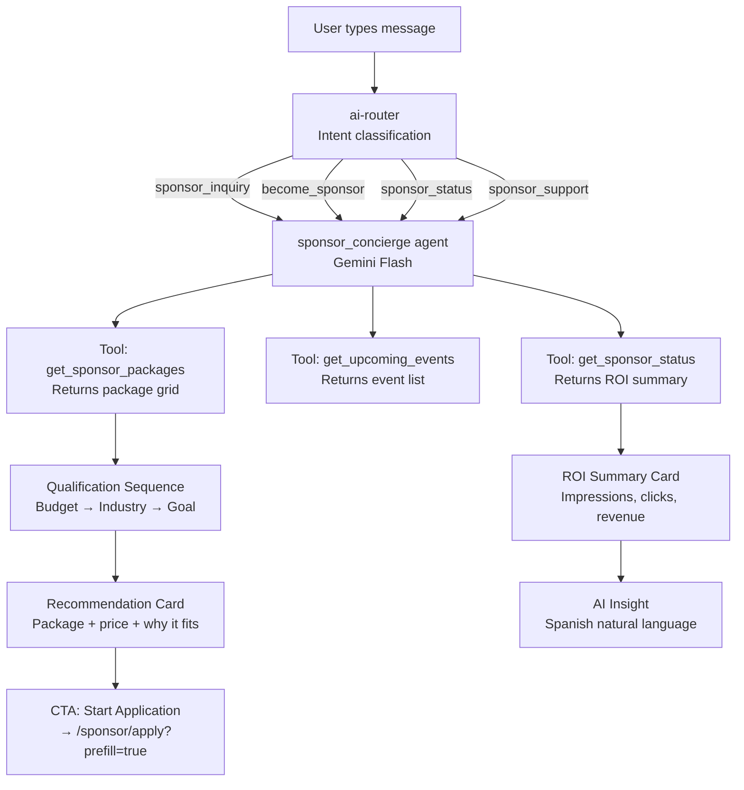
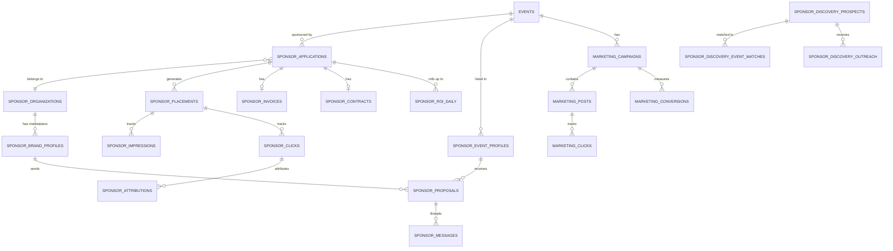
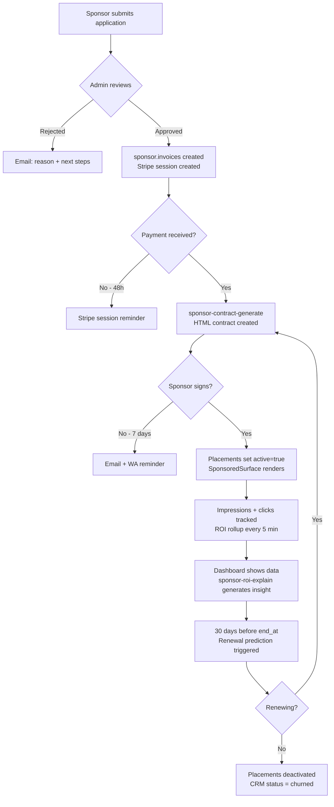

# mdeai Sponsorship System — Master Implementation Plan

> **Purpose:** Canonical forensic audit + phased build plan for the complete sponsorship system.
> Covers every task from schema to marketplace to AI agents to Paperclip governance.
> Supersedes contradictions between tasks 045–103.

---

## PART 1 — EXECUTIVE SUMMARY

The mdeai sponsorship system has a **fully working MVP core** (tasks 045–058): schema, apply wizard, admin approval, Stripe payment, contract signing, dispute flow, impression/click tracking, and daily ROI rollup are all deployed.

**Two critical MVP gaps remain unbuilt:**
1. `/sponsor/dashboard/:applicationId` — sponsors cannot see their ROI (Task 052 specced, not built)
2. AI edge functions — `sponsor-roi-explain`, `sponsor-creative-gen`, etc. (Task 054 specced, not built)

**Next 30 days** build those gaps, add the sponsor concierge chatbot, and open the marketplace.
**Next 90 days** wire OpenClaw discovery, Postiz campaigns, and Hermes scoring.
Paperclip governance is Phase 6 (10+ active sponsors, not needed yet).

**Revenue model:** 15% commission on all packages. No subscription. Brands only pay when they get value.
**Colombia advantage:** Zero dedicated sponsorship marketplace in LATAM. First mover wins.

---

## PART 2 — FORENSIC AUDIT

### 2.1 What Is Correct ✅

| Area | Status | Evidence |
|---|---|---|
| 10 sponsor.* tables | DONE | Migrations confirmed in supabase/migrations/ |
| 8 edge functions | DONE | All in supabase/functions/sponsor-* |
| Apply wizard (4 steps) | DONE | /sponsor/apply route + wizard components |
| Admin approval queue | DONE | /admin/sponsorships + detail + dispute routes |
| Stripe checkout + webhook | DONE | sponsor-checkout + sponsor-payment-webhook |
| SponsoredSurface component | DONE | src/components/sponsor/SponsoredSurface.tsx |
| Impression + click tracking | DONE | sponsor-impression + sponsor-click edge fns |
| Attribution trigger | DONE | sponsor.attribute_order() trigger on event_orders |
| ROI daily rollup cron | DONE | pg_cron every 5 min, sponsor.rollup_roi_daily() |
| Contracts (generate + sign) | DONE | HTML + PDF, bilingual, Stripe-compatible bucket |
| Dispute UI | DONE | /admin/sponsorships/:id/dispute |
| RLS on all tables | DONE | Service role writes; sponsors read own org |
| TypeScript types | DONE | src/types/sponsor.ts — complete |
| 15% commission model | CONFIRMED | Consistent across 100, 101, 102, 103 |
| Supabase Storage for assets | CONFIRMED | 102 corrected Cloudinary assumption |

### 2.2 What Is Wrong ❌

| Issue | Severity | File | Fix |
|---|---|---|---|
| `/sponsor/dashboard/:applicationId` route missing from App.tsx | CRITICAL | App.tsx:291–298 | Build Task 065 |
| sponsor-roi-explain, sponsor-creative-gen, sponsor-moderate, sponsor-audience-match NOT in functions/ | CRITICAL | supabase/functions/ | Build Task 066 |
| 4 sponsor intents not in ai-router/index.ts | HIGH | supabase/functions/ai-router/index.ts | Build Task 067 |
| marketing.* schema (Task 059) conflicts with campaign tables in Task 064 | HIGH | 059 vs 064 | Merge into unified marketing.* (see §6) |
| notes-sponsor-outreach.md still references Cloudinary | MEDIUM | notes file | Informational; 102 is authoritative |
| Task 059 (marketing schema) is in parent /prompts/ not /sponsor/ | LOW | File location | Rename is risky; update README pointer instead |

### 2.3 Contradictions ⚠️

| Contradiction | File A | File B | Resolution |
|---|---|---|---|
| LinkedIn scraping: "never" | 100 (Part 7) | notes-Sponsor Discovery Engine | Use API-based (PhantomBuster API), never browser automation |
| Asset management: Cloudinary | notes-sponsor-outreach | 102 | **Use Supabase Storage** (102 is authoritative) |
| V1 discovery: manual vs automated | 100 (Part 12) | notes-Sponsor Discovery Engine | Phase 1 = manual admin entry; Phase 4 = automated pipeline |
| Marketplace tables conflict with existing sponsor.* | 101 (first draft) | 102 | **102 is authoritative** — new tables use correct naming |
| n8n as orchestration layer | 061 | 062 (Paperclip orchestrates) | Use Supabase pg_cron for simple triggers; Paperclip only Phase 6 |
| Task 059 = marketing schema vs sponsor chat | README uses 059 for marketing | 100 (Part 14) calls it sponsor chat task | Keep 059 = marketing schema; use Task 067 for chat |

### 2.4 Duplicates to Consolidate

| Duplicate Content | Files | Action |
|---|---|---|
| SponsorFlo analysis | notes-sponsor-research + 103 | 103 is authoritative; notes file is reference backup |
| Activation types | 100 Part 9 + 061 + notes-activation-types | notes-activation-types is the reference; others cite it |
| Sponsor lifecycle diagram | 100 + notes-sponsor-research | 100 Part 3 is canonical |
| Platform comparison table | 101 + notes-sponsor-research + 102 | 102 is the corrected version |
| Scoring formula | 060 + 063 + notes-Sponsor-Discovery-Engine | 063 is most detailed (5 components with weights) |

### 2.5 Missing Dependencies

| Missing Item | Blocks | Solution |
|---|---|---|
| Stripe secrets not set | All payment flows | Set STRIPE_SECRET_KEY + STRIPE_SPONSOR_WEBHOOK_SECRET in Supabase dashboard |
| Sponsor dashboard route | Sponsor self-serve | Add route in App.tsx (Task 065) |
| pgvector setup for marketplace | Semantic sponsor search | Already enabled (used by ai-search); use for sponsor.marketplace_index |
| Paperclip server | Phase 6 governance | Do not build until 10+ active sponsors. Use pg_cron + approval_gates table instead |
| WhatsApp business number | OpenClaw outreach | Infobip configured; needs active +57 number |
| `marketing.*` schema | Campaign system | Build Task 059 migration before any campaign features |

### 2.6 Wrong Sequencing (Original Order)

Original task order had these misequences:

| Original | Problem | Correct Order |
|---|---|---|
| 052 (dashboard) after 053 (cron) | Dashboard needs cron data — cron should come first | 053 → 052 ✅ (actually correct — cron is done) |
| 054 AI fns listed as "Phase A" — no deployment plan | Spec says "Phase A" but no task for actual deployment | Build 054 as Task 066 with proper CI gate |
| 060–064 listed as "Design" without dependencies | 060 depends on sponsor_discovery schema not yet built | Add schema migration Task 074 before 060 logic |
| Marketplace (101) built before chat (Task 067) | Chat brings sponsors to marketplace | 067 (chat) → 065 (dashboard) → marketplace |

### 2.7 What to Delete / Merge / Rename

**Delete nothing** (per CLAUDE.md absolute rule).

**Merge strategy (logical consolidation only — no file deletion):**
- `notes-sponsor-research.md` → superseded by 101/102/103; keep as archive
- `notes-Sponsor Discovery Engine.md` → superseded by 063; keep as archive
- Task 059 (marketing) conflicts with 064 (campaigns) → merge schema in unified migration (see §6)
- Tasks 060–064 are "Design" status → promote to build tasks with proper task IDs (065–090)

**Rename plan (via new task files, not moving existing):**
See Part 3 — Corrected Task Register.

### 2.8 What to Build First (Priority Stack)

```
P0 — BLOCKER (Week 1):
  [065] Sponsor ROI Dashboard ← sponsors have no self-serve view
  [066] AI Edge Fns Phase A (roi-explain, creative-gen) ← no AI differentiation
  [067] Chat Integration — Sponsor Concierge ← discovery loop closed

P1 — HIGH (Week 2):
  [068] Schema.org Event markup ← 4.4x conversion, 2hr build
  [069] Sponsor Export (PDF/CSV reports) ← closes the ROI reporting loop
  [070] Marketing + Campaign schema migration ← unblocks Phase 3+

P2 — MEDIUM (Week 3-4):
  [071] Marketplace tables + embeddings
  [072] Brand profile UI
  [073] Event marketplace browse
  [074] Proposal + messaging system

P3 — LATER (Month 2-3):
  Discovery pipeline, OpenClaw, Postiz, Hermes

P4 — FUTURE (Month 3+):
  Paperclip, dynamic pricing, mockup generator, multi-year renewals
```

---

## PART 3 — CORRECTED TASK REGISTER

Tasks are listed in strict **dependency order**. Original numbers preserved for completed work.
New tasks start at 065.

### Phase 1 — MVP Core (ALL DONE ✅)

| Task | Title | Status | Depends On |
|---|---|---|---|
| 045 | Schema migration (10 tables + RLS) | ✅ Done | — |
| 046 | Apply wizard (4-step) | ✅ Done | 045 |
| 047 | Admin approval queue | ✅ Done | 045, 046 |
| 048 | Stripe checkout | ✅ Done | 047 |
| 053 | ROI rollup cron | ✅ Done | 045 |
| 055 | Contracts schema | ✅ Done | 045 |
| 056 | Contract generate edge fn | ✅ Done | 055 |
| 057 | Contract sign page | ✅ Done | 056 |
| 058 | Dispute UI + cancel edge fn | ✅ Done | 048, 057 |
| 049 | SponsoredSurface component | ✅ Done | 045, 047 |
| 050 | Impression + click edge fns | ✅ Done | 049 |
| 051 | Attribution trigger | ✅ Done | 050 |

### Phase 2 — Sponsor Self-Serve (NEXT 🔵)

| Task | Title | Status | Depends On |
|---|---|---|---|
| 065 | Sponsor ROI Dashboard | 🔵 Next | 045, 050, 051, 053 |
| 066 | AI Edge Fns Phase A (roi-explain, creative-gen, moderate) | 🔵 Next | 045, 065 |
| 067 | Chat Integration — Sponsor Concierge (ai-router + ai-chat) | 🔵 Next | 065 |
| 068 | Schema.org Event markup (2hr quick win) | 🔵 Next | — |
| 069 | Sponsor Report Export (PDF + CSV) | 📋 Design | 065, 066 |

### Phase 3 — Marketplace (Week 3-4)

| Task | Title | Status | Depends On |
|---|---|---|---|
| 070 | Marketing + Campaign schema migration (unified) | 📋 Design | 045 |
| 071 | Marketplace tables + vector embeddings migration | 📋 Design | 045, 070 |
| 072 | Brand profile UI (/sponsor/profile) | 📋 Design | 071 |
| 073 | Event marketplace listing (/marketplace/events/:id) | 📋 Design | 071 |
| 074 | Marketplace browse + search (/sponsor/marketplace) | 📋 Design | 071, 073 |
| 075 | Proposal + in-platform messaging system | 📋 Design | 071, 074 |

### Phase 4 — Discovery (Month 2)

| Task | Title | Status | Depends On |
|---|---|---|---|
| 076 | Discovery schema migration (sponsor_discovery.*) | 📋 Design | 045 |
| 077 | Discovery admin UI (/admin/sponsor-discovery) | 📋 Design | 076 |
| 078 | Enrichment edge fn (Fire Enrich + Firecrawl) | 📋 Design | 076 |
| 079 | Scoring edge fn (5-factor formula) | 📋 Design | 076, 078 |
| 080 | Outreach edge fn (Infobip WA + Resend email) | 📋 Design | 076, 079 |
| 081 | Contact extraction edge fn | 📋 Design | 076, 078 |

### Phase 5 — AI Automation + OpenClaw + Postiz + Hermes (Month 2-3)

| Task | Title | Status | Depends On |
|---|---|---|---|
| 082 | AI Proposal Generator edge fn (Gemini Pro, bilingual PDF) | 📋 Design | 065, 066 |
| 083 | AI Ideas Generator edge fn (Flash, activation ideas <30s) | 📋 Design | 066 |
| 084 | AI Contract Extract edge fn (Gemini Pro + urlContext) | 📋 Design | 055, 056 |
| 085 | AI Audience Match edge fn (Pro + googleSearch) | 📋 Design | 071 |
| 086 | Campaign planner AI edge fn | 📋 Design | 070 |
| 087 | Campaign content generator | 📋 Design | 086 |
| 088 | Postiz scheduling integration | 📋 Design | 086, 087 |
| 089 | OpenClaw outreach skill integration | 📋 Design | 080, 088 |
| 090 | Hermes scoring layer (Python CLI → edge fn bridge) | 📋 Design | 079, 089 |
| 091 | Renewal prediction edge fn + OpenClaw trigger | 📋 Design | 090 |

### Phase 6 — Advanced (Month 3+)

| Task | Title | Status | Depends On |
|---|---|---|---|
| 092 | Retention risk matrix admin view (2×2 quadrant) | 📋 Design | 065, 053 |
| 093 | AI Mockup Generator (Gemini Imagen 3) | 📋 Design | 082 |
| 094 | Dynamic pricing engine | 📋 Design | 065, 053 |
| 095 | Paperclip governance layer | 📋 Design | 090 (10+ active sponsors) |
| 096 | Performance-based pricing tier | 📋 Design | 094 |

---

## PART 4 — PHASED IMPLEMENTATION PLAN

### Phase 0 — Cleanup + Alignment

**Goal:** No contradictions, all secrets set, team aligned.

| Action | File/System | Owner |
|---|---|---|
| Set STRIPE_SECRET_KEY in Supabase dashboard | Supabase secrets | Manual |
| Set STRIPE_SPONSOR_WEBHOOK_SECRET | Supabase dashboard | Manual |
| Set FRONTEND_URL | Supabase dashboard | Manual |
| Confirm WhatsApp +57 number active in Infobip | Infobip dashboard | Manual |
| Confirm pgvector extension enabled | Supabase | Already enabled via ai-search |
| Archive duplicate notes files (keep, label as superseded) | notes-*.md headers | Claude |
| Update README.md with full task register | README.md | Claude |

**Acceptance:** `git grep "STRIPE_SECRET_KEY"` returns nothing in src/. Supabase shows 3 new secrets.

---

### Phase 1 — MVP Core [COMPLETE]

All 12 tasks done. Gate: sponsor can apply → admin approves → sponsor pays → signs contract → placement active → impressions tracked → daily ROI logged.

**Verified by:** Edge functions in supabase/functions/sponsor-*, migrations in supabase/migrations/, routes in App.tsx lines 291–298.

---

### Phase 2 — Sponsor Self-Serve

**Goal:** Sponsors can log in, see ROI, get AI insights, and interact with the chatbot.

#### Task 065 — Sponsor ROI Dashboard

| Aspect | Details |
|---|---|
| **Route** | `/sponsor/dashboard/:applicationId` |
| **Auth** | ProtectedRoute; user must own the organization |
| **Data** | sponsor.roi_daily + sponsor.applications + sponsor.placements |
| **Components** | `DashboardHeader`, `ROITiles`, `ImpressionsChart`, `AIInsightCard`, `PlacementList` |
| **Hook** | `useSponsorDashboard(applicationId)` |
| **Edge fn** | Read from `sponsor.roi_daily` (no new fn needed; data already rolled up) |
| **AI insight** | Calls `sponsor-roi-explain` (Task 066) for natural language summary |

**Wiring Plan:**

| Layer | File | Action |
|---|---|---|
| Route | `src/App.tsx` | Add `/sponsor/dashboard/:applicationId` under ProtectedRoute |
| Page | `src/pages/sponsor/Dashboard.tsx` | Create |
| Hook | `src/hooks/sponsor/useSponsorDashboard.ts` | Create |
| Component | `src/components/sponsor/dashboard/ROITiles.tsx` | Create |
| Component | `src/components/sponsor/dashboard/ImpressionsChart.tsx` | Create (Recharts) |
| Component | `src/components/sponsor/dashboard/AIInsightCard.tsx` | Create |
| Component | `src/components/sponsor/dashboard/PlacementList.tsx` | Create |

**4 ROI Tiles:**
1. Impressions (total) vs benchmark
2. Clicks (total) + CTR %
3. Attributed conversions (tickets, votes)
4. Attributed revenue (COP)

**Acceptance Criteria:**
- [ ] Route accessible at `/sponsor/dashboard/:applicationId`
- [ ] User without org ownership gets 403
- [ ] All 4 ROI tiles render with real data from `sponsor.roi_daily`
- [ ] ImpressionsChart shows 30-day trend (Recharts LineChart)
- [ ] AIInsightCard shows Gemini-generated Spanish insight
- [ ] PlacementList shows all active placements with status
- [ ] Empty state if no placements yet
- [ ] Mobile: single column, tiles stack vertically

---

#### Task 066 — AI Edge Functions Phase A

**Functions to build:**

| Function | Model | Endpoint | Purpose |
|---|---|---|---|
| `sponsor-roi-explain` | Flash | POST /sponsor-roi-explain | Generate Spanish ROI insight from daily data |
| `sponsor-creative-gen` | Flash | POST /sponsor-creative-gen | Generate caption + hashtags for sponsor post |
| `sponsor-moderate` | Flash | POST /sponsor-moderate | Moderate uploaded assets (logo, creative) |
| `sponsor-optimize` | Flash | POST /sponsor-optimize | Detect underperformers, recommend action |
| `sponsor-audience-match` | Pro | POST /sponsor-audience-match | Score brand-event audience alignment |

**`sponsor-roi-explain` input/output:**
```typescript
// Input
{ applicationId: string; dateRange: { from: string; to: string } }

// Output
{
  insight: string;        // Spanish natural language
  recommendation: string; // What sponsor should do next
  score: number;          // 0-100 performance score
  action: {
    type: 'upgrade_tier' | 'add_placement' | 'extend_contract' | 'no_action';
    payload: Record<string, unknown>;
  }
}
```

**Side effects:** Logs to `ai_runs` table (agent_name, tokens, duration_ms, status).

---

#### Task 067 — Chat Integration (Sponsor Concierge)

**Files to modify:**

| File | Change |
|---|---|
| `supabase/functions/ai-router/index.ts` | Add 4 sponsor intents |
| `supabase/functions/ai-chat/index.ts` | Add `sponsor_concierge` agent handler |
| `supabase/functions/ai-chat/index.ts` | Add 3 Supabase tools: get_sponsor_packages, get_upcoming_events, get_sponsor_status |

**4 New Intents (add to ai-router):**
```typescript
{ patterns: [/\b(sponsor|patrocin|patrocinador|brand partner)\b/i],
  intent: 'sponsor_inquiry', confidence: 0.88 },
{ patterns: [/\b(become.*sponsor|quiero.*patrocinar|paquetes.*patrocinio)\b/i],
  intent: 'become_sponsor', confidence: 0.92 },
{ patterns: [/\b(my.*sponsor|mi.*patrocinio|ver.*roi|dashboard)\b/i],
  intent: 'sponsor_status', confidence: 0.90 },
{ patterns: [/\b(contrato|contract|pago|payment|disputa|dispute)\b/i],
  intent: 'sponsor_support', confidence: 0.87 },
```

**Sponsor Concierge Qualification Sequence:**
```
Q1: "¿Cuál es el presupuesto aproximado para patrocinio?" ($500–$1000 / $1000–$5000 / $5000+)
Q2: "¿En qué industria opera su marca?" (select from categories)
Q3: "¿Cuál es su objetivo principal?" (brand awareness / lead generation / sales / community)
→ Recommendation: Package name + price + why it fits
→ CTA: "¿Le gustaría iniciar la aplicación?" → link to /sponsor/apply
```

**3 Supabase Tools:**
```typescript
get_sponsor_packages(eventId?: string): SponsorPackage[]
get_upcoming_events(city?: string, category?: string): Event[]
get_sponsor_status(applicationId: string): SponsorApplication & ROISummary
```

---

#### Task 068 — Schema.org Event Markup (2-Hour Quick Win)

**Based on:** ShowCare research — 4.4x conversion rate vs plain search traffic.

**Files to modify:**

| File | Change |
|---|---|
| `src/pages/EventDetail.tsx` | Add `<script type="application/ld+json">` with Event schema |
| `src/pages/sponsor/marketplace/EventProfile.tsx` (new) | Include Event schema |

**Schema.org Event markup:**
```json
{
  "@context": "https://schema.org",
  "@type": "Event",
  "name": "{{event.title}}",
  "startDate": "{{event.starts_at}}",
  "endDate": "{{event.ends_at}}",
  "location": { "@type": "Place", "name": "{{event.venue}}", "address": "{{event.city}}" },
  "image": "{{event.banner_url}}",
  "description": "{{event.description}}",
  "organizer": { "@type": "Organization", "name": "mdeai.co" },
  "offers": { "@type": "Offer", "price": "{{ticket.price_cop}}", "priceCurrency": "COP" }
}
```

---

### Phase 3 — Marketplace

**Goal:** Brands browse events and propose sponsorships. Events list openly for discovery.

#### Task 070 — Unified Marketing + Campaign Schema Migration

**Note:** Task 059 (marketing schema) conflicts with Task 064 (campaign tables). Merge into one migration.

**Tables (marketing schema — 13 tables):**
See database plan §6 for full column definitions.

Key additions beyond Task 059:
- `marketing.campaigns` — add `application_id` FK to link to sponsor
- `marketing.posts` — add `postiz_post_id`, `utm_content` for attribution
- `marketing.influencers` — vector(768) for semantic matching

#### Task 071 — Marketplace Tables + Vector Embeddings

**5 new sponsor.* tables:**
```sql
sponsor.event_profiles       -- organizer's marketplace listing
sponsor.brand_profiles       -- brand's marketplace presence
sponsor.messages             -- in-platform messaging thread
sponsor.proposals            -- brand → organizer interest (pre-application)
sponsor.marketplace_index    -- denormalized search + pgvector
```

See database plan §6 for full schemas.

#### Tasks 072-075 — Marketplace UI + Proposal System

| Task | Route | Key Components |
|---|---|---|
| 072 | `/sponsor/profile` | Brand profile editor, categories, budget range, past events |
| 073 | `/marketplace/events/:id` | Event stats, audience demo, package grid, proposal CTA |
| 074 | `/sponsor/marketplace` | Browse events, filter by city/category/budget, search |
| 075 | `/sponsor/inbox` | Message threads, proposal status, accept/decline |

---

### Phase 4 — Discovery

**Goal:** Admin can find and qualify new sponsor prospects without manual Google searching.

#### Task 076 — Discovery Schema

**2 new schemas:** `sponsor_discovery.*` (4 tables)
- `prospects` — company profile, scoring, CRM status
- `event_matches` — ranked prospects per event
- `outreach_messages` — multi-channel log
- `enrichment_jobs` — async enrichment queue

See database plan §6.

#### Tasks 077-081 — Discovery Pipeline

| Task | Function | Purpose |
|---|---|---|
| 077 | Discovery admin UI | `/admin/sponsor-discovery` — prospect list, filters, enrich button |
| 078 | `sponsor-discovery-enrich` | Firecrawl + Fire Enrich → prospect data |
| 079 | `sponsor-discovery-score` | 5-factor formula → sponsor_fit_score |
| 080 | `sponsor-discovery-outreach` | Generate + send WA/email via Infobip/Resend |
| 081 | `sponsor-discovery-extract` | Contact identification from scraped pages |

---

### Phase 5 — AI Automation

**Goal:** Gemini writes proposals, captions, and outreach. OpenClaw sends. Postiz schedules.

#### Tasks 082-091 — AI + Automation

| Task | Function | Model | Bilingual |
|---|---|---|---|
| 082 | `sponsor-proposal-gen` | Pro | Yes (ES + EN) |
| 083 | `sponsor-ideas-gen` | Flash | Yes |
| 084 | `sponsor-contract-extract` | Pro + urlContext | Yes |
| 085 | `sponsor-audience-match` | Pro + googleSearch | — |
| 086 | `sponsor-campaign-plan` | Pro | Yes |
| 087 | `sponsor-content-gen` | Flash | Yes |
| 088 | Postiz scheduling integration | — | — |
| 089 | OpenClaw WA outreach | — | — |
| 090 | Hermes scoring bridge | — | — |
| 091 | Renewal prediction + trigger | Flash | Yes |

**Hermes role (Python CLI):** Receives prospect data via HTTP from edge fn, runs 5-factor scoring formula, returns score + recommendation JSON. Does NOT orchestrate — edge fns call it.

**OpenClaw role (messaging only):** Executes approved sends via WhatsApp/email/Instagram DM. Does NOT scrape. All messages require human approval gate before sending.

**Postiz role:** Schedules approved social posts. Human-approved draft only — never auto-publishes.

---

### Phase 6 — Advanced

**Goal:** Self-service renewals, dynamic pricing, governance.

| Task | Feature | Trigger |
|---|---|---|
| 092 | Retention risk matrix | Admin dashboard, 2×2 quadrant view |
| 093 | AI Mockup Generator | Gemini Imagen 3, brand + event context |
| 094 | Dynamic pricing engine | Demand-based package pricing |
| 095 | Paperclip governance | Issue tracking, approval gates, audit log |
| 096 | Performance pricing tier | CPM/CPA-based billing option |

**Paperclip gate:** Do NOT build until 10+ active paid sponsors exist. Before that, pg_cron + `sponsor.approval_gates` table handles all governance needs.

---

## PART 5 — ARCHITECTURE DIAGRAMS

### A. Full Sponsorship Architecture



### B. Sponsor Lifecycle Flow



### C. Marketplace Matching Flow



### D. Sponsor Discovery Engine



### E. OpenClaw + Postiz Workflow



### F. Chatbot Sponsorship Flow



### G. Supabase Data Model (ERD Summary)



### H. Payment + Contract Activation Gates



---

## PART 6 — DATABASE PLAN

### Existing Tables (Phase 1 — DONE ✅)

All 10 tables in `sponsor` schema are deployed with correct RLS.

| Table | Purpose | Key Columns | RLS Rule |
|---|---|---|---|
| `sponsor.organizations` | Brand entity | nit, legal_name, primary_contact_user_id | Users see own org |
| `sponsor.applications` | Application per org/event | org_id, event_id, tier, activation_type, status | Org users see own |
| `sponsor.assets` | Logo, creative, copy | application_id, asset_type, url, ai_approved | Org users see own |
| `sponsor.placements` | Active ad surfaces | application_id, surface, active, starts_at, ends_at | Org users see own |
| `sponsor.impressions` | Ad renders | placement_id, viewer_user_id, anon_id, rendered_at | Service role writes |
| `sponsor.clicks` | Ad clicks | placement_id, redirect_url, clicked_at | Service role writes |
| `sponsor.attributions` | Last-click conversions | click_id, event_order_id, revenue_cop | Service role writes |
| `sponsor.roi_daily` | Daily rollup | application_id, date, impressions, clicks, conversions, revenue_cop | Org users see own |
| `sponsor.invoices` | Stripe payment | application_id, stripe_session_id, status, amount_usd | Org users see own |
| `sponsor.contracts` | E-signature | application_id, html_url, signed_at, signer_ip | Org users see own |

### New Tables — Phase 3 Marketplace

```sql
-- sponsor.event_profiles
-- Organizer creates marketplace listing for their event
CREATE TABLE sponsor.event_profiles (
  id              uuid PRIMARY KEY DEFAULT gen_random_uuid(),
  event_id        uuid NOT NULL REFERENCES public.events(id) ON DELETE CASCADE,
  organizer_id    uuid NOT NULL REFERENCES auth.users(id),
  tagline         text NOT NULL,
  audience_size   int,
  demographics    jsonb,           -- { age_range, gender_split, city_dist }
  past_sponsors   text[],          -- brand names (display only)
  min_package_usd int NOT NULL DEFAULT 500,
  max_package_usd int,
  is_published    bool NOT NULL DEFAULT false,
  published_at    timestamptz,
  created_at      timestamptz DEFAULT now()
);
-- RLS: organizer_id = auth.uid() for writes; is_published = true for public reads
-- Indexes: (event_id), (organizer_id), (is_published, published_at)

-- sponsor.brand_profiles
-- Brand creates marketplace presence
CREATE TABLE sponsor.brand_profiles (
  id               uuid PRIMARY KEY DEFAULT gen_random_uuid(),
  organization_id  uuid NOT NULL REFERENCES sponsor.organizations(id) ON DELETE CASCADE,
  tagline          text,
  categories       text[],         -- ['food_beverage', 'beauty', 'fintech']
  min_deal_usd     int DEFAULT 500,
  max_deal_usd     int,
  past_events      text[],         -- event names (display)
  is_published     bool NOT NULL DEFAULT false,
  created_at       timestamptz DEFAULT now()
);
-- RLS: org users see own; is_published for public reads

-- sponsor.messages
-- Thread-based messaging between brand and organizer
CREATE TABLE sponsor.messages (
  id               uuid PRIMARY KEY DEFAULT gen_random_uuid(),
  thread_id        uuid NOT NULL,
  event_profile_id uuid NOT NULL REFERENCES sponsor.event_profiles(id),
  sender_id        uuid NOT NULL REFERENCES auth.users(id),
  receiver_id      uuid NOT NULL REFERENCES auth.users(id),
  body             text NOT NULL,
  is_read          bool NOT NULL DEFAULT false,
  created_at       timestamptz DEFAULT now()
);
-- RLS: sender_id = auth.uid() OR receiver_id = auth.uid()
-- Indexes: (thread_id, created_at), (receiver_id, is_read)

-- sponsor.proposals
-- Brand proposes interest before formal application
CREATE TABLE sponsor.proposals (
  id                      uuid PRIMARY KEY DEFAULT gen_random_uuid(),
  event_profile_id        uuid NOT NULL REFERENCES sponsor.event_profiles(id),
  organization_id         uuid NOT NULL REFERENCES sponsor.organizations(id),
  proposed_tier           text,
  proposed_amount_usd     int,
  message                 text,
  status                  text NOT NULL DEFAULT 'pending'
                          CHECK (status IN ('pending','accepted','declined','converted')),
  converted_application_id uuid REFERENCES sponsor.applications(id),
  created_at              timestamptz DEFAULT now()
);
-- RLS: org users see own proposals; event organizer sees proposals on their events
-- Unique: (event_profile_id, organization_id) -- one proposal per pair

-- sponsor.marketplace_index
-- Denormalized for fast search + pgvector similarity
CREATE TABLE sponsor.marketplace_index (
  event_profile_id uuid PRIMARY KEY REFERENCES sponsor.event_profiles(id),
  city             text,
  country          text DEFAULT 'CO',
  category         text,
  audience_min     int,
  audience_max     int,
  package_min_usd  int,
  package_max_usd  int,
  next_event_date  date,
  search_vector    tsvector,
  embedding        vector(1536),   -- pgvector; updated by edge fn on publish
  updated_at       timestamptz DEFAULT now()
);
-- Indexes: GIN(search_vector), ivfflat(embedding), (city, category), (next_event_date)
-- Trigger: update search_vector on event_profiles.tagline + events.title change
```

### New Tables — Phase 4 Discovery

```sql
-- sponsor_discovery.prospects
CREATE TABLE sponsor_discovery.prospects (
  id               uuid PRIMARY KEY DEFAULT gen_random_uuid(),
  company_name     text NOT NULL,
  website_url      text,
  industry         text,
  city             text,
  country          text DEFAULT 'CO',
  employee_range   text,
  annual_rev_usd   int,
  sponsor_fit_score int,           -- 0-100, from scoring fn
  sponsorship_history jsonb,       -- past events (scraped)
  source           text,           -- 'manual' | 'firecrawl' | 'apify' | 'clay'
  crm_status       text DEFAULT 'prospect'
                   CHECK (crm_status IN ('prospect','contacted','replied','qualified','applied','rejected')),
  enrichment_state text DEFAULT 'raw'
                   CHECK (enrichment_state IN ('raw','enriching','enriched','failed')),
  colombia_law_compliant bool DEFAULT true,
  created_at       timestamptz DEFAULT now(),
  updated_at       timestamptz DEFAULT now()
);
-- RLS: admin-only (role check)
-- Indexes: (crm_status), (sponsor_fit_score DESC), (city, industry)

-- sponsor_discovery.event_matches
CREATE TABLE sponsor_discovery.event_matches (
  id           uuid PRIMARY KEY DEFAULT gen_random_uuid(),
  prospect_id  uuid NOT NULL REFERENCES sponsor_discovery.prospects(id),
  event_id     uuid NOT NULL REFERENCES public.events(id),
  match_score  int NOT NULL,       -- 0-100
  score_breakdown jsonb,           -- { audience, industry, local, history, budget }
  recommended_tier text,
  created_at   timestamptz DEFAULT now(),
  UNIQUE (prospect_id, event_id)
);

-- sponsor_discovery.outreach_messages
CREATE TABLE sponsor_discovery.outreach_messages (
  id           uuid PRIMARY KEY DEFAULT gen_random_uuid(),
  prospect_id  uuid NOT NULL REFERENCES sponsor_discovery.prospects(id),
  channel      text CHECK (channel IN ('whatsapp','email','instagram_dm')),
  message_body text NOT NULL,
  status       text DEFAULT 'pending'
               CHECK (status IN ('pending','approved','sent','delivered','read','replied','failed','opted_out')),
  sent_at      timestamptz,
  contact_hash text,               -- SHA-256 of phone/email
  openclaw_job_id text,
  created_at   timestamptz DEFAULT now()
);

-- sponsor_discovery.enrichment_jobs
CREATE TABLE sponsor_discovery.enrichment_jobs (
  id           uuid PRIMARY KEY DEFAULT gen_random_uuid(),
  prospect_id  uuid NOT NULL REFERENCES sponsor_discovery.prospects(id),
  job_type     text CHECK (job_type IN ('firecrawl','fire_enrich','apify','clay','manual')),
  status       text DEFAULT 'queued'
               CHECK (status IN ('queued','running','done','failed')),
  result_json  jsonb,
  cost_usd     numeric(8,4),
  started_at   timestamptz,
  finished_at  timestamptz,
  created_at   timestamptz DEFAULT now()
);
```

### New Tables — Phase 5 Marketing / Campaigns (unified from Task 059 + 064)

```sql
-- Unified marketing schema (merges Task 059 and Task 064)
-- 13 tables total; key additions from 064:
-- campaigns.application_id — links to sponsor
-- posts.postiz_post_id + utm_content — per-post attribution
-- influencers.embedding vector(768) — semantic matching

-- Key: campaigns and campaign_posts are renamed from 064's
-- "campaigns" and "campaign_posts" to avoid confusion with marketing.campaigns
-- Final names: marketing.campaigns + marketing.posts (as in Task 059)
-- application_id added as nullable FK for sponsor-funded campaigns
```

### Migration Order

```
1.  20260504_045_sponsor_schema.sql          ✅ Done
2.  20260504_055_sponsor_contracts.sql       ✅ Done  
3.  20260504_XXX_marketing_schema.sql        📋 Task 070
4.  20260505_XXX_marketplace_tables.sql      📋 Task 071
5.  20260505_XXX_marketplace_embeddings.sql  📋 Task 071 (pgvector setup)
6.  20260506_XXX_discovery_schema.sql        📋 Task 076
```

---

## PART 7 — BACKEND / EDGE FUNCTIONS

### Existing Functions (DONE ✅)

| Function | Auth | Idempotency |
|---|---|---|
| `sponsor-application-create` | Optional (auth at step 4) | application_id key |
| `sponsor-checkout` | Required | Stripe idempotency key |
| `sponsor-payment-webhook` | Stripe signature | stripe_event_id |
| `sponsor-impression` | None (public beacon) | None needed |
| `sponsor-click` | None (public beacon) | None needed |
| `sponsor-contract-generate` | Service role | application_id |
| `sponsor-contract-sign` | Required (ownership) | contract_id |
| `sponsor-cancel` | Required (ownership or admin) | application_id |

### New Functions — Phase 2 (Task 066)

| Function | Endpoint | Auth | Model | Input | Output |
|---|---|---|---|---|---|
| `sponsor-roi-explain` | POST | Required | Flash | `{applicationId, dateRange}` | `{insight, recommendation, score, action}` |
| `sponsor-creative-gen` | POST | Required | Flash | `{applicationId, channel, tone}` | `{caption_es, caption_en, hashtags[], image_prompt}` |
| `sponsor-moderate` | POST | Service role | Flash | `{asset_url, asset_type}` | `{approved, reason, flagged_categories}` |
| `sponsor-optimize` | POST | Required | Flash | `{applicationId}` | `{underperformers[], recommendations[]}` |
| `sponsor-audience-match` | POST | Admin | Pro | `{brandId, eventId}` | `{score, breakdown, reasoning}` |

**Failure modes for all AI fns:**
- Gemini timeout (>30s): return cached last result or `{insight: null, error: 'AI_TIMEOUT'}`
- Rate limit: return 429 with `Retry-After: 60`
- Invalid applicationId: return 403 (do not reveal existence)

### New Functions — Phase 4 Discovery

| Function | Auth | External Call | Side Effect |
|---|---|---|---|
| `sponsor-discovery-enrich` | Admin | Firecrawl API | Creates enrichment_jobs row |
| `sponsor-discovery-score` | Admin | Hermes bridge | Updates prospects.sponsor_fit_score |
| `sponsor-discovery-outreach` | Admin | Infobip/Resend | Creates outreach_messages row (status=pending) |
| `sponsor-discovery-send` | Admin (gate required) | OpenClaw | Updates outreach_messages.status = sent |
| `sponsor-discovery-matches` | Admin | — | Returns ranked event_matches for event |

**Approval gate pattern:**
```typescript
// In sponsor-discovery-send:
const gate = await supabase.from('sponsor.approval_gates')
  .select('approved_by').eq('resource_id', outreachId).single();
if (!gate.data?.approved_by) return errorResponse(403, 'GATE_REQUIRED', 'Admin approval needed');
```

---

## PART 8 — FRONTEND / UI SCREENS

### Existing Screens (DONE ✅)

| Route | Purpose | Status |
|---|---|---|
| `/sponsor/apply` | 4-step wizard | ✅ Done |
| `/sponsor/contract/:contractId` | E-signing | ✅ Done |
| `/admin/sponsorships` | Application queue | ✅ Done |
| `/admin/sponsorships/:id` | Detail + approve | ✅ Done |
| `/admin/sponsorships/:id/dispute` | Dispute resolution | ✅ Done |

### New Screens — Phase 2

#### `/sponsor/dashboard/:applicationId`

| Aspect | Details |
|---|---|
| **Auth** | ProtectedRoute; ownership check |
| **Components** | `DashboardHeader`, `ROITiles×4`, `ImpressionsChart`, `AIInsightCard`, `PlacementList`, `CampaignPreview` |
| **Data** | `sponsor.roi_daily` + `sponsor.placements` + `sponsor.applications` |
| **Actions** | "Generate Report" → PDF export, "Get AI Insight" → roi-explain, "View Contract" → link |
| **Empty** | "Your dashboard activates once your first placement goes live" |
| **Error** | "Unable to load ROI data — please try again" + retry |
| **Mobile** | Tiles stack 2×2, chart scrolls horizontally |

**Suggested improvements:**
- Add "Share ROI Report" button (public link with token)
- Add competitor benchmark (anonymous CTR comparison)
- Add "Renew" CTA when within 30 days of end_at

#### `/host/event/:id/sponsorships`

| Aspect | Details |
|---|---|
| **Auth** | Organizer only |
| **Components** | `SponsorshipPackageGrid`, `ApplicationList`, `RevenueProjection` |
| **Actions** | Create package, set pricing, publish to marketplace |

#### `/host/event/:id/marketing`

| Aspect | Details |
|---|---|
| **Auth** | Organizer only |
| **Components** | `CampaignPlanner`, `PostCalendar`, `InfluencerList`, `UTMTracker` |
| **Actions** | "Plan Campaign" → AI planner, "Schedule Posts" → Postiz |

### New Screens — Phase 3 Marketplace

| Route | Purpose | Key Components |
|---|---|---|
| `/sponsor/profile` | Brand profile editor | CategorySelect, BudgetRange, PastEventsList |
| `/marketplace/events` | Browse events | EventCard grid, FiltersPanel (city/category/budget/date) |
| `/marketplace/events/:id` | Event detail + proposals | EventStats, AudienceDemographics, PackageGrid, ProposeCTA |
| `/sponsor/marketplace` | Brand-side browse | Same as above but with proposal status tracking |
| `/sponsor/inbox` | Messages + proposals | ThreadList, MessageThread, ProposalActions |

### New Screens — Phase 4 Admin Discovery

| Route | Purpose | Key Components |
|---|---|---|
| `/admin/sponsor-discovery` | Prospect list | ProspectTable, FilterBar, ScoreBar, EnrichButton |
| `/admin/sponsor-discovery/:id` | Prospect detail | ProspectCard, ContactList, EventMatches, OutreachHistory |

### Chatbot Sponsor Cards

**Sponsor Recommendation Card:**
```tsx
<SponsorPackageCard
  tier="Gold"
  price="$2,500 USD"
  event="Feria de las Flores 2026"
  activations={['stage_branding', 'social_posts', 'qr_station']}
  onApply={() => navigate('/sponsor/apply?tier=gold&event=...')}
  onLearnMore={() => navigate('/marketplace/events/...')}
/>
```

**ROI Summary Card (for existing sponsors):**
```tsx
<SponsorROICard
  impressions={12400}
  clicks={340}
  ctr="2.74%"
  attributed_revenue_cop="4,200,000"
  insight="Tu CTR supera el benchmark del sector en 1.2×"
  onViewDashboard={() => navigate('/sponsor/dashboard/:id')}
/>
```

---

## PART 9 — AI AGENTS PLAN

### Agent Roster

| Agent | Phase | Model | Trigger | Guardrails |
|---|---|---|---|---|
| Sponsor Concierge | 2 | Flash | Chat intent (4 patterns) | No auto-apply; always CTA |
| ROI Analyst | 2 | Flash | Daily cron + dashboard load | Read-only; logs to ai_runs |
| Creative Generator | 2 | Flash | Sponsor request in dashboard | Human reviews before publish |
| Content Moderator | 2 | Flash | Asset upload webhook | Auto-approve only SAFE; flag for review |
| Audience Matcher | 3 | Pro | Admin trigger | Admin reviews match score |
| Proposal Generator | 5 | Pro | Admin/sponsor trigger | Human approves PDF before send |
| Ideas Generator | 5 | Flash | Dashboard CTA | Shows ideas; user selects |
| Campaign Planner | 5 | Pro | Organizer trigger | Human approves plan before scheduling |
| Content Generator | 5 | Flash | Campaign plan trigger | Human approves posts before Postiz |
| Outreach Agent | 5 | Flash | Admin approval gate | Gate required; no auto-send |
| Discovery Scorer | 4 | Flash (Hermes bridge) | Enrichment complete | Score only; no outreach without gate |
| Renewal Agent | 6 | Flash | pg_cron 30d before end_at | Proposes; human confirms |

### Tool Access Per Agent

**Sponsor Concierge tools:**
```typescript
tools: [
  { name: 'get_sponsor_packages', description: 'Get available sponsor packages for an event' },
  { name: 'get_upcoming_events', description: 'Get upcoming events by city or category' },
  { name: 'get_sponsor_status', description: 'Get ROI summary for existing sponsor' },
]
```

**Proposal Generator tools:**
```typescript
tools: [
  { name: 'get_event_profile', description: 'Get event audience and demographics' },
  { name: 'get_brand_profile', description: 'Get brand categories and goals' },
  { name: 'get_roi_benchmarks', description: 'Get industry CTR/impression benchmarks' },
  { name: 'generate_pdf', description: 'Render HTML proposal as PDF via storage' },
]
```

### Hermes Clarification

**Hermes is a Python CLI, not an edge function.** It runs as a local process (or Docker container) and exposes an HTTP endpoint. mdeai edge functions call it via `fetch('http://hermes:8080/score', ...)`.

**Hermes 5-factor scoring input:**
```json
{
  "prospect": { "industry": "food_beverage", "city": "Medellin", "annual_rev_usd": 2000000 },
  "event": { "category": "beauty_contest", "audience_size": 5000, "demographics": {...} },
  "history": { "past_sponsor_count": 3, "avg_package_usd": 1500 }
}
```

**Hermes output:**
```json
{
  "score": 78,
  "breakdown": {
    "audience_match": 0.82,
    "industry_relevance": 0.75,
    "local_presence": 0.90,
    "sponsorship_history": 0.60,
    "budget_fit": 0.70
  },
  "tier_recommendation": "silver",
  "reasoning": "Alta presencia local y alineación demográfica. Historial limitado pero budget adecuado."
}
```

---

## PART 10 — WORKFLOWS

### Workflow 1 — Sponsor Applies Manually

```
1. Brand visits /sponsor/apply
2. Step 1: Company info → POST sponsor-application-create (step=1, returns application_id)
3. Step 2: Package selection → POST sponsor-application-create (step=2)
4. Step 3: Asset upload → Supabase Storage, POST sponsor-application-create (step=3)
5. Step 4: Auth gate + review → POST sponsor-application-create (step=4, auth required)
   → DB: sponsor.applications.status = 'submitted'
   → DB: sponsor.assets rows created
   → DB: sponsor-moderate called on each asset (background)
```

### Workflow 2 — Organizer Creates Sponsor Packages

```
1. Organizer visits /host/event/:id/sponsorships
2. Selects "Create Package" → fills tier, price, activations, benefits
   → DB: INSERT sponsor.event_profiles (event_profile_id generated)
   → DB: INSERT sponsor.marketplace_index (embedding generated via AI)
3. Publishes → event_profiles.is_published = true
4. Event appears in /marketplace/events
```

### Workflow 3 — Sponsor Pays + Signs Contract

```
1. Admin approves application (PUT approve_sponsor_application RPC)
   → DB: sponsor.applications.status = 'approved'
   → DB: sponsor.placements rows created (active=false)
2. System calls sponsor-contract-generate
   → DB: sponsor.contracts row created (html_url = Supabase Storage)
3. Sponsor visits /sponsor/contract/:contractId
4. Sponsor reviews + clicks "I agree"
   → POST sponsor-contract-sign
   → DB: contracts.signed_at = now(), signer_ip = request IP
   → DB: placements.active = true
5. SponsoredSurface renders on event pages
```

### Workflow 4 — Impression + Click + Attribution

```
1. Event page loads → <SponsoredSurface placement_id="..." />
2. Component fires POST /sponsor-impression (no auth, no blocking)
   → DB: sponsor.impressions INSERT (placement_id, viewer_user_id or anon_id)
3. Viewer clicks sponsor ad
   → GET /sponsor-click?placement_id=...&redirect=...
   → DB: sponsor.clicks INSERT
   → Response: 302 redirect to sponsor URL
4. User buys ticket (event_orders INSERT)
   → Trigger: sponsor.attribute_order() fires
   → Looks for click within 24h window matching buyer_id or anon_id
   → If found: INSERT sponsor.attributions (click_id, order_id, revenue_cop)
5. pg_cron every 5 min: sponsor.rollup_roi_daily() aggregates into roi_daily
```

### Workflow 5 — Sponsor Dashboard Reporting

```
1. Sponsor logs in → navigates to /sponsor/dashboard/:applicationId
2. useSponsorDashboard hook:
   → SELECT sponsor.roi_daily WHERE application_id = X AND date >= NOW()-30d
   → SELECT sponsor.placements WHERE application_id = X
   → SELECT sponsor.applications WHERE id = X
3. Dashboard renders: 4 tiles + chart + placement list
4. Sponsor clicks "Get AI Insight"
   → POST /sponsor-roi-explain (applicationId, lastMonth)
   → Gemini Flash generates Spanish insight
   → AIInsightCard shows recommendation
5. Sponsor clicks "Export Report"
   → Client-side: csv() or html2pdf() from roi_daily data
```

### Workflow 6 — AI Finds Sponsors for Event

```
1. Admin visits /admin/sponsor-discovery
2. Seeds event + target categories → POST /sponsor-discovery-search
   → Gemini expands to 20 search queries
3. Admin triggers enrichment → POST /sponsor-discovery-enrich
   → Creates enrichment_jobs rows
   → Background: Firecrawl scrapes each prospect's website
   → Updates: prospects.enrichment_state = 'enriched'
4. Admin triggers scoring → POST /sponsor-discovery-score
   → Calls Hermes bridge
   → Updates: prospects.sponsor_fit_score
   → Creates: event_matches rows
5. Admin reviews top matches in /admin/sponsor-discovery
6. Admin approves outreach → creates sponsor.approval_gates row
7. Admin triggers send → POST /sponsor-discovery-send
   → Checks approval_gates (403 if missing)
   → Calls Infobip WA API or Resend email
   → Updates: outreach_messages.status = 'sent'
```

### Workflow 7 — OpenClaw Sends Approved Outreach

```
1. Admin drafts WA message in /admin/sponsor-discovery/:id
2. Hermes generates personalized message (Spanish)
3. Admin reviews → clicks "Approve + Send"
   → INSERT sponsor.approval_gates (resource_id, approved_by, type='outreach')
   → POST /sponsor-discovery-send
   → Edge fn verifies gate exists
   → Calls OpenClaw skill: whatsapp.sendMessage({ to: contactHash, body: message })
   → UPDATE outreach_messages.status = 'sent'
4. OpenClaw webhook fires on delivery/read/reply
   → UPDATE outreach_messages.status = 'delivered' | 'read' | 'replied'
```

### Workflow 8 — Postiz Schedules Approved Sponsor Campaign

```
1. Organizer triggers campaign plan → POST /sponsor-campaign-plan
   → Gemini Pro generates 5-phase calendar (JSON)
2. Organizer reviews + edits in /host/event/:id/marketing
3. Organizer approves → Content generation triggered
   → POST /sponsor-content-gen (one per post in calendar)
   → Gemini Flash generates caption_es, hashtags, image_prompt
4. Organizer reviews each post → approves individual posts
5. Approved posts → POST /postiz-schedule
   → Calls Postiz API: posts.create({ content, scheduleDate, platforms })
   → Updates: marketing.posts.postiz_post_id = returned ID
6. Postiz publishes at scheduled time
7. UTM clicks tracked → marketing.clicks
8. Conversions attributed → marketing.conversions
```

### Workflow 9 — Chatbot Creates Sponsorship Plan

```
1. Organizer types "Help me find sponsors for Reina de Antioquia 2026"
2. ai-router → intent: 'sponsor_inquiry'
3. sponsor_concierge agent activates
4. Tool call: get_upcoming_events(city="Medellin") → returns event list
5. Concierge asks qualification questions (budget, industry, goals)
6. Tool call: get_sponsor_packages(eventId=X) → returns packages
7. Concierge recommends 3 packages with rationale
8. Renders SponsorRecommendationCard with CTA
9. Organizer clicks → /sponsor/apply?prefill=true&event=X&tier=gold
```

### Workflow 10 — Renewal and Upsell

```
1. pg_cron: every day, check for contracts ending in 30 days
   → Selects from sponsor.contracts WHERE end_at BETWEEN now() AND now()+30d
   → AND applications.status = 'active'
2. renewal-predict edge fn runs:
   → Reads roi_daily: calculate actual CTR vs benchmark
   → Reads attributions: total revenue attributed
   → Hermes scores renewal likelihood (0-100)
3. If score > 70: generate renewal proposal
   → AI generates personalized renewal offer in Spanish
   → Creates sponsor.proposals row (type='renewal')
4. OpenClaw sends approved WA message
5. Sponsor visits /sponsor/dashboard → sees "Renew Now" banner
6. Sponsor clicks → /sponsor/apply?renew=true&contract=X (pre-filled)
```

### Additional Workflow 11 — Chatbot Generates Proposal

```
1. Admin types "Generate a sponsor proposal for Leonisa for Cali Fashion Week"
2. Intent: 'sponsor_inquiry' → sponsor_concierge
3. Tool calls: get_event_profile(eventId) + get_brand_profile(brand="Leonisa")
4. POST /sponsor-proposal-gen (Gemini Pro, bilingual)
5. Returns PDF link stored in Supabase Storage
6. Admin downloads + sends via email or WA
```

### Additional Workflow 12 — Organizer Sets Package Pricing

```
1. Organizer visits /host/event/:id/sponsorships
2. Clicks "Create Package" → fills form:
   - Tier: Bronze / Silver / Gold / Platinum
   - Price (COP input, auto-convert to USD display)
   - Activations (multi-select from 34 types)
   - Benefits (text editor)
   - Max sponsors at this tier
3. Saves → INSERT/UPDATE sponsor.event_profiles
4. Publishes → event_profiles.is_published = true + marketplace_index updated
5. Brands can now see and propose at /marketplace/events/:id
```

---

## PART 11 — CONTENT + DATA PLAN

### Sponsor Package Tiers (COP pricing)

| Tier | USD | COP | Activations | Expected ROI |
|---|---|---|---|---|
| Bronze | $500 | $2,100,000 | Digital banner + social mention × 3 | 500 impressions, 15 clicks |
| Silver | $1,500 | $6,300,000 | All Bronze + stage banner + QR station | 2,000 impressions, 80 clicks |
| Gold | $3,500 | $14,700,000 | All Silver + title card + MC mention × 5 + photo booth | 8,000 impressions, 320 clicks |
| Platinum | $7,500 | $31,500,000 | All Gold + event naming rights + VIP table + influencer post | 25,000 impressions, 1,000 clicks |

*COP at 4,200/USD — update rate in constants.ts quarterly*

### Sponsor Categories (for brand_profiles)

```typescript
export const SPONSOR_CATEGORIES = [
  'food_beverage', 'beauty_cosmetics', 'fashion_clothing', 'fintech_banking',
  'telecom', 'real_estate', 'automotive', 'hospitality_tourism',
  'health_wellness', 'media_entertainment', 'education', 'tech_software',
  'retail_ecommerce', 'ngos_foundations'
] as const;
```

### Medellín Top Sponsor Targets (from research)

| Brand | Category | Tier Target | Contact Method |
|---|---|---|---|
| Bancolombia | fintech_banking | Platinum | Email → VP Marketing |
| Leonisa | fashion_clothing | Gold | WA → Brand Director |
| Postobón | food_beverage | Gold | Email → Sponsorship Mgr |
| Comfama | health_wellness | Gold | Email → Community Relations |
| EPM | utilities | Platinum | Formal RFP only |
| Grupo Sura | fintech_banking | Gold | Email → Comms team |
| Auteco | automotive | Silver | WA → Marketing |
| Corona | retail | Silver | Email |
| Grupo Nutresa | food_beverage | Gold | Email |
| Haceb | home_appliances | Silver | WA |

### WhatsApp Outreach Templates

**Template 1 — Cold intro (Spanish):**
```
Hola [Name], soy [Admin] de mdeai.co — la plataforma de eventos premium en Medellín.

Estamos organizando [Event Name] el [Date] y creemos que [Brand] es el patrocinador ideal para nuestra audiencia de [N] personas.

¿Tiene 10 minutos esta semana para conocer nuestros paquetes? Los precios arrancan desde $2,100,000 COP con garantía de [N] impresiones.
```

**Template 2 — Warm follow-up:**
```
Hola [Name], le escribo de nuevo sobre [Event]. Preparamos un paquete especial para [Brand] con [3 specific benefits]. ¿Podemos agendar una llamada de 15 min?
```

### AI Prompt Templates

**sponsor-roi-explain system prompt:**
```
Eres un analista de marketing especializado en patrocinios en Colombia.
Analiza los datos de ROI del patrocinador y genera un informe en español colombiano.
Sé específico con números. Compara contra benchmarks del sector.
Máximo 150 palabras. Termina con una recomendación accionable.
```

**sponsor-proposal-gen system prompt:**
```
Eres un especialista en propuestas de patrocinio. Genera una propuesta profesional y persuasiva
en español para [Brand] para [Event]. Incluye: resumen ejecutivo, audiencia objetivo,
paquetes recomendados, beneficios, métricas esperadas, y próximos pasos.
Tono: profesional, específico, orientado a resultados. Máximo 800 palabras.
```

---

## PART 12 — TESTING + LAUNCH GATES

### Unit / Integration Tests

| Test | File | Covers |
|---|---|---|
| RLS isolation | `supabase/functions/tests/sponsor-rls.test.ts` | Cross-tenant data leak |
| sponsor-roi-explain | `tests/sponsor-roi-explain.test.ts` | Input validation, Gemini mock |
| sponsor-dashboard hook | `src/hooks/sponsor/__tests__/useSponsorDashboard.test.ts` | Data fetch, error state |
| sponsor-discovery-score | `tests/sponsor-discovery-score.test.ts` | 5-factor formula bounds |
| sponsor-outreach gate | `tests/sponsor-outreach-gate.test.ts` | 403 without approval |
| payment webhook | `tests/sponsor-payment-webhook.test.ts` | Stripe event types |
| contract sign | `tests/sponsor-contract-sign.test.ts` | Ownership check |
| attribution trigger | `tests/sponsor-attribution.test.ts` | 24h window |
| chatbot routing | `tests/ai-router-sponsor.test.ts` | 4 intent patterns |

### Launch Gates (go-live checklist)

| Gate | Test | Blocking? |
|---|---|---|
| Sponsor can apply (4-step wizard) | E2E: complete wizard → application in DB | YES |
| Admin can approve | Unit: RPC returns 200; placements created | YES |
| Sponsor can pay | Integration: Stripe test mode checkout | YES |
| Contract can be signed | E2E: sign → placements.active = true | YES |
| Placement renders only when paid + signed | Unit: SponsoredSurface returns null if active=false | YES |
| Impressions tracked | Integration: beacon fires, DB inserts within 2s | YES |
| Clicks tracked + redirect works | Integration: click → DB insert + 302 redirect | YES |
| Dashboard displays ROI | E2E: sponsor logs in, sees roi_daily data | YES |
| No cross-tenant data leak | RLS test: sponsor A cannot read sponsor B's data | YES |
| AI insight generates | Integration: roi-explain returns insight in <30s | NO |
| Chat routes sponsor intent | Unit: ai-router returns 'sponsor_inquiry' for test inputs | YES |
| OpenClaw send requires gate | Unit: 403 without approval_gates row | YES |
| Postiz scheduling mock | Unit: postiz.createPost() called with correct params | NO |

---

## PART 13 — MVP CHECKLIST

### MUST HAVE NOW (Phases 1-2)

- [x] Sponsor can apply (4-step wizard) — Task 046
- [x] Admin can approve — Task 047
- [x] Stripe payment — Task 048
- [x] Contract signing — Tasks 055-057
- [x] Placement rendering — Task 049
- [x] Impression/click tracking — Task 050
- [x] Attribution — Task 051
- [x] ROI rollup — Task 053
- [x] Dispute resolution — Task 058
- [ ] **ROI Dashboard** — Task 065 (NEXT)
- [ ] **AI ROI insight** — Task 066 (NEXT)
- [ ] **Sponsor concierge chat** — Task 067 (NEXT)

### NEXT (Phase 3)

- [ ] Schema.org Event markup — Task 068
- [ ] Report export (PDF/CSV) — Task 069
- [ ] Marketing schema — Task 070
- [ ] Marketplace tables — Task 071
- [ ] Brand profile UI — Task 072
- [ ] Event marketplace browse — Task 073
- [ ] Proposal + messaging — Task 075

### LATER (Phases 4-5)

- [ ] Discovery pipeline — Tasks 076-081
- [ ] AI proposals — Task 082
- [ ] Postiz integration — Task 088
- [ ] OpenClaw outreach — Task 089
- [ ] Hermes scoring — Task 090

### FUTURE (Phase 6)

- [ ] Renewal prediction — Task 091
- [ ] Retention risk matrix — Task 092
- [ ] AI mockup generator — Task 093
- [ ] Dynamic pricing — Task 094
- [ ] Paperclip governance — Task 095

---

## PART 14 — 30-DAY EXECUTION PLAN

### Week 1 (Days 1-7) — Self-Serve Complete

| Day | Task | Deliverable |
|---|---|---|
| 1 | Phase 0 setup | Stripe secrets set, WhatsApp confirmed, pgvector verified |
| 1-2 | **Task 065** | `/sponsor/dashboard/:applicationId` route + page + hook |
| 2-3 | **Task 065** | 4 ROI tiles + ImpressionsChart + PlacementList |
| 3-4 | **Task 066** | `sponsor-roi-explain` edge fn deployed |
| 4-5 | **Task 066** | `sponsor-creative-gen` + `sponsor-moderate` deployed |
| 5-6 | **Task 067** | 4 sponsor intents in ai-router |
| 6-7 | **Task 067** | `sponsor_concierge` agent + 3 tools in ai-chat |
| 7 | **Task 068** | Schema.org markup on /events/:id |

**Week 1 Gate:** Sponsor can log in → see ROI tiles → get AI insight → chat to apply.

### Week 2 (Days 8-14) — Reports + Campaign Schema

| Day | Task | Deliverable |
|---|---|---|
| 8-9 | **Task 069** | Report export (CSV + HTML-to-PDF) |
| 10-11 | **Task 070** | Unified marketing.* schema migration (13 tables) |
| 12-13 | **Task 071** | Marketplace tables + pgvector embeddings |
| 14 | Testing + bug fixes | All Week 1-2 features verified |

**Week 2 Gate:** Marketing schema deployed. Marketplace tables ready.

### Week 3 (Days 15-21) — Marketplace Live

| Day | Task | Deliverable |
|---|---|---|
| 15-16 | **Task 072** | Brand profile UI (/sponsor/profile) |
| 17-18 | **Task 073** | Event marketplace listing (/marketplace/events/:id) |
| 19-20 | **Task 074** | Marketplace browse (/sponsor/marketplace) |
| 21 | **Task 075** | Proposals (send + receive) |

**Week 3 Gate:** First brand can browse events and send a proposal.

### Week 4 (Days 22-30) — Polish + Seed

| Day | Task | Deliverable |
|---|---|---|
| 22-23 | Seed 5 Medellín events in marketplace | Feria de las Flores, Reina de Antioquia, etc. |
| 24-25 | **Task 075** | In-platform messaging (/sponsor/inbox) |
| 26-27 | Seed top 10 brands in system | Bancolombia, Leonisa, Postobón, etc. |
| 28-29 | Manual outreach to 3 brands | WhatsApp + email (templates from §11) |
| 30 | Review + adjust | Dashboard, proposals, messaging — QA pass |

**Week 4 Gate:** 5 events live, 10 brands seeded, 3 outreach sent.

---

## PART 15 — 90-DAY ROADMAP

| Weeks | Phase | Goal | Revenue Signal |
|---|---|---|---|
| 1-4 | Phase 2-3 | Dashboard live, marketplace open, 10 brands seeded | First paid sponsor (target: $1,500 Bronze) |
| 5-8 | Phase 4 start | Discovery schema + admin UI + manual enrichment | 3 new prospects per week manually |
| 9-12 | Phase 4 complete | Enrichment pipeline + scoring + approved outreach | 10 prospects in CRM, 3 in negotiation |
| 13-16 | Phase 5 start | AI proposals + campaign planner | First AI-generated proposal sent |
| 17-20 | Phase 5 | Postiz scheduling + OpenClaw WA outreach | First campaign live with sponsor |
| 21-24 | Phase 5 complete | Hermes scoring live, outreach automated | 5 brands in pipeline monthly |
| 25+ | Phase 6 | Renewals, dynamic pricing, Paperclip | MRR target: $19,500/month |

**Revenue projection (Month 6):**
- 10 Gold sponsors × $3,500 = $35,000 × 15% = $5,250
- 15 Silver sponsors × $1,500 = $22,500 × 15% = $3,375
- 20 Bronze sponsors × $500 = $10,000 × 15% = $1,500
- **Total: ~$10,125 MRR** (conservative, no Platinum)
- With 2 Platinum × $7,500 = $15,000 × 15% = $2,250 → **~$12,375 MRR**

---

## PART 16 — RISKS + MITIGATIONS

| Risk | Probability | Impact | Mitigation |
|---|---|---|---|
| Stripe secrets not set | HIGH | CRITICAL | Phase 0 gate — checklist before any dev |
| Marketplace cold start (no brands, no events) | HIGH | HIGH | Seed 5 events + 10 brands manually in week 4 |
| WhatsApp TOS violation (bulk send) | MEDIUM | HIGH | Use Infobip BSP; message templates pre-approved; no bulk send >50/day |
| LinkedIn scraping TOS | HIGH | MEDIUM | Use PhantomBuster API only; no browser automation |
| Gemini timeout in sponsor-roi-explain | MEDIUM | LOW | Cache last result; 30s timeout + graceful fallback |
| Colombian data law 1581/2012 | MEDIUM | HIGH | contact_hash SHA-256; no raw PII; colombia_law_compliant flag |
| Paperclip built too early | LOW | MEDIUM | Hard gate: do not start until 10+ paid sponsors |
| n8n dependency | MEDIUM | MEDIUM | All n8n workflows in task 061/062 → replace with pg_cron + edge fns |
| OpenAI as fallback | LOW | LOW | Gemini is primary; OpenAI is optional — do not add unless user requests |
| Mockup generator scope creep | MEDIUM | MEDIUM | Task 093 is Phase 6 — do not start before 20 sponsors |

---

## PART 17 — EXACT NEXT FILES TO EDIT/CREATE

### Immediate (Week 1 — Task 065)

```
CREATE: src/pages/sponsor/Dashboard.tsx
CREATE: src/hooks/sponsor/useSponsorDashboard.ts
CREATE: src/components/sponsor/dashboard/ROITiles.tsx
CREATE: src/components/sponsor/dashboard/ImpressionsChart.tsx
CREATE: src/components/sponsor/dashboard/AIInsightCard.tsx
CREATE: src/components/sponsor/dashboard/PlacementList.tsx
MODIFY: src/App.tsx — add route at line ~298:
  <Route path="/sponsor/dashboard/:applicationId" element={<ProtectedRoute><SponsorDashboard /></ProtectedRoute>} />
```

### Week 1 — Task 066 (AI Edge Fns)

```
CREATE: supabase/functions/sponsor-roi-explain/index.ts
CREATE: supabase/functions/sponsor-creative-gen/index.ts
CREATE: supabase/functions/sponsor-moderate/index.ts
CREATE: supabase/functions/sponsor-optimize/index.ts
CREATE: supabase/functions/sponsor-audience-match/index.ts
```

### Week 1 — Task 067 (Chat Integration)

```
MODIFY: supabase/functions/ai-router/index.ts — add 4 intent patterns
MODIFY: supabase/functions/ai-chat/index.ts — add sponsor_concierge handler + 3 tools
```

### Week 1 — Task 068 (Schema.org)

```
MODIFY: src/pages/EventDetail.tsx — add <script type="application/ld+json"> in <head>
```

### Week 2 — Tasks 070-071 (Schemas)

```
CREATE: supabase/migrations/20260508_070_marketing_schema.sql
CREATE: supabase/migrations/20260509_071_marketplace_tables.sql
CREATE: supabase/migrations/20260509_071_marketplace_embeddings.sql
```

### Week 3 — Tasks 072-075 (Marketplace UI)

```
CREATE: src/pages/sponsor/Profile.tsx
CREATE: src/pages/marketplace/EventsList.tsx
CREATE: src/pages/marketplace/EventDetail.tsx
CREATE: src/pages/sponsor/Marketplace.tsx
CREATE: src/pages/sponsor/Inbox.tsx
CREATE: src/hooks/sponsor/useMarketplace.ts
CREATE: src/hooks/sponsor/useProposals.ts
CREATE: src/hooks/sponsor/useMessages.ts
MODIFY: src/App.tsx — add 5 new routes
```

---

## APPENDIX — Wireframe Descriptions

### Screen A: Sponsor Dashboard (/sponsor/dashboard/:id)

```
┌─────────────────────────────────────────────────────────────┐
│ [mdeai logo]  My Sponsorship — Reina de Antioquia 2026    [?]│
├──────────┬──────────┬──────────┬──────────────────────────────┤
│ 👁 12,400 │ 🖱 340   │ 🎟 28    │ 💰 $4,200,000 COP            │
│ Impressions│ Clicks  │ Tickets  │ Attributed Revenue           │
│ ▲ +12% vs │ CTR: 2.74│ Attribute│ ▲ +8% vs last month         │
│ benchmark  │         │ d sales  │                              │
├────────────┴─────────┴──────────┴────────────────────────────┤
│ Impressions Trend (30 days)                                   │
│ ████████░░░░░░░░░██████████████████░░░░░░░░░░░░░░░░░░░░░░░   │
├──────────────────────────────────────────────────────────────┤
│ 🤖 AI Insight                              [Refresh Insight] │
│ "Tu campaña supera el benchmark del sector en impresiones    │
│  (1.2×). El CTR de 2.74% indica buena alineación con la     │
│  audiencia. Recomendación: añadir un QR station en el stage  │
│  para incrementar conversiones de tickets en un 15–20%."     │
├──────────────────────────────────────────────────────────────┤
│ Active Placements                           [Export Report]  │
│ ● Contest Header Banner    — 8,200 impressions  Active       │
│ ● Leaderboard Footer       — 3,900 impressions  Active       │
│ ● WhatsApp Broadcast × 3   — 300 sends          Done         │
│                                                              │
│ Contract: Gold Tier   Expires: 2026-08-15   [View Contract] │
└──────────────────────────────────────────────────────────────┘
```

### Screen B: Marketplace Browse (/sponsor/marketplace)

```
┌──────────────────────────────────────────────────────────────┐
│ Browse Events for Sponsorship                                │
│ [City: Medellín ▼] [Category: All ▼] [Budget: $500–$5k ▼]  │
├──────────────────────────────────────────────────────────────┤
│ ┌─────────────────┐ ┌─────────────────┐ ┌─────────────────┐ │
│ │ Reina de        │ │ Feria de las    │ │ Cali Fashion    │ │
│ │ Antioquia 2026  │ │ Flores 2026     │ │ Week 2026       │ │
│ │ 📍 Medellín     │ │ 📍 Medellín     │ │ 📍 Cali         │ │
│ │ 👥 5,000        │ │ 👥 25,000       │ │ 👥 8,000        │ │
│ │ 📅 Aug 15       │ │ 📅 Jul 28       │ │ 📅 Sep 1        │ │
│ │ 💰 $500–$3.5k   │ │ 💰 $1.5k–$7.5k │ │ 💰 $500–$5k     │ │
│ │ [Propose]       │ │ [Propose]       │ │ [Propose]       │ │
│ └─────────────────┘ └─────────────────┘ └─────────────────┘ │
└──────────────────────────────────────────────────────────────┘
```

### Screen C: Admin Discovery (/admin/sponsor-discovery)

```
┌────────────────────────────────────────────────────────────────────┐
│ Sponsor Discovery                      [+ Add Prospect] [Enrich All]│
├──────────┬──────────┬────────┬─────────┬─────────┬────────────────┤
│ Company  │ Industry │ City   │ Score   │ Status  │ Actions        │
├──────────┼──────────┼────────┼─────────┼─────────┼────────────────┤
│ Postobón │ food_bev │ Bogotá │ ████ 78 │contacted│ [Score][Send]  │
│ Leonisa  │ fashion  │ Medell │ █████ 85│ replied │ [Proposal][⚐]  │
│ Haceb    │ home_app │ Medell │ ███ 60  │ prospect│ [Enrich][Score]│
│ Avianca  │ travel   │ Bogotá │ ██ 45   │ raw     │ [Enrich]       │
└──────────┴──────────┴────────┴─────────┴─────────┴────────────────┘
│ Approval Gate Required for outreach — [Review Queue: 2 pending]    │
└────────────────────────────────────────────────────────────────────┘
```

---

*This document supersedes contradictions in tasks 045–103. Update status column in Part 3 as tasks complete. Next update: after Task 065 ships.*
