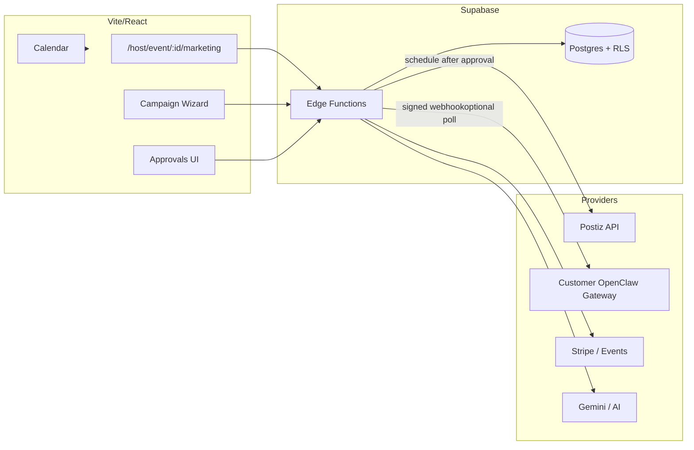
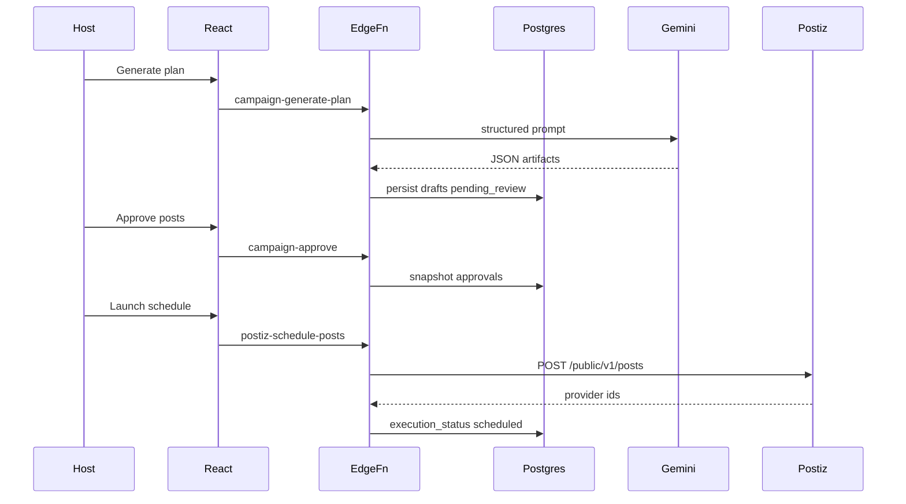

# Postiz + OpenClaw × mdeai Events — Implementation Plan

## Summary — what this is, in plain language

Imagine an event organizer in Medellín who sells tickets on **mdeai**: they shouldn’t spend two hours every day rewriting the same promo for Instagram, X, and WhatsApp links, nor should anything “AI” blast DMs without them seeing it first.

**This plan is about:**

- **Marketing campaigns tied to real things you already sell:** an event first; later contests, restaurants, sponsors, rentals — same pattern.
- **A copilot that writes drafts, not autopilot.** The AI proposes a timeline, captions, hashtags, and (optionally) who you might reach out to. **Nothing publishes and nobody gets messaged until the organizer taps approve** on specific posts or batches.
- **Two specialist tools plugged in cleanly:**
  - **Postiz** = the “radio scheduler” — after approval, **mdeai** calls Postiz’s API so posts go live on the channels the organizer connected in Postiz (Instagram, TikTok, X, LinkedIn, Facebook, etc.). We store Postiz’s IDs so we can cancel, retry, or pull basic stats later.
  - **OpenClaw** = optional “hands for sending” — the organizer runs OpenClaw on **their own** setup (their WhatsApp/Telegram/Slack, their risk profile). After approval, **mdeai** hands off a signed job list — we don’t operate their inbox for them in v1.

**Rough delivery story (honest sequencing):**

1. **First:** trackable links and clicks (prove “this tweet drove ticket sales”) — small PR, real revenue insight.
2. **Then:** campaign wizard + AI draft posts inside mdeai + approval UI.
3. **Then:** wire Postiz so approved posts actually schedule.
4. **Later:** approved outreach envelopes to OpenClaw, influencer lists, fancier ROI for sponsors — only after events + tickets revenue is humming.

**One rule to remember:** if it touches the outside world *and* carries your brand risk (post, DM, scrape, blast), **preview → approve → execute** is enforced in data and APIs, not just in the AI prompt.

---

**Status:** Draft architecture (2026-05-03)  
**Goal:** Ship revenue-first Events + Tickets MVP, then layer **approved** social scheduling (Postiz) and **approved** outreach automation (OpenClaw) without auto-posting/scraping/DM-ing without explicit human gates.

**References:**  
- [Postiz + OpenClaw (X)](https://postiz.com/openclaw/x)  
- [postiz-docs / Public API README](https://github.com/gitroomhq/postiz-docs)  
- [postiz-agent](https://github.com/gitroomhq/postiz-agent)  
- [postiz-app](https://github.com/gitroomhq/postiz-app)  
- [OpenClaw](https://github.com/openclaw/openclaw) · [docs.openclaw.ai](https://docs.openclaw.ai/)

**Non-negotiable product principle:** **AI proposes → user previews → user approves → system executes.** No posting, scraping, bulk imports of DMs, or outbound messaging without approval records.

---

## 0) Architecture (high level)



**Integration stance (practical):**

| Capability | MVP owner | Notes |
|------------|-----------|--------|
| Social scheduling | **Postiz public API** from Edge Functions using **per-org secret** (`POSTIZ_API_KEY` stored in Supabase Secrets / env — later vault per tenant) | Map `campaign_posts` → Postiz `/public/v1/posts` payload; persist Postiz IDs. |
| AI planning + copy | **Gemini** (existing edge pattern) | All generations stored as drafts with `approval_status = pending_review`. |
| Outreach / influencers | **OpenClaw runs outside mdeai** in v1 unless you explicitly host a gateway | Edge Functions expose **approve + queue + webhook**; customer’s Gateway executes sends with local channel creds ([OpenClaw channels](https://docs.openclaw.ai/)). |

Operational warning (from internal notes in `open-claw-postiz.md`): some networks (esp. TikTok) penalize **pure API‑scheduled** publishing — product should allow **draft-only** queues and manual publish flows per channel.

---

## 1) Product scope

### 1.1 What “AI Marketing Campaign Builder” does

Core loop for an **event host** (later: sponsor, venue, restaurant marketer):

1. Attach a campaign to a **subject** (event, contest, restaurant promo, sponsor package, listing).
2. AI proposes **timeline + channel mix + post ideas + optional outreach hypotheses** constrained by budgets, dates, tone, locale (ES-first CO / EN for exports).
3. User reviews **post-level previews**, **audience assumptions**, **outreach batches**.
4. On approval: **Postiz** receives schedule jobs; optional **OpenClaw** receives **approved** outbound job payloads.

### 1.2 MVP vs advanced

**MVP (ship with Events + Tickets):**

- One campaign type: **`event_promotion`** tied to `events.id`.
- AI: strategy one-pager + 5–12 **draft posts** across 2–3 connected channels max (pick **X + Instagram + WhatsApp landing link** pattern for CO).
- Approvals: per-post approve + **“approve all reviewed”**.
- Scheduling: Postiz API only after **immutable approval snapshot**.
- Tracking: UTMs + `referral_links` + dashboard for **click → ticket_started** proxy (Stripe checkout started / ticket issued).
- Outreach: **no auto-DM**. Optional: export CSV or trigger **manual** webhook to customer OpenClaw with **daily cap = 0** until enabled.

**Advanced (later):**

- Contest/sponsor/UGC workflows, influencer CRM scoring, roster imports, WhatsApp Template packs, multi-tenant sponsor orgs, auto metrics pull from Postiz, cross-event portfolio reports, embedded OpenClaw “node pairing” UX.

### 1.3 Use cases (by vertical)

| Vertical | MVP slice | Advanced |
|---------|-----------|----------|
| **Event** | Pre-launch teaser → lineup → ticket deadline; track sales | Segment by ticket tier/timezone |
| **Contest / vote** | Promo post series + UTM `vote` | Vote funnel metrics + leaderboard hooks |
| **Restaurant** | Event-night promo + booking link (`/restaurants/:id`) | Geo + hour-based slots |
| **Sponsor** | Co-branded post templates + ROI click report | Dedicated sponsor workspaces |
| **Real estate** | Open house event + RSVP | Listing cross-promo |

---

## 2) User flow

1. Host creates/edits **event** (existing flows).
2. From event: **Create Marketing Campaign**.
3. Wizard collects: objectives (sell tickets / build waitlist / drive votes), budget hint, locale, blackout dates, **allowed channels**, brand voice snippet.
4. **AI generates campaign plan** (stored versioned JSON + human summary).
5. User reviews tabs: **Posts** · **Audiences** (assumptions) · **Outreach** (draft batches, off by default) · **Compliance** (consent attestations).
6. User actions: approve individual posts · approve full campaign (“execute when all required posts approved”) · reject/edit/regenerate slices.
7. **Execute:**
   - `postiz-schedule-posts` runs for approved posts → Postiz IDs saved → status `scheduled`.
   - If outreach enabled **and** batch approved → **OpenClaw** receives job (webhook); sends are **logged** server-side + in OpenClaw.
8. **mdeai tracks** via UTM landing + short links → events on `campaign_events` + aggregates in `campaign_metrics` / `campaign_conversions`.

---

## 3) Database design (Supabase Postgres)

Below: proposed schema. Adjust names to fit existing conventions when implementing.

### 3.1 Enums (`public` schema)

```sql
-- Example: create as Postgres enums OR text + CHECK constraints (lighter to migrate).

CREATE TYPE public.marketing_campaign_status AS ENUM (
  'draft', 'planning', 'pending_review', 'approved', 'executing', 'active', 'paused', 'completed', 'cancelled', 'failed'
);

CREATE TYPE public.marketing_campaign_subject AS ENUM (
  'event', 'contest', 'restaurant', 'sponsor_activation', 'real_estate_listing'
);

CREATE TYPE public.campaign_channel_provider AS ENUM (
  'postiz', 'manual', 'openclaw', 'whatsapp_template', 'email', 'sms'
);

CREATE TYPE public.social_platform AS ENUM (
  'instagram', 'tiktok', 'x', 'linkedin', 'facebook', 'threads', 'youtube', 'other'
);

CREATE TYPE public.approval_status AS ENUM (
  'draft', 'pending_review', 'approved', 'rejected', 'superseded', 'cancelled'
);

CREATE TYPE public.execution_status AS ENUM (
  'pending', 'queued', 'scheduled', 'published', 'failed', 'skipped', 'cancelled'
);

CREATE TYPE public.outreach_direction AS ENUM (
  'outbound_dm', 'outbound_public_reply', 'outbound_email', 'outbound_whatsapp', 'draft_only'
);

CREATE TYPE public.metric_granularity AS ENUM (
  'hour', 'day', 'campaign_total'
);
```

Enum strategy: Prefer **TEXT + CHECK** in early migrations if you want zero-friction rollback; enums are nicer for UX.

---

### 3.2 Tables (columns · keys · FKs · indexes · RLS · notes)

RLS patterns (baseline): **`host_user_id = auth.uid()`** for SELECT/INSERT/UPDATE; DELETE restricted; **`is_admin()`** read-all where needed; **service_role** bypass for ingestion workers. Exact helpers should mirror existing `profiles` / host tables when you add landlord/event-host roles.

#### `marketing_campaigns`

| Column | Type | Notes |
|--------|------|--------|
| `id` | uuid PK | `gen_random_uuid()` |
| `host_user_id` | uuid NOT NULL | FK → `auth.users(id)` |
| `subject_type` | `marketing_campaign_subject` NOT NULL | |
| `subject_id` | uuid NOT NULL | **Polymorphic** — enforce in app/trigger (`subject_type`,`subject_id`) |
| `event_id` | uuid NULL | FK → `public.events(id)` — **duplicate pointer** when subject is event (for convenient joins Phase 1) |
| `name` | text NOT NULL | |
| `objective` | text | |
| `locale` | text DEFAULT 'es-CO' | |
| `status` | `marketing_campaign_status` NOT NULL DEFAULT 'draft' | |
| `plan_version` | int NOT NULL DEFAULT 1 | bump on regenerate |
| `plan_json` | jsonb DEFAULT '{}'::jsonb | normalized AI payload |
| `starts_at`, `ends_at` | timestamptz | optional campaign window |
| `timezone` | text DEFAULT 'America/Bogota' | |
| `daily_post_cap`, `daily_outreach_cap` | int | safety |
| `idempotency_key` | text UNIQUE | dedupe wizard creates |
| `created_at`, `updated_at` | timestamptz | |

**FKs:** `host_user_id` → users; optional `event_id` → events.  
**Indexes:** `(host_user_id, status)`, `(event_id)`, `(subject_type, subject_id)`, `(created_at DESC)`.  
**RLS:** host owns rows; admins read.

#### `campaign_channels`

Maps logical channels → Postiz integrations / manual.

| Column | Type |
|--------|------|
| `id` uuid PK |
| `campaign_id` uuid NOT NULL FK → `marketing_campaigns(id)` ON DELETE CASCADE |
| `provider` `campaign_channel_provider` |
| `platform` `social_platform` or text |
| `label` text |
| `postiz_integration_id` text NULL | from Postiz list-integrations ([API](https://github.com/gitroomhq/postiz-docs)) |
| `is_enabled` boolean DEFAULT true |
| `settings_json` jsonb DEFAULT '{}'::jsonb | provider-specific defaults |
| `created_at` timestamptz |

**Indexes:** `(campaign_id)`, `(postiz_integration_id)` where non-null.

#### `campaign_posts`

Each proposed/scheduled asset.

| Column | Type |
|--------|------|
| `id` uuid PK |
| `campaign_id` uuid NOT NULL FK |
| `channel_id` uuid NULL FK → `campaign_channels` |
| `sequence` int | thread order |
| `content_json` jsonb NOT NULL | `{ caption, hashtags[], thread[], mentions[] }` |
| `scheduled_at` timestamptz NULL |
| `approval_status` `approval_status` |
| `approval_id` uuid NULL FK → `campaign_approvals(id)` |
| `execution_status` `execution_status` DEFAULT 'pending' |
| `postiz_payload_json` jsonb | exact outbound body snapshot |
| `provider_post_id` text NULL | Postiz job/post id |
| `last_error` text NULL |
| `idempotency_key` text UNIQUE | |
| `created_at`, `updated_at` timestamptz |

**Indexes:** `(campaign_id, scheduled_at)`, `(execution_status)`, `(approval_status)`.  
**Trigger:** forbid transition to `scheduled` unless approved snapshot exists.

#### `campaign_assets`

| Column | Type |
|--------|------|
| `id` uuid PK |
| `campaign_id` uuid NOT NULL FK |
| `storage_path` text NULL | Supabase Storage |
| `public_url` text NULL |
| `postiz_media_id` text NULL | After upload-from-url/upload |
| `mime_type` text |
| `meta_json` jsonb | dimensions, duration |
| `created_at` timestamptz |

#### `campaign_audiences`

| Column | Type |
|--------|------|
| `id` uuid PK |
| `campaign_id` uuid NOT NULL FK |
| `segment_name` text | e.g. `engaged_locals` |
| `definition_json` jsonb | rules snapshot (city, affinity tags, follower bands) |
| `is_ai_generated` boolean |
| `approval_status` `approval_status` default `pending_review` |

#### `campaign_contacts`

**Do not scrape into this table without consent flags.** Rows represent allowed targets only.

| Column | Type |
|--------|------|
| `id` uuid PK |
| `campaign_id` uuid NOT NULL FK |
| `external_handle` text NULL | |
| `phone_e164` text NULL | hashed optional |
| `email` citext NULL | |
| `source` text | `import_csv`, `manual`, `partner_list` |
| `consent_status` text CHECK IN (`unknown`, `opt_in`, `opt_out`, `implied_partner`) |
| `consent_recorded_at` timestamptz |
| `notes` text |
| UNIQUE optional `(campaign_id, external_handle)` where handle present |

#### `outreach_messages`

| Column | Type |
|--------|------|
| `id` uuid PK |
| `campaign_id` uuid NOT NULL FK |
| `contact_id` uuid NULL FK |
| `direction` `outreach_direction` |
| `payload_json` jsonb NOT NULL | template + variables |
| `approval_status` `approval_status` |
| `approval_id` uuid NULL FK |
| `execution_status` `execution_status` |
| `openclaw_job_id` text NULL | |
| `scheduled_at` timestamptz |
| `sent_at` timestamptz |
| `last_error` text |
| `idempotency_key` text UNIQUE |

#### `campaign_approvals`

Immutable approval records (“what was approved when”).

| Column | Type |
|--------|------|
| `id` uuid PK |
| `campaign_id` uuid NOT NULL FK |
| `actor_user_id` uuid NOT NULL FK |
| `scope` text CHECK IN (`campaign`, `post`, `outreach_batch`, `asset_pack`, `channel_enablement`) |
| `target_id` uuid NULL | FK polymorphic via `scope` (application enforced) |
| `snapshot_json` jsonb NOT NULL | content hash preimage |
| `snapshot_sha256` text | |
| `decision` text CHECK IN (`approved`, `rejected`, `revoked`) |
| `notes` text |
| `created_at` timestamptz |

#### `campaign_events` (immutable event stream)

| Column | Type |
|--------|------|
| `id` bigint PK SERIAL |
| `campaign_id` uuid NOT NULL FK |
| `occurred_at` timestamptz NOT NULL DEFAULT now() |
| `event_type` text | `approval_granted`, `post_scheduled`, `post_failed`, `click`, … |
| `payload_json` jsonb |
| `actor_user_id` uuid NULL |

**Index:** `(campaign_id, occurred_at DESC)`; optionally BRIN on `occurred_at`.

#### `campaign_metrics`

Rolled-up counters.

| Column | Type |
|--------|------|
| `id` bigint PK SERIAL |
| `campaign_id` uuid NOT NULL FK |
| `granularity` `metric_granularity` |
| `bucket_start` timestamptz NOT NULL |
| `impressions` int default 0 | may be unknown until Postiz pull |
| `clicks` int |
| `unique_clickers` int |
| `spend_estimate_cents` int NULL |
| `meta_json` jsonb |

UNIQUE `(campaign_id, granularity, bucket_start)`

#### `campaign_conversions`

| Column | Type |
|--------|------|
| `id` bigint PK SERIAL |
| `campaign_id` uuid NOT NULL FK |
| `conversion_type` text | `ticket_paid`, `checkout_started`, `vote_cast`, `booking_created`, … |
| `subject_type` text | aligns with Stripe/ticket/order tables |
| `subject_id` uuid | |
| `attribution_json` jsonb | first/last touch, UTMs |
| `value_cents` int NULL |
| `currency` text |
| `occurred_at` timestamptz |

#### `influencer_partners`

| Column | Type |
|--------|------|
| `id` uuid PK |
| `host_user_id` uuid NOT NULL FK | owner CRM |
| `handle` text | |
| `platform` text | |
| `tier` text | nano/micro/macro |
| `score_json` jsonb | influencer scoring AI output |
| `rate_card_json` jsonb | |
| `approval_status` for listing in campaign roster | reuse `approval_status` |
| `created_at` timestamptz |

#### `referral_links`

| Column | Type |
|--------|------|
| `id` uuid PK |
| `campaign_id` uuid NOT NULL FK |
| `code` text UNIQUE NOT NULL | short slug |
| `destination_url` text NOT NULL | must include UTMs |
| `utm_json` jsonb | |
| `influencer_id` uuid NULL FK |
| `created_at` timestamptz |

Serve via edge redirect `/r/:code` → `campaign-track-click`.

#### `suppression_lists`

| Column | Type |
|--------|------|
| `id` bigint PK SERIAL |
| `scope` text CHECK (`host`, `global_template`) |
| `host_user_id` uuid NULL FK |
| `channel` text | phone/email/handle |
| `normalized_value` text NOT NULL | hashed phone/email variant |
| `reason` text | |
| `source` text | user_request, bounce, spam_complaint |
| `created_at` timestamptz |

UNIQUE `(host_user_id, channel, normalized_value)`

#### `audit_logs`

| Column | Type |
|--------|------|
| `id` bigint PK SERIAL |
| `table_name` text |
| `row_id` uuid |
| `action` text |
| `actor_user_id` uuid |
| `before_json` jsonb |
| `after_json` jsonb |
| `request_id` text |
| `created_at` timestamptz |

**Implementation note:** Optionally reuse `campaign_events` for product analytics and keep `audit_logs` for security/compliance mutations only.

---

## 4) API / Edge Functions (design)

Uniform contract: **`{ success: true, data }` / `{ success: false, error: { code, message } }`**. JWT = Supabase user for host flows; **`x-idempotency-key`** header supported.

Logging: **`ai_runs`** for Gemini calls (`agent_name`: `campaign-generate-plan`, etc.); **`audit_logs` + `campaign_events`** for state transitions.

### `campaign-create`

| | |
|--|--|
| **Auth** | Host JWT; optional `moderator/admin` impersonation audited |
| **Body** | `{ subjectType, subjectId, eventId?, name, locale?, timezone?, caps?, objectives? , idempotencyKey? }` |
| **Response** | `{ campaignId }` |
| **Idempotency** | Upsert by `idempotency_key` per `host_user_id` |
| **Errors** | 403 wrong subject ownership; 404 event |

### `campaign-generate-plan`

| | |
|--|--|
| **Auth** | Host JWT |
| **Body** | `{ campaignId, promptPack?: string[], regenerate?: boolean }` |
| **Response** | `{ planVersion, summaryMarkdown, artifacts: { posts[], audiences[], sponsorIdeas? } }` (also persisted) |
| **Idempotency** | Same key returns same unfinished job or 409 if plan in-flight |
| **AI** | Gemini structured output validating JSON schemas (§7) |

### `campaign-approve`

| | |
|--|--|
| **Auth** | Host JWT |
| **Body** | `{ campaignId, scope, targetIds?, decision, notes?, snapshotAck: true }` |
| **Response** | `{ approvalId }` |
| **Idempotency** | Key per `(campaignId,scope,target subset hash)` |

### `postiz-schedule-posts`

| | |
|--|--|
| **Auth** | Service role invoked **after** approvals **or** user JWT plus server verification that posts are approved |
| **Body** | `{ campaignId, postIds?, dryRun?: boolean }` |
| **Response** | `{ results: [{ postId, providerPostId?, executionStatus }] }` |
| **Idempotency** | Per-post `idempotency_key`; Postiz retries safe |
| **Errors** | map Postiz HTTP to `POSTIZ_*` codes; populate `campaign_posts.last_error`; write `campaign_events` |

Postiz mapping: POST `https://api.postiz.com/public/v1/posts` with `Authorization: POSTIZ_API_KEY` per README in [postiz-docs](https://github.com/gitroomhq/postiz-docs).

### `openclaw-build-audience`

| | |
|--|--|
| **Auth** | Host JWT (**proposal only**) |
| **Body** | `{ campaignId, rulesText, csvPreview?: paste }` |
| **Response** | `{ suggestedSegments[], contactsPreview[] }` stored as **draft**, no send |
| **Idempotency** | job key |

*(Real imports: separate CSV endpoint with virus scan + consent attestation checkbox.)*

### `openclaw-send-outreach`

| | |
|--|--|
| **Auth** | Prefer **service role** triggered after approval envelope |
| **Body** | `{ campaignId, messageIds?, openclawWebhookUrl?,_hmacSecretRotating }` |
| **Response** | `{ queuedJobs[] }` |
| **Safety** | hard fail if **any** message not `approved` or caps exceeded |

Actual send path v1:

1. mdeai signs payload → customer OpenClaw **plugin action** validates → sends via Telegram/WhatsApp/Slack per [OpenClaw channels](https://docs.openclaw.ai/).

### `campaign-track-click`

| | |
|--|--|
| **Auth** | Anonymous GET redirect handler + optional signed pixel later |
| **Input** | path param `code` |
| **Response** | HTTP 302 to `destination_url` |
| **Side effect** | insert `campaign_events` type `click` + roll `campaign_metrics` |

### `campaign-ingest-metrics`

| | |
|--|--|
| **Auth** | Cron secret header OR service role |
| **Body** | `{ campaignId?, since? }` |
| **Pull** | Postiz list posts / analytics endpoints as available in [public-api docs](https://docs.postiz.com/public-api/introduction); store in `campaign_metrics.meta_json` |

### `campaign-generate-report`

| | |
|--|--|
| **Auth** | Host JWT |
| **Body** | `{ campaignId, format: markdown|pdf }` |
| **Response** | signed Storage URL |

### `campaign-cancel`

| | |
|--|--|
| **Auth** | Host JWT |
| **Body** | `{ campaignId, reason }` |
| **Actions** | call Postiz delete where API supports DELETE post; enqueue OpenClaw cancel; update statuses |

Reference: DELETE example in postiz-docs README (`DELETE /public/v1/posts/:id`).

### `suppression-list-manage`

CRUD host-scoped suppression entries; consulted by `openclaw-send-outreach` and CSV import.

---

## 5) Postiz integration

1. **Connect accounts:** Completed **inside Postiz product UI** (`platform.postiz.com` settings). Host pastes integrations into wizard or you store `postiz_integration_id` per channel from [`GET /public/v1/integrations`](https://github.com/gitroomhq/postiz-docs)).
2. **Schedule posts:** Edge function transforms `campaign_posts.postiz_payload_json` to Postiz `{ type:"schedule", date, posts:[{ integration:{id}, value:[...], settings }]} ` per docs.
3. **Mapping:**
   - `campaign_posts.channel_id.postiz_integration_id` → Postiz `integration.id`
   - Uploaded media → `POST /upload` / `upload-from-url` → store returned media id/url in `campaign_assets.postiz_media_id`
4. **Provider IDs:** `campaign_posts.provider_post_id` + `campaign_events` audit.
5. **Failures:** Retry with backoff 3×; terminal failure → `execution_status=failed`, host notification; **never auto-reapprove** regenerated copy without explicit user confirm.
6. **Multi-platform:** `settings_json` mirrors each provider (`__type` / X settings per [Postiz OpenClaw X page](https://postiz.com/openclaw/x)). Keep **Instagram/TikTok** on **draft** toggles until operations validate account health.

**Optional CLI:** Operators can mirror flows with [`postiz-agent`](https://github.com/gitroomhq/postiz-agent) locally; SaaS path remains HTTP API.

---

## 6) OpenClaw integration

**Audience “finding” (honest scoped):**

- **In-product:** Imports from CSV/list partners, manual handles, contestants who opted marketing at registration (your events/terms).
- **Not MVP:** Automated scraping Twitter/IG for influencers (ToS + legal risk).

**Influencers:** `influencer_partners` + optional **public handle** ingest with **explicit** “relationship established” checkbox.

**Sends:**

- Draft-only default → user copies from UI **or** approves webhook batch.
- **Anti-spam / bans:** per-channel daily caps; exponential spacing; warmup toggles for new numbers; WhatsApp template-only for cold outreach.
- **Approval:** Hard gate via `campaign_approvals.scope = outreach_batch` + each `outreach_messages.approval_status`.
- **Logging:** Dual write: `campaign_events` + OpenClaw session logs locally.

OpenClaw is **configured by customer** at `~/.openclaw/openclaw.json`; mdeai only sends signed task envelopes ([OpenClaw config](https://docs.openclaw.ai/)).

---

## 7) AI workflows + JSON schemas (Gemini structured outputs)

### 7.1 `campaign.strategy.v1`

```json
{
  "$schema":"https://json-schema.org/draft/2020-12/schema",
  "type":"object",
  "required":["headline","narrative_pillars","cta_matrix","timeline_phases","risks"],
  "properties":{
    "headline":{"type":"string"},
    "narrative_pillars":{"type":"array","minItems":3,"items":{"type":"string"}},
    "cta_matrix":{"type":"array","items":{
      "type":"object",
      "required":["goal","primary_url_placeholder","tracking_hint"],
      "properties":{
        "goal":{"enum":["tickets","votes","signup","booking","sponsor_clicks"]},
        "primary_url_placeholder":{"type":"string"},
        "tracking_hint":{"type":"string"}
      }
    }},
    "timeline_phases":{"type":"array","items":{
      "type":"object",
      "required":["name","start_offset_days","end_offset_days"],
      "properties":{
        "name":{"type":"string"},
        "start_offset_days":{"type":"integer"},
        "end_offset_days":{"type":"integer"},
        "focus":{"type":"string"}
      }
    }},
    "risks":{"type":"array","items":{"type":"string"}}
  },
  "additionalProperties":false
}
```

### 7.2 `campaign.post_bundle.v1`

```json
{
  "type":"object",
  "required":["posts"],
  "properties":{
    "posts":{
      "type":"array",
      "items":{
        "type":"object",
        "required":["platform","caption","timezone_safe"],
        "properties":{
          "platform":{"type":"string"},
          "caption":{"type":"string","maxLength":4000},
          "thread":{"type":"array","items":{"type":"string"}},
          "hashtags":{"type":"array","maxItems":8,"items":{"type":"string"}},
          "suggested_schedule_at":{"type":"string","format":"date-time"},
          "media_hints":{"type":"array","items":{"type":"object","properties":{
            "role":{"enum":["hero","slideshow","story"]},
            "description":{"type":"string"}
          }}},
          "compliance_notes":{"type":"string"}
        }
      }
    }
  }
}
```

### 7.3 `campaign.hashtags.v1`

Nested in posts bundle or standalone array with `clusters` → `{theme, tags[]}`.

### 7.4 `campaign.ugc_challenge.v1`

Fields: `title`, `mechanics`, `rules`, `prize_disclosure`, `hashtag`, `moderation_warnings`.

### 7.5 `campaign.influencer_scores.v1`

```json
{
  "type":"array",
  "items":{
    "type":"object",
    "required":["handle","score","signals"],
    "properties":{
      "handle":{"type":"string"},
      "platform":{"type":"string"},
      "score":{"type":"number","minimum":0,"maximum":100},
      "signals":{"type":"array","items":{"type":"string"}},
      "fit_reason":{"type":"string"},
      "risk_flags":{"type":"array","items":{"type":"string"}}
    }
  }
}
```

### 7.6 `campaign.audience_segments.v1`

Array of `{ name, personas[], exclusions[], assumptions_disclaimer }`.

### 7.7 `campaign.sponsor_activation.v1`

`{ beats: [{timing, asset_type, sponsorship_tier}], deliverables checklist }`.

### 7.8 `campaign.performance_summary.v1`

`{ kpis[], insights[], recommendations_next_week[], data_gaps[] }`.

---

## 8) Approval system

States: **Draft → Pending review → Approved → Executing**.

| Flow | Mechanics |
|------|-----------|
| Preview | UI renders Markdown + carousel cards |
| Per-post approve | Creates `campaign_approvals` row `scope=post` |
| Bulk approve | Transaction + immutable `snapshot_sha256` of all included posts |
| Outreach batch | Separate envelope; toggle default **off** |
| Reject / edit | Reject bumps `plan_version`; edits mark post `draft` |
| Regenerate | AI increments `plan_version`; prior snapshots `superseded` |
| Undo / cancel | **`campaign-cancel`** deletes Postiz IDs where supported; revoked approvals append `campaign_events` |

---

## 9) Tracking + attribution

1. **`referral_links`** generate `/r/:code`.
2. **UTM standard:** `utm_source=mdeai&utm_medium=social&utm_campaign=<campaignId>&utm_content=<postId>`
3. **Short links:** Vercel/edge rewrite or Supabase-hosted redirect (`campaign-track-click`).
4. **Conversions:** Stripe webhook (`checkout.session.completed`) + ticket issuance RPC already in stack → write `campaign_conversions` matching last non-direct click within **7-day** attribution window *(config)* — keep **first_click** optional column in `attribution_json`.
5. **Votes/bookings:** same pattern via domain events.
6. **WhatsApp:** unique `wa.me` links per referral code.
7. **Influencer:** `referral_links.influencer_id`
8. **Postiz metrics:** ingest job maps provider analytics into `campaign_metrics`.
9. **OpenClaw:** delivery receipts → webhook `openclaw-delivery` stub (Phase 4) updating `outreach_messages`.

---

## 10) Safety + compliance

| Area | Control |
|------|---------|
| Consent | Opt-in checkbox on ticket forms; influencer lists contractual |
| Suppression | `suppression_lists` mandatory check before enqueue |
| Rate limits | `daily_*_cap`; per-contact min spacing stored in Redis later or DB ledger |
| Anti-spam | Template-only WhatsApp cold; forbid purchased email lists |
| **Habeas Data (CO)** | Data minimization; phone/email hashing at rest optional; SAR export/delete path |
| Platform ToS | Ban risky scraping; TikTok/API draft playbook |
| Human gates | All outbound requires `approval_status=approved` |
| Audit | `campaign_events`, `audit_logs`, `campaign_approvals.snapshot_json` |

---

## 11) UI surfaces

| Piece | Responsibility |
|-------|----------------|
| `/host/event/:id/marketing` | Entry + KPI strip |
| **Wizard** steps | Goal → Channels → Timeline → Drafts → Approvals → Launch |
| **Calendar** week/month | Loads `campaign_posts.scheduled_at` |
| **Post preview cards** | Thread expander, hashtags, IG vs X badges |
| **Audience builder** | Segments AI + disclaimers |
| **Outreach queue** | Batch cards, blocked by toggles |
| **Influencer CRM** table | tier, scores, statuses |
| **Metrics dashboard** | funnel chart clicks→checkout→paid |
| **Sponsor ROI** | Phase 5 export |

Reuse shadcn, 3-panel responsive patterns existing in app.

---

## 12) Implementation sequence → tasks

### Phase 1 — Referral / click tracking (foundation)

| Artifact | Deliverable |
|----------|-------------|
| Migration | `referral_links`, `campaign_events` (minimal), enums |
| Edge | `campaign-track-click` (+ optional `campaign-create` stub linking event) |
| FE | Lightweight “share link” widget on `/events/:id` for organizers |
| Tests | Redirect + idempotency on click flood |
| **Acceptance** | Unique codes resolve; events logged |

### Phase 2 — Campaign builder + AI drafts (no external post)

| Artifact | Deliverable |
|----------|-------------|
| Migration | Core `marketing_campaigns`, `campaign_posts`, `campaign_approvals`, `audit_logs` |
| Edge | `campaign-create`, `campaign-generate-plan`, `campaign-approve` |
| FE | Wizard + previews |
| Tests | Approval state machine |

### Phase 3 — Postiz scheduling

| Artifact | Deliverable |
|----------|-------------|
| Migration | `campaign_channels`, extend posts with provider columns |
| Edge | `postiz-schedule-posts`, `campaign-cancel`, partial `campaign-ingest-metrics` |
| FE | Calendar + failures panel |
| Tests | Mock Postiz HTTP (MSW/Vitest) |

### Phase 4 — OpenClaw outreach

| Artifact | Deliverable |
|----------|-------------|
| Migration | Contacts, outreach_messages, suppression |
| Edge/Webhook | Signed envelope dispatcher + receipt endpoint |
| FE | Outreach queue approvals |
| Tests | Caps + suppression unit tests |

### Phase 5 — Sponsor ROI / automation reports

**Migration:** aggregates views; **`campaign-metrics` materialization** cron.

---

## 13) Testing plan

| Layer | Cases |
|-------|-------|
| Unit | Approval FSM; UTM builder; hashing utils |
| Edge | Postiz mocks (success/throttle/4xx); idempotency replay |
| RLS | Host cannot see other campaigns; anon cannot INSERT |
| Scheduling | TZ boundary (America/Bogota) |
| Mocks | Recorded Postiz responses; stub OpenClaw webhook |
| Rate limits | cap overflow rejected |
| Approvals | cannot schedule unapproved snapshot |
| Attribution | synthesized click timelines → conversions |

---

## 14) Final deliverables in this doc

### 14.1 MVP build order

1. Tracking links + metrics events  
2. DB host campaign + AI drafts  
3. Approvals + audit trail  
4. Postiz executor  
5. (Optional toggle) Outreach webhooks  

### 14.2 Risks

| Risk | Mitigation |
|------|------------|
| TikTok/account bans | drafts + human publish path |
| Postiz API limits / drift | typed client version pin + contract tests |
| OpenClaw security | rotate HMAC secrets; IP allow lists |
| Legal (CO) | privacy policy gate + SAR hooks |
| Overbuilding CRM | influencer table minimal until sponsorship revenue |

### 14.3 Recommended **first PR** (small + shippable)

**Title:** `feat(events): referral tracking + redirect edge function scaffold`

Includes:

1. Migration: `referral_links` + minimal `marketing_campaigns` scaffold (FK to `events.id`, host user).  
2. Edge function `campaign-track-click` anonymous GET with **302**.  
3. Unit tests for slug + basic RLS smoke.  

**No**: Postiz calls, outbound messaging, scraping.

---

## Appendix A — Scheduling workflow diagram



---

## Appendix B — Ownership note

 Tie `host_user_id` to whoever may edit `events.created_by` or future `event_hosts` table when multi-host exists; until then simplest rule: **`events.created_by` must match JWT** to mutate marketing rows for that `event_id`.

---

*Document owner: Architecture — revise after Phase 2 user testing.*
