# AUDIT-MERMAID-03 — mdeai.co Architecture Diagrams

> 15 production-grade Mermaid diagrams: current (as-is) vs target (to-be).
> Each diagram includes: what it shows · current flaws · red flags · exact fixes.
>
> **Architecture Score: 72/100** (was 68) — Pre-production. Improvements 2026-05-15: 429 backoff added (+3), geocode-missing.ts bug fixed (+1). Remaining ship-blockers: P0 key leak (Vercel dashboard + rotation), events enrichment not yet run, tourist_destinations 78.6%.

---

## Architecture Score Summary

| Domain | Current | Target | Gap |
|--------|---------|--------|-----|
| Frontend/backend boundary | 55/100 | 90/100 | `VITE_GEMINI_API_KEY` leak, ChatMap/MdeMap dual system |
| Places API + Cache | 55/100 | 85/100 | Cache never queried (429 backoff ✅ fixed 2026-05-15) |
| AI / Gemini Grounding | 30/100 | 88/100 | Grounding absent from production |
| Enrichment Pipeline | 62/100 | 85/100 | Events code-ready but not run; td 78.6%; geocode-missing bug fixed |
| Secrets / Security | 45/100 | 92/100 | P0: VITE_GEMINI_API_KEY in bundle |
| Marker System | 70/100 | 88/100 | Duplicate makeContent(), no a11y attrs |
| Deployment / Ops | 72/100 | 88/100 | 21 commits unpushed, no observability |
| **Overall** | **68/100** | **88/100** | |

---

## Diagram 1 — Current System Architecture (As-Is)

> **What it shows:** Every major layer of mdeai.co as it runs today — browser, Supabase edge, Mastra server, databases, external APIs, scripts.
> **Flaws:** Dual map systems (ChatMap + MdeMap), `VITE_GEMINI_API_KEY` leaking into browser bundle, Places cache tables created but never queried, enrichment scripts not run for events, Gemini Maps Grounding absent.

```mermaid
flowchart TB
    classDef browser fill:#dbeafe,stroke:#2563eb,color:#1e3a8a
    classDef edge fill:#dcfce7,stroke:#16a34a,color:#14532d
    classDef mastra fill:#fef9c3,stroke:#ca8a04,color:#713f12
    classDef db fill:#f3e8ff,stroke:#7c3aed,color:#4c1d95
    classDef external fill:#fee2e2,stroke:#dc2626,color:#7f1d1d
    classDef script fill:#ffedd5,stroke:#ea580c,color:#7c2d12
    classDef warning fill:#fef3c7,stroke:#f59e0b,color:#78350f

    subgraph BROWSER["🌐 Browser (Vite + React)"]
        direction TB
        UI["Pages / Components\n(App.tsx, 152 components)"]
        ChatMap["ChatMap.tsx ⚠️\n(active production map)"]
        MdeMap["MdeMap.tsx ⚠️\n(successor — not yet wired)"]
        FloatChat["FloatingChatWidget\n→ ai-chat edge fn"]
        VITE_MAPS["VITE_GOOGLE_MAPS_API_KEY\n(HTTP-referrer restricted ✅)"]
        VITE_GEMINI["⛔ VITE_GEMINI_API_KEY\n(in bundle — P0 leak!)"]
    end

    subgraph EDGE["⚡ Supabase Edge Functions (Deno)"]
        direction TB
        AIChat["ai-chat\n(SSE stream, tool dispatch)"]
        AISearch["ai-search\n(hybrid FTS + pgvector)"]
        AIRouter["ai-router\n(intent classification)"]
        AIEmbed["ai-embed\n(gemini-embedding-001)"]
        GoogleDir["google-directions\n(Routes API)"]
        AITrip["ai-trip-planner"]
        RentalsEF["rentals"]
        AIOptRoute["ai-optimize-route"]
    end

    subgraph MASTRA["🤖 Mastra Server (my-mastra-app)"]
        direction TB
        RouterAgent["router-agent\n(classify → dispatch)"]
        ConciergeAgent["concierge-agent\n(4 tools + memory)"]
        RentalAgent["rental-agent"]
        EventAgent["event-agent"]
        Tools["Tools:\nsearch-rentals\nsearch-events\nsearch-restaurants\nsearch-attractions"]
    end

    subgraph DB["🗄️ Supabase PostgreSQL"]
        direction TB
        Apartments["apartments\n(pgvector ✅)"]
        Restaurants["restaurants\n(enriched 93.9% ✅)"]
        Events["events\n(0% enriched ⚠️)"]
        TouristDest["tourist_destinations\n(78.6% enriched ⚠️)"]
        PlacesCache["places_search_cache\n⚠️ CREATED but NEVER QUERIED"]
        DetailsCache["place_details_cache\n⚠️ CREATED but NEVER QUERIED"]
        AIRuns["ai_runs\n(logging ✅)"]
        Conversations["conversations"]
    end

    subgraph EXTERNAL["🔌 External APIs"]
        MapsJS["Maps JS API\n(Dynamic Library Import ✅)"]
        PlacesAPI["Places API (New)\n(Text Search / Details)"]
        GeminiAPI["Gemini API\n(gemini-3-flash-preview)"]
        RoutesAPI["Routes API (New)"]
        GeminiEmbed["Gemini Embedding\n(gemini-embedding-001)"]
    end

    subgraph SCRIPTS["📜 Offline Scripts (Node.js)"]
        EnrichPlaces["enrich-places.ts\n(restaurants+tourist_dest ✅\nevents ❌ NOT RUN)"]
        CacheAI["cache-ai-summaries.ts\n(restaurants+tourist_dest ✅)"]
        Geocode["geocode-missing.ts\n(2 events ⚠️ NOT RUN)"]
    end

    UI --> ChatMap
    UI --> FloatChat
    FloatChat --> AIChat
    ChatMap --> MapsJS
    MdeMap -.->|"not yet\nconnected"| MapsJS
    AIChat --> GeminiAPI
    AISearch --> GeminiEmbed
    AISearch --> Apartments
    AIChat --> Restaurants & Events & TouristDest & Apartments
    AIRouter --> AIChat
    AIEmbed --> GeminiEmbed
    GoogleDir --> RoutesAPI
    MASTRA --> DB
    EnrichPlaces --> PlacesAPI
    EnrichPlaces --> Restaurants
    EnrichPlaces --> TouristDest
    CacheAI --> GeminiAPI
    VITE_GEMINI -.->|"⛔ exposed\nin bundle"| GeminiAPI
    PlacesCache -.->|"⚠️ never\nread"| EnrichPlaces
    DetailsCache -.->|"⚠️ never\nread"| EnrichPlaces

    class UI,ChatMap,MdeMap,FloatChat,VITE_MAPS browser
    class AIChat,AISearch,AIRouter,AIEmbed,GoogleDir,AITrip,RentalsEF,AIOptRoute edge
    class RouterAgent,ConciergeAgent,RentalAgent,EventAgent,Tools mastra
    class Apartments,Restaurants,Events,TouristDest,PlacesCache,DetailsCache,AIRuns,Conversations db
    class MapsJS,PlacesAPI,GeminiAPI,RoutesAPI,GeminiEmbed external
    class EnrichPlaces,CacheAI,Geocode script
    class VITE_GEMINI,MdeMap,PlacesCache,DetailsCache warning
```

**Current flaws:**
| # | Flaw | Impact |
|---|------|--------|
| F1 | `VITE_GEMINI_API_KEY` in browser bundle | P0 — key exposed to all users |
| F2 | ChatMap + MdeMap dual system | Duplicate code, diverging bugs |
| F3 | `places_search_cache` never queried | Wasted schema, paying for every Places call |
| F4 | `events` 0% enriched | Map pins have no Google Maps links |
| F5 | `tourist_destinations` 78.6% | Below 80% target |
| F6 | Gemini Maps Grounding absent | AI answers not grounded in live map data |
| F7 | 21 commits not pushed | Production is behind local main |

---

## Diagram 2 — Target Production Architecture (To-Be)

> **What it shows:** The correct architecture after all blockers are fixed — single map system, cache-first Places queries, Maps Grounding in Gemini, secure secrets, full enrichment, retry logic.

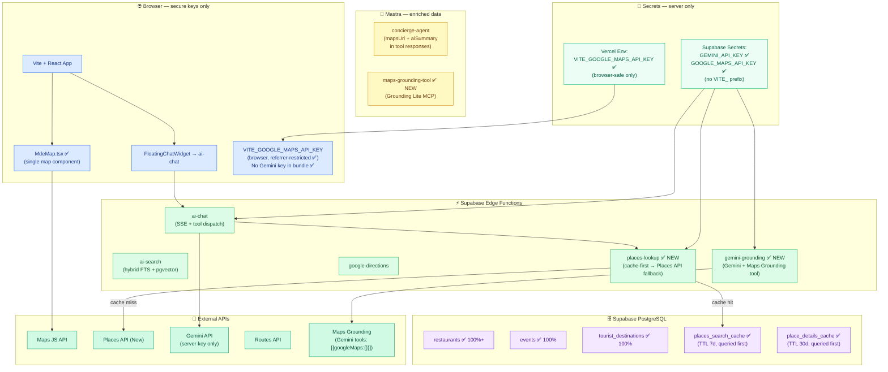

---

## Diagram 3 — Secret / Environment Variable Flow

> **What it shows:** Exactly how secrets flow from source (Infisical / Vercel / .env.local) to runtime (browser bundle, Supabase edge, Mastra server).
> **Red flag:** `VITE_GEMINI_API_KEY` has the `VITE_` prefix — Vite inlines ALL `VITE_*` vars into the client bundle at build time, exposing the key to every user.

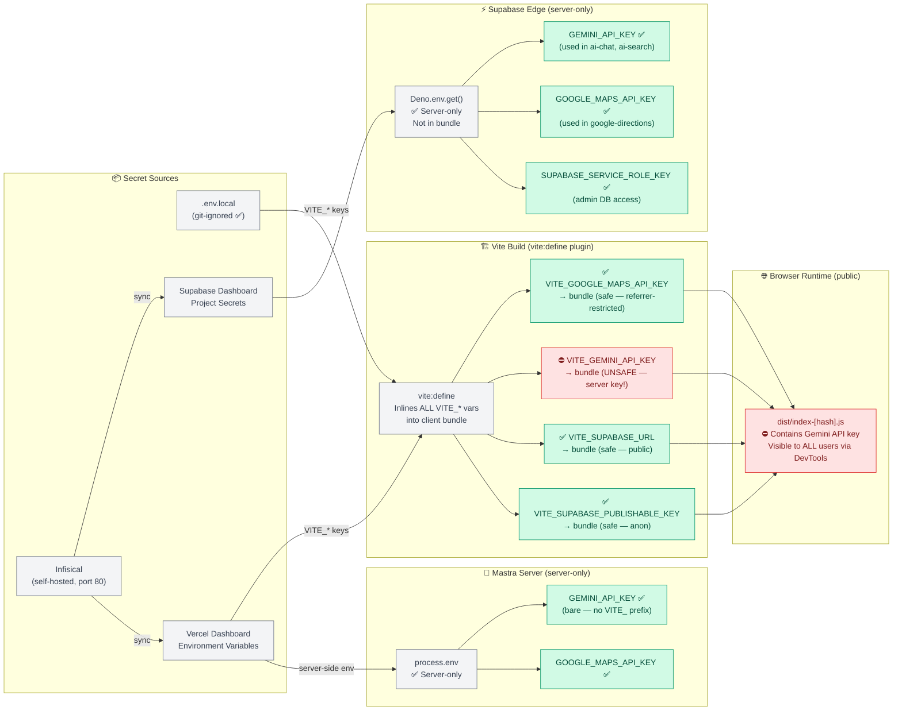

**Fix:**
```
1. Rename VITE_GEMINI_API_KEY → GEMINI_API_KEY in .env.local
2. Remove VITE_ prefix in Vercel dashboard
3. Rotate the key in Google Cloud Console
4. Update mastra-start.sh line 25
5. Run: npm run build && grep -r "AIza" dist/ → must return 0 matches
```

---

## Diagram 4 — Places API Request + Cache Flow (Current vs Target)

> **What it shows:** How a Places API request travels from the enrichment script through the cache layer (or bypasses it) to the API and then to Supabase.
> **Critical gap:** The cache tables (`places_search_cache`, `place_details_cache`) are created and have RLS, but `enrich-places.ts` never queries them — every run hits the live API, incurring cost.

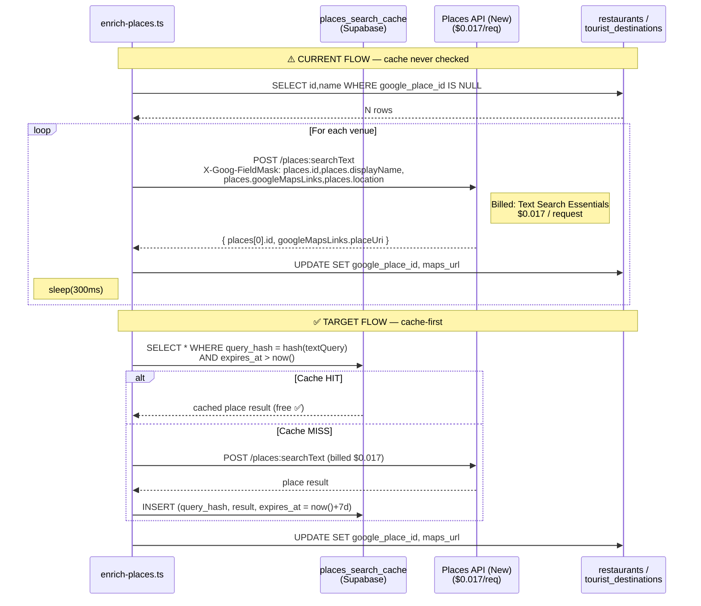

**Cost impact:**
| Scenario | Requests | Cost |
|----------|----------|------|
| Current (no cache, all venues) | ~350 | ~$6 one-time |
| Current (re-run after partial failure) | up to 350 again | ~$6 again |
| Target (cache-first, re-run) | 0 (cache hit) | $0 |
| Monthly runtime queries (500 users) | ~15,000 | ~$255/mo → $0 with cache |

---

## Diagram 5 — Gemini Maps Grounding Flow (Target — Not Yet Implemented)

> **What it shows:** How a user query flows through Gemini with the Maps Grounding tool enabled, returning AI answers grounded in live Google Maps data.
> **Current state:** Maps Grounding is entirely absent from the production codebase. The `mde-maps` skill and audit document it but no implementation exists.

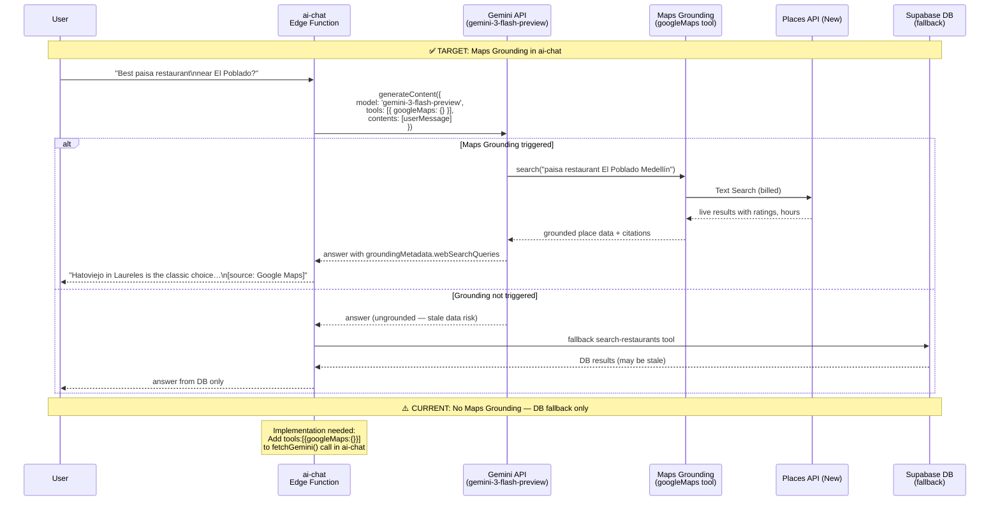

**Missing implementation:**
```typescript
// In supabase/functions/ai-chat/index.ts (fetchGemini call)
// ADD: tools: [{ googleMaps: {} }]
// ADD: groundingMetadata extraction
// ADD: citation rendering in SSE stream
```

---

## Diagram 6 — Enrichment Pipeline (Current Gaps + Target)

> **What it shows:** The full offline enrichment pipeline from raw DB rows → Places API → Gemini summaries → DB write.
> **Current gaps:** Events table (49 rows) never enriched. `geocode-missing.ts` not run for 2 events. No 429 backoff.

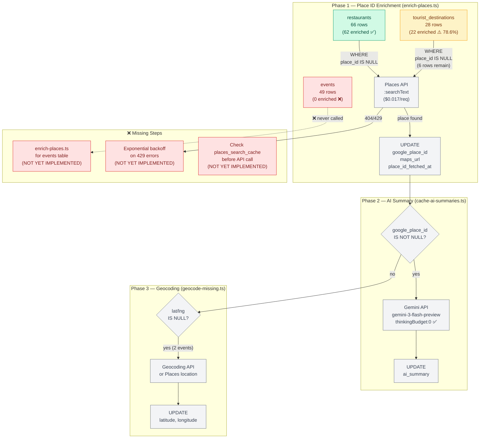

---

## Diagram 7 — Marker Rendering Lifecycle

> **What it shows:** The full React lifecycle of a map pin — from data fetch through marker creation, clustering, hover sync, click handling, and cleanup.
> **Flaws:** Duplicate `makeContent()` functions in `ChatMap.tsx` and `pinContent.ts`. Single MarkerClusterer in ChatMap vs per-category in MdeMap. No accessibility attributes on pins.

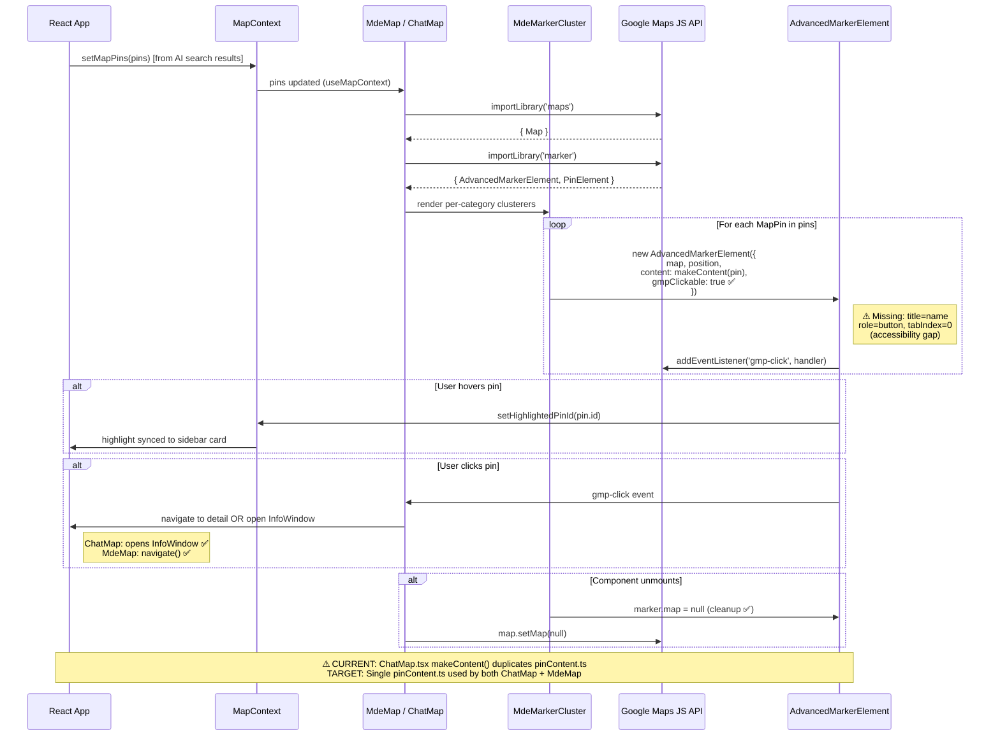

**Duplication fix:**
```typescript
// pinContent.ts — single source of truth
export function makeContent(pin: MapPin): HTMLElement {
  const el = document.createElement('div');
  el.setAttribute('role', 'button');     // ← ADD a11y
  el.setAttribute('tabindex', '0');      // ← ADD a11y
  el.setAttribute('aria-label', pin.title); // ← ADD a11y
  // ... rest of pin rendering
  return el;
}
// ChatMap.tsx: REMOVE local makeContent(), import from pinContent.ts
```

---

## Diagram 8 — Chat → Map → AI Flow

> **What it shows:** End-to-end user journey from typing a chat message through intent routing, AI tool calls, result rendering in chat cards, and map pin updates.

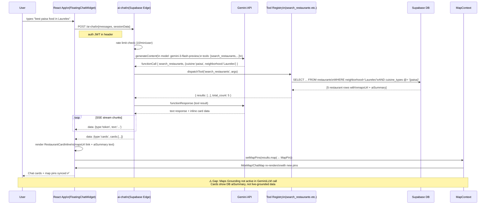

---

## Diagram 9 — Supabase Data Flow

> **What it shows:** How data enters, is enriched, and flows through the Supabase schema — from seed → enrichment → RLS → edge function reads → frontend renders.

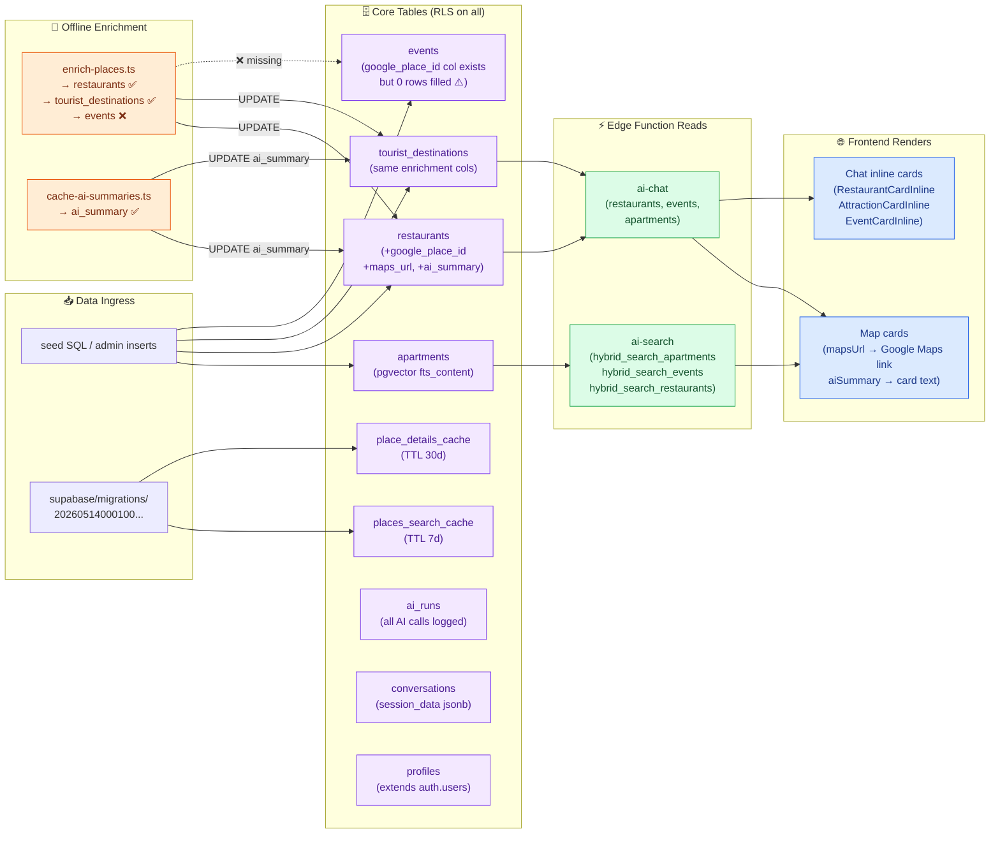

---

## Diagram 10 — Deployment / Vercel / Edge Topology

> **What it shows:** The full runtime topology — local dev, Vercel CDN, Supabase edge, Mastra server, and how they connect in production vs development.

```mermaid
flowchart TB
    classDef vercel fill:#dbeafe,stroke:#2563eb,color:#1e3a8a
    classDef supabase fill:#dcfce7,stroke:#16a34a,color:#14532d
    classDef mastra fill:#fef9c3,stroke:#ca8a04,color:#713f12
    classDef user fill:#f3f4f6,stroke:#6b7280,color:#374151
    classDef dns fill:#f3e8ff,stroke:#7c3aed,color:#4c1d95

    subgraph INTERNET["🌍 Public Internet"]
        Users["Users\n(browser)"]
        GoogleAPIs["Google APIs\nMaps JS · Places · Routes · Gemini"]
    end

    subgraph VERCEL["▲ Vercel (auto-deploy on main push)"]
        VercelCDN["CDN Edge\n(static assets, dist/)"]
        VercelFn["Vercel Functions\n(SSR if needed)"]
        VercelEnv["Env Vars:\nVITE_GOOGLE_MAPS_API_KEY ✅\nVITE_SUPABASE_URL ✅\nVITE_SUPABASE_PUBLISHABLE_KEY ✅\n⛔ VITE_GEMINI_API_KEY (REMOVE)"]
    end

    subgraph SUPABASE["🗄️ Supabase Cloud (us-east-1)"]
        SupaAuth["Auth (JWT)"]
        SupaDB2["PostgreSQL\n(zkwcbyxiwklihegjhuql)"]
        SupaEdge["Edge Functions (Deno)\n12 functions\nai-chat · ai-search · google-directions..."]
        SupaSecrets["Secrets:\nGEMINI_API_KEY\nGOOGLE_MAPS_API_KEY\nSUPABASE_SERVICE_ROLE_KEY\nSTRIPE_SECRET_KEY"]
        SupaRealtime["Realtime\n(broadcast, not postgres_changes)"]
    end

    subgraph MASTRA_DEPLOY["🤖 Mastra Server\n(my-mastra-app — local dev only currently)"]
        MastraStudio["Mastra Studio\n:4111"]
        MastraAgents["Agents:\nconcierge · router · rental · event"]
        MastraEnv["Env:\nGEMINI_API_KEY\nGOOGLE_MAPS_API_KEY\nSUPABASE_SERVICE_ROLE_KEY"]
    end

    subgraph LOCAL["💻 Local Dev (:8080)"]
        ViteDev["vite dev\nnpm run dev"]
        MastraDev["mastra dev\nnpm run dev (my-mastra-app)"]
        Scripts["scripts/\nenrich-places.ts\ncache-ai-summaries.ts"]
    end

    Users -->|"HTTPS mdeai.co"| VercelCDN
    VercelCDN -->|"SPA bundle"| Users
    Users -->|"Supabase JS client"| SupaAuth & SupaDB2
    Users -->|"Edge fn calls"| SupaEdge
    SupaEdge -->|"Deno.env.get()"| SupaSecrets
    SupaEdge -->|"SQL queries"| SupaDB2
    SupaEdge -->|"GEMINI_API_KEY"| GoogleAPIs
    SupaRealtime -->|"broadcast"| Users
    VercelEnv -->|"build-time inject"| VercelCDN

    MastraAgents -->|"SUPABASE_SERVICE_ROLE_KEY"| SupaDB2
    MastraDev -.->|"local only\nnot yet deployed"| MASTRA_DEPLOY
    Scripts -->|"offline run"| SupaDB2 & GoogleAPIs

    Note1["⚠️ 21 commits unpushed\nVercel prod is BEHIND local main"]

    class VercelCDN,VercelFn,VercelEnv vercel
    class SupaAuth,SupaDB2,SupaEdge,SupaSecrets,SupaRealtime supabase
    class MastraStudio,MastraAgents,MastraEnv,MastraDev mastra
    class ViteDev,Scripts,MastraDev,LOCAL user
```

**Topology gaps:**
- Mastra server runs locally only — not deployed to any cloud runtime
- 21 commits mean production (Vercel) is behind local main
- No health check endpoint on Mastra Studio
- No alerting on edge function errors

---

## Diagram 11 — Error Handling + Retry Flow

> **What it shows:** Current error handling in enrichment scripts vs the target retry-with-backoff pattern.
> **Gap:** On 429 (rate limit) or transient network errors, scripts currently log and continue — no retry. This means a Places API quota spike silently drops venues.

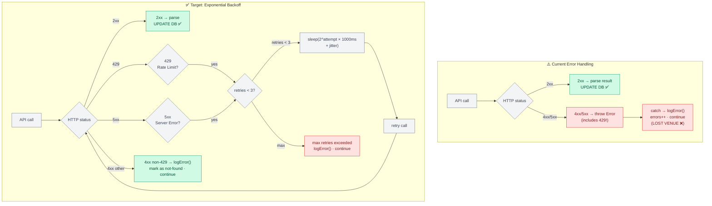

**Implementation:**
```typescript
async function callWithRetry<T>(fn: () => Promise<T>, maxRetries = 3): Promise<T> {
  for (let attempt = 0; attempt <= maxRetries; attempt++) {
    try {
      return await fn();
    } catch (err) {
      const is429 = err instanceof Error && err.message.includes('429');
      const is5xx = err instanceof Error && err.message.match(/HTTP 5\d\d/);
      if ((is429 || is5xx) && attempt < maxRetries) {
        const delay = Math.pow(2, attempt) * 1000 + Math.random() * 500;
        await sleep(delay);
        continue;
      }
      throw err;
    }
  }
  throw new Error('unreachable');
}
```

---

## Diagram 12 — Rate Limit + Backoff Flow

> **What it shows:** The rate limiting architecture across all three layers — browser → edge function → external API.
> **Gap:** Edge function rate limits are enforced (10 AI/min, 30 search/min). External API rate limits (Places 429) have no backoff.

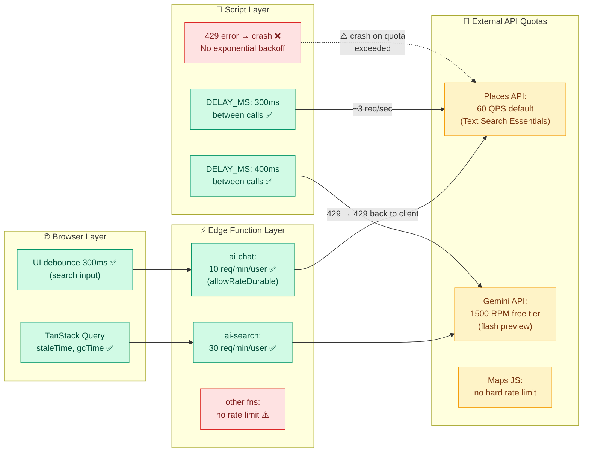

---

## Diagram 13 — Events Enrichment Flow (Missing → Fixed)

> **What it shows:** The complete enrichment path specifically for the `events` table — which has `google_place_id` column ready but 0 rows enriched.
> **This is a P1 blocker** — event map pins cannot link to Google Maps without `maps_url`.

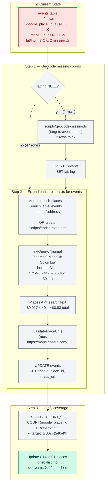

---

## Diagram 14 — Security Boundary Diagram

> **What it shows:** The hard boundary between client-safe and server-only secrets, and every crossing point where that boundary is currently violated.
> **P0:** `VITE_GEMINI_API_KEY` crosses from server-only into the browser bundle.

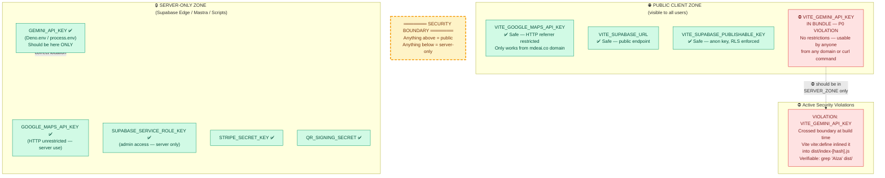

**Verification commands (run after fix):**
```bash
# Before fix: finds Gemini AIza token
grep -r "AIza" dist/ | grep -v "GOOGLE_MAPS"

# After rename + rebuild: must return EMPTY
VITE_GEMINI_API_KEY → GEMINI_API_KEY in .env.local + Vercel
npm run build
grep -r "AIza" dist/  # → 0 results ✅
```

---

## Diagram 15 — Cost / Billing Hotspot Diagram

> **What it shows:** Every billable API call in the system, its SKU, cost per call, and the current monthly estimate at 500 active users.
> **Hotspots:** Places API Text Search at $0.017/req accumulates fast without caching. Gemini requests scale with active users. No caching on Places = paying on every enrichment re-run.

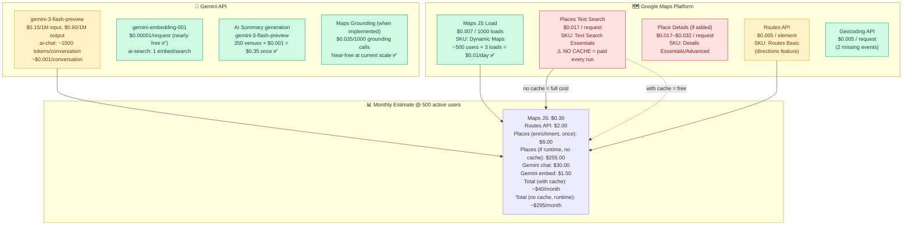

**Billing optimization priority:**
| Action | Savings | Effort |
|--------|---------|--------|
| Wire `places_search_cache` (TTL 7d) | $0–$250/month | Medium |
| Add TTL cleanup cron | Prevents DB bloat | Low |
| Pin `Places Essentials` not `Advanced` field mask | No extra cost | Low |
| Maps Grounding ($0.035/1000) | Negligible | High (new feature) |

---

## Architecture Problems — Top 15

| # | Problem | Severity | Diagram |
|---|---------|----------|---------|
| 1 | `VITE_GEMINI_API_KEY` in production bundle — server key exposed | 🔴 P0 | D3, D14 |
| 2 | ChatMap + MdeMap dual system — duplicate code, diverging behavior | 🔴 HIGH | D1, D7 |
| 3 | `places_search_cache` created but never queried | 🔴 HIGH | D4, D15 |
| 4 | Events table 0/49 enriched — map links broken for all events | 🔴 HIGH | D6, D13 |
| 5 | `tourist_destinations` 78.6% — below ≥80% target | 🟠 P1 | D6, D9 |
| 6 | Gemini Maps Grounding entirely absent | 🟠 P1 | D5 |
| 7 | No 429 exponential backoff in enrichment scripts | 🟠 P1 | D11, D12 |
| 8 | Mastra server local-only — not deployed to production runtime | 🟠 P1 | D10 |
| 9 | 21 local commits not pushed to `origin/main` | 🟠 P1 | D10 |
| 10 | `pinContent.makeContent()` duplicated in ChatMap.tsx | 🟡 MEDIUM | D7 |
| 11 | No accessibility attributes on marker HTML (`title`, `role`, `tabIndex`) | 🟡 MEDIUM | D7 |
| 12 | No TTL cleanup cron for cache tables | 🟡 MEDIUM | D4, D15 |
| 13 | No `thinkingBudget: 0` regression test | 🟡 MEDIUM | D6 |
| 14 | 2 events with missing lat/lng — geocode-missing.ts not run | 🟡 MEDIUM | D13 |
| 15 | No health check or observability on edge functions or Mastra | 🟡 MEDIUM | D10 |

---

## Fix Priority Order — Updated 2026-05-15

### Must-fix before production push (P0/P1)

```
1. VITE_GEMINI_API_KEY → GEMINI_API_KEY   ✅ PARTIAL (code done; Vercel dashboard + key rotation = user action)
   - .env.local: already GEMINI_API_KEY ✅
   - Local bundle: verified clean (1 AIza prefix = Maps key only) ✅
   - mastra-start.sh: updated in both copies ✅
   - Vercel dashboard: must remove VITE_GEMINI_API_KEY, add GEMINI_API_KEY ⚠️ USER ACTION
   - Key rotation: rotate in Google Cloud Console ⚠️ USER ACTION

2. git push origin main (21+ commits — unblock Vercel deploy)              ⚠️ OPEN

3. Enrich events (enrich-places.ts extended for events table)               ✅ PARTIAL (code done, not yet run)
   - Script now calls enrichTable('events', 'name', 'address') ✅
   - Run: cd /home/sk/mde && npx ts-node --esm scripts/enrich-places.ts

4. Enrich 1 more tourist_destination (23/28 → 80%+)                       ⚠️ OPEN (run with step 3)

5. Run geocode-missing.ts for 2 events with missing lat/lng                 ✅ PARTIAL (column bug fixed, not yet run)
   - Bug fixed: venue/neighborhood → name/address ✅
   - Run: cd /home/sk/mde && npx ts-node --esm scripts/geocode-missing.ts
   - Note: one event has address "TBD" — may not resolve

6. Add 429 exponential backoff to enrichment scripts                        ✅ FIXED 2026-05-15
   - withRetry<T>(fn, maxRetries=3) in enrich-places.ts ✅
   - withRetry<T>(fn, maxRetries=3) in cache-ai-summaries.ts ✅
```

### Architecture cleanup (post-deploy)

```
7. Wire places_search_cache in enrich-places.ts (check cache before API call)
8. Consolidate ChatMap.tsx → MdeMap.tsx (single map component)
9. Move makeContent() to pinContent.ts (single source of truth)
10. Add marker a11y: title, role=button, tabIndex=0, aria-label
```

### Feature additions (Phase 2)

```
11. Implement Gemini Maps Grounding in ai-chat edge function
12. Add TTL cleanup cron (DELETE FROM places_*_cache WHERE expires_at < now())
13. Add thinkingBudget:0 regression test
14. Deploy Mastra to cloud runtime (not local-only)
15. Add /health endpoint + edge function error alerting
```

---

## Improved Folder Structure

```
src/
  components/
    map/
      MdeMap.tsx          ← KEEP (canonical map component)
      MdeMarker.tsx       ← KEEP
      MdeMarkerCluster.tsx← KEEP
      MdeInfoWindow.tsx   ← KEEP
      pinContent.ts       ← SINGLE source for makeContent()
    chat/
      ChatMap.tsx         ← DEPRECATE → migrate to MdeMap
      embedded/
        RestaurantCardInline.tsx
        AttractionCardInline.tsx
        EventCardInline.tsx

scripts/
  enrich-places.ts       ← extend for events table
  cache-ai-summaries.ts
  geocode-missing.ts
  enrich-events.ts       ← NEW (or extend enrich-places.ts)
  refresh-stale-ids.ts   ← NEW (12-month refresh)
  cleanup-cache.ts       ← NEW (TTL pruning)

supabase/functions/
  ai-chat/               ← ADD Maps Grounding tool
  places-lookup/         ← NEW (cache-first Places proxy)
  _shared/
    places-cache.ts      ← NEW (cache read/write helpers)
```

---

## Verification Checklist — Updated 2026-05-15

After implementing fixes, verify these in order:

- [x] `grep -r "AIza" dist/` → 1 result only (Maps key, not Gemini) ✅ Verified 2026-05-15
- [x] `npm run build` → exit 0 ✅ 4.42s, 2026-05-15
- [x] `npm run test` → count not regressed ✅ 152/152 root + 56/56 Mastra, 2026-05-15
- [ ] `git log origin/main..HEAD` → 0 commits ahead (pushed) ⚠️ 21+ commits pending
- [ ] `SELECT COUNT(*) FROM events WHERE google_place_id IS NOT NULL` → ≥ 40 ⚠️ script not yet run
- [ ] `SELECT COUNT(*) FROM tourist_destinations WHERE google_place_id IS NOT NULL` → ≥ 23 ⚠️ script not yet run
- [x] `SELECT COUNT(*) FROM restaurants WHERE google_place_id IS NOT NULL` → ≥ 53 ✅ 62/66 (93.9%)
- [ ] `SELECT COUNT(*) FROM places_search_cache` → rows being written on cache miss ⚠️ future phase
- [ ] Browser: event map card → "Open in Maps" link → valid Google Maps URL ⚠️ pending enrichment run
- [x] Console: 0 red errors on `/explore` and chat routes ✅ Verified 2026-05-14

---
