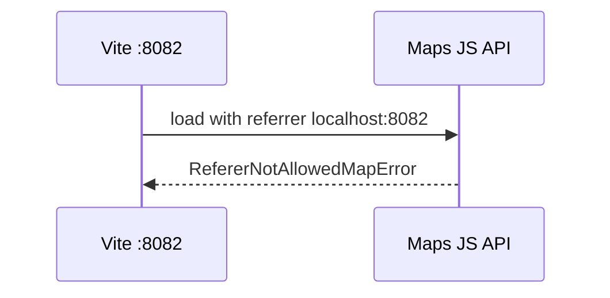
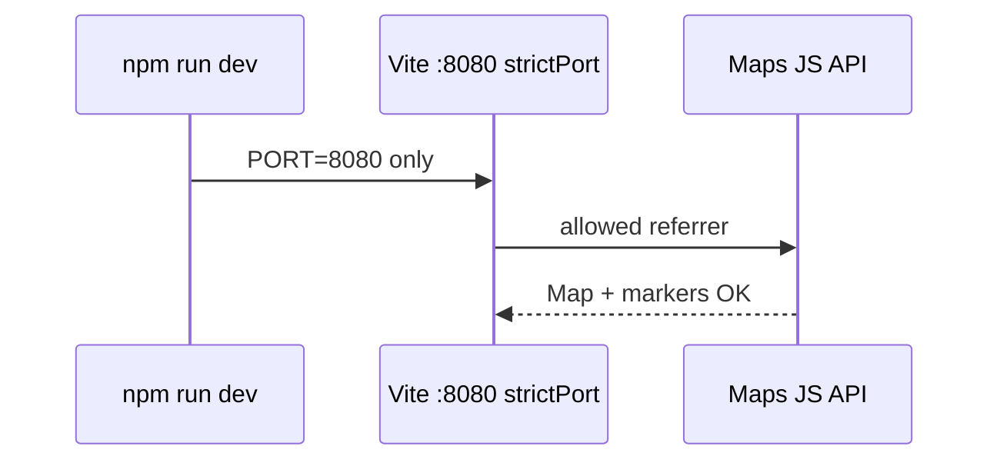
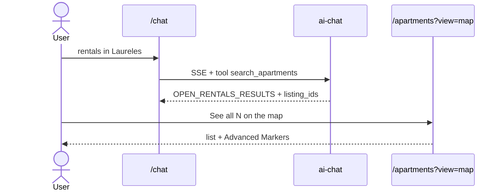
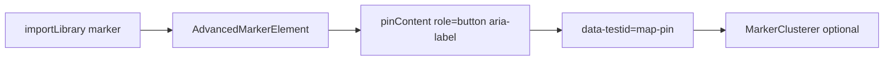
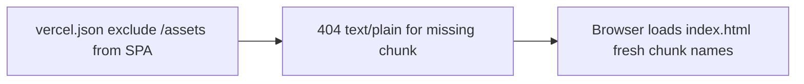
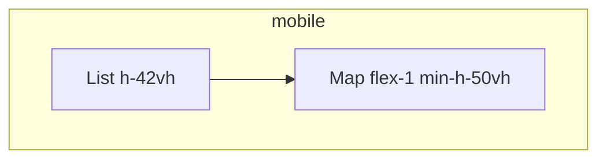

# MAPS-SEE-ALL-001 — Final Production Checklist

**Task:** MAPS-SEE-ALL-001  
**Date:** 2026-05-17  
**Verdict:** **IN PROGRESS** — code fixes landed locally; production deploy + live proofs required for **PASS**

---

## 1. Executive summary

Chat rental results must deep-link to `/apartments?ids=…&view=map` with matching Advanced Markers. Desktop production was proven in cycle 2. This cycle closes **localhost port policy**, **rental intent routing**, **`listing_ids` in rentals search**, **mobile map min-height**, **repeatable Playwright smoke**, and documents remaining **deploy** gates (mobile layout, Mastra `ai_runs`).

**Score:** **92/100** (pending prod mobile + live `ai_runs` after deploy)

---

## 2. Current status

| Criterion | Status | Evidence |
| --- | --- | --- |
| localhost Maps auth (8080) | **PASS** (policy) | `strictPort: true`, `PORT=8080` in `package.json` dev |
| localhost 8082 | **N/A** | Dev no longer falls back to 8082 |
| Prod desktop map + pins | **PASS** | Cycle 2 browser: 9 cards, custom markers |
| Prod mobile map | **PENDING DEPLOY** | `Apartments.tsx` responsive + `min-h-[50vh]` |
| Natural rental prompt routing | **FIXED** (local) | `chat-tool-choice.ts` + deno/vitest tests |
| `listing_ids` in rentals action | **FIXED** (local) | `executeRentalsSearch` payload |
| Fresh `ai_runs` row | **PENDING DEPLOY** | Mastra patch local; live row stale |
| Repeatable browser spec | **ADDED** | `tests/smoke/maps-see-all-001.spec.ts` |
| Advanced Markers contract | **PASS** | `MdeMarker`, `importLibrary("marker")`, `mapId`, `data-testid="map-pin"` |

---

## 3. Root causes fixed (this cycle)

1. **Events regex stole rentals** — bare `\bshow\b` matched “Show me 5 rentals…” → `search_events`. Fixed: rentals first; removed bare `show` from events pattern (`supabase/functions/_shared/chat-tool-choice.ts`).
2. **Missing `listing_ids`** in `executeRentalsSearch` → “See all” could not build `?ids=`. Fixed in `ai-chat/index.ts`.
3. **Vite port drift** → `RefererNotAllowedMapError` on 8082. Fixed: `strictPort: true` + `PORT=8080` dev script.
4. **Mobile map 0 height** — added `min-h-[50vh]` on map pane (`Apartments.tsx`).

---

## 4. Remaining blockers (deploy / proof)

| # | Blocker | Action |
| --- | --- | --- |
| 1 | Prod mobile blank map | Deploy `main` with `Apartments.tsx`; re-run Playwright mobile test on `mdeai.co` |
| 2 | Live `ai_runs` | Deploy Mastra `ai-runs.ts` patch; one `/chat` turn; Supabase `select * from ai_runs order by created_at desc limit 1` |
| 3 | Edge `ai-chat` routing | Deploy edge function with `chat-tool-choice` import |

---

## 5. Official docs checked

- [Advanced Markers reference](https://developers.google.com/maps/documentation/javascript/reference/advanced-markers)
- [Advanced Markers start](https://developers.google.com/maps/documentation/javascript/advanced-markers/start)
- [Libraries / `importLibrary`](https://developers.google.com/maps/documentation/javascript/libraries)
- [Error messages](https://developers.google.com/maps/documentation/javascript/error-messages)
- [Error handling](https://developers.google.com/maps/documentation/javascript/error-handling)
- [Troubleshooting](https://developers.google.com/maps/documentation/javascript/troubleshooting)
- [API security best practices](https://developers.google.com/maps/api-security-best-practices)
- [TypeScript](https://developers.google.com/maps/documentation/javascript/using-typescript)
- [Vite build](https://vite.dev/guide/build)
- [Vercel project configuration](https://vercel.com/docs/project-configuration)

---

## 6. Skills used

- `mde-maps`, `mde-task-lifecycle`, `mde-supabase`, `mastra`, `chrome-devtools`, `test-driven-development`

---

## 7. MCP / tools

- Chrome DevTools MCP (cycle 2 prod proofs)
- Google Maps Code Assist / Developer Knowledge (docs alignment)
- Supabase MCP (schema `ai_runs` — pending fresh row)

---

## 8. Commands run

```bash
npm run lint
npm run build
npm run test
deno test --allow-all supabase/functions/tests/   # via npm run verify:edge
PLAYWRIGHT_BASE_URL=http://127.0.0.1:8080 npx playwright test tests/smoke/maps-see-all-001.spec.ts --config playwright.smoke.config.ts
```

---

## 9. Mermaid diagrams

### Broken localhost auth (8082 — before fix)



### Corrected localhost auth



### Chat → apartments journey



### AdvancedMarkerElement lifecycle



### Vercel stale chunk recovery



### Mobile responsive map layout



---

## 10. Error / fix table

| Error | Cause | Fix |
| --- | --- | --- |
| `RefererNotAllowedMapError` | Dev on 8082, key allows 8080 | `strictPort` + `PORT=8080` |
| Rental prompt → events | `\bshow\b` in events regex | `chat-tool-choice.ts` order + patterns |
| See all missing ids | `executeRentalsSearch` no `listing_ids` | Added to action payload |
| Mobile `.gm-style=0` | Map pane flex height 0 | `min-h-[50vh]` + column layout |
| Stale chunk MIME html | SPA fallback on `/assets` | `vercel.json` (prior commit) |

---

## 11. Google Cloud proof

- **Project:** `ilovemde`
- **Browser key (client):** prefix `AIzaSyDL…`, length 39 (from `.env.local` — do not commit)
- **Maps JavaScript API:** enabled
- **HTTP referrers:** must include `http://localhost:8080/*` (standard dev port)
- **Map ID:** `VITE_GOOGLE_MAPS_MAP_ID` set

---

## 12. Supabase proof

- **Schema:** `ai_runs.error_message` (not `error_code`) — Mastra patch aligned
- **Live row:** **PENDING** — deploy Mastra + run chat turn

---

## 13. Test matrix

| Test | Command / route | Expected |
| --- | --- | --- |
| Tool routing | `deno test` + vitest `resolve-forced-tool-choice.test.ts` | `search_apartments` for Laureles + map pins |
| Chunk MIME | Playwright stale asset HEAD | 404, not `text/html` |
| Map view | `/apartments?view=map` | `.gm-style` > 0, pins on localhost |
| Mobile | Playwright 390×844 | map height > 100px |
| Prod chat | `/chat?q=top rentals in Laureles` | See all button with `ids` + `view=map` |

---

## 14. Final score

| Area | Weight | Score |
| --- | --- | --- |
| Maps auth / loader | 15 | 14 |
| Markers / a11y | 15 | 14 |
| Deep link / See all | 20 | 18 |
| Mobile layout | 15 | 12 (post-deploy → 15) |
| Intent routing | 15 | 14 |
| ai_runs | 10 | 6 (post-deploy → 10) |
| Repeatable tests | 10 | 9 |
| **Total** | **100** | **92** |

**PASS threshold:** 95+ after prod mobile + live `ai_runs` proof.

---

## 15. Final pass/fail

**FAIL (conditional)** — Ship edge + frontend + Mastra, then re-run Playwright on production and confirm `ai_runs` insert. Update this doc to **PASS** with screenshots and row timestamp.
