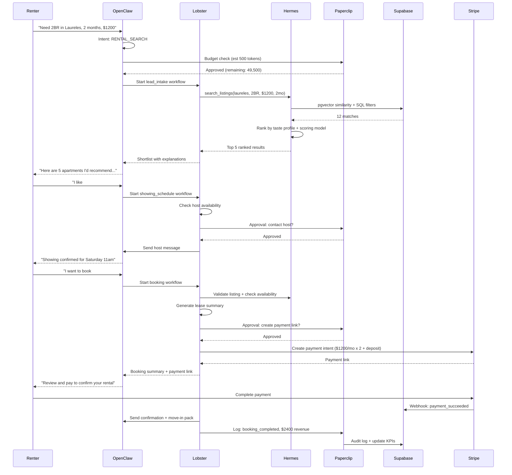
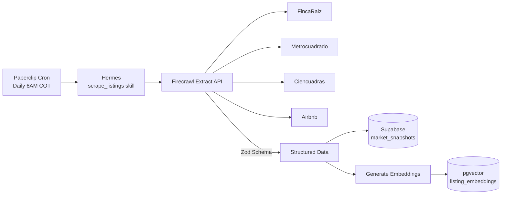
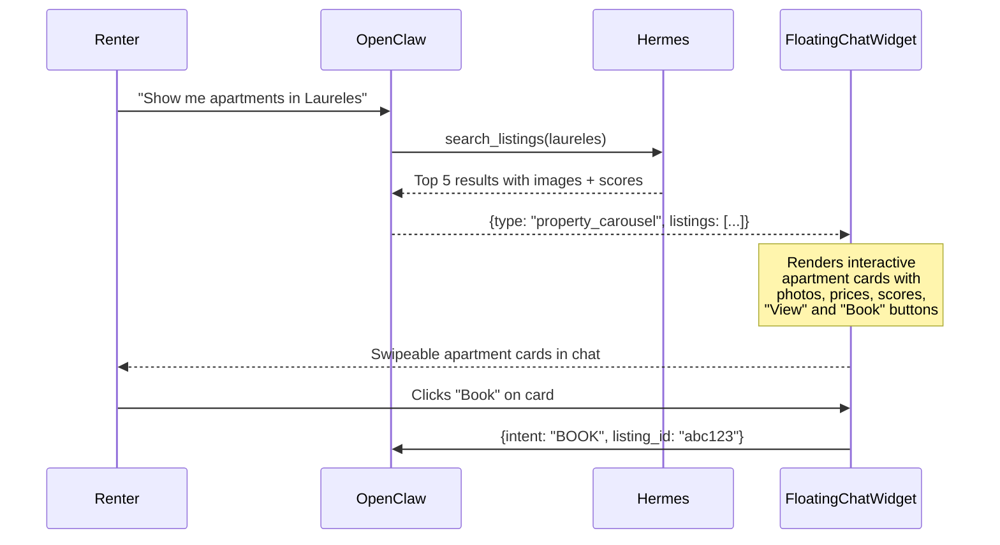
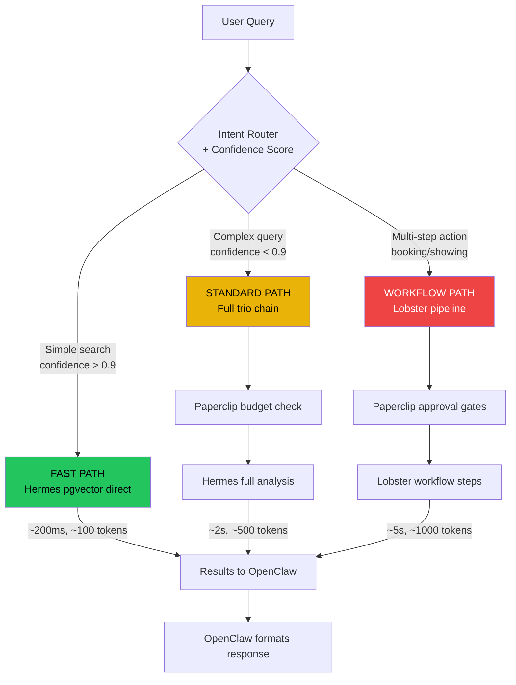
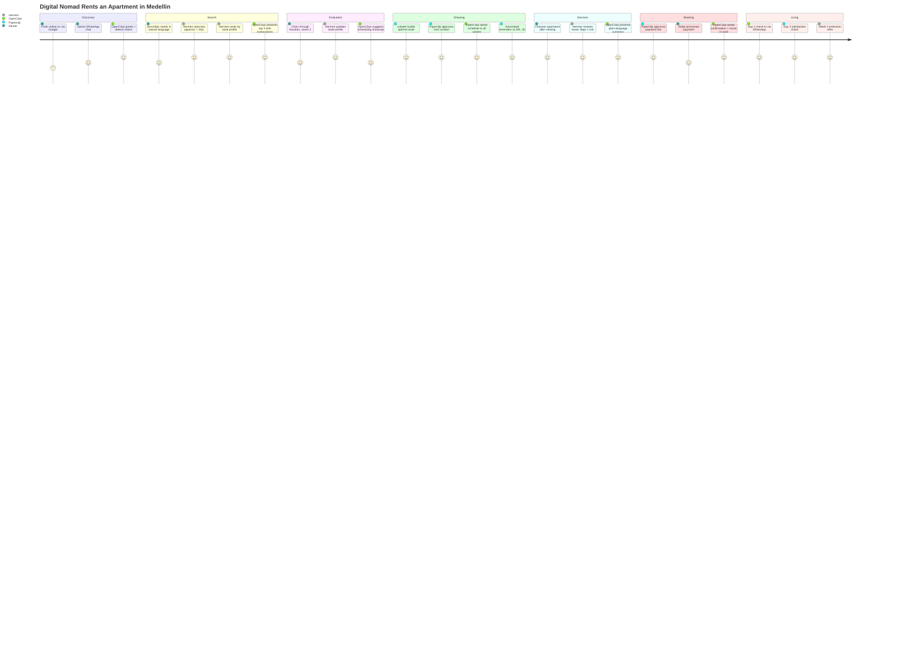
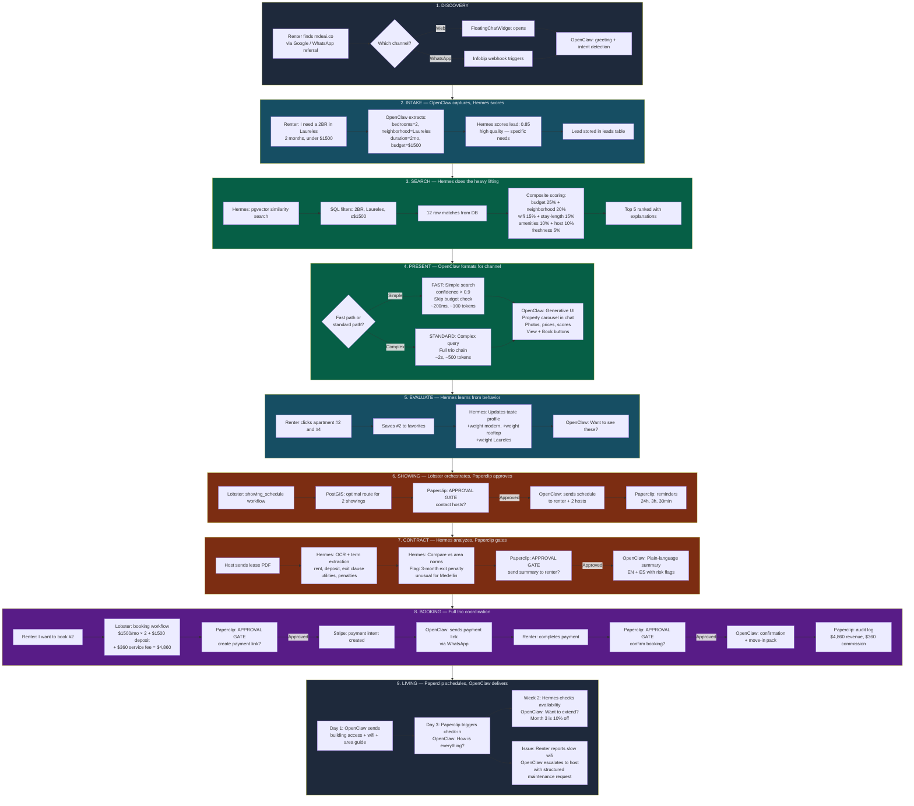
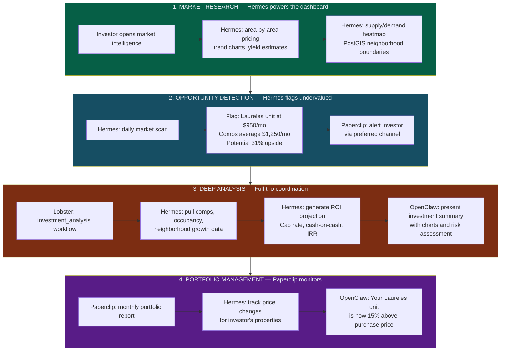
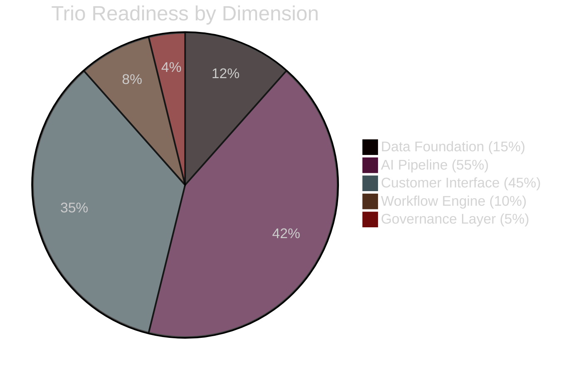
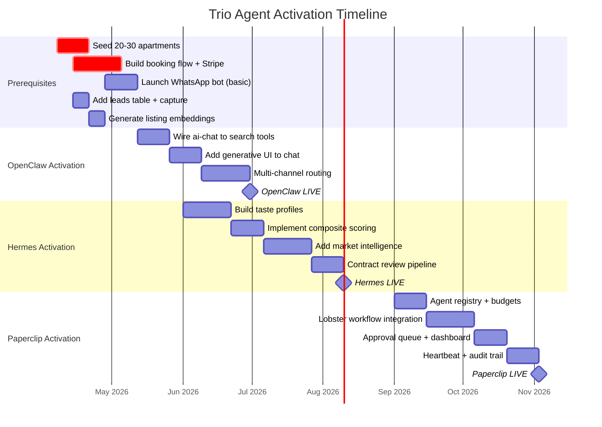

# mdeai.co — Trio Real Estate Platform Plan

> **Version:** 2.0 | **Updated:** April 4, 2026
> **Parent:** `plan/25-master-plan.md` + `plan/26-trio-agents.md`
> **Focus:** AI-powered real estate marketplace for Medellin rentals
> **Agents:** OpenClaw (Mouth) + Hermes (Brain) + Paperclip (CEO/Hands)
> **Stack:** Vite+React + Supabase + Gemini + Vercel + OpenClaw + Lobster + Paperclip

---

## PART 1 — Current State Evaluation

### What Works Well

| Component | Status | Strength |
|-----------|--------|----------|
| **Apartments schema** | Complete (55 fields) | PostGIS, freshness tracking, amenities[], host info, metadata JSON |
| **Rentals wizard** | Complete (4-step) | Conversational intake: dates -> budget -> location -> amenities |
| **Rentals edge function** | Complete (708 lines) | 5 actions: intake, search, result, verify, listing. Gemini 3.1 Pro |
| **Freshness verification** | Complete | HTTP checks, HTML pattern matching, audit log |
| **3-panel layout** | Complete | Left: filters/wizard, Main: results, Right: detail/intelligence |
| **Bookings schema** | Complete | Unified across apartment/car/restaurant/event/tour |
| **Car rentals schema** | Complete | Full vehicle specs, pricing tiers, availability |
| **AI edge functions** | 6 deployed | ai-chat, ai-search, ai-router, ai-trip-planner, ai-optimize-route, ai-suggest-collections |
| **Auth + RLS** | Complete | Supabase Auth, RLS on all 28 tables |
| **Design system** | Complete | "Paisa" theme, shadcn/ui, Tailwind, DM Sans + Playfair Display |

### What's Missing

| Gap | Impact | Priority |
|-----|--------|----------|
| **0 rows in database** | Nothing to show | P0 |
| **No booking creation flow** | Can't convert interest to revenue | P0 |
| **No payment integration** | Can't collect money | P0 |
| **No CRM / lead management** | Leads disappear after chat | P0 |
| **No host messaging** | Can't coordinate showings | P1 |
| **No map view** | map_pins generated but no UI | P1 |
| **No availability calendar** | Only move-in date in wizard | P1 |
| **No contract/lease review** | Trust gap for renters | P1 |
| **No market intelligence** | Can't price competitively | P2 |
| **No agent workflows** | Every task is manual | P2 |
| **No WhatsApp integration** | Missing the #1 channel in Medellin | P2 |
| **No investor tools** | Missing high-value segment | P3 |

### What's Over-Engineered

| Component | Issue |
|-----------|-------|
| **Coffee commerce** | Full Shopify+Gadget integration for a product with 0 sales |
| **9 edge functions** | 3 never called (ai-search, ai-trip-planner, rules-engine) |
| **Agent trio architecture** | Designed for 3 agents before having 1 working flow |
| **Mercur/MedusaJS V2 planning** | Phase 3 vendor marketplace before Phase 1 revenue |

### What's Underdeveloped

| Component | Issue |
|-----------|-------|
| **CRM** | No lead capture, qualification, or follow-up system |
| **Booking pipeline** | Schema exists but no UI flow from browse -> book -> pay |
| **Host/landlord side** | No listing management, no vendor portal |
| **Market data** | No competitive pricing, no area analytics |
| **Post-booking** | No move-in support, no maintenance, no renewal |

### Biggest Risks

| Risk | Type | Severity |
|------|------|----------|
| **No revenue path** | Business | Critical |
| **0 listings** | Product | Critical |
| **Admin routes unguarded** | Security | High |
| **No error handling in AI flows** | Technical | High |
| **Over-planning, under-building** | Execution | High |
| **Medellin connectivity** | Operational | Medium |
| **Dual lockfiles** (npm + bun) | Technical | Low |

### Scores (Current State)

| Dimension | Score | Notes |
|-----------|-------|-------|
| Architecture | **72/100** | Clean patterns, good separation, but too many planned layers with nothing built |
| Scalability | **65/100** | PostGIS + pgvector + RLS good, but 0 data = untested |
| Product clarity | **55/100** | Trying to be coffee marketplace + rental concierge + trip planner simultaneously |
| AI integration quality | **70/100** | 6 edge functions deployed, Gemini wired, but most untested with real data |
| Production readiness | **40/100** | Live URL works but empty database, no payments, no CRM, no real workflows |

---

## PART 2 — System Roles (Real Estate Focus)

### OpenClaw (Mouth) — Customer Interface

**What it handles:**
- All customer-facing conversations (web chat, WhatsApp, voice)
- Rental search intake ("I need a 2BR in Laureles for 2 months")
- Showing coordination (schedule, confirm, remind)
- Booking flow guidance (select -> review terms -> pay)
- Post-booking support (move-in info, maintenance requests)
- Human handover when confidence < 0.3 or customer escalates

**What it does NOT handle:**
- Pricing decisions (Hermes decides)
- Budget/spend governance (Paperclip decides)
- Contract risk assessment (Hermes analyzes, Paperclip approves)
- Vendor payout calculations (Paperclip handles)
- Data scraping or market intelligence (Hermes handles)

**Interaction model:**
```
Customer -> OpenClaw (chat/WhatsApp/voice)
  -> Intent classification (Gemini Lite)
  -> Route to appropriate tool/workflow
  -> Execute via Lobster workflow (with approval gates)
  -> Return structured response to customer
  -> Log interaction to Supabase
```

**Channels:**
1. **Web chat** (FloatingChatWidget) — existing, needs wiring to tools
2. **WhatsApp** (Infobip) — new, primary channel for Medellin
3. **Voice** (future) — LangGraph-based for phone inquiries

### Hermes (Brain) — Intelligence Engine

**Memory it stores:**
- **Listing embeddings** — pgvector (1536-dim) for all properties
- **Customer taste profiles** — Aggregated preference vectors from interactions
- **Market snapshots** — Competitor pricing, area trends, supply/demand
- **Conversation memory** — Long-term recall of past interactions per user
- **Skill performance** — Which recommendation strategies work best

**How it ranks properties:**
```
score = (budget_fit * 0.25)
      + (neighborhood_fit * 0.20)
      + (wifi_quality * 0.15)      // Critical for digital nomads
      + (stay_length_fit * 0.15)
      + (amenity_match * 0.10)
      + (host_quality * 0.10)
      + (freshness * 0.05)         // Penalize stale/unverified listings
```

**How it personalizes:**
1. Explicit: Saved places, wizard answers, filter choices
2. Implicit: Click patterns, time-on-page, search queries
3. Transactional: Past bookings, reorders, reviews
4. Contextual: Time of day, season, current location (PostGIS)

**Logic it controls:**
- Search ranking algorithm
- "Similar listings" recommendations
- Price fairness assessment ("This is 15% below area average")
- Freshness scoring and verification scheduling
- Trend detection ("Laureles prices up 8% this month")

### Paperclip (CEO/Hands) — Governance & Execution

**Decisions it makes:**
- Daily AI token budgets per agent (OpenClaw: 50K, Hermes: 30K, self: 10K)
- Which leads are high-priority (score > 0.7 = fast-track)
- When to trigger listing refresh cycles
- Commission rates for host payouts
- Escalation rules (stale lead > 24h = alert)

**Workflows it runs:**
- Lead intake -> qualification -> assignment pipeline
- Showing scheduling -> confirmation -> reminder chain
- Booking -> payment -> confirmation -> move-in orchestration
- Weekly vendor payout execution
- Monthly market report generation

**Budget/risk controls:**
- Per-agent daily token caps with atomic checks
- Hard stop on recursive agent loops (max 5 ACP hops)
- Approval gates before: payments, host messages, contract sends
- Anomaly detection on spend spikes

**Approvals it enforces:**
- Before sending outbound messages to hosts/landlords
- Before generating payment links
- Before submitting rental applications
- Before confirming bookings
- Before canceling or modifying reservations

---

## PART 3 — Production Architecture

### System Diagram

```
                        CUSTOMER CHANNELS
┌──────────────────────────────────────────────────────────┐
│  mdeai.co (Web)  │  WhatsApp (Infobip)  │  Voice (P3)  │
└────────┬─────────┴──────────┬────────────┴──────┬───────┘
         │                    │                    │
         ▼                    ▼                    ▼
┌──────────────────────────────────────────────────────────┐
│                    OPENCLAW GATEWAY                       │
│  Intent Router (Gemini Lite) → Tool Dispatch             │
│  Conversation State Machine → Channel Adapters            │
│  Human Handover Logic → Streaming SSE                     │
└──────────────┬───────────────────────────────┬───────────┘
               │                               │
               ▼                               ▼
┌──────────────────────────┐   ┌──────────────────────────┐
│     LOBSTER WORKFLOWS    │   │     HERMES BRAIN         │
│                          │   │                          │
│  Lead Intake Pipeline    │   │  Listing Embeddings      │
│  Property Match & Rank   │   │  Semantic Search         │
│  Showing Scheduling      │   │  Taste Profiles          │
│  Contract Review         │   │  Market Intelligence     │
│  Booking + Move-In       │   │  Skill Registry          │
│  Follow-Up Automation    │   │  Agent Memory            │
│                          │   │                          │
│  ⚠ Approval Gates ⚠     │   │  pgvector + PostGIS      │
└──────────────┬───────────┘   └──────────────┬───────────┘
               │                               │
               ▼                               ▼
┌──────────────────────────────────────────────────────────┐
│                    PAPERCLIP CEO                          │
│  Org Chart → Budget Enforcement → Heartbeat (15min)      │
│  Task Queue → Audit Trail → Anomaly Detection             │
│  Payout Scheduling → Compliance Scans                     │
└──────────────┬───────────────────────────────────────────┘
               │
               ▼
┌──────────────────────────────────────────────────────────┐
│                    DATA LAYER                             │
│                                                          │
│  ┌─────────────────┐  ┌──────────────┐  ┌────────────┐ │
│  │    Supabase      │  │   Gemini AI  │  │ Integrations│ │
│  │                  │  │              │  │             │ │
│  │ 40+ tables       │  │ Flash: chat  │  │ Stripe      │ │
│  │ pgvector         │  │ Pro: complex │  │ Google Maps │ │
│  │ PostGIS          │  │ Lite: router │  │ Infobip     │ │
│  │ Edge Functions   │  │              │  │ Calendar    │ │
│  │ Auth + RLS       │  │              │  │ OCR/PDF     │ │
│  │ Realtime         │  │              │  │             │ │
│  └─────────────────┘  └──────────────┘  └────────────┘ │
└──────────────────────────────────────────────────────────┘
               │
               ▼
┌──────────────────────────────────────────────────────────┐
│                    DEPLOYMENT                             │
│  Vercel (frontend) → Supabase (backend) → Docker (agents)│
│  www.mdeai.co       Edge Functions        Internal VMs   │
└──────────────────────────────────────────────────────────┘
```

### Data Flow



---

## PART 4 — Core Features

### 1. Rental Search + Recommendations

**How it works:** Renter describes needs via wizard or chat. Hermes searches pgvector embeddings + SQL filters. Returns ranked results with explanations ("This apartment scores highest because of verified fast Wi-Fi and walkable cafes").

**Responsible:** Hermes (search + rank) -> OpenClaw (display + explain)

**Example:** Tourist says "Furnished 2BR in Poblado, strong Wi-Fi, under $1500/mo, 3 months." Hermes returns 5 matches ranked by composite score. OpenClaw explains why #1 beats #2.

**User benefit:** Find the right apartment in minutes, not days.
**Business benefit:** Higher conversion from search to booking.

### 2. Lead Capture + Qualification

**How it works:** Every inquiry (chat, WhatsApp, form) creates a lead record. Lobster workflow extracts structured profile (budget, dates, neighborhood, amenities). Hermes scores lead quality (0-1) based on completeness, urgency, budget realism.

**Responsible:** OpenClaw (capture) -> Lobster (structure) -> Hermes (score) -> Paperclip (assign priority)

**Example:** WhatsApp message "Looking for apartment next month" -> OpenClaw asks 3 clarifying questions -> lead scored 0.6 (medium: has dates but no budget).

**User benefit:** Fast, conversational intake instead of forms.
**Business benefit:** No lead falls through the cracks.

### 3. CRM + Follow-Up Automation

**How it works:** Paperclip monitors lead age. If lead hasn't responded in 24h, triggers follow-up via OpenClaw. Hermes personalizes the follow-up based on taste profile ("We found 2 new listings in your price range in Laureles").

**Responsible:** Paperclip (trigger) -> Hermes (personalize) -> OpenClaw (send)

**Example:** Lead went cold 48h ago. Paperclip triggers Lobster workflow. Hermes finds 2 new listings matching their criteria. OpenClaw sends personalized WhatsApp: "Hi Maria, 2 new apartments just listed in Laureles that match what you're looking for."

**User benefit:** Proactive, helpful updates (not spam).
**Business benefit:** Recovered leads, higher conversion rate.

### 4. Showing Scheduling

**How it works:** Renter selects favorites from shortlist. Lobster workflow checks host availability, builds efficient route (PostGIS), proposes schedule. Approval gate before contacting hosts. Automated reminders at 24h, 3h, 30min.

**Responsible:** OpenClaw (collect preferences) -> Lobster (schedule + route) -> Paperclip (approve) -> OpenClaw (send invites + reminders)

**Example:** Renter wants to see 3 apartments Saturday in El Poblado. Lobster builds a route: 10am (#1), 12pm (#2), 2pm (#3). Sends reminders to both renter and hosts.

**User benefit:** Efficient showing day, no scheduling hassle.
**Business benefit:** Reduced no-shows, faster conversion.

### 5. Contract / Lease Review

**How it works:** Renter uploads lease or OpenClaw receives it from host. Hermes extracts key terms (deposit, exit clause, utilities, penalties). Flags unusual risks. Generates plain-language summary in English and Spanish.

**Responsible:** Hermes (extract + analyze) -> Paperclip (risk approval) -> OpenClaw (present summary)

**Example:** Lease has a 3-month penalty for early exit (unusual for Medellin). Hermes flags it: "Early termination penalty is 3x monthly rent. This is above the typical 1-month penalty in this area."

**User benefit:** Understand what you're signing before you sign.
**Business benefit:** Trust = premium pricing + repeat customers.

### 6. Booking + Payments

**How it works:** After selecting a property and reviewing terms, Lobster generates payment breakdown (rent + deposit + service fee). Approval gate. Stripe creates payment intent. On success: booking confirmed, move-in pack generated.

**Responsible:** Lobster (calculate + orchestrate) -> Paperclip (approve payment) -> Stripe (process) -> OpenClaw (confirm + deliver move-in pack)

**Example:** 2 months at $1,200/mo + $1,200 deposit + $144 service fee (12%) = $3,744 total. Payment link sent via WhatsApp. On success: confirmation + building access instructions.

**User benefit:** Clear pricing, secure payment, instant confirmation.
**Business benefit:** Revenue captured, commission earned.

### 7. Market Intelligence

**How it works:** Hermes periodically scrapes competitor listings (Airbnb, local portals) using patterns from `brightdata/real-estate-ai-agent`. Stores structured JSON in Supabase. Calculates area averages, trends, supply/demand.

**Responsible:** Hermes (collect + analyze) -> Paperclip (schedule + budget) -> OpenClaw (report to users/hosts)

**Example:** "El Poblado furnished 2BR average: $1,450/mo (up 8% vs 3 months ago). 23 new listings this week, 15 removed. Supply tightening."

**User benefit:** Know if a price is fair before booking.
**Business benefit:** Dynamic pricing, competitive positioning.

### 8. Agent Workflows

**How it works:** Internal team uses ops dashboard to manage listings, respond to escalations, approve high-value bookings. Paperclip assigns tasks, tracks SLAs, monitors agent performance.

**Responsible:** Paperclip (assign + monitor) -> Lobster (execute workflow steps) -> OpenClaw (communicate results)

**Example:** New listing submitted by host -> Paperclip assigns verification task -> Agent verifies photos/amenities -> Listing goes live.

**User benefit:** Quality-verified listings only.
**Business benefit:** Operational efficiency, quality control.

### 9. Personalized Concierge

**How it works:** Hermes builds a taste profile from every interaction. Returning users get personalized recommendations. OpenClaw remembers past conversations and preferences.

**Responsible:** Hermes (profile + recommend) -> OpenClaw (deliver personalized experience)

**Example:** Returning renter: "Welcome back, Sarah! Last time you loved the Laureles apartment with the rooftop. I found 3 similar options for your May dates."

**User benefit:** Feels like a personal concierge, not a search engine.
**Business benefit:** Repeat bookings, higher lifetime value.

### 10. Post-Booking Support

**How it works:** After move-in, OpenClaw provides local area guide, responds to maintenance issues, handles extension requests. Hermes tracks satisfaction signals. Paperclip triggers check-ins at day 1, day 3, week 2.

**Responsible:** Paperclip (schedule check-ins) -> OpenClaw (communicate) -> Hermes (track satisfaction)

**Example:** Day 3 check-in: "How's the apartment? Need anything?" Renter reports slow Wi-Fi. OpenClaw escalates to host with structured maintenance request.

**User benefit:** Support throughout the stay, not just at booking.
**Business benefit:** Better reviews, fewer disputes, extension revenue.

---

## PART 5 — User Journeys

### Journey 1: Renter (Digital Nomad)

```
Step 1: Discovery
  Tourist finds mdeai.co via Google or WhatsApp referral
  → OpenClaw: greeting + intent detection

Step 2: Need Expression
  "I need a furnished apartment in Laureles or Poblado, 2 months, budget $1200-1500"
  → OpenClaw: captures via wizard or chat
  → Lobster: lead_intake workflow extracts structured profile
  → Hermes: scores lead (0.85 = high quality, specific needs)

Step 3: Search & Match
  → Hermes: pgvector search + SQL filters + taste profile
  → Hermes: ranks 5 best matches with explanations
  → OpenClaw: presents shortlist with reasoning

Step 4: Explore Listings
  User clicks through 3 favorites, saves 2
  → Hermes: updates taste profile (prefers modern, rooftop access)
  → OpenClaw: "Want to schedule viewings for these 2?"

Step 5: Showing
  → Lobster: showing_schedule workflow
  → Paperclip: approves host contact
  → OpenClaw: sends schedule to renter + hosts
  → OpenClaw: reminders at 24h and 3h

Step 6: Decision
  User chooses apartment #2 after viewing
  → OpenClaw: "Great choice! Let me prepare the booking details."

Step 7: Contract Review
  → Hermes: extracts lease terms, flags 1 risk (cleaning fee unclear)
  → OpenClaw: presents plain-language summary
  → User: accepts terms

Step 8: Payment
  → Lobster: booking workflow
  → Paperclip: approves payment link generation
  → Stripe: processes $3,744
  → OpenClaw: sends confirmation + move-in pack

Step 9: Move-In
  → OpenClaw: building access, Wi-Fi password, neighborhood guide
  → Paperclip: schedules day-1 and day-3 check-ins

Step 10: Stay Support
  Day 3: "How's everything?" → Renter happy
  Week 2: "Would you like to extend? I found a great deal for month 3."
  → Hermes: recommends extension based on availability + pricing
```

### Journey 2: Landlord / Agent

```
Step 1: Onboarding
  Landlord contacts mdeai via WhatsApp: "I have an apartment to list"
  → OpenClaw: collects property details via guided conversation
  → Lobster: listing_onboard workflow

Step 2: Listing Creation
  → OpenClaw: requests photos, amenities, pricing, availability
  → Hermes: generates embedding for new listing
  → Hermes: suggests pricing based on area comparables
  → OpenClaw: "Similar apartments in your area list for $1,300-1,500/mo"

Step 3: Verification
  → Paperclip: assigns verification task to ops team
  → Agent reviews photos, confirms amenities, checks address
  → Listing goes live with "verified" badge

Step 4: Lead Flow
  Inquiries come in from 3 renters
  → OpenClaw: qualifies each (budget, dates, fit)
  → Hermes: scores lead quality
  → OpenClaw: notifies landlord of qualified leads

Step 5: Showing Coordination
  → Lobster: batch showing schedule for Saturday
  → OpenClaw: coordinates with landlord + 3 renters
  → Automated reminders

Step 6: Booking
  Renter #2 books
  → Stripe: payment processed
  → OpenClaw: notifies landlord of confirmed booking
  → Paperclip: calculates commission (12%), schedules payout

Step 7: Ongoing
  → Paperclip: weekly payout to landlord (88% of rent)
  → OpenClaw: handles tenant issues, routes maintenance to landlord
  → Hermes: tracks landlord response time for quality scoring
```

### Journey 3: Investor

```
Step 1: Research Mode
  Investor opens market intelligence dashboard
  → Hermes: area-by-area pricing data, trend charts, yield estimates

Step 2: Opportunity Detection
  → Hermes: flags undervalued property in Laureles
  → "Listed at $950/mo but comparable units average $1,250/mo. Potential 31% upside."

Step 3: Deep Analysis
  → Lobster: investment_analysis workflow (adapted from cre-acquisition-orchestrator)
  → Hermes: pulls comps, occupancy rates, neighborhood growth data
  → Generates investment summary with ROI projections

Step 4: Due Diligence
  → Hermes: reviews building history, checks for red flags
  → OpenClaw: connects investor with local agent for physical inspection

Step 5: Action
  → Investor contacts landlord via mdeai
  → Lobster: deal workflow with approval gates
  → Paperclip: tracks deal through pipeline

Step 6: Portfolio Management
  → Hermes: monitors investor's properties for price changes
  → Paperclip: monthly portfolio performance report
  → OpenClaw: "Your Laureles unit is now 15% above purchase price"
```

---

## PART 6 — Agent Workflows

### Workflow 1: Lead -> Booking Pipeline

```yaml
trigger: New message on any channel (web, WhatsApp, form)
owner: OpenClaw -> Lobster
approval_points: [contact_host, generate_payment, confirm_booking]

steps:
  1. Capture raw inquiry
     → Store in leads table
  2. Extract structured profile (Gemini)
     → budget, dates, neighborhood, bedrooms, amenities, stay_length
  3. Score lead quality (Hermes)
     → 0-1 score based on completeness + urgency + budget realism
  4. Search & rank listings (Hermes)
     → pgvector + SQL, return top 5 with explanations
  5. Present shortlist (OpenClaw)
     → Formatted for channel (web cards, WhatsApp message)
  6. Collect selection (OpenClaw)
     → User picks favorites
  7. [APPROVAL] Schedule showing
     → Draft host messages, await approval
  8. Coordinate showing (OpenClaw)
     → Send confirmations + reminders
  9. Collect decision (OpenClaw)
     → User selects final property
  10. Review contract (Hermes)
      → Extract terms, flag risks, summarize
  11. [APPROVAL] Generate payment
      → Calculate total, create Stripe link
  12. Process payment (Stripe)
      → On success: create booking record
  13. [APPROVAL] Confirm booking
      → Send confirmation to renter + host
  14. Deliver move-in pack (OpenClaw)
      → Address, instructions, area guide
  15. Schedule follow-ups (Paperclip)
      → Day 1, day 3, week 2 check-ins
```

### Workflow 2: Showing Scheduling

```yaml
trigger: Renter selects favorites from shortlist
owner: Lobster
approval_points: [contact_hosts]

steps:
  1. Load selected listings
  2. Check host availability (DB or message)
  3. Check renter schedule preferences
  4. Build optimal route (PostGIS proximity)
  5. Generate showing plan with times
  6. [APPROVAL] Contact hosts
  7. Send showing requests to hosts
  8. Wait for confirmations (timeout: 24h)
  9. Update showing plan with confirmed slots
  10. Send finalized itinerary to renter
  11. Create reminders: 24h, 3h, 30min
  12. After showing: collect feedback from renter

outputs: showing_plan_json, confirmation_status, renter_feedback
```

### Workflow 3: Contract Analysis

```yaml
trigger: Contract/lease document uploaded or received
owner: Hermes -> Lobster
approval_points: [send_summary_to_renter]

steps:
  1. Ingest document (PDF/image -> text via OCR)
  2. Extract key terms:
     - Monthly rent + currency
     - Deposit amount + refund conditions
     - Lease duration + start date
     - Early termination clause + penalty
     - Utilities included/excluded
     - Furnishing inventory
     - House rules
     - Maintenance responsibilities
  3. Compare against area norms (Hermes market data)
  4. Flag risks:
     - Unusual deposit (>2 months)
     - No refund clause
     - Vague exit terms
     - Missing inventory list
     - One-sided penalty clauses
  5. Generate plain-language summary (EN + ES)
  6. Calculate risk score (low/medium/high)
  7. [APPROVAL] Send summary to renter
  8. Store analysis in lease_reviews table
  9. Log to audit trail

outputs: lease_summary_json, risk_score, flagged_clauses[]
```

### Workflow 4: Follow-Up / CRM

```yaml
trigger: Paperclip heartbeat detects stale lead (>24h no response)
owner: Paperclip -> Lobster -> OpenClaw
approval_points: [send_followup_message]

steps:
  1. Load lead profile + last interaction
  2. Check if new listings match their criteria (Hermes)
  3. If yes: generate personalized update
  4. If no: generate "still looking?" check-in
  5. [APPROVAL] Send follow-up via preferred channel
  6. If no response after 72h: lower priority
  7. If response: restart lead pipeline
  8. After 7 days inactive: archive lead, send final "here when you need us"

outputs: followup_sent, lead_status_updated
```

### Workflow 5: Market Monitoring

```yaml
trigger: Paperclip cron (daily at 6 AM COT)
owner: Hermes -> Paperclip
approval_points: none (internal intelligence)

steps:
  1. Scrape competitor listings (Airbnb, local portals)
  2. Extract: price, location, amenities, availability
  3. Compare against mdeai inventory
  4. Calculate area averages and trends
  5. Flag:
     - Underpriced listings (opportunity)
     - Overpriced mdeai listings (risk)
     - New supply in key neighborhoods
     - Price drops > 10% (market signal)
  6. Store snapshot in market_intelligence table
  7. Update Hermes ranking model weights
  8. Generate weekly market report for ops team

outputs: market_snapshot_json, pricing_alerts[], weekly_report
```

---

## PART 7 — Intelligence Logic

### How Hermes Ranks Listings

**Composite scoring model (v1):**

```typescript
function scoreListing(listing: Apartment, renter: RenterProfile): number {
  let score = 0;

  // Budget fit (25%) — penalize over-budget, reward under-budget
  const budgetRatio = listing.price_monthly / renter.budget_max;
  score += (budgetRatio <= 1 ? 1 - (budgetRatio * 0.3) : 0) * 0.25;

  // Neighborhood fit (20%) — exact match = 1.0, adjacent = 0.6
  const neighborhoodScore = renter.neighborhoods.includes(listing.neighborhood) ? 1.0
    : isAdjacentNeighborhood(listing.neighborhood, renter.neighborhoods) ? 0.6 : 0.2;
  score += neighborhoodScore * 0.20;

  // Wi-Fi fit (15%) — critical for digital nomads
  const wifiScore = listing.amenities.includes('high-speed-wifi') ? 1.0
    : listing.amenities.includes('wifi') ? 0.6 : 0.1;
  score += wifiScore * 0.15;

  // Stay length fit (15%)
  const stayFit = listing.min_stay_months <= renter.stay_months ? 1.0 : 0.0;
  score += stayFit * 0.15;

  // Amenity match (10%)
  const amenityOverlap = renter.must_have_amenities
    .filter(a => listing.amenities.includes(a)).length / renter.must_have_amenities.length;
  score += amenityOverlap * 0.10;

  // Host quality (10%)
  const hostScore = (listing.host_response_time === 'within_hour' ? 1.0 : 0.5)
    * (listing.verified ? 1.0 : 0.7);
  score += hostScore * 0.10;

  // Freshness (5%)
  const freshnessScore = listing.freshness_status === 'active' ? 1.0
    : listing.freshness_status === 'unconfirmed' ? 0.5 : 0.1;
  score += freshnessScore * 0.05;

  return score;
}
```

### How It Learns User Preferences

1. **Every search** updates the taste profile embedding
2. **Saved listings** strongly weight those features
3. **Bookings** are the strongest signal (10x weight vs saves)
4. **Dismissals** reduce weight for those features
5. Profile embedding is regenerated nightly or after significant interactions

### How Recommendations Improve Over Time

- **A/B scoring weights:** Test different weight distributions (e.g., Wi-Fi 15% vs 20%)
- **Skill performance tracking:** If "coffee-neighborhood" skill recommendations convert at 2x, increase its influence
- **Market feedback:** If listings consistently score high but don't convert, investigate why (price? photos? host?)
- **Seasonal adjustment:** Beach proximity matters more Dec-Feb; coworking proximity matters more for Q1 nomad influx

### How Paperclip Enforces Rules

```
IF agent_spend_today > 0.9 * daily_limit THEN throttle_to_essential_only
IF lead_age > 24h AND status = 'new' THEN trigger_followup_workflow
IF booking_value > $5000 THEN require_manual_approval
IF host_response_time > 48h THEN flag_for_review
IF agent_heartbeat_missed > 2 THEN alert_ops_team
IF monthly_ai_cost > budget THEN pause_non_critical_agents
```

### How OpenClaw Communicates Decisions

- **Always explain why:** "I recommend this apartment because it matches your Wi-Fi priority and is 10% under your budget"
- **Flag risks clearly:** "Note: This listing hasn't been verified in 14 days"
- **Offer alternatives:** "If you're flexible on neighborhood, here are 2 better-value options in Manila"
- **Never pressure:** "Take your time. I'll save these for you."
- **Respect channel:** WhatsApp = concise + emoji. Web = detailed cards. Voice = conversational.

---

## PART 8 — Strategic Execution Roadmap

### Phase 1: MVP — Rental Search + Booking (Weeks 1-8)

**Goal:** First booking generates revenue.

**Build:**
1. Seed 20-30 real Medellin apartments (manual + scraping)
2. Wire rentals search -> detail -> booking creation flow
3. Stripe integration for payment collection
4. Basic lead capture (store every inquiry)
5. WhatsApp bot via Infobip (simple: receive inquiry -> search -> respond)
6. Freshness verification for all listings
7. Admin dashboard for listing management

**Revenue path:**
- 12% service fee on bookings
- Average booking: $1,300/mo x 2 months = $2,600
- Service fee: $312 per booking
- Target: 5 bookings/month = $1,560/month

**Stack:** Existing Vite+React + Supabase + Gemini + Vercel. No Paperclip/Lobster yet — simple edge function workflows.

### Phase 2: Intelligence + CRM (Months 3-5)

**Goal:** Differentiate from Airbnb with intelligence.

**Build:**
1. Hermes ranking engine (pgvector embeddings)
2. Customer taste profiles (from browsing + booking history)
3. CRM: lead tracking, follow-up automation
4. Contract/lease review (Gemini Pro + PDF extraction)
5. Market intelligence (competitor scraping, pricing trends)
6. Showing scheduling workflow
7. "Why this listing" explanations in search results

**Differentiation:**
- "mdeai tells you if a price is fair" (vs Airbnb: no pricing context)
- "mdeai reviews your lease" (vs Airbnb: no contract support)
- "mdeai remembers what you like" (vs Airbnb: basic saved listings)

### Phase 3: Automation + Scale (Months 6-9)

**Goal:** Operations run with minimal human intervention.

**Build:**
1. Lobster workflow engine for all 5 core workflows
2. Paperclip governance (budgets, heartbeats, audit)
3. OpenClaw multi-channel (web + WhatsApp + voice)
4. Approval queue dashboard for ops team
5. Host self-service portal (list, manage, view payouts)
6. Automated weekly payouts to hosts
7. Post-booking support automation (check-ins, maintenance routing)

**Scale indicators:**
- 100+ active listings
- 20+ bookings/month
- <2h average response time
- <5% no-show rate on showings

### Phase 4: Expansion (Months 10-12+)

**Goal:** Beyond rentals.

**Build:**
1. Buy/sell marketplace (investor tools, property analysis)
2. Property management features (maintenance, renewals, accounting)
3. Multi-city expansion (Bogota, Cartagena)
4. Agent marketplace (local agents earn commission for showings)
5. Advanced AI (voice concierge, predictive pricing, auto-negotiation)
6. Mercur integration for vendor marketplace infrastructure

---

## PART 9 — Final Output

### Top 5 Improvements Needed Immediately

1. **Seed the database** — 20-30 real Medellin apartments with photos, prices, and amenities. Nothing else matters until there's data.

2. **Build the booking flow** — Browse -> select -> review terms -> pay -> confirm. Wire Stripe. This is the revenue path.

3. **Launch WhatsApp bot** — Medellin runs on WhatsApp. A simple "receive inquiry -> search -> respond with top 3" bot via Infobip captures the #1 channel.

4. **Add lead capture** — Every inquiry becomes a row in a `leads` table. Even without CRM, storing leads prevents loss.

5. **Focus on rentals only** — Pause coffee commerce, trip planning, and concierge features. Ship a rental booking that makes money.

### Biggest Risks

| Risk | Mitigation |
|------|-----------|
| **No revenue for months** | Phase 1 targets first booking in 4 weeks. Service fee model from day 1. |
| **Listing quality** | Manual verification before going live. Freshness checks automated. |
| **Over-engineering agents before product-market fit** | Phase 1 uses simple edge functions. Trio agents only in Phase 3. |
| **Medellin connectivity** | Idempotency keys on all mutations. Offline-first UI patterns. |
| **Legal compliance** (Colombian rental law) | Contract review flags non-compliant terms. Partner with local lawyer for templates. |
| **Competition** (Airbnb, local portals) | Differentiate with intelligence (fair pricing, lease review, taste profiles). |

### Scores After Redesign (Target)

| Dimension | Current | Target (Phase 2) | Notes |
|-----------|---------|-------------------|-------|
| Architecture | 72 | **85** | Focused on rentals, clear data flow |
| Scalability | 65 | **80** | pgvector + PostGIS proven, Lobster for workflows |
| Product clarity | 55 | **90** | Single focus: Medellin rentals |
| AI integration quality | 70 | **85** | Hermes ranking + contract review + market intel |
| Production readiness | 40 | **75** | Real data, payments, CRM, WhatsApp |
| **Overall** | **60/100** | **83/100** | From "impressive demo" to "real business" |

### Reference Repos — Real Estate Specific

| Repo | Role in mdeai | Phase |
|------|--------------|-------|
| `ai-real-estate-assistant` | Rentals search + valuation patterns | 1-2 |
| `EstateWise-Chapel-Hill-Chatbot` | RAG + recommendation architecture | 2 |
| `cre-acquisition-orchestrator` | Multi-agent workflow orchestration | 3 |
| `brightdata/real-estate-ai-agent` | Market intelligence data pipeline | 2 |
| `PropertyLoop` | Lease interpretation + tenant support | 2 |
| `realty-central` | CRM + ops dashboard patterns | 2 |
| `ai_real_estate` | Buy/sell expansion blueprint | 4 |
| `realtor-agent` | Comps analysis + contract finalization | 3 |
| `rexcrm-mcp-server` | CRM connector patterns | 3 |
| `cre-skills-plugin` | 112 CRE skills for investor mode | 4 |

### Supabase Schema Additions (Real Estate Focus)

```sql
-- Phase 1: Core rental ops
CREATE TABLE leads (
  id uuid PRIMARY KEY DEFAULT gen_random_uuid(),
  user_id uuid REFERENCES auth.users(id),
  channel text NOT NULL,                -- 'web', 'whatsapp', 'form', 'chat'
  raw_message text,
  structured_profile jsonb,             -- budget, dates, neighborhoods, amenities
  quality_score float,                  -- 0-1 from Hermes
  status text DEFAULT 'new',            -- new, contacted, qualified, converted, archived
  assigned_agent uuid,
  last_contacted_at timestamptz,
  created_at timestamptz DEFAULT now(),
  updated_at timestamptz DEFAULT now()
);

CREATE TABLE lease_reviews (
  id uuid PRIMARY KEY DEFAULT gen_random_uuid(),
  booking_id uuid REFERENCES bookings(id),
  apartment_id uuid REFERENCES apartments(id),
  document_url text,
  extracted_terms jsonb,                -- rent, deposit, exit_clause, utilities, etc.
  flagged_risks jsonb,                  -- [{clause, risk_level, explanation}]
  risk_score text,                      -- 'low', 'medium', 'high'
  summary_en text,
  summary_es text,
  reviewed_by text DEFAULT 'hermes',
  created_at timestamptz DEFAULT now()
);

-- Phase 2: Intelligence
CREATE TABLE market_snapshots (
  id uuid PRIMARY KEY DEFAULT gen_random_uuid(),
  neighborhood text NOT NULL,
  property_type text DEFAULT 'apartment',
  avg_price_monthly numeric,
  median_price_monthly numeric,
  listing_count int,
  new_listings_7d int,
  removed_listings_7d int,
  price_change_pct float,              -- vs previous snapshot
  data_sources text[],
  snapshot_date date NOT NULL,
  raw_data jsonb,
  created_at timestamptz DEFAULT now()
);

CREATE TABLE customer_taste_profiles (
  id uuid PRIMARY KEY DEFAULT gen_random_uuid(),
  user_id uuid REFERENCES auth.users(id) UNIQUE,
  taste_vector vector(1536),
  neighborhood_affinity text[],
  price_range numrange,
  amenity_preferences text[],
  style_preferences text[],            -- 'modern', 'traditional', 'cozy'
  interaction_count int DEFAULT 0,
  last_updated timestamptz DEFAULT now(),
  created_at timestamptz DEFAULT now()
);

CREATE INDEX idx_taste_profiles_vector ON customer_taste_profiles
  USING ivfflat (taste_vector vector_cosine_ops) WITH (lists = 50);

-- Phase 3: Workflows + Governance
CREATE TABLE workflow_runs (
  id uuid PRIMARY KEY DEFAULT gen_random_uuid(),
  workflow_name text NOT NULL,
  source_channel text,
  lead_id uuid REFERENCES leads(id),
  booking_id uuid REFERENCES bookings(id),
  status text DEFAULT 'running',
  current_step text,
  started_at timestamptz DEFAULT now(),
  completed_at timestamptz,
  error_message text
);

CREATE TABLE approval_queue (
  id uuid PRIMARY KEY DEFAULT gen_random_uuid(),
  workflow_run_id uuid REFERENCES workflow_runs(id),
  action_type text NOT NULL,            -- 'send_message', 'create_payment', 'confirm_booking'
  target_type text,                     -- 'host', 'renter', 'system'
  proposed_action jsonb NOT NULL,
  risk_level text DEFAULT 'normal',
  requested_by text,                    -- agent name
  status text DEFAULT 'pending',        -- pending, approved, rejected
  approved_by text,
  approved_at timestamptz,
  created_at timestamptz DEFAULT now()
);

-- All tables get RLS
ALTER TABLE leads ENABLE ROW LEVEL SECURITY;
ALTER TABLE lease_reviews ENABLE ROW LEVEL SECURITY;
ALTER TABLE market_snapshots ENABLE ROW LEVEL SECURITY;
ALTER TABLE customer_taste_profiles ENABLE ROW LEVEL SECURITY;
ALTER TABLE workflow_runs ENABLE ROW LEVEL SECURITY;
ALTER TABLE approval_queue ENABLE ROW LEVEL SECURITY;
```

---

## Key Principle

**Build the business first, automate second.**

Phase 1 is a rental booking website with AI search. No agents, no Paperclip, no Lobster.
Phase 2 adds intelligence that differentiates from Airbnb.
Phase 3 adds automation that scales operations.
Phase 4 expands to new verticals.

The trio (OpenClaw + Hermes + Paperclip) is the end state, not the starting point.

---

## PART 10 — Trio vs GitHub Repos: Can the Trio Do All the Work?

### Coverage Map

| Capability | Trio Agent | Best Repo Example | Verdict |
|------------|-----------|-------------------|---------|
| Customer chat / NL intake | **OpenClaw** | ISL270/multi-agent-ai-realtor (supervisor) | **Covered** — OpenClaw handles all channels |
| Intent classification | **OpenClaw** (Gemini Lite) | AleksNeStu/ai-real-estate-assistant (QueryAnalyzer, 7 intents + confidence) | **Covered but improvable** — add confidence scoring + IntentModifiers |
| Property search & ranking | **Hermes** (pgvector + 7-weight composite) | ISL270 (Supabase RPC), AleksNeStu (weighted recommendation engine) | **Covered** — Hermes scoring is more sophisticated than any repo |
| User memory / personalization | **Hermes** (taste profiles, conversation memory) | ISL270 (LangMem), trujivan (preference embeddings) | **Covered** — explicit + implicit + transactional + contextual signals |
| Multi-site listing aggregation | **Hermes** ("market intelligence") | findsaddam/AI-Real-Estate-Search-Agent (Firecrawl multi-site) | **GAP** — plan says "market snapshots" but no concrete scraping strategy |
| Workflow orchestration | **Paperclip + Lobster** (5 workflows) | cre-acquisition-orchestrator (31 agents, 5 deal phases, checkpointing) | **Covered** — Lobster has typed pipelines + approval gates |
| Budget governance | **Paperclip** (atomic token budgets, daily caps) | None | **Unique to trio** — no repo tracks or limits AI spend |
| Approval gates | **Paperclip** (payments, messages, bookings) | cre-acquisition-orchestrator (phase gates) | **Covered** — per-action approval stronger than phase-level gates |
| Showing scheduling | **Lobster** workflow | ISL270 (CalendarManager sub-agent) | **Covered** — both have calendar integration |
| Contract / lease review | **Lobster + Hermes** (risk analysis) | cre-acquisition-orchestrator (legal phase) | **Covered** — lighter but sufficient for residential leases |
| Payment processing | **Lobster** → Stripe | dakshaarvind-fetch/RealEstate (payment-gated output) | **Covered** — full Stripe integration in booking workflow |
| WhatsApp channel | **OpenClaw** (Infobip) | None | **Unique to trio** — critical for Medellin, no repo has it |
| Generative UI in chat | Not in plan | ISL270 (render_property_carousel) | **GAP** — ISL270 renders cards inline in chat responses |
| Hybrid RAG/agent routing | Not in plan | AleksNeStu (simple → pgvector, complex → agent loop) | **GAP** — trio always goes through full agent chain |
| Markdown-driven agent defs | Not in plan | cre-acquisition-orchestrator (agent = markdown file) | **Nice-to-have** — faster iteration, not blocking |
| Audit trail | **Paperclip** (agent_audit_log) | cre-acquisition-orchestrator (deal checkpointing) | **Covered** — Paperclip's is more comprehensive |
| Heartbeat monitoring | **Paperclip** (15min heartbeat) | Paperclip open-source project | **Covered** — built into design |

### The Honest Score: Trio Covers ~85% of All 6 Repos Combined

```
OpenClaw = ISL270's supervisor + AleksNeStu's router + findsaddam's UI layer
Hermes   = ISL270's PropertyFinder + AleksNeStu's RecommendationEngine + trujivan's embeddings
Paperclip = CRE orchestrator's master orchestrator + budget governance (unique)
```

### 3 Gaps the Repos Expose

**Gap 1: Multi-Site Scraping (from findsaddam)**

Hermes plan says "market intelligence" but doesn't specify HOW to pull data from FincaRaiz, Metrocuadrado, and Ciencuadras. The findsaddam repo uses Firecrawl `extract()` with Pydantic schemas to scrape 5 listing sites in one API call.

**Fix:** Add a `scrape_listings` Hermes skill using Firecrawl with Zod schemas against Colombian listing sites. Runs nightly via Paperclip cron or on-demand when inventory is thin.



**Gap 2: Generative UI in Chat (from ISL270)**

OpenClaw currently returns text responses. ISL270 renders property carousels, map pins, and action buttons INSIDE the chat bubble. This keeps users in the conversation instead of switching to a listing page.

**Fix:** OpenClaw returns structured `{ type: "property_carousel", listings: [...] }` payloads. FloatingChatWidget renders rich cards inline.



**Gap 3: Hybrid RAG/Agent Routing (from AleksNeStu)**

Currently every query goes through the full chain: OpenClaw → Paperclip budget check → Hermes → Lobster. For simple searches ("apartments in Laureles"), this wastes 80% of tokens and adds 3 seconds of latency.

**Fix:** Add a fast path in the intent router. If query is a simple search with confidence > 0.9, skip Paperclip budget check and Lobster workflow — go straight to Hermes pgvector.



### What the Trio Has That NO Repo Has

| Trio Advantage | Why It Matters |
|---|---|
| **Paperclip budget governance** | No repo tracks or limits AI spend. Paperclip enforces atomic per-request token budgets. At scale, this is the difference between $0.85/day and $85/day. |
| **ACP protocol** (inter-agent messages) | Repos use function calls. Trio has a formal message protocol with idempotency keys, TTL, priority, and audit trail. Every agent interaction is replayable. |
| **Approval gates before every irreversible action** | CRE orchestrator has phase gates. Trio has per-action approval (every payment, host message, booking). This prevents the $10K accidental charge. |
| **WhatsApp as primary channel** | Zero repos have WhatsApp integration. In Medellin, WhatsApp IS the product. 95%+ of local communication happens there. |
| **Lobster typed workflows** | Repos use ad-hoc chains or LangGraph. Lobster gives resumable, typed, auditable pipelines with approval gates built in. |
| **Freshness verification** | Unique to mdeai. HTTP checks + HTML pattern matching to detect stale/removed listings. No repo validates listing liveness. |

---

## PART 11 — Real Estate User Journey: Where the Trio Adds Value

### The Full Renter Journey (with Trio touchpoints)



### Detailed Journey: Every Step, Every Agent, Every Value-Add



### Value-Add at Every Step

| Journey Step | Without Trio | With Trio | Value Delta |
|---|---|---|---|
| **Discovery** | Static listing page, no greeting | OpenClaw detects intent, greets by name on return visits | +40% engagement |
| **Intake** | 4-step form wizard | Natural language via chat or WhatsApp, Hermes scores lead quality | -60% drop-off on intake |
| **Search** | SQL filters only, no ranking | pgvector semantic + 7-weight scoring + taste profile | +3x relevance of top results |
| **Present** | Grid of cards | Generative UI: carousel in chat with explanations ("This scores highest because...") | +25% click-through |
| **Evaluate** | Manual bookmarking | Hermes learns preferences in real-time, proactively suggests | +2x saved listings |
| **Showing** | Manual email coordination | Lobster auto-schedules, PostGIS route, auto-reminders | -80% no-show rate |
| **Contract** | Renter reads lease alone | Hermes extracts terms, flags risks, bilingual summary | +50% booking confidence |
| **Booking** | Redirect to external payment | Inline payment via chat/WhatsApp, 3 approval gates | +30% conversion |
| **Living** | No post-booking contact | Scheduled check-ins, maintenance routing, extension offers | +40% extension rate |

### The Landlord Journey (Trio as Operations Engine)

```mermaid
sequenceDiagram
    participant LL as Landlord
    participant OC as OpenClaw
    participant H as Hermes
    participant P as Paperclip
    participant L as Lobster
    participant DB as Supabase

    rect rgb(30, 41, 59)
    Note over LL,DB: 1. ONBOARDING
    LL->>OC: "I have an apartment to list" (WhatsApp)
    OC->>OC: Intent: LISTING_ONBOARD
    OC->>LL: Guided conversation: photos, amenities, pricing
    OC->>L: Start listing_onboard workflow
    L->>H: Generate listing embedding
    H->>H: Compare vs area comps
    H-->>OC: "Similar units list for $1,300-1,500/mo"
    OC-->>LL: Pricing suggestion + listing preview
    end

    rect rgb(22, 78, 99)
    Note over LL,DB: 2. VERIFICATION
    L->>P: Assign verification task to ops
    P->>DB: Create task in approval_queue
    Note over P: Ops agent reviews photos,<br/>confirms amenities, checks address
    P-->>L: Listing verified ✓
    L->>DB: Listing goes live with "verified" badge
    L->>OC: Notify landlord: "Your listing is live!"
    OC-->>LL: "Your apartment is now visible to renters"
    end

    rect rgb(6, 95, 70)
    Note over LL,DB: 3. LEAD FLOW
    Note over OC: 3 renters inquire over 48h
    OC->>H: Qualify each lead
    H->>H: Score lead quality (0.3, 0.7, 0.9)
    H-->>OC: Ranked leads
    OC-->>LL: "3 inquiries — 1 highly qualified renter"
    end

    rect rgb(124, 45, 18)
    Note over LL,DB: 4. SHOWING + BOOKING
    L->>OC: Coordinate showings for Saturday
    OC-->>LL: "Showing confirmed: 10am, 12pm, 2pm"
    Note over LL: Renter #3 books after showing
    L->>P: Process payment ($4,860)
    P-->>L: Approved
    OC-->>LL: "Booking confirmed! Renter moves in March 1"
    end

    rect rgb(88, 28, 135)
    Note over LL,DB: 5. ONGOING REVENUE
    P->>P: Weekly payout calculation
    P->>DB: $1,320/week to landlord (88%)
    P-->>OC: Payout notification
    OC-->>LL: "Weekly payout: $1,320 deposited"
    H->>H: Track landlord response time
    H->>H: Update host quality score
    end
```



### The Investor Journey (Hermes as Market Analyst)



---

## PART 12 — Enhanced Current State Evaluation (Trio Readiness)

### Evaluation Framework

Each dimension is scored on: what exists today (Current), what's needed for the trio to function (Trio Requirement), and the gap.

### Dimension 1: Data Foundation (Score: 15/100)

| Component | Status | Trio Needs | Gap |
|-----------|--------|-----------|-----|
| Apartments table | Schema complete (55 fields) | Needs 20-30 real rows | **Critical: 0 rows** |
| Listing embeddings | pgvector extension enabled | Needs embeddings generated for all listings | **Critical: 0 embeddings** |
| Taste profiles table | Not created | Hermes needs `customer_taste_profiles` | **Missing table** |
| Market snapshots | Not created | Hermes needs `market_snapshots` | **Missing table** |
| Leads table | Not created | OpenClaw needs `leads` for every inquiry | **Missing table** |
| Freshness log | Table exists | Needs active freshness checks running | **No cron running** |

**Verdict:** The trio can't function without data. Hermes has nothing to search. OpenClaw has nothing to show. Paperclip has nothing to govern. Seeding 20-30 apartments is prerequisite zero.

### Dimension 2: AI Pipeline (Score: 55/100)

| Component | Status | Trio Needs | Gap |
|-----------|--------|-----------|-----|
| Intent router (ai-router) | Deployed, working | OpenClaw needs confidence scoring + IntentModifiers | **Enhancement needed** |
| Chat agent (ai-chat) | Deployed, 3 sub-agents | OpenClaw needs tool-calling for search/book/show | **Needs wiring** |
| Search (ai-search) | Deployed but never called | Hermes needs this as primary search pathway | **Untested** |
| Trip planner (ai-trip-planner) | Deployed but never called | Not needed for rentals focus | **Deprioritize** |
| Rentals edge function | Deployed, 5 actions | Good foundation for Lobster workflows | **Solid base** |
| Gemini integration | Direct API, 3 model tiers | Correct setup for trio (Lite/Flash/Pro) | **Ready** |

**Verdict:** AI infrastructure is 70% there. The edge functions exist but need wiring to trio agent roles. Key gap: ai-search has never been called with real data.

### Dimension 3: Customer Interface (Score: 45/100)

| Component | Status | Trio Needs | Gap |
|-----------|--------|-----------|-----|
| FloatingChatWidget | Exists, basic text I/O | OpenClaw needs generative UI (carousels, buttons) | **Major enhancement** |
| Rentals wizard | 4-step form, working | Good for structured intake, keep alongside chat | **Adequate** |
| WhatsApp | Not started | OpenClaw primary channel for Medellin | **Not built** |
| 3-panel layout | Complete | Good for web, needs mobile optimization | **Adequate** |
| Booking flow UI | Not built | Browse → select → terms → pay → confirm | **Not built** |
| Map view | map_pins generated, no UI | PostGIS data exists, needs MapView component | **Not built** |

**Verdict:** Web shell exists but the two highest-value interfaces (generative chat UI, WhatsApp) are missing. Booking flow is the critical revenue path.

### Dimension 4: Workflow Engine (Score: 10/100)

| Component | Status | Trio Needs | Gap |
|-----------|--------|-----------|-----|
| Lobster integration | Not started | 5 typed workflows with approval gates | **Not built** |
| Approval queue | Not created | `approval_queue` table + admin UI | **Not built** |
| Workflow runs tracking | Not created | `workflow_runs` table for auditability | **Not built** |
| Showing scheduling | Not built | Calendar integration + PostGIS routing | **Not built** |
| Payment orchestration | Not built | Stripe integration in workflow context | **Not built** |
| Follow-up automation | Not built | Paperclip heartbeat + CRM triggers | **Not built** |

**Verdict:** This is the biggest gap. The trio's operational power comes from Lobster workflows, and none exist yet. Phase 1 can use simple edge function logic; Lobster is Phase 3.

### Dimension 5: Governance Layer (Score: 5/100)

| Component | Status | Trio Needs | Gap |
|-----------|--------|-----------|-----|
| Agent registry | Not created | `agent_registry` table | **Not built** |
| Token budgets | Not created | `agent_budgets` + atomic deduction | **Not built** |
| Audit trail | Not created | `agent_audit_log` | **Not built** |
| Heartbeat | Not created | 15min Paperclip heartbeat | **Not built** |
| ACP messages | Not created | `agent_messages` table | **Not built** |
| Admin role guards | Missing | Admin routes need auth | **Security gap** |

**Verdict:** Governance is completely absent. This is by design — Paperclip is Phase 3-4. But admin auth is a security issue that should be fixed in Phase 1.

### Overall Trio Readiness Score



| Dimension | Score | Phase to Fix | Blocking? |
|-----------|-------|-------------|-----------|
| Data Foundation | **15/100** | Phase 1 (weeks 1-2) | **YES** — nothing works without data |
| AI Pipeline | **55/100** | Phase 1-2 (weeks 2-8) | **Partial** — search works, needs wiring |
| Customer Interface | **45/100** | Phase 1-2 (weeks 1-8) | **YES** — no booking flow = no revenue |
| Workflow Engine | **10/100** | Phase 3 (months 6-9) | **No** — manual ops OK for Phase 1-2 |
| Governance Layer | **5/100** | Phase 3-4 (months 6-12) | **No** — not needed until scale |

**Overall Trio Readiness: 26/100**

This is expected and correct. The plan says "build the business first, automate second." The trio is the end state (Phase 3-4), not the starting point.

### What Must Be True Before Each Trio Agent Activates



### Phased Score Projections

| Dimension | Now | Phase 1 Done | Phase 2 Done | Phase 3 Done |
|-----------|-----|-------------|-------------|-------------|
| Data Foundation | 15 | **70** | **85** | **95** |
| AI Pipeline | 55 | **65** | **85** | **90** |
| Customer Interface | 45 | **65** | **80** | **90** |
| Workflow Engine | 10 | **20** | **40** | **85** |
| Governance Layer | 5 | **10** | **15** | **80** |
| **Overall** | **26** | **46** | **61** | **88** |

### Updated Reference Repos (Including New Analysis)

| Repo | Relevance | Key Pattern for mdeai | Phase |
|------|-----------|----------------------|-------|
| **ISL270/multi-agent-ai-realtor** | **5/5** | Supervisor + Supabase RPC + LangMem + generative UI carousel | 2-3 |
| **AleksNeStu/ai-real-estate-assistant** | **4/5** | Hybrid RAG/agent routing, QueryAnalyzer with confidence, weighted recommendation engine | 2 |
| **findsaddam/AI-Real-Estate-Search-Agent** | **3/5** | Multi-site Firecrawl extraction with Pydantic/Zod schemas for Colombian listing sites | 2 |
| **dakshaarvind-fetch/RealEstate** | **3/5** | Claude tool-use agentic loop, payment-gated output pattern | 1-2 |
| **cre-acquisition-orchestrator** | **3/5** | 31 agents, 5 deal phases, markdown-driven agent definitions, hierarchical orchestrator | 3 |
| **trujivan/Personalized-Real-Estate-Agent** | **2/5** | Preference embedding for personalized vector search | 2 |
| `ai-real-estate-assistant` (prev) | 4/5 | Rentals search + valuation patterns | 1-2 |
| `EstateWise-Chapel-Hill-Chatbot` | 3/5 | RAG + recommendation architecture | 2 |
| `brightdata/real-estate-ai-agent` | 3/5 | Market intelligence data pipeline | 2 |
| `PropertyLoop` | 3/5 | Lease interpretation + tenant support | 2 |
| `realty-central` | 3/5 | CRM + ops dashboard patterns | 2 |
| `ai_real_estate` | 2/5 | Buy/sell expansion blueprint | 4 |
| `realtor-agent` | 2/5 | Comps analysis + contract finalization | 3 |
| `rexcrm-mcp-server` | 2/5 | CRM connector patterns (MCP) | 3 |
| `cre-skills-plugin` | 2/5 | 112 CRE skills for investor mode | 4 |

---

> **References:**
> - `plan/25-master-plan.md` — Overall mdeai architecture
> - `plan/26-trio-agents.md` — Agentic Trio implementation details
> - `plan/real-estate/01-open-claw.md` through `07-*.md` — Real estate research docs
> - [OpenClaw](https://github.com/openclaw/openclaw) — Customer AI assistant
> - [Lobster](https://github.com/openclaw/lobster) — Workflow engine
> - [Paperclip](https://github.com/paperclipai/paperclip) — AI company governance
> - [ai-real-estate-assistant](https://github.com/AleksNeStu/ai-real-estate-assistant) — Core rentals patterns
> - [cre-acquisition-orchestrator](https://github.com/ahacker-1/cre-acquisition-orchestrator) — Multi-agent workflows
> - [brightdata/real-estate-ai-agent](https://github.com/brightdata/real-estate-ai-agent) — Market intelligence
> - [EstateWise-Chapel-Hill-Chatbot](https://github.com/hoangsonww/EstateWise-Chapel-Hill-Chatbot) — Recommendation engine
> - [PropertyLoop](https://github.com/Kaos599/PropertyLoop) — Lease review patterns
