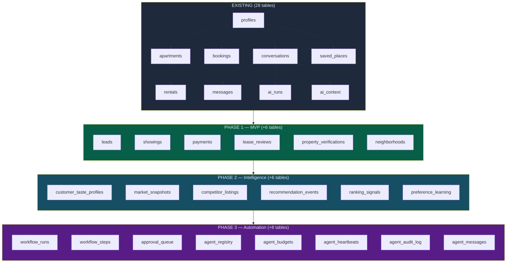
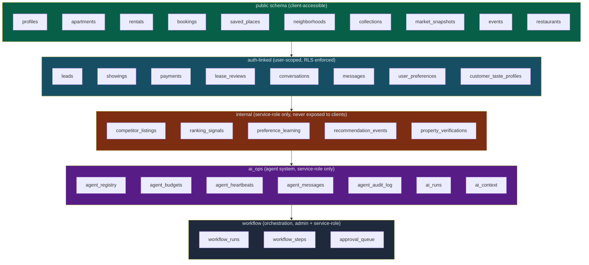
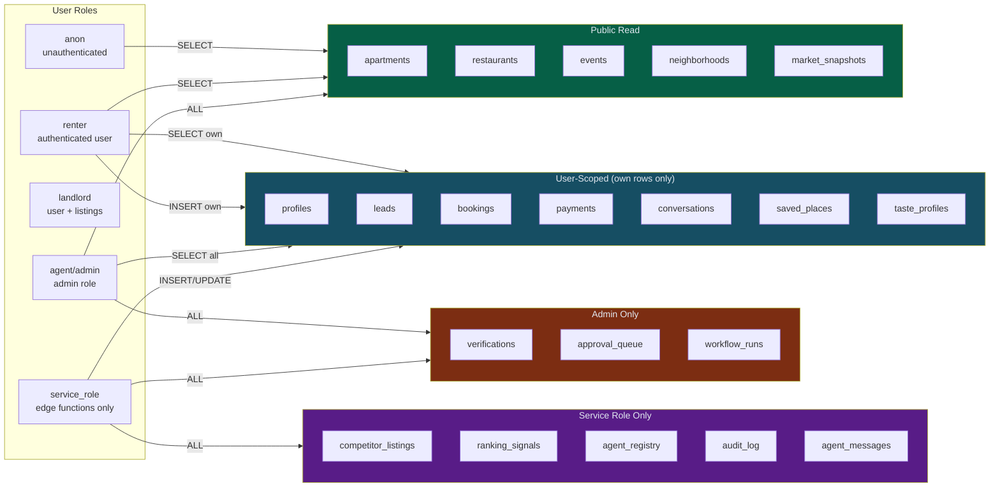
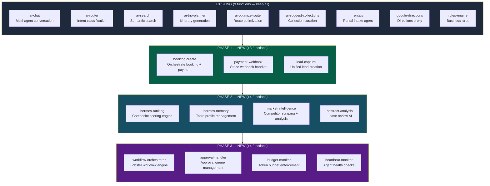
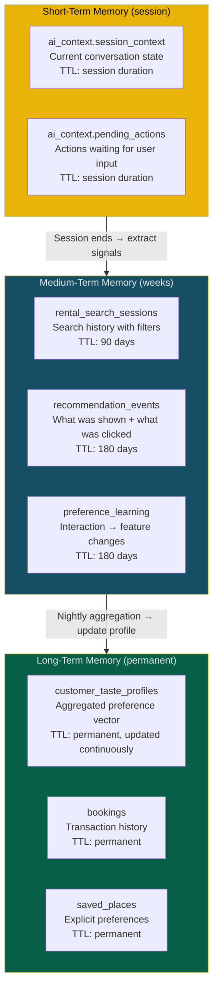
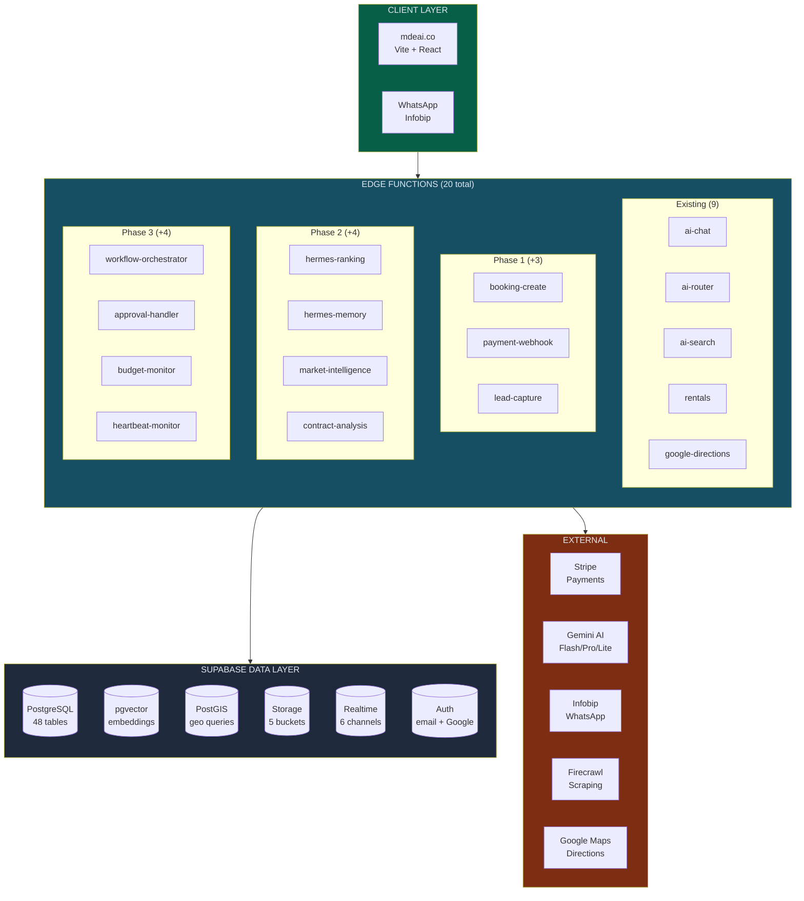

# mdeai.co — Supabase Strategy for AI Real Estate Platform

> **Version:** 1.0 | **Created:** April 4, 2026
> **Author:** Senior Supabase Architect
> **Parent:** `plan/real-estate/10-trio-real-estate-plan.md`
> **Current state:** 28 tables, 9 edge functions, 27 custom functions, 8 enums, 0 rows
> **Target state:** Production-ready AI real estate platform for Medellin rentals, buy/sell, and agent workflows

---

## PART 1 — Executive Summary

### What Exists Today

mdeai has a surprisingly complete Supabase foundation:

- **28 tables** with RLS enabled on all of them
- **9 edge functions** (6 AI-powered, 1 rentals, 1 directions proxy, 1 rules engine)
- **27 custom PostgreSQL functions** (auth helpers, job queue, realtime broadcasting, utilities)
- **8 enums** (agent types, booking status, user roles, etc.)
- **5 extensions** (PostGIS, pgvector, pg_trgm, uuid-ossp, pg_stat_statements)
- **0 rows** in any table — the entire database is empty

### What This Strategy Adds

This document designs the evolution from "impressive empty schema" to "production AI real estate backend" across 4 phases:

| Phase | Tables Added | Edge Functions Added | Focus |
|-------|-------------|---------------------|-------|
| **Phase 1 (MVP)** | +6 tables (leads, showings, payments, lease_reviews, property_verifications, neighborhoods) | +3 (booking-create, payment-webhook, lead-capture) | First booking, first dollar |
| **Phase 2 (Intelligence)** | +6 tables (customer_taste_profiles, market_snapshots, competitor_listings, recommendation_events, ranking_signals, preference_learning) | +4 (hermes-ranking, hermes-memory, market-intelligence, contract-analysis) | AI differentiation |
| **Phase 3 (Automation)** | +8 tables (workflow_runs, workflow_steps, approval_queue, agent_registry, agent_budgets, agent_heartbeats, agent_audit_log, agent_messages) | +4 (workflow-orchestrator, approval-handler, budget-monitor, heartbeat-monitor) | Trio agent activation |
| **Phase 4 (Scale)** | +4 tables (property_units, pricing_history, investor_portfolios, maintenance_requests) | +2 (investor-analysis, portfolio-monitor) | Multi-vertical expansion |

### Design Principles

1. **Don't rebuild what works.** The existing 28 tables are well-designed. Extend, don't replace.
2. **RLS on everything.** No exceptions. Service role only in edge functions.
3. **JSONB for flexibility, columns for queries.** If you filter/sort/join on it, it's a column. If it's metadata, it's JSONB.
4. **Triggers for side effects, edge functions for logic.** DB triggers update timestamps and create audit events. Edge functions contain business logic.
5. **Phase-gated complexity.** Don't create Phase 3 tables until Phase 2 is done.



---

## PART 2 — Full Table Strategy

### Existing Tables to KEEP (28 — no changes needed)

| Category | Tables | Notes |
|----------|--------|-------|
| **Users/Auth** | `profiles`, `user_preferences`, `user_roles` | Auto-created on signup, roles for admin |
| **Listings** | `apartments`, `rentals`, `car_rentals`, `restaurants`, `events`, `collections`, `tourist_destinations` | Core marketplace. `apartments` is the primary real estate table (55 fields). |
| **Rentals Module** | `rental_listing_sources`, `rental_listing_images`, `rental_freshness_log`, `rental_search_sessions` | Complete freshness verification system |
| **Bookings/Trips** | `bookings`, `trips`, `trip_items`, `saved_places`, `budget_tracking` | Unified booking across types |
| **AI/Chat** | `conversations`, `messages`, `ai_context`, `ai_runs` | Full conversation tracking + AI logging |
| **Jobs** | `agent_jobs` | Async job queue with locking, expiry, cleanup |
| **AI Proposals** | `proactive_suggestions`, `conflict_resolutions` | AI recommendation delivery |
| **WhatsApp** | `whatsapp_conversations`, `whatsapp_messages` | Ready for Infobip integration |

### New Tables — Phase 1: MVP (+6)

#### `leads`
**Purpose:** Capture every inquiry from any channel. The CRM foundation.

| Column | Type | Notes |
|--------|------|-------|
| `id` | uuid PK | |
| `user_id` | uuid FK → profiles | Nullable (anonymous leads from WhatsApp) |
| `channel` | text | 'web_chat', 'whatsapp', 'form', 'phone', 'referral' |
| `raw_message` | text | Original inquiry text |
| `structured_profile` | jsonb | Extracted: budget, dates, neighborhoods, bedrooms, amenities |
| `quality_score` | float | 0-1 from Hermes (Phase 2). NULL in Phase 1. |
| `status` | text | 'new', 'contacted', 'qualified', 'showing_scheduled', 'converted', 'archived' |
| `assigned_to` | uuid FK → profiles | Agent assignment (nullable) |
| `source_listing_id` | uuid | Which listing triggered the inquiry (nullable) |
| `phone_number` | text | For WhatsApp leads |
| `email` | text | For form leads |
| `last_contacted_at` | timestamptz | |
| `converted_booking_id` | uuid FK → bookings | Set when lead becomes a booking |
| `created_at` | timestamptz | |
| `updated_at` | timestamptz | |

**RLS:** User sees own leads. Agents/admins see all. Service role for AI writes.
**Indexes:** `(status, created_at)`, `(user_id)`, `(assigned_to)`

#### `showings`
**Purpose:** Coordinate property viewings between renters and hosts.

| Column | Type | Notes |
|--------|------|-------|
| `id` | uuid PK | |
| `lead_id` | uuid FK → leads | |
| `apartment_id` | uuid FK → apartments | |
| `renter_id` | uuid FK → profiles | |
| `host_contact` | jsonb | {name, phone, email, whatsapp} |
| `scheduled_at` | timestamptz | Showing date/time |
| `duration_minutes` | int | Default 30 |
| `status` | text | 'proposed', 'confirmed', 'completed', 'cancelled', 'no_show' |
| `renter_feedback` | jsonb | {rating, notes, would_book} |
| `host_notified_at` | timestamptz | |
| `reminder_sent_at` | timestamptz | |
| `route_position` | int | Order in showing route (if multi-showing day) |
| `created_at` | timestamptz | |
| `updated_at` | timestamptz | |

**RLS:** Renter sees own. Admins see all.
**Indexes:** `(scheduled_at)`, `(lead_id)`, `(apartment_id)`

#### `payments`
**Purpose:** Track all financial transactions. Bookings table has `payment_status` enum but no payment details.

| Column | Type | Notes |
|--------|------|-------|
| `id` | uuid PK | |
| `booking_id` | uuid FK → bookings | |
| `user_id` | uuid FK → profiles | |
| `stripe_payment_intent_id` | text UNIQUE | |
| `stripe_checkout_session_id` | text | |
| `amount_cents` | bigint | Amount in smallest currency unit |
| `currency` | text | 'COP', 'USD' |
| `status` | text | 'pending', 'processing', 'succeeded', 'failed', 'refunded', 'disputed' |
| `payment_method` | text | 'card', 'bank_transfer', 'wompi', 'cash' |
| `commission_amount_cents` | bigint | mdeai's 12% fee |
| `host_payout_amount_cents` | bigint | 88% to landlord |
| `host_payout_status` | text | 'pending', 'scheduled', 'paid' |
| `host_payout_at` | timestamptz | |
| `receipt_url` | text | Stripe receipt link |
| `metadata` | jsonb | Extra payment data |
| `created_at` | timestamptz | |
| `updated_at` | timestamptz | |

**RLS:** User sees own payments. Admins see all. Service role for Stripe webhook writes.
**Indexes:** `(stripe_payment_intent_id)`, `(booking_id)`, `(user_id)`, `(status)`

#### `lease_reviews`
**Purpose:** AI-analyzed lease/contract documents.

| Column | Type | Notes |
|--------|------|-------|
| `id` | uuid PK | |
| `booking_id` | uuid FK → bookings | Nullable (can review before booking) |
| `apartment_id` | uuid FK → apartments | |
| `user_id` | uuid FK → profiles | Who requested the review |
| `document_url` | text | Storage path to PDF |
| `extracted_terms` | jsonb | {rent, deposit, duration, exit_clause, utilities, inventory, rules} |
| `flagged_risks` | jsonb | [{clause, risk_level, explanation_en, explanation_es}] |
| `risk_score` | text | 'low', 'medium', 'high' |
| `summary_en` | text | Plain-language English summary |
| `summary_es` | text | Plain-language Spanish summary |
| `ai_model_used` | text | 'gemini-3.1-pro-preview' |
| `tokens_used` | int | |
| `reviewed_by` | text | 'hermes' or agent ID |
| `created_at` | timestamptz | |

**RLS:** User sees own reviews. Service role for AI writes.
**Indexes:** `(apartment_id)`, `(user_id)`

#### `property_verifications`
**Purpose:** Track verification status of each listing.

| Column | Type | Notes |
|--------|------|-------|
| `id` | uuid PK | |
| `apartment_id` | uuid FK → apartments | |
| `verified_by` | uuid FK → profiles | Agent who verified |
| `verification_type` | text | 'photos', 'amenities', 'address', 'pricing', 'full' |
| `status` | text | 'pending', 'verified', 'rejected', 'needs_update' |
| `notes` | text | |
| `verified_at` | timestamptz | |
| `expires_at` | timestamptz | Verification valid until (e.g., 90 days) |
| `created_at` | timestamptz | |

**RLS:** Admins only.
**Indexes:** `(apartment_id, verification_type)`, `(status)`

#### `neighborhoods`
**Purpose:** Reference data for Medellin neighborhoods with geo boundaries.

| Column | Type | Notes |
|--------|------|-------|
| `id` | uuid PK | |
| `name` | text UNIQUE | 'El Poblado', 'Laureles', 'Envigado', etc. |
| `slug` | text UNIQUE | 'el-poblado', 'laureles' |
| `zone` | text | 'south', 'west', 'center', 'north' |
| `avg_price_monthly` | numeric | Current average rent |
| `walkability_score` | float | 0-1 |
| `safety_score` | float | 0-1 |
| `digital_nomad_score` | float | 0-1 (wifi, coworking, cafes) |
| `description_en` | text | |
| `description_es` | text | |
| `boundary` | geometry(Polygon, 4326) | PostGIS polygon for geo queries |
| `center_point` | geometry(Point, 4326) | PostGIS center for distance calc |
| `adjacent_neighborhoods` | text[] | Names of bordering neighborhoods |
| `created_at` | timestamptz | |
| `updated_at` | timestamptz | |

**RLS:** Public read. Admin write.
**Indexes:** `(boundary) USING GIST`, `(center_point) USING GIST`, `(slug)`

### New Tables — Phase 2: Intelligence (+6)

#### `customer_taste_profiles`
**Purpose:** Hermes stores per-user preference vectors for personalized ranking.

| Column | Type | Notes |
|--------|------|-------|
| `id` | uuid PK | |
| `user_id` | uuid FK → profiles UNIQUE | |
| `taste_vector` | vector(1536) | Aggregated preference embedding |
| `neighborhood_affinity` | jsonb | {neighborhood: weight} map |
| `price_range` | numrange | Preferred price band |
| `amenity_preferences` | text[] | Ranked amenity list |
| `style_preferences` | text[] | 'modern', 'traditional', 'cozy', 'luxury' |
| `interaction_count` | int DEFAULT 0 | Total interactions feeding this profile |
| `last_search_query` | text | Most recent search for context |
| `booking_history_count` | int DEFAULT 0 | |
| `created_at` | timestamptz | |
| `updated_at` | timestamptz | |

**RLS:** User sees own. Service role for Hermes writes.
**Indexes:** `USING ivfflat (taste_vector vector_cosine_ops) WITH (lists = 50)`

#### `market_snapshots`
**Purpose:** Periodic competitive market data by neighborhood.

| Column | Type | Notes |
|--------|------|-------|
| `id` | uuid PK | |
| `neighborhood` | text | FK-ish to neighborhoods.name |
| `property_type` | text | 'apartment', 'room', 'house' |
| `bedrooms` | int | Nullable (aggregate across all sizes) |
| `avg_price_monthly` | numeric | |
| `median_price_monthly` | numeric | |
| `p25_price` | numeric | 25th percentile |
| `p75_price` | numeric | 75th percentile |
| `listing_count` | int | Total active listings |
| `new_listings_7d` | int | New in last 7 days |
| `removed_listings_7d` | int | |
| `price_change_pct` | float | vs previous snapshot |
| `occupancy_estimate` | float | 0-1 estimated occupancy |
| `data_sources` | text[] | 'finca_raiz', 'metrocuadrado', 'airbnb', 'mdeai' |
| `snapshot_date` | date | |
| `raw_data` | jsonb | Full scraped data for debugging |
| `created_at` | timestamptz | |

**RLS:** Public read (market data is a feature). Service role for writes.
**Indexes:** `(neighborhood, snapshot_date)`, `(snapshot_date)`

#### `competitor_listings`
**Purpose:** Individual scraped listings from competing platforms.

| Column | Type | Notes |
|--------|------|-------|
| `id` | uuid PK | |
| `source` | text | 'finca_raiz', 'metrocuadrado', 'airbnb', 'ciencuadras' |
| `source_id` | text | External platform listing ID |
| `source_url` | text | Direct link |
| `title` | text | |
| `neighborhood` | text | |
| `bedrooms` | int | |
| `bathrooms` | int | |
| `price_monthly` | numeric | |
| `currency` | text | |
| `amenities` | text[] | |
| `images` | text[] | First 3 image URLs |
| `listing_embedding` | vector(1536) | For similarity matching against mdeai listings |
| `matched_apartment_id` | uuid FK → apartments | If we determine it's the same listing |
| `price_delta_pct` | float | vs our listing price (if matched) |
| `first_seen_at` | timestamptz | |
| `last_seen_at` | timestamptz | |
| `is_active` | boolean DEFAULT true | |
| `raw_data` | jsonb | Full scraped payload |
| `created_at` | timestamptz | |

**RLS:** Internal only (service role). Not exposed to clients.
**Indexes:** `(source, source_id) UNIQUE`, `(neighborhood, price_monthly)`, `(is_active, last_seen_at)`

#### `recommendation_events`
**Purpose:** Track what Hermes recommended and whether it converted.

| Column | Type | Notes |
|--------|------|-------|
| `id` | uuid PK | |
| `user_id` | uuid FK → profiles | |
| `apartment_id` | uuid FK → apartments | |
| `recommendation_type` | text | 'search_result', 'similar', 'follow_up', 'taste_match' |
| `position` | int | Position in result list (1=top) |
| `score` | float | Composite score at time of recommendation |
| `score_breakdown` | jsonb | {budget: 0.23, neighborhood: 0.18, wifi: 0.15, ...} |
| `action_taken` | text | 'viewed', 'saved', 'showing_requested', 'booked', 'dismissed', 'ignored' |
| `action_at` | timestamptz | When user acted on it |
| `session_id` | uuid | Link to rental_search_sessions |
| `created_at` | timestamptz | |

**RLS:** User sees own. Service role for writes.
**Indexes:** `(user_id, created_at)`, `(apartment_id)`, `(action_taken)`

#### `ranking_signals`
**Purpose:** Hermes uses these to tune the composite scoring weights.

| Column | Type | Notes |
|--------|------|-------|
| `id` | uuid PK | |
| `signal_type` | text | 'booking', 'save', 'view_30s', 'dismiss', 'showing_complete', 'review_positive' |
| `user_id` | uuid FK → profiles | |
| `apartment_id` | uuid FK → apartments | |
| `weight` | float | Signal strength (booking=10, save=3, view=1, dismiss=-2) |
| `context` | jsonb | {search_query, position, channel} |
| `created_at` | timestamptz | |

**RLS:** Service role only.
**Indexes:** `(apartment_id, signal_type)`, `(user_id, created_at)`

#### `preference_learning`
**Purpose:** Log every interaction that updates a taste profile, for explainability.

| Column | Type | Notes |
|--------|------|-------|
| `id` | uuid PK | |
| `user_id` | uuid FK → profiles | |
| `event_type` | text | 'search', 'save', 'dismiss', 'book', 'review', 'filter_change' |
| `features_extracted` | jsonb | {neighborhood: 'Laureles', budget: 1500, amenities: ['wifi', 'pool']} |
| `profile_before` | jsonb | Snapshot of taste profile pre-update |
| `profile_after` | jsonb | Snapshot post-update |
| `created_at` | timestamptz | |

**RLS:** User sees own. Service role for writes.
**Indexes:** `(user_id, created_at)`

### New Tables — Phase 3: Automation (+8)

#### `agent_registry`
**Purpose:** Register all trio agents (OpenClaw, Hermes, Paperclip) and their capabilities.

| Column | Type | Notes |
|--------|------|-------|
| `id` | uuid PK | |
| `name` | text UNIQUE | 'openclaw', 'hermes', 'paperclip' |
| `display_name` | text | 'OpenClaw (Mouth)' |
| `role` | text | 'interface', 'brain', 'governance' |
| `status` | text | 'active', 'degraded', 'offline' |
| `capabilities` | text[] | ['chat', 'whatsapp', 'search', 'rank'] |
| `model_default` | text | 'gemini-3-flash-preview' |
| `daily_token_budget` | int | 50000 for OpenClaw, 30000 for Hermes, 10000 for Paperclip |
| `config` | jsonb | Agent-specific configuration |
| `last_heartbeat_at` | timestamptz | |
| `created_at` | timestamptz | |
| `updated_at` | timestamptz | |

#### `agent_budgets`
**Purpose:** Track per-agent daily token consumption with atomic deduction.

| Column | Type | Notes |
|--------|------|-------|
| `id` | uuid PK | |
| `agent_id` | uuid FK → agent_registry | |
| `budget_date` | date | |
| `daily_limit` | int | |
| `tokens_used` | int DEFAULT 0 | |
| `requests_count` | int DEFAULT 0 | |
| `estimated_cost_usd` | numeric(10,4) | |
| `created_at` | timestamptz | |
| `updated_at` | timestamptz | |

**Constraint:** `UNIQUE (agent_id, budget_date)`

Atomic deduction function:
```sql
CREATE OR REPLACE FUNCTION deduct_agent_budget(
  p_agent_id uuid,
  p_tokens int
) RETURNS boolean AS $$
DECLARE
  remaining int;
BEGIN
  UPDATE agent_budgets
  SET tokens_used = tokens_used + p_tokens,
      requests_count = requests_count + 1,
      updated_at = now()
  WHERE agent_id = p_agent_id
    AND budget_date = CURRENT_DATE
    AND tokens_used + p_tokens <= daily_limit
  RETURNING daily_limit - tokens_used INTO remaining;

  RETURN FOUND;
END;
$$ LANGUAGE plpgsql;
```

#### `agent_heartbeats`
**Purpose:** Paperclip monitors agent health via periodic heartbeats.

| Column | Type | Notes |
|--------|------|-------|
| `id` | uuid PK | |
| `agent_id` | uuid FK → agent_registry | |
| `status` | text | 'healthy', 'degraded', 'unresponsive' |
| `response_time_ms` | int | |
| `tokens_remaining` | int | Budget remaining for the day |
| `active_workflows` | int | Count of in-progress workflows |
| `error_count_1h` | int | Errors in last hour |
| `metadata` | jsonb | |
| `created_at` | timestamptz | |

**Retention:** Keep 7 days, archive older.
**Indexes:** `(agent_id, created_at DESC)`

#### `agent_audit_log`
**Purpose:** Every significant agent action is logged for compliance and debugging.

| Column | Type | Notes |
|--------|------|-------|
| `id` | uuid PK | |
| `agent_id` | uuid FK → agent_registry | |
| `action` | text | 'search', 'recommend', 'send_message', 'create_payment', 'approve', 'reject', 'escalate' |
| `target_type` | text | 'lead', 'booking', 'showing', 'payment', 'workflow' |
| `target_id` | uuid | |
| `user_id` | uuid FK → profiles | Affected user (nullable) |
| `input_summary` | text | Brief description of input |
| `output_summary` | text | Brief description of output |
| `tokens_used` | int | |
| `duration_ms` | int | |
| `success` | boolean | |
| `error_message` | text | |
| `metadata` | jsonb | |
| `created_at` | timestamptz | |

**RLS:** Admin read only. Service role for writes.
**Indexes:** `(agent_id, created_at)`, `(target_type, target_id)`, `(user_id, created_at)`
**Retention:** Keep 90 days in main table, partition monthly.

#### `agent_messages` (ACP Protocol)
**Purpose:** Inter-agent communication via the Agent Communication Protocol.

| Column | Type | Notes |
|--------|------|-------|
| `id` | uuid PK | |
| `from_agent` | uuid FK → agent_registry | |
| `to_agent` | uuid FK → agent_registry | |
| `type` | text | 'request', 'response', 'event', 'heartbeat' |
| `intent` | text | 'search_listings', 'check_budget', 'approve_action', 'rank_results' |
| `payload` | jsonb | Intent-specific data |
| `idempotency_key` | text UNIQUE | Prevents duplicate processing |
| `token_budget` | int | Max tokens this request may consume |
| `priority` | text | 'low', 'normal', 'high', 'critical' |
| `parent_message_id` | uuid FK → agent_messages | For request/response correlation |
| `status` | text | 'pending', 'processing', 'completed', 'failed', 'expired' |
| `expires_at` | timestamptz | TTL |
| `created_at` | timestamptz | |
| `processed_at` | timestamptz | |

**RLS:** Service role only.
**Indexes:** `(to_agent, status, priority)`, `(idempotency_key)`, `(parent_message_id)`

#### `workflow_runs`
**Purpose:** Track Lobster workflow executions.

| Column | Type | Notes |
|--------|------|-------|
| `id` | uuid PK | |
| `workflow_name` | text | 'lead_intake', 'showing_schedule', 'booking', 'contract_review', 'follow_up' |
| `trigger_type` | text | 'user_message', 'cron', 'webhook', 'agent_event' |
| `trigger_channel` | text | 'web', 'whatsapp', 'admin', 'system' |
| `lead_id` | uuid FK → leads | |
| `booking_id` | uuid FK → bookings | |
| `user_id` | uuid FK → profiles | |
| `status` | text | 'running', 'paused', 'waiting_approval', 'completed', 'failed', 'cancelled' |
| `current_step` | text | |
| `started_at` | timestamptz | |
| `completed_at` | timestamptz | |
| `error_message` | text | |
| `total_tokens_used` | int | |
| `metadata` | jsonb | |

**RLS:** Admin read. Service role write.
**Indexes:** `(status, started_at)`, `(workflow_name, status)`, `(lead_id)`, `(booking_id)`

#### `workflow_steps`
**Purpose:** Individual step execution within a workflow run.

| Column | Type | Notes |
|--------|------|-------|
| `id` | uuid PK | |
| `workflow_run_id` | uuid FK → workflow_runs | |
| `step_name` | text | 'extract_profile', 'search_listings', 'rank_results', 'present_shortlist' |
| `step_order` | int | |
| `status` | text | 'pending', 'running', 'completed', 'failed', 'skipped' |
| `agent_id` | uuid FK → agent_registry | Which agent executed this step |
| `input` | jsonb | |
| `output` | jsonb | |
| `tokens_used` | int | |
| `duration_ms` | int | |
| `error_message` | text | |
| `started_at` | timestamptz | |
| `completed_at` | timestamptz | |

**RLS:** Admin read. Service role write.
**Indexes:** `(workflow_run_id, step_order)`

#### `approval_queue`
**Purpose:** Human-in-the-loop approval before irreversible actions.

| Column | Type | Notes |
|--------|------|-------|
| `id` | uuid PK | |
| `workflow_run_id` | uuid FK → workflow_runs | |
| `workflow_step_id` | uuid FK → workflow_steps | |
| `action_type` | text | 'send_host_message', 'create_payment_link', 'confirm_booking', 'send_contract', 'cancel_booking' |
| `target_type` | text | 'lead', 'booking', 'showing', 'payment' |
| `target_id` | uuid | |
| `proposed_action` | jsonb | Full details of what will happen |
| `risk_level` | text | 'low', 'normal', 'high', 'critical' |
| `auto_approve_eligible` | boolean DEFAULT false | Low-risk actions can be auto-approved |
| `requested_by` | text | Agent name |
| `status` | text | 'pending', 'approved', 'rejected', 'expired', 'auto_approved' |
| `decided_by` | uuid FK → profiles | Human who approved/rejected |
| `decision_reason` | text | |
| `decided_at` | timestamptz | |
| `expires_at` | timestamptz | Auto-expire after 24h |
| `created_at` | timestamptz | |

**RLS:** Admin read/write. Service role for creation.
**Indexes:** `(status, created_at)`, `(action_type, status)`

---

## PART 3 — Schema Design

### Recommended Schema Structure



### Schema Assignment Rules

| Schema | Access | Purpose | Tables |
|--------|--------|---------|--------|
| **public** | Anon read, auth write | Marketplace data visible to everyone | apartments, rentals, restaurants, events, neighborhoods, market_snapshots, collections |
| **auth-linked** | Auth required, user-scoped RLS | Personal data only accessible by owner | profiles, leads, showings, payments, bookings, conversations, messages, lease_reviews, saved_places, user_preferences, customer_taste_profiles |
| **internal** | Service role only | Never exposed to frontend. Backend processing only. | competitor_listings, ranking_signals, preference_learning, recommendation_events, property_verifications |
| **ai_ops** | Service role only | Agent system internals | agent_registry, agent_budgets, agent_heartbeats, agent_messages, agent_audit_log, ai_runs, ai_context |
| **workflow** | Admin read + service role write | Workflow orchestration | workflow_runs, workflow_steps, approval_queue |

> **Practical note:** Supabase works best with everything in the `public` schema. Use RLS to enforce access boundaries rather than separate Postgres schemas. The table above is a *logical* grouping — all tables physically live in `public` but RLS policies enforce the access rules.

---

## PART 4 — SQL Schema Draft

### Core Phase 1 Tables

```sql
-- ============================================================
-- PHASE 1: MVP Tables
-- ============================================================

-- Neighborhoods reference data
CREATE TABLE IF NOT EXISTS neighborhoods (
  id uuid PRIMARY KEY DEFAULT gen_random_uuid(),
  name text UNIQUE NOT NULL,
  slug text UNIQUE NOT NULL,
  zone text NOT NULL,  -- 'south', 'west', 'center', 'north'
  avg_price_monthly numeric,
  walkability_score float CHECK (walkability_score BETWEEN 0 AND 1),
  safety_score float CHECK (safety_score BETWEEN 0 AND 1),
  digital_nomad_score float CHECK (digital_nomad_score BETWEEN 0 AND 1),
  description_en text,
  description_es text,
  boundary geometry(Polygon, 4326),
  center_point geometry(Point, 4326),
  adjacent_neighborhoods text[],
  created_at timestamptz DEFAULT now(),
  updated_at timestamptz DEFAULT now()
);

CREATE INDEX idx_neighborhoods_boundary ON neighborhoods USING GIST (boundary);
CREATE INDEX idx_neighborhoods_center ON neighborhoods USING GIST (center_point);
CREATE INDEX idx_neighborhoods_slug ON neighborhoods (slug);

-- Leads (CRM foundation)
CREATE TABLE IF NOT EXISTS leads (
  id uuid PRIMARY KEY DEFAULT gen_random_uuid(),
  user_id uuid REFERENCES profiles(id) ON DELETE SET NULL,
  channel text NOT NULL CHECK (channel IN ('web_chat', 'whatsapp', 'form', 'phone', 'referral')),
  raw_message text,
  structured_profile jsonb DEFAULT '{}',
  quality_score float CHECK (quality_score BETWEEN 0 AND 1),
  status text NOT NULL DEFAULT 'new'
    CHECK (status IN ('new', 'contacted', 'qualified', 'showing_scheduled', 'converted', 'archived')),
  assigned_to uuid REFERENCES profiles(id) ON DELETE SET NULL,
  source_listing_id uuid,
  phone_number text,
  email text,
  last_contacted_at timestamptz,
  converted_booking_id uuid REFERENCES bookings(id) ON DELETE SET NULL,
  created_at timestamptz DEFAULT now(),
  updated_at timestamptz DEFAULT now()
);

CREATE INDEX idx_leads_status_created ON leads (status, created_at);
CREATE INDEX idx_leads_user ON leads (user_id);
CREATE INDEX idx_leads_assigned ON leads (assigned_to);

-- Showings
CREATE TABLE IF NOT EXISTS showings (
  id uuid PRIMARY KEY DEFAULT gen_random_uuid(),
  lead_id uuid REFERENCES leads(id) ON DELETE CASCADE,
  apartment_id uuid REFERENCES apartments(id) ON DELETE CASCADE,
  renter_id uuid REFERENCES profiles(id) ON DELETE SET NULL,
  host_contact jsonb DEFAULT '{}',
  scheduled_at timestamptz NOT NULL,
  duration_minutes int DEFAULT 30,
  status text NOT NULL DEFAULT 'proposed'
    CHECK (status IN ('proposed', 'confirmed', 'completed', 'cancelled', 'no_show')),
  renter_feedback jsonb,
  host_notified_at timestamptz,
  reminder_sent_at timestamptz,
  route_position int,
  created_at timestamptz DEFAULT now(),
  updated_at timestamptz DEFAULT now()
);

CREATE INDEX idx_showings_scheduled ON showings (scheduled_at);
CREATE INDEX idx_showings_lead ON showings (lead_id);
CREATE INDEX idx_showings_apartment ON showings (apartment_id);

-- Payments
CREATE TABLE IF NOT EXISTS payments (
  id uuid PRIMARY KEY DEFAULT gen_random_uuid(),
  booking_id uuid REFERENCES bookings(id) ON DELETE SET NULL,
  user_id uuid REFERENCES profiles(id) ON DELETE SET NULL,
  stripe_payment_intent_id text UNIQUE,
  stripe_checkout_session_id text,
  amount_cents bigint NOT NULL,
  currency text NOT NULL DEFAULT 'COP',
  status text NOT NULL DEFAULT 'pending'
    CHECK (status IN ('pending', 'processing', 'succeeded', 'failed', 'refunded', 'disputed')),
  payment_method text,
  commission_amount_cents bigint,
  host_payout_amount_cents bigint,
  host_payout_status text DEFAULT 'pending'
    CHECK (host_payout_status IN ('pending', 'scheduled', 'paid')),
  host_payout_at timestamptz,
  receipt_url text,
  metadata jsonb DEFAULT '{}',
  created_at timestamptz DEFAULT now(),
  updated_at timestamptz DEFAULT now()
);

CREATE INDEX idx_payments_stripe ON payments (stripe_payment_intent_id);
CREATE INDEX idx_payments_booking ON payments (booking_id);
CREATE INDEX idx_payments_user ON payments (user_id);
CREATE INDEX idx_payments_status ON payments (status);

-- Lease Reviews
CREATE TABLE IF NOT EXISTS lease_reviews (
  id uuid PRIMARY KEY DEFAULT gen_random_uuid(),
  booking_id uuid REFERENCES bookings(id) ON DELETE SET NULL,
  apartment_id uuid REFERENCES apartments(id) ON DELETE CASCADE,
  user_id uuid REFERENCES profiles(id) ON DELETE SET NULL,
  document_url text,
  extracted_terms jsonb DEFAULT '{}',
  flagged_risks jsonb DEFAULT '[]',
  risk_score text CHECK (risk_score IN ('low', 'medium', 'high')),
  summary_en text,
  summary_es text,
  ai_model_used text,
  tokens_used int,
  reviewed_by text DEFAULT 'hermes',
  created_at timestamptz DEFAULT now()
);

CREATE INDEX idx_lease_reviews_apartment ON lease_reviews (apartment_id);
CREATE INDEX idx_lease_reviews_user ON lease_reviews (user_id);

-- Property Verifications
CREATE TABLE IF NOT EXISTS property_verifications (
  id uuid PRIMARY KEY DEFAULT gen_random_uuid(),
  apartment_id uuid REFERENCES apartments(id) ON DELETE CASCADE,
  verified_by uuid REFERENCES profiles(id) ON DELETE SET NULL,
  verification_type text NOT NULL
    CHECK (verification_type IN ('photos', 'amenities', 'address', 'pricing', 'full')),
  status text NOT NULL DEFAULT 'pending'
    CHECK (status IN ('pending', 'verified', 'rejected', 'needs_update')),
  notes text,
  verified_at timestamptz,
  expires_at timestamptz,
  created_at timestamptz DEFAULT now()
);

CREATE INDEX idx_verifications_apartment ON property_verifications (apartment_id, verification_type);
CREATE INDEX idx_verifications_status ON property_verifications (status);
```

### Phase 2: Intelligence Tables

```sql
-- ============================================================
-- PHASE 2: Intelligence Tables
-- ============================================================

-- Customer Taste Profiles
CREATE TABLE IF NOT EXISTS customer_taste_profiles (
  id uuid PRIMARY KEY DEFAULT gen_random_uuid(),
  user_id uuid REFERENCES profiles(id) ON DELETE CASCADE UNIQUE,
  taste_vector vector(1536),
  neighborhood_affinity jsonb DEFAULT '{}',
  price_range numrange,
  amenity_preferences text[] DEFAULT '{}',
  style_preferences text[] DEFAULT '{}',
  interaction_count int DEFAULT 0,
  last_search_query text,
  booking_history_count int DEFAULT 0,
  created_at timestamptz DEFAULT now(),
  updated_at timestamptz DEFAULT now()
);

CREATE INDEX idx_taste_vector ON customer_taste_profiles
  USING ivfflat (taste_vector vector_cosine_ops) WITH (lists = 50);

-- Market Snapshots
CREATE TABLE IF NOT EXISTS market_snapshots (
  id uuid PRIMARY KEY DEFAULT gen_random_uuid(),
  neighborhood text NOT NULL,
  property_type text DEFAULT 'apartment',
  bedrooms int,
  avg_price_monthly numeric,
  median_price_monthly numeric,
  p25_price numeric,
  p75_price numeric,
  listing_count int,
  new_listings_7d int,
  removed_listings_7d int,
  price_change_pct float,
  occupancy_estimate float,
  data_sources text[],
  snapshot_date date NOT NULL,
  raw_data jsonb,
  created_at timestamptz DEFAULT now()
);

CREATE INDEX idx_snapshots_neighborhood_date ON market_snapshots (neighborhood, snapshot_date);
CREATE INDEX idx_snapshots_date ON market_snapshots (snapshot_date);

-- Competitor Listings
CREATE TABLE IF NOT EXISTS competitor_listings (
  id uuid PRIMARY KEY DEFAULT gen_random_uuid(),
  source text NOT NULL,
  source_id text NOT NULL,
  source_url text,
  title text,
  neighborhood text,
  bedrooms int,
  bathrooms int,
  price_monthly numeric,
  currency text DEFAULT 'COP',
  amenities text[],
  images text[],
  listing_embedding vector(1536),
  matched_apartment_id uuid REFERENCES apartments(id) ON DELETE SET NULL,
  price_delta_pct float,
  first_seen_at timestamptz DEFAULT now(),
  last_seen_at timestamptz DEFAULT now(),
  is_active boolean DEFAULT true,
  raw_data jsonb,
  created_at timestamptz DEFAULT now(),
  UNIQUE (source, source_id)
);

CREATE INDEX idx_competitor_neighborhood ON competitor_listings (neighborhood, price_monthly);
CREATE INDEX idx_competitor_active ON competitor_listings (is_active, last_seen_at);

-- Recommendation Events
CREATE TABLE IF NOT EXISTS recommendation_events (
  id uuid PRIMARY KEY DEFAULT gen_random_uuid(),
  user_id uuid REFERENCES profiles(id) ON DELETE CASCADE,
  apartment_id uuid REFERENCES apartments(id) ON DELETE CASCADE,
  recommendation_type text NOT NULL,
  position int,
  score float,
  score_breakdown jsonb,
  action_taken text,
  action_at timestamptz,
  session_id uuid,
  created_at timestamptz DEFAULT now()
);

CREATE INDEX idx_reco_user ON recommendation_events (user_id, created_at);
CREATE INDEX idx_reco_apartment ON recommendation_events (apartment_id);
CREATE INDEX idx_reco_action ON recommendation_events (action_taken);

-- Ranking Signals
CREATE TABLE IF NOT EXISTS ranking_signals (
  id uuid PRIMARY KEY DEFAULT gen_random_uuid(),
  signal_type text NOT NULL,
  user_id uuid REFERENCES profiles(id) ON DELETE CASCADE,
  apartment_id uuid REFERENCES apartments(id) ON DELETE CASCADE,
  weight float NOT NULL,
  context jsonb,
  created_at timestamptz DEFAULT now()
);

CREATE INDEX idx_signals_apartment ON ranking_signals (apartment_id, signal_type);
CREATE INDEX idx_signals_user ON ranking_signals (user_id, created_at);

-- Preference Learning
CREATE TABLE IF NOT EXISTS preference_learning (
  id uuid PRIMARY KEY DEFAULT gen_random_uuid(),
  user_id uuid REFERENCES profiles(id) ON DELETE CASCADE,
  event_type text NOT NULL,
  features_extracted jsonb,
  profile_before jsonb,
  profile_after jsonb,
  created_at timestamptz DEFAULT now()
);

CREATE INDEX idx_pref_learn_user ON preference_learning (user_id, created_at);
```

### Phase 3: Automation Tables

```sql
-- ============================================================
-- PHASE 3: Automation / Trio Agent Tables
-- ============================================================

-- Agent Registry
CREATE TABLE IF NOT EXISTS agent_registry (
  id uuid PRIMARY KEY DEFAULT gen_random_uuid(),
  name text UNIQUE NOT NULL,
  display_name text NOT NULL,
  role text NOT NULL CHECK (role IN ('interface', 'brain', 'governance')),
  status text NOT NULL DEFAULT 'active'
    CHECK (status IN ('active', 'degraded', 'offline')),
  capabilities text[] DEFAULT '{}',
  model_default text,
  daily_token_budget int,
  config jsonb DEFAULT '{}',
  last_heartbeat_at timestamptz,
  created_at timestamptz DEFAULT now(),
  updated_at timestamptz DEFAULT now()
);

-- Agent Budgets
CREATE TABLE IF NOT EXISTS agent_budgets (
  id uuid PRIMARY KEY DEFAULT gen_random_uuid(),
  agent_id uuid REFERENCES agent_registry(id) ON DELETE CASCADE,
  budget_date date NOT NULL,
  daily_limit int NOT NULL,
  tokens_used int DEFAULT 0,
  requests_count int DEFAULT 0,
  estimated_cost_usd numeric(10,4) DEFAULT 0,
  created_at timestamptz DEFAULT now(),
  updated_at timestamptz DEFAULT now(),
  UNIQUE (agent_id, budget_date)
);

-- Atomic budget deduction
CREATE OR REPLACE FUNCTION deduct_agent_budget(
  p_agent_id uuid,
  p_tokens int
) RETURNS boolean AS $$
BEGIN
  UPDATE agent_budgets
  SET tokens_used = tokens_used + p_tokens,
      requests_count = requests_count + 1,
      updated_at = now()
  WHERE agent_id = p_agent_id
    AND budget_date = CURRENT_DATE
    AND tokens_used + p_tokens <= daily_limit;
  RETURN FOUND;
END;
$$ LANGUAGE plpgsql;

-- Agent Heartbeats
CREATE TABLE IF NOT EXISTS agent_heartbeats (
  id uuid PRIMARY KEY DEFAULT gen_random_uuid(),
  agent_id uuid REFERENCES agent_registry(id) ON DELETE CASCADE,
  status text NOT NULL,
  response_time_ms int,
  tokens_remaining int,
  active_workflows int,
  error_count_1h int,
  metadata jsonb,
  created_at timestamptz DEFAULT now()
);

CREATE INDEX idx_heartbeats_agent ON agent_heartbeats (agent_id, created_at DESC);

-- Agent Audit Log
CREATE TABLE IF NOT EXISTS agent_audit_log (
  id uuid PRIMARY KEY DEFAULT gen_random_uuid(),
  agent_id uuid REFERENCES agent_registry(id) ON DELETE SET NULL,
  action text NOT NULL,
  target_type text,
  target_id uuid,
  user_id uuid REFERENCES profiles(id) ON DELETE SET NULL,
  input_summary text,
  output_summary text,
  tokens_used int,
  duration_ms int,
  success boolean,
  error_message text,
  metadata jsonb,
  created_at timestamptz DEFAULT now()
);

CREATE INDEX idx_audit_agent ON agent_audit_log (agent_id, created_at);
CREATE INDEX idx_audit_target ON agent_audit_log (target_type, target_id);
CREATE INDEX idx_audit_user ON agent_audit_log (user_id, created_at);

-- Agent Messages (ACP Protocol)
CREATE TABLE IF NOT EXISTS agent_messages (
  id uuid PRIMARY KEY DEFAULT gen_random_uuid(),
  from_agent uuid REFERENCES agent_registry(id),
  to_agent uuid REFERENCES agent_registry(id),
  type text NOT NULL CHECK (type IN ('request', 'response', 'event', 'heartbeat')),
  intent text NOT NULL,
  payload jsonb DEFAULT '{}',
  idempotency_key text UNIQUE,
  token_budget int,
  priority text DEFAULT 'normal'
    CHECK (priority IN ('low', 'normal', 'high', 'critical')),
  parent_message_id uuid REFERENCES agent_messages(id),
  status text DEFAULT 'pending'
    CHECK (status IN ('pending', 'processing', 'completed', 'failed', 'expired')),
  expires_at timestamptz,
  created_at timestamptz DEFAULT now(),
  processed_at timestamptz
);

CREATE INDEX idx_agentmsg_queue ON agent_messages (to_agent, status, priority);
CREATE INDEX idx_agentmsg_idempotency ON agent_messages (idempotency_key);
CREATE INDEX idx_agentmsg_parent ON agent_messages (parent_message_id);

-- Workflow Runs
CREATE TABLE IF NOT EXISTS workflow_runs (
  id uuid PRIMARY KEY DEFAULT gen_random_uuid(),
  workflow_name text NOT NULL,
  trigger_type text,
  trigger_channel text,
  lead_id uuid REFERENCES leads(id) ON DELETE SET NULL,
  booking_id uuid REFERENCES bookings(id) ON DELETE SET NULL,
  user_id uuid REFERENCES profiles(id) ON DELETE SET NULL,
  status text NOT NULL DEFAULT 'running'
    CHECK (status IN ('running', 'paused', 'waiting_approval', 'completed', 'failed', 'cancelled')),
  current_step text,
  started_at timestamptz DEFAULT now(),
  completed_at timestamptz,
  error_message text,
  total_tokens_used int DEFAULT 0,
  metadata jsonb DEFAULT '{}'
);

CREATE INDEX idx_workflow_status ON workflow_runs (status, started_at);
CREATE INDEX idx_workflow_name ON workflow_runs (workflow_name, status);
CREATE INDEX idx_workflow_lead ON workflow_runs (lead_id);

-- Workflow Steps
CREATE TABLE IF NOT EXISTS workflow_steps (
  id uuid PRIMARY KEY DEFAULT gen_random_uuid(),
  workflow_run_id uuid REFERENCES workflow_runs(id) ON DELETE CASCADE,
  step_name text NOT NULL,
  step_order int NOT NULL,
  status text NOT NULL DEFAULT 'pending'
    CHECK (status IN ('pending', 'running', 'completed', 'failed', 'skipped')),
  agent_id uuid REFERENCES agent_registry(id),
  input jsonb,
  output jsonb,
  tokens_used int,
  duration_ms int,
  error_message text,
  started_at timestamptz,
  completed_at timestamptz
);

CREATE INDEX idx_wf_steps_run ON workflow_steps (workflow_run_id, step_order);

-- Approval Queue
CREATE TABLE IF NOT EXISTS approval_queue (
  id uuid PRIMARY KEY DEFAULT gen_random_uuid(),
  workflow_run_id uuid REFERENCES workflow_runs(id) ON DELETE CASCADE,
  workflow_step_id uuid REFERENCES workflow_steps(id),
  action_type text NOT NULL,
  target_type text,
  target_id uuid,
  proposed_action jsonb NOT NULL,
  risk_level text DEFAULT 'normal'
    CHECK (risk_level IN ('low', 'normal', 'high', 'critical')),
  auto_approve_eligible boolean DEFAULT false,
  requested_by text,
  status text NOT NULL DEFAULT 'pending'
    CHECK (status IN ('pending', 'approved', 'rejected', 'expired', 'auto_approved')),
  decided_by uuid REFERENCES profiles(id),
  decision_reason text,
  decided_at timestamptz,
  expires_at timestamptz DEFAULT (now() + interval '24 hours'),
  created_at timestamptz DEFAULT now()
);

CREATE INDEX idx_approval_status ON approval_queue (status, created_at);
CREATE INDEX idx_approval_type ON approval_queue (action_type, status);

-- ============================================================
-- RLS for all new tables
-- ============================================================
ALTER TABLE neighborhoods ENABLE ROW LEVEL SECURITY;
ALTER TABLE leads ENABLE ROW LEVEL SECURITY;
ALTER TABLE showings ENABLE ROW LEVEL SECURITY;
ALTER TABLE payments ENABLE ROW LEVEL SECURITY;
ALTER TABLE lease_reviews ENABLE ROW LEVEL SECURITY;
ALTER TABLE property_verifications ENABLE ROW LEVEL SECURITY;
ALTER TABLE customer_taste_profiles ENABLE ROW LEVEL SECURITY;
ALTER TABLE market_snapshots ENABLE ROW LEVEL SECURITY;
ALTER TABLE competitor_listings ENABLE ROW LEVEL SECURITY;
ALTER TABLE recommendation_events ENABLE ROW LEVEL SECURITY;
ALTER TABLE ranking_signals ENABLE ROW LEVEL SECURITY;
ALTER TABLE preference_learning ENABLE ROW LEVEL SECURITY;
ALTER TABLE agent_registry ENABLE ROW LEVEL SECURITY;
ALTER TABLE agent_budgets ENABLE ROW LEVEL SECURITY;
ALTER TABLE agent_heartbeats ENABLE ROW LEVEL SECURITY;
ALTER TABLE agent_audit_log ENABLE ROW LEVEL SECURITY;
ALTER TABLE agent_messages ENABLE ROW LEVEL SECURITY;
ALTER TABLE workflow_runs ENABLE ROW LEVEL SECURITY;
ALTER TABLE workflow_steps ENABLE ROW LEVEL SECURITY;
ALTER TABLE approval_queue ENABLE ROW LEVEL SECURITY;

-- ============================================================
-- Auto-update updated_at triggers (reuse existing function)
-- ============================================================
CREATE TRIGGER update_leads_updated_at BEFORE UPDATE ON leads
  FOR EACH ROW EXECUTE FUNCTION update_updated_at_column();
CREATE TRIGGER update_showings_updated_at BEFORE UPDATE ON showings
  FOR EACH ROW EXECUTE FUNCTION update_updated_at_column();
CREATE TRIGGER update_payments_updated_at BEFORE UPDATE ON payments
  FOR EACH ROW EXECUTE FUNCTION update_updated_at_column();
CREATE TRIGGER update_neighborhoods_updated_at BEFORE UPDATE ON neighborhoods
  FOR EACH ROW EXECUTE FUNCTION update_updated_at_column();
CREATE TRIGGER update_taste_profiles_updated_at BEFORE UPDATE ON customer_taste_profiles
  FOR EACH ROW EXECUTE FUNCTION update_updated_at_column();
CREATE TRIGGER update_agent_registry_updated_at BEFORE UPDATE ON agent_registry
  FOR EACH ROW EXECUTE FUNCTION update_updated_at_column();
CREATE TRIGGER update_agent_budgets_updated_at BEFORE UPDATE ON agent_budgets
  FOR EACH ROW EXECUTE FUNCTION update_updated_at_column();
```

---

## PART 5 — RLS Strategy

### Access Matrix



### RLS Policy Examples

```sql
-- NEIGHBORHOODS: Public read, admin write
CREATE POLICY "neighborhoods_public_read" ON neighborhoods
  FOR SELECT USING (true);
CREATE POLICY "neighborhoods_admin_write" ON neighborhoods
  FOR ALL USING (is_admin());

-- LEADS: User sees own, admins see all, service role writes
CREATE POLICY "leads_user_select" ON leads
  FOR SELECT USING (user_id = (SELECT auth.uid()) OR is_admin());
CREATE POLICY "leads_user_insert" ON leads
  FOR INSERT WITH CHECK (user_id = (SELECT auth.uid()) OR user_id IS NULL);
CREATE POLICY "leads_admin_all" ON leads
  FOR ALL USING (is_admin());

-- PAYMENTS: User sees own, admin sees all
CREATE POLICY "payments_user_read" ON payments
  FOR SELECT USING (user_id = (SELECT auth.uid()) OR is_admin());
-- No user INSERT — payments created only via edge functions (service role)

-- MARKET_SNAPSHOTS: Public read (market data is a feature)
CREATE POLICY "snapshots_public_read" ON market_snapshots
  FOR SELECT USING (true);

-- COMPETITOR_LISTINGS: Service role only (no client access)
-- No RLS policies = no client access (RLS enabled blocks all)

-- AGENT tables: Service role only
-- No RLS policies on agent_registry, agent_budgets, agent_messages, etc.
-- Edge functions use service_role key to bypass RLS

-- APPROVAL_QUEUE: Admin read/write
CREATE POLICY "approval_admin_all" ON approval_queue
  FOR ALL USING (is_admin());

-- CUSTOMER_TASTE_PROFILES: User reads own
CREATE POLICY "taste_user_read" ON customer_taste_profiles
  FOR SELECT USING (user_id = (SELECT auth.uid()));
-- Writes via service role only (Hermes updates)
```

### AI Service Role Safety Rules

1. **Edge functions use service_role key** to bypass RLS for AI writes (ai_runs, recommendation_events, ranking_signals, taste profiles)
2. **Never pass service_role to the client** — only `VITE_SUPABASE_PUBLISHABLE_KEY` (anon key) in frontend
3. **Edge functions validate JWT** from Authorization header before processing requests
4. **Audit every service_role write** — all agent actions logged to `agent_audit_log`
5. **Rate limit service_role calls** — Paperclip enforces daily token budgets via `deduct_agent_budget()`

---

## PART 6 — Storage Strategy

### Bucket Design

| Bucket | Visibility | Purpose | Access Rules | Naming Convention |
|--------|-----------|---------|-------------|-------------------|
| `property-images` | **Public** | Apartment/listing photos | Anon read. Auth upload (landlords). Admin delete. | `{apartment_id}/{position}.{ext}` |
| `contracts` | **Private** | Lease PDFs, rental agreements | Owner + admin only. Service role for AI review. | `{user_id}/{apartment_id}/{timestamp}.pdf` |
| `identity-docs` | **Private** | ID verification (passport, cedula) | Owner + admin only. Auto-delete after 90 days. | `{user_id}/id/{timestamp}.{ext}` |
| `maintenance` | **Private** | Issue photos from tenants | Tenant + admin. Service role for escalation. | `{booking_id}/{timestamp}.{ext}` |
| `ai-exports` | **Private** | Generated reports, market analyses | Admin only. Service role for generation. | `{report_type}/{date}/{filename}` |

### Retention Policy

| Bucket | Retention | Archive Strategy |
|--------|-----------|-----------------|
| `property-images` | Permanent (while listing active) | Delete when listing removed |
| `contracts` | 5 years (legal requirement) | Move to cold storage after lease ends |
| `identity-docs` | 90 days max | Auto-delete via cron or Supabase lifecycle |
| `maintenance` | 1 year | Archive after booking completes |
| `ai-exports` | 30 days | Auto-delete, regenerate on demand |

---

## PART 7 — Edge Functions Strategy

### Full Edge Functions Map



### Phase 1 Edge Functions Detail

#### `booking-create`
| Field | Value |
|-------|-------|
| **Purpose** | Orchestrate the full booking flow: validate listing → calculate pricing → create Stripe payment intent → create booking record |
| **Inputs** | `{ apartment_id, user_id, check_in, check_out, guests }` |
| **Outputs** | `{ booking_id, payment_url, total_amount, breakdown }` |
| **Auth** | Required (JWT) |
| **Key logic** | Check apartment availability → calculate (rent × months + deposit + 12% fee) → Stripe `payment_intents.create()` → insert bookings row (status=pending) → insert payments row → return checkout URL |

#### `payment-webhook`
| Field | Value |
|-------|-------|
| **Purpose** | Handle Stripe webhooks: payment succeeded/failed → update booking + payment status |
| **Inputs** | Stripe webhook event (verify signature) |
| **Outputs** | `{ received: true }` |
| **Auth** | Stripe signature verification (no JWT) |
| **Key logic** | `payment_intent.succeeded` → update payments.status='succeeded' + bookings.status='confirmed'. `payment_intent.payment_failed` → update payments.status='failed'. Log to audit. |

#### `lead-capture`
| Field | Value |
|-------|-------|
| **Purpose** | Unified lead creation from any channel (web chat, WhatsApp, form submission) |
| **Inputs** | `{ channel, message, user_id?, phone?, email?, source_listing_id? }` |
| **Outputs** | `{ lead_id, status }` |
| **Auth** | Optional (anonymous leads allowed from WhatsApp) |
| **Key logic** | Parse message → extract structured profile (Gemini Flash) → create leads row → if user_id exists, link to profile → return lead_id |

### Phase 2 Edge Functions Detail

#### `hermes-ranking`
| Field | Value |
|-------|-------|
| **Purpose** | Hermes composite scoring engine — takes a search query and returns ranked results with explanations |
| **Inputs** | `{ query, user_id?, filters?, limit? }` |
| **Outputs** | `{ results: [{ apartment, score, breakdown, explanation }] }` |
| **Auth** | Optional (anon search allowed, auth enables personalization) |
| **Key logic** | pgvector similarity → SQL filters → composite scoring (7 weights) → if user_id, apply taste profile → generate explanations → log to recommendation_events |

#### `hermes-memory`
| Field | Value |
|-------|-------|
| **Purpose** | Update customer taste profiles from user interactions |
| **Inputs** | `{ user_id, event_type, features }` |
| **Outputs** | `{ profile_updated: true }` |
| **Auth** | Service role (called by other edge functions) |
| **Key logic** | Load current taste profile → apply signal weights → regenerate taste vector → save to customer_taste_profiles → log to preference_learning |

#### `market-intelligence`
| Field | Value |
|-------|-------|
| **Purpose** | Scrape competitor listings, generate market snapshots |
| **Inputs** | `{ neighborhoods?, sources?, full_scan? }` |
| **Outputs** | `{ listings_scraped, snapshots_created, alerts }` |
| **Auth** | Service role (cron triggered by Paperclip) |
| **Key logic** | Firecrawl Extract against FincaRaiz/Metrocuadrado/Airbnb → parse with Zod schemas → upsert competitor_listings → calculate snapshots → flag price deltas → store market_snapshots |

#### `contract-analysis`
| Field | Value |
|-------|-------|
| **Purpose** | AI lease/contract review — extract terms, flag risks, generate summary |
| **Inputs** | `{ document_url, apartment_id, user_id, language? }` |
| **Outputs** | `{ lease_review_id, risk_score, summary_en, summary_es, flagged_risks }` |
| **Auth** | Required (JWT) |
| **Key logic** | Download PDF from storage → OCR if needed → Gemini Pro extract terms → compare against area norms (market_snapshots) → flag risks → generate bilingual summary → insert lease_reviews |

### Phase 3 Edge Functions Detail

#### `workflow-orchestrator`
| Field | Value |
|-------|-------|
| **Purpose** | Execute Lobster-style typed workflows step by step |
| **Inputs** | `{ workflow_name, trigger, context }` |
| **Outputs** | `{ workflow_run_id, status, current_step }` |
| **Auth** | Service role |
| **Key logic** | Create workflow_runs row → execute steps sequentially → check approval gates → call agent-specific functions → update step status → handle errors/retries → complete or pause workflow |

#### `approval-handler`
| Field | Value |
|-------|-------|
| **Purpose** | Process approval queue items (auto-approve low-risk, hold high-risk for humans) |
| **Inputs** | `{ approval_id, decision, decided_by, reason? }` |
| **Outputs** | `{ approved: boolean, workflow_resumed: boolean }` |
| **Auth** | Admin required |
| **Key logic** | If auto_approve_eligible and risk_level='low' → auto-approve. Else wait for human. On approval → resume workflow. On rejection → cancel workflow step. |

#### `budget-monitor`
| Field | Value |
|-------|-------|
| **Purpose** | Paperclip checks and enforces agent token budgets |
| **Inputs** | `{ agent_id, requested_tokens }` |
| **Outputs** | `{ approved: boolean, remaining_tokens, daily_usage_pct }` |
| **Auth** | Service role |
| **Key logic** | Call `deduct_agent_budget()` → if over 90%, throttle to essential only → if over 100%, reject → log to audit |

#### `heartbeat-monitor`
| Field | Value |
|-------|-------|
| **Purpose** | Paperclip periodic health check of all agents |
| **Inputs** | `{}` (cron-triggered) |
| **Outputs** | `{ agents: [{ name, status, response_time }] }` |
| **Auth** | Service role |
| **Key logic** | For each agent in registry → test basic operation → measure response time → insert heartbeat record → if 2+ consecutive failures → set agent status='degraded' → create escalation |

---

## PART 8 — Trigger & Automation Strategy

### What Should Be Database Triggers

Triggers are for **side effects that must happen atomically** with the data change. Keep them simple and fast.

```sql
-- 1. Auto-update updated_at (already exists, reuse for new tables)
-- Uses existing update_updated_at_column() function

-- 2. New inquiry → auto-create lead
CREATE OR REPLACE FUNCTION auto_create_lead_from_conversation()
RETURNS TRIGGER AS $$
BEGIN
  -- Only for new conversations from web_chat or whatsapp
  IF NEW.agent_type IN ('general_concierge', 'local_scout') THEN
    INSERT INTO leads (user_id, channel, raw_message, status)
    VALUES (
      NEW.user_id,
      CASE
        WHEN NEW.session_data->>'channel' = 'whatsapp' THEN 'whatsapp'
        ELSE 'web_chat'
      END,
      NEW.title,
      'new'
    )
    ON CONFLICT DO NOTHING;
  END IF;
  RETURN NEW;
END;
$$ LANGUAGE plpgsql SECURITY DEFINER;

CREATE TRIGGER trg_conversation_create_lead
  AFTER INSERT ON conversations
  FOR EACH ROW EXECUTE FUNCTION auto_create_lead_from_conversation();

-- 3. Booking created → create audit event
CREATE OR REPLACE FUNCTION audit_booking_created()
RETURNS TRIGGER AS $$
BEGIN
  INSERT INTO agent_audit_log (action, target_type, target_id, user_id, input_summary, success)
  VALUES ('booking_created', 'booking', NEW.id, NEW.user_id,
    format('Booking %s for %s', NEW.booking_type, NEW.location_id), true);
  RETURN NEW;
END;
$$ LANGUAGE plpgsql SECURITY DEFINER;

CREATE TRIGGER trg_booking_audit
  AFTER INSERT ON bookings
  FOR EACH ROW EXECUTE FUNCTION audit_booking_created();

-- 4. Payment status change → update booking status
CREATE OR REPLACE FUNCTION sync_payment_to_booking()
RETURNS TRIGGER AS $$
BEGIN
  IF NEW.status = 'succeeded' AND OLD.status != 'succeeded' THEN
    UPDATE bookings SET status = 'confirmed', updated_at = now()
    WHERE id = NEW.booking_id;
  ELSIF NEW.status = 'failed' AND OLD.status != 'failed' THEN
    UPDATE bookings SET status = 'cancelled', updated_at = now()
    WHERE id = NEW.booking_id;
  ELSIF NEW.status = 'refunded' AND OLD.status != 'refunded' THEN
    UPDATE bookings SET status = 'cancelled', updated_at = now()
    WHERE id = NEW.booking_id;
  END IF;
  RETURN NEW;
END;
$$ LANGUAGE plpgsql SECURITY DEFINER;

CREATE TRIGGER trg_payment_sync_booking
  AFTER UPDATE OF status ON payments
  FOR EACH ROW EXECUTE FUNCTION sync_payment_to_booking();

-- 5. Update conversation stats (already exists)
-- Reuses existing update_conversation_stats() trigger
```

### What Should Be Edge Functions (Not Triggers)

| Automation | Why Edge Function, Not Trigger |
|-----------|-------------------------------|
| Contract uploaded → AI review | Expensive (Gemini Pro call, OCR). Must be async. |
| Lead scored → assign priority | Requires Hermes intelligence (external AI call). |
| Showing confirmed → send reminder | External integration (WhatsApp/email via Infobip). |
| New competitor listing → price comparison | Requires market data aggregation logic. |
| Stale lead → follow-up | Requires Hermes personalization + message generation. |
| Payment succeeded → send confirmation | External channel delivery (WhatsApp, email). |

### What Should Be Cron Jobs (Scheduled Edge Functions)

| Job | Schedule | Edge Function | Purpose |
|-----|----------|--------------|---------|
| Market scrape | Daily 6 AM COT | `market-intelligence` | Scrape competitor listings |
| Heartbeat check | Every 15 min | `heartbeat-monitor` | Verify agent health |
| Stale lead check | Hourly | `workflow-orchestrator` | Trigger follow-up workflows |
| Budget reset | Daily midnight | SQL function | Reset daily token budgets |
| Freshness verify | Every 6 hours | `rentals` (action: verify) | Check listing liveness |
| Cleanup expired approvals | Hourly | SQL function | Expire stale approval queue items |

### Dangerous Trigger Anti-Patterns to Avoid

1. **No AI calls in triggers.** Triggers must complete in <100ms. AI calls take 2-30 seconds.
2. **No external HTTP calls in triggers.** No Stripe, no Infobip, no Firecrawl.
3. **No cascade triggers** (trigger A fires trigger B fires trigger C). Max 1 level deep.
4. **No heavy computation in triggers.** Embedding generation, scoring, ranking — all edge functions.
5. **Always use SECURITY DEFINER** on trigger functions to run with proper privileges.

---

## PART 9 — AI Data Strategy

### What Goes in Vector Tables

| Data | Table | Embedding Model | Dimensions | Purpose |
|------|-------|----------------|------------|---------|
| Property descriptions | `apartments.embedding` (add column) | Gemini embedding | 1536 | Semantic search: "cozy apartment near cafes" |
| Competitor descriptions | `competitor_listings.listing_embedding` | Gemini embedding | 1536 | Cross-platform matching |
| User taste profiles | `customer_taste_profiles.taste_vector` | Aggregated from signals | 1536 | Personalized ranking |
| Conversation context | Not vectorized | — | — | JSONB in ai_context is sufficient |

### What Stays in Relational Tables

| Data | Table | Why Not Vector |
|------|-------|---------------|
| Search filters (bedrooms, price, dates) | SQL WHERE clauses | Exact matches, not fuzzy |
| Booking history | `bookings` | Structured, relational |
| Lead qualification | `leads.structured_profile` | JSONB, queried by key |
| Market pricing | `market_snapshots` | Numeric aggregates |
| Agent budgets | `agent_budgets` | Atomic counters |

### Memory Architecture for Hermes



### Retrieval Strategy for Recommendations

```
1. User sends query → ai-router classifies intent
2. If RENTAL_SEARCH:
   a. Parse query → structured filters (Gemini Flash)
   b. pgvector similarity search against apartment embeddings (top 50)
   c. SQL filters narrow to matching results
   d. If user_id exists, load taste_vector from customer_taste_profiles
   e. Compute composite score for each (7 weights + taste similarity)
   f. Return top 5 with score_breakdown
   g. Log to recommendation_events
   h. If user acts (save/book/dismiss) → log to ranking_signals
   i. Nightly: aggregate ranking_signals → update taste_vector
```

---

## PART 10 — Realtime Strategy

### Use Realtime For

| Event | Channel Pattern | Subscribers | Why Realtime |
|-------|----------------|-------------|-------------|
| New lead in CRM | `leads:status=eq.new` | Admin dashboard | Instant lead notification |
| Showing confirmed | `showings:status=eq.confirmed` | Renter + admin | Immediate schedule update |
| Booking status change | `bookings:id=eq.{id}` | Renter (their booking) | Payment confirmation feedback |
| Approval queue update | `approval_queue:status=eq.pending` | Admin dashboard | Quick approval response |
| Chat message received | `messages:conversation_id=eq.{id}` | Chat widget (already exists) | Live conversation |
| Agent heartbeat failure | Broadcast via existing `broadcast_agent_jobs_changes` | Admin ops dashboard | Alert on agent down |

### Do NOT Use Realtime For

| Event | Why Not | Use Instead |
|-------|---------|-------------|
| Market snapshot updates | Daily batch, not real-time need | Polling on dashboard load |
| Ranking signal writes | High volume, internal analytics | Batch processing |
| Competitor listing changes | Daily scrape, not live | Cron job |
| Preference learning events | Internal, no user-facing UI | Background processing |
| Audit log writes | Write-heavy, no UI subscription | Query on demand |

---

## PART 11 — Performance & Scaling Strategy

### Indexing Strategy

**Already indexed:** All existing tables have appropriate indexes per the migration file.

**New tables — key indexes:**
- `leads(status, created_at)` — CRM dashboard queries
- `payments(stripe_payment_intent_id)` — Webhook lookups (must be instant)
- `competitor_listings(source, source_id) UNIQUE` — Dedup on scrape
- `agent_messages(to_agent, status, priority)` — Agent message queue polling
- `customer_taste_profiles USING ivfflat (taste_vector)` — Vector similarity search
- `agent_audit_log(created_at)` — Time-range queries with partition pruning

### Partitioning Strategy (Phase 3+)

| Table | Partition By | When to Partition | Retention |
|-------|-------------|-------------------|-----------|
| `agent_audit_log` | Monthly (`created_at`) | >100K rows | 90 days active, archive older |
| `agent_heartbeats` | Weekly (`created_at`) | >50K rows | 7 days active, delete older |
| `ranking_signals` | Monthly (`created_at`) | >500K rows | 6 months, aggregate older |
| `recommendation_events` | Monthly (`created_at`) | >200K rows | 6 months |

Don't partition until row counts justify it. Premature partitioning adds complexity.

### Search Strategy

| Search Type | Method | Table | Index |
|-------------|--------|-------|-------|
| Text search | pg_trgm + `ILIKE` | apartments.title, description | GIN trigram index |
| Semantic search | pgvector cosine similarity | apartments.embedding, competitor_listings.listing_embedding | IVFFlat |
| Geo search | PostGIS `ST_DWithin` | apartments.location, neighborhoods.boundary | GIST |
| Structured filters | SQL WHERE | apartments (bedrooms, price, neighborhood) | B-tree composites |

**Hybrid search pattern:**
```sql
-- Fast: vector similarity + SQL filter + geo radius
SELECT a.*, 1 - (a.embedding <=> query_vector) as similarity
FROM apartments a
WHERE a.is_active = true
  AND a.bedrooms >= 2
  AND a.price_per_month BETWEEN 1000 AND 1500
  AND ST_DWithin(a.location::geography, ST_MakePoint(-75.57, 6.24)::geography, 3000)
ORDER BY similarity DESC
LIMIT 20;
```

### Keeping AI Tables from Slowing Core

1. **Separate concern:** AI write-heavy tables (ranking_signals, recommendation_events, preference_learning) never appear in user-facing queries. They're only read by batch processes.
2. **No JOINs from marketplace to AI tables.** Hermes reads AI tables → computes score → returns results. Frontend queries apartments directly.
3. **Batch aggregation.** Don't compute taste profiles in real-time. Aggregate nightly.
4. **TTL on high-volume tables.** agent_heartbeats (7 days), ranking_signals (6 months).

---

## PART 12 — Implementation Priorities

### MVP Schema (Phase 1 — Do This Week)

Create these 6 tables + 3 edge functions. Everything else waits.

1. `neighborhoods` — Seed with 15 Medellin neighborhoods
2. `leads` — Start capturing every inquiry
3. `showings` — Track property viewings
4. `payments` — Record Stripe transactions
5. `lease_reviews` — AI contract analysis results
6. `property_verifications` — Track listing quality
7. Edge function: `lead-capture`
8. Edge function: `booking-create`
9. Edge function: `payment-webhook`

### Top 10 Implementation Priorities (Ordered)

| # | Priority | Phase | Why |
|---|----------|-------|-----|
| 1 | **Seed apartments table** (20-30 real listings) | 1 | Nothing works without data |
| 2 | **Create leads + lead-capture edge function** | 1 | Every inquiry generates a lead |
| 3 | **Create payments + booking-create edge function** | 1 | Revenue path |
| 4 | **Create payment-webhook edge function** | 1 | Stripe webhook handling |
| 5 | **Seed neighborhoods table** | 1 | Foundation for geo queries + market data |
| 6 | **Add embedding column to apartments** | 1-2 | Enable semantic search |
| 7 | **Create customer_taste_profiles + hermes-ranking** | 2 | AI differentiation |
| 8 | **Create market_snapshots + market-intelligence** | 2 | Competitive pricing data |
| 9 | **Create contract-analysis edge function** | 2 | Trust-building feature |
| 10 | **Create workflow_runs + workflow-orchestrator** | 3 | Automation engine |

### Total Table Count by Phase

| Phase | Existing | New | Cumulative |
|-------|----------|-----|-----------|
| Current | 28 | 0 | 28 |
| Phase 1 (MVP) | 28 | +6 | **34** |
| Phase 2 (Intelligence) | 34 | +6 | **40** |
| Phase 3 (Automation) | 40 | +8 | **48** |

### Architecture Summary



---

> **Key Principle:** This schema is designed to be built incrementally. Don't create Phase 2 tables until Phase 1 is generating revenue. Don't create Phase 3 tables until Phase 2 is proving AI differentiation. Every table earns its place by solving a real problem.

> **References:**
> - `plan/real-estate/10-trio-real-estate-plan.md` — Trio agent architecture
> - `plan/26-trio-agents.md` — ACP protocol and agent table specifications
> - `plan/25-master-plan.md` — Overall roadmap
> - Current schema: `supabase/migrations/20260404044720_remote_schema.sql`
> - Current types: `src/integrations/supabase/types.ts`
