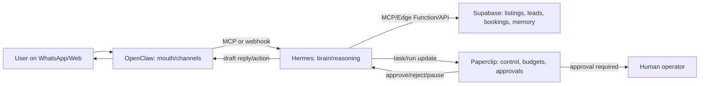

Below is a practical Hostinger production plan based on live sources checked on May 1, 2026. Where Hostinger or upstream docs do not publish an exact variable name, I mark it as **needs hPanel verification** instead of guessing.

**Sources Used**
- [Hostinger OpenClaw 1-Click setup](https://www.hostinger.com/support/what-is-1-click-openclaw-and-how-to-set-it-up/)
- [Hostinger OpenClaw WhatsApp setup](https://www.hostinger.com/support/how-to-set-up-whatsapp-for-1-click-openclaw/)
- [Hostinger OpenClaw VPS install](https://www.hostinger.com/support/how-to-install-openclaw-on-hostinger-vps/)
- [OpenClaw Hostinger docs](https://docs.openclaw.ai/install/hostinger)
- [OpenClaw Docker docs](https://docs.openclaw.ai/install/docker)
- [OpenClaw WhatsApp docs](https://docs.openclaw.ai/channels/whatsapp)
- [OpenClaw MCP docs](https://docs.openclaw.ai/cli/mcp)
- [Hostinger Hermes VPS](https://www.hostinger.com/vps/docker/hermes-agent)
- [Hostinger Hermes getting started](https://www.hostinger.com/support/how-to-get-started-with-hermes-agent-at-hostinger/)
- [Hostinger Hermes Docker tutorial](https://www.hostinger.com/tutorials/how-to-set-up-hermes-agent)
- [Hermes GitHub](https://github.com/NousResearch/hermes-agent)
- [Hermes docs](https://hermes-agent.nousresearch.com/docs/)
- [Hermes v0.12.0 release](https://github.com/NousResearch/hermes-agent/releases/tag/v2026.4.30)
- [Hostinger Paperclip VPS](https://www.hostinger.com/vps/docker/paperclip)
- [Hostinger Paperclip getting started](https://www.hostinger.com/support/how-to-get-started-with-the-paperclip-at-hostinger/)
- [Paperclip GitHub](https://github.com/paperclipai/paperclip)
- [Paperclip docs](https://paperclip.ing/)
- [Paperclip v2026.428.0 release](https://github.com/paperclipai/paperclip/releases/tag/v2026.428.0)

**1. Setup Guide**
**OpenClaw on Hostinger**
1. For fastest production channel setup, buy Hostinger 1-Click OpenClaw from hPanel or the Hostinger OpenClaw page.
2. Choose Ready-to-use AI via nexos.ai, or provide your own OpenAI, Anthropic, Gemini, or xAI key during onboarding.
3. Select WhatsApp, Telegram, or Hostinger Email. WhatsApp uses QR pairing from hPanel.
4. Save the generated `OPENCLAW_GATEWAY_TOKEN`.
5. Open the OpenClaw dashboard from hPanel and send “Hi” from the connected channel.
6. For self-managed VPS, Hostinger recommends KVM2 or greater. KVM2 on related Hostinger Docker app pages is 2 vCPU, 8 GB RAM, 100 GB NVMe, 8 TB bandwidth.
7. Existing VPS path: hPanel → VPS → Docker Manager → Catalog → OpenClaw → Select → configure → Deploy.
8. Env/config fields documented by Hostinger: `OPENCLAW_GATEWAY_TOKEN`, `WHATSAPP_NUMBER`, optional Telegram bot token, optional `ANTHROPIC_API_KEY`, `OPENAI_API_KEY`, `GEMINI_API_KEY`, `XAI_API_KEY`. Hostinger’s guide labels the Anthropic/OpenAI descriptions oddly, so verify labels in hPanel before pasting secrets.
9. Manual Docker commands from OpenClaw docs:
```bash
export OPENCLAW_IMAGE="ghcr.io/openclaw/openclaw:latest"
./scripts/docker/setup.sh
docker compose run --rm openclaw-cli channels login
docker compose run --rm openclaw-cli channels add --channel telegram --token "<token>"
curl -fsS http://127.0.0.1:18789/healthz
curl -fsS http://127.0.0.1:18789/readyz
```
10. Connect to Hermes via OpenClaw MCP bridge:
```bash
openclaw mcp serve --url wss://gateway-host:18789 --token-file ~/.openclaw/gateway.token
```

**Hermes Agent on Hostinger**
1. Use Hostinger VPS → Docker Manager → Catalog → Hermes Agent → Select.
2. Hostinger’s Hermes page recommends KVM2: 2 vCPU, 8 GB RAM, 100 GB NVMe, 8 TB bandwidth.
3. During deployment, provide one LLM API key: OpenRouter, Anthropic, or OpenAI. Add more later.
4. After deploy, open Browser Terminal.
5. Enter the project directory:
```bash
cd /docker/hermes-agent-xxxx/
docker compose exec -it hermes-agent /bin/bash
```
6. Run Hermes:
```bash
hermes
/hermes help
hermes doctor
hermes model
hermes tools
```
7. Manual Docker install from Hostinger tutorial:
```bash
mkdir -p ~/.hermes
cd ~/.hermes
docker run -it --rm -v ~/.hermes:/opt/data nousresearch/hermes-agent setup
```
8. Persistent data lives in the mounted `~/.hermes` volume.
9. Common env vars from Hermes docs: `OPENROUTER_API_KEY`, `OPENAI_API_KEY`, `ANTHROPIC_API_KEY`, `GEMINI_API_KEY` or `GOOGLE_API_KEY`, `FIRECRAWL_API_KEY`, `BROWSERBASE_API_KEY`, `BROWSERBASE_PROJECT_ID`, `API_SERVER_ENABLED`, `API_SERVER_PORT`, `API_SERVER_HOST`, `API_SERVER_KEY`, `API_SERVER_CORS_ORIGINS`.
10. Connect Hermes to OpenClaw through MCP and to Supabase through either a custom MCP server or a narrow HTTP/Supabase Edge Function tool.

**Paperclip on Hostinger**
1. Use Hostinger VPS → Docker Manager → Catalog → Paperclip → Select.
2. Hostinger’s Paperclip page recommends KVM2: 2 vCPU, 8 GB RAM, 100 GB NVMe, 8 TB bandwidth.
3. Deployment fields documented by Hostinger: admin name, admin email, admin password, optional Anthropic/OpenAI/Gemini/Cursor API keys.
4. Click Deploy. Hostinger creates Paperclip and supporting Docker services.
5. Open from Docker Manager, log in with the admin email/password, create the MDE company, define mission, create CEO agent, choose adapter, set working directory/model, and assign the first task.
6. Upstream quickstart:
```bash
npx paperclipai onboard --yes
npx paperclipai onboard --yes --bind lan
npx paperclipai onboard --yes --bind tailnet
```
7. Manual dev setup:
```bash
git clone https://github.com/paperclipai/paperclip.git
cd paperclip
pnpm install
pnpm dev
```
8. Requirements from README for manual dev: Node.js 20+, pnpm 9.15+. Hostinger’s one-click Docker hides most of this.
9. Paperclip runtime/API envs documented in docs/skill material include `PAPERCLIP_API_URL`, `PAPERCLIP_API_KEY`, `PAPERCLIP_AGENT_ID`, `PAPERCLIP_COMPANY_ID`, `PAPERCLIP_RUN_ID`. Hostinger deployment variable names for admin credentials are not published in the guide, so verify in hPanel.
10. Connect Paperclip to Hermes/OpenClaw by creating agents/adapters that invoke Hermes API jobs or OpenClaw channel tasks, with approval gates for bookings, spend, data mutation, and public messages.

**2. Features Tables**
**OpenClaw**

| Feature | What it does | Core/Advanced | MDE use case | Real example | Setup difficulty | Score /100 |
|---|---|---:|---|---|---:|---:|
| WhatsApp channel | WhatsApp Web/Baileys messaging | Core | Concierge entrypoint | “Find 2BR in Laureles” | Medium | 96 |
| Telegram channel | Bot-based chat | Core | Internal ops channel | Founder asks for lead status | Easy | 86 |
| Hostinger Email | Email automation via Hostinger flow | Core | Landlord outreach | Reply to listing owner | Medium | 82 |
| WebChat/UI | Browser control and chat UI | Core | In-app assistant | Chat from mdeai.co | Medium | 88 |
| Gateway token auth | Secures dashboard/gateway access | Core | Protect agent | Admin logs in with token | Easy | 91 |
| Allowlists/pairing | Limits who can message bot | Core | Stop random WhatsApp users | Only approved renter numbers | Medium | 95 |
| Multi-agent routing | Routes channels/accounts to agents | Advanced | Sales vs support agents | WhatsApp sales, Telegram ops | Medium | 88 |
| MCP bridge | Exposes conversations to clients | Advanced | Hermes reads/replies to OpenClaw channels | Hermes handles WA thread | Medium | 90 |
| Media support | Images, audio, documents | Advanced | Listing photos/voice notes | Renter sends apartment photo | Medium | 83 |
| Browser/search/tools | Browser automation, web search, cron | Advanced | Verify listings/events | Check source listing page | Hard | 80 |

**Hermes Agent**

| Feature | What it does | Core/Advanced | MDE use case | Real example | Setup difficulty | Score /100 |
|---|---|---:|---|---|---:|---:|
| Learning loop | Creates/refines skills from use | Core | Improve rental matching | Learns “quiet street” preference | Medium | 93 |
| Persistent memory | Remembers sessions/preferences | Core | User taste profile | “Sarah likes Laureles under $1,800” | Medium | 94 |
| Tool registry | Web, terminal, files, memory, delegation | Core | Agent actions | Query listings and draft reply | Medium | 92 |
| Provider routing | OpenRouter, OpenAI, Anthropic, Gemini | Core | Cost/quality model mix | Cheap search, strong final answer | Medium | 90 |
| API server | HTTP/SSE jobs and runs API | Core | Connect app/backend | Supabase function calls Hermes | Hard | 89 |
| MCP client | Uses DB/internal API tools | Core | Supabase connector | Hermes calls property search tool | Medium | 91 |
| Cron jobs | Natural-language scheduled tasks | Core | Lead follow-up | “Daily 9am check stale leads” | Medium | 87 |
| Browser automation | Browserbase/Firecrawl/Camofox | Advanced | Listing verification/scraping | Check if Airbnb listing exists | Hard | 84 |
| Subagents | Parallel task delegation | Advanced | Research, verify, summarize | One agent checks events, another rentals | Hard | 82 |
| Curator release | Maintains skill library | Advanced | Keep MDE skills clean | Prunes obsolete scraper skill | Medium | 78 |

**Paperclip**

| Feature | What it does | Core/Advanced | MDE use case | Real example | Setup difficulty | Score /100 |
|---|---|---:|---|---|---:|---:|
| Org chart | Defines agent roles/reporting | Core | Rental ops team | CEO, listings, concierge agents | Medium | 88 |
| Goals/tasks | Goal-linked work tracking | Core | MVP execution | “Launch WhatsApp rental search” | Easy | 90 |
| Heartbeats | Scheduled/event agent runs | Core | Recurring automation | Agent wakes every hour for leads | Medium | 91 |
| Approval gates | Human signoff for risky actions | Core | Booking/payment/listing approvals | Approve deposit request | Medium | 97 |
| Budgets/costs | Per-agent spend controls | Core | Prevent runaway agents | Stop scraper after $20 | Easy | 96 |
| Audit trail | Immutable task/run history | Core | Governance/proof | Why listing was rejected | Medium | 94 |
| BYO agents | Claude/Codex/Gemini/OpenClaw/custom | Advanced | Mixed agent fleet | Hermes brain, OpenClaw worker | Hard | 89 |
| Multi-company | Isolated orgs in one deploy | Advanced | MDE vs ILM brands | Separate Medellín/LatAm ops | Medium | 81 |
| Pause/resume | Stop/start agents safely | Core | Incident control | Pause WhatsApp follow-up agent | Easy | 92 |
| Productivity review | Finds stalled/noisy work | Advanced | Detect stuck automations | Agent loops on same listing | Medium | 84 |

**3. Integration Architecture**



Best integration path:
- OpenClaw connects to Hermes through `openclaw mcp serve` or a small webhook/API adapter.
- Hermes connects to Paperclip through Paperclip API/agent heartbeat adapter.
- Hermes connects to Supabase only through narrow, audited tools: search listings, create lead, create booking draft, update lead status.
- Paperclip owns approval gates, budgets, agent assignments, and audit logs.
- Supabase remains the source of truth for listings, leads, users, bookings, payments, and AI memory records.

**4. Real Workflows**
**WhatsApp rental search**
1. User sends WhatsApp: “I need a furnished 2BR in Laureles under $1,800.”
2. OpenClaw validates sender allowlist/pairing and forwards the request.
3. Hermes extracts constraints and calls Supabase rental search/ranking.
4. Hermes returns top 3 DB-backed listings with price, location, WiFi, safety, furnishing, walkability, and transport explanation.
5. OpenClaw replies on WhatsApp with options and asks whether to save, contact, or book.

**Listing verification**
1. Landlord submits listing URL/photos.
2. Hermes checks completeness and calls browser/Firecrawl-style verification where allowed.
3. Supabase stores listing as `pending_verification`.
4. Paperclip opens approval task for admin.
5. Admin approves, requests revision, or rejects. Only approved listings go public.

**Booking + approval**
1. User says “Book viewing for Tuesday 3pm.”
2. Hermes creates a booking draft in Supabase, not a confirmed booking.
3. Paperclip approval gate asks operator/landlord to approve.
4. After approval, Supabase updates booking status and OpenClaw sends confirmation.
5. Undo/cancel path stays available.

**Lead follow-up automation**
1. Supabase marks lead as stale after no reply.
2. Paperclip heartbeat wakes follow-up agent.
3. Hermes drafts WhatsApp follow-up.
4. If low risk, send automatically within policy; if pricing/legal/payment, Paperclip requires approval.
5. All messages and costs are logged.

**5. Core vs Advanced**
Top 5 core MVP features:
1. OpenClaw WhatsApp concierge with allowlists.
2. Hermes rental search/ranking against Supabase.
3. Supabase lead capture and listing database.
4. Paperclip approval gates for bookings/listings/payments.
5. Paperclip budgets and audit trail.

Top 5 advanced later:
1. Hermes browser automation for listing verification.
2. OpenClaw multi-agent routing by channel/number.
3. Paperclip multi-agent org with CEO/listings/support/market agents.
4. Hermes autonomous Curator and self-improving MDE skills.
5. Market intelligence workflows for price trends and competitor listings.

**6. Best Practices**
- Security: use dedicated WhatsApp number, allowlists, pairing, gateway tokens, narrow CORS, `API_SERVER_KEY`, firewall closed ports, no public Hermes API without bearer auth.
- Scaling: start with one KVM2 VPS per service for isolation; combine only for MVP testing. Split OpenClaw, Hermes, Paperclip, and Supabase workload as traffic grows.
- Cost control: route cheap research to lower-cost models, reserve premium models for final ranking and booking decisions, enforce Paperclip monthly budgets.
- Monitoring: use Docker health checks, Hostinger Docker logs, Hermes `doctor`, OpenClaw `/healthz` and `/readyz`, Paperclip audit/cost dashboards.
- Data integrity: AI proposes; Supabase Edge Functions validate; Paperclip approves; user confirms; actions can be undone where possible.

**7. Risks / Limitations**
- WhatsApp: OpenClaw’s WhatsApp channel is WhatsApp Web-based, not Twilio WhatsApp API; sessions can require re-pairing and must follow WhatsApp platform limits.
- Scraping: listing sites may block automation, forbid scraping, or show stale data. Use verified/permissioned sources where possible.
- Agent failures: agents can loop, hallucinate, or overrun costs. Paperclip budgets and approval gates are mandatory.
- Memory limits: memory is useful for preferences, not truth. Listing truth must live in Supabase.
- Hostinger templates: one-click templates are convenient but may hide exact compose/env details. For full production control, prefer VPS Docker projects with explicit volumes/backups.
- Public APIs: Hermes API exposes powerful tools, including terminal/file access. Keep it private or strongly authenticated.

**8. Final Recommendation**
Use all three, but keep roles clean:

- **OpenClaw = mouth and hands:** WhatsApp, WebChat, email, channel routing.
- **Hermes = brain:** reasoning, ranking, memory, tool use, workflows.
- **Paperclip = CEO/control layer:** approvals, budgets, audit, task ownership.
- **Supabase = source of truth:** listings, users, leads, bookings, payments, memory records.

Simplest production-ready Hostinger setup: start with **three KVM2 VPS Docker deployments**: one OpenClaw, one Hermes, one Paperclip. Keep Supabase hosted separately. Wire them through authenticated HTTPS/MCP/Edge Function adapters, and make every money/legal/public-listing mutation go through Paperclip approval plus Supabase validation.